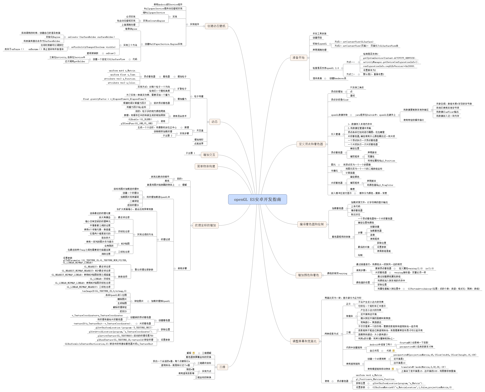
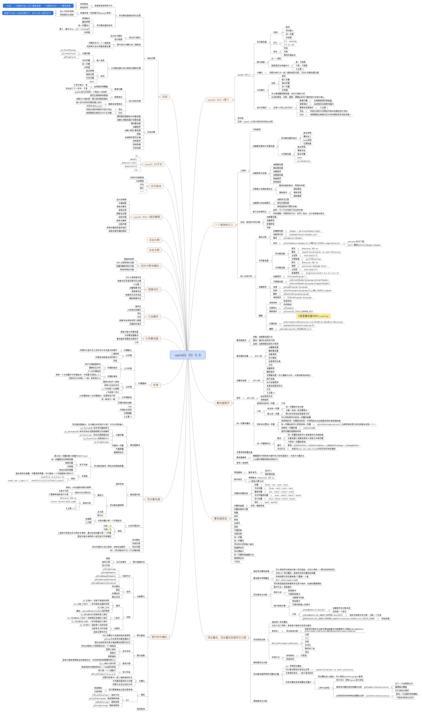

# Open gl es

opengles笔记以及总结,

open gl es 2.0

open gl 3.0

## surfaceView和GLSurfaceView的使用以及原理

- [EGL的使用过程](书本翻译（机器翻译）\3.第三章.md)
- surfaceView的使用
- GLSurfaceView的使用
- 它们的共同点和区别

## open gl es基础知识

- 一个完整的案例以及分析它的步骤
- 着色器程序
- 着色器语言
- 顶点属性、顶点数组和缓冲对象
- 图元装配和光栅化
- 顶点着色器
- 纹理
- 片段着色器
- 每个片段进行操作
- FrameBuffer
- 高级编程

## 绘制操作

- 绘制三角形
- 矩阵变换
- 显示图片
- 旋转平移等操作
- 光照操作
- 图片滤镜操作
- YUV显示

## 相机案例

- 相机显示的最少代码
- 相机显示分析
- 相机滤镜

## 视频显示

- surfaceView显示视频
- 封装MediaPlayer
- 封装MediaExtractor

## AndroidRecord

