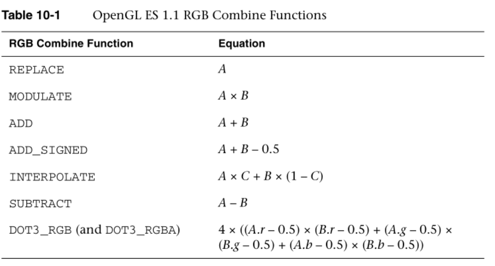
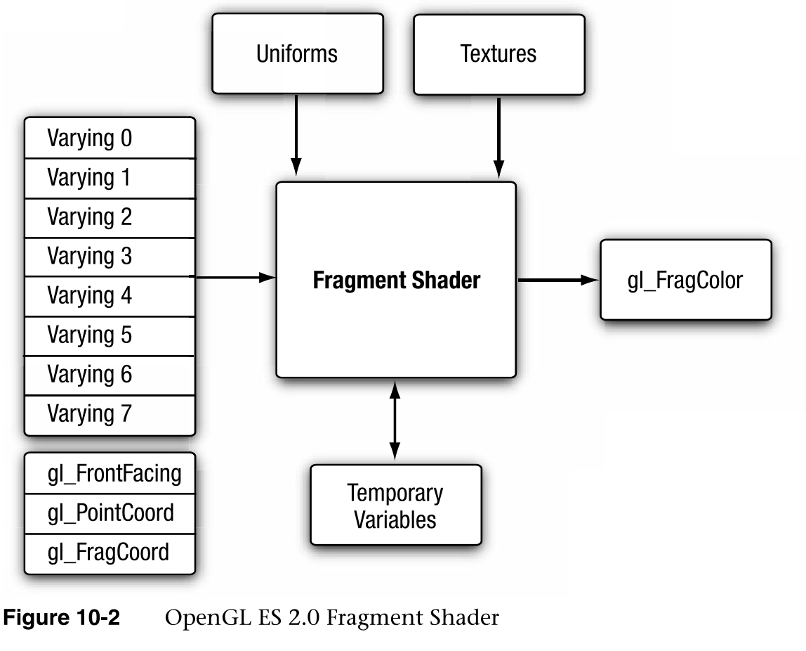
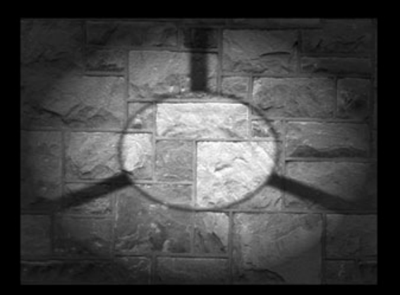
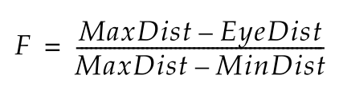
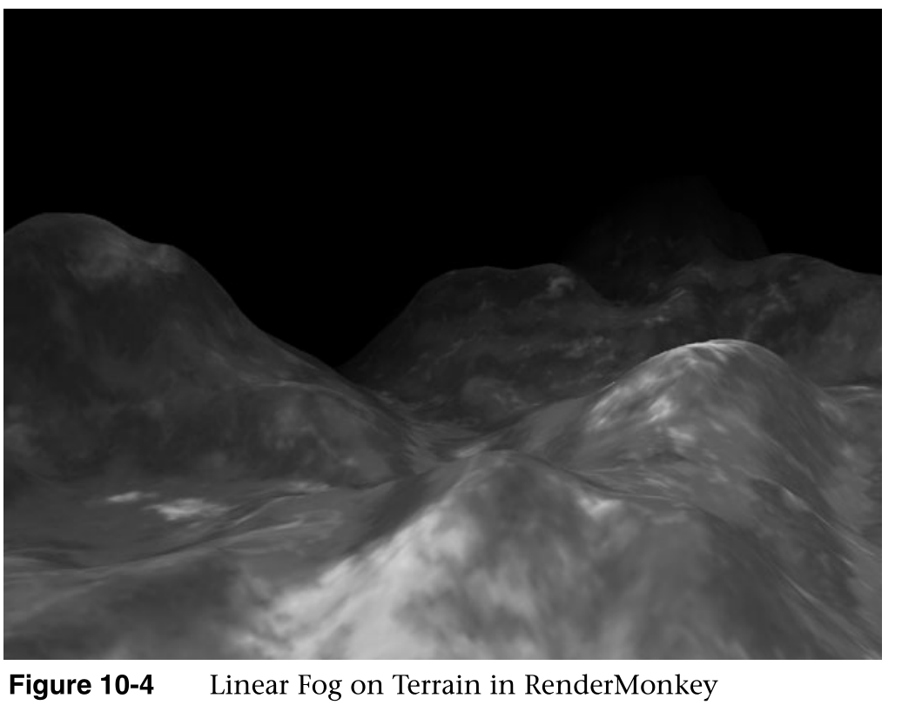
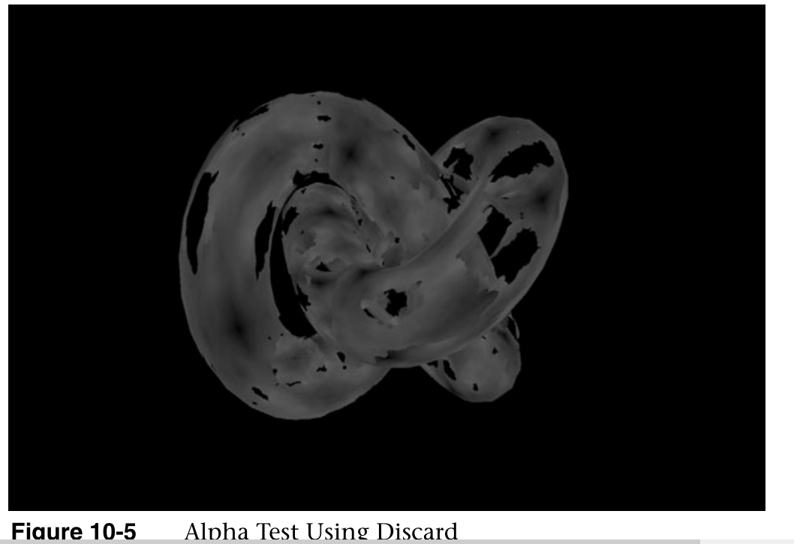
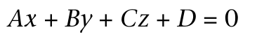
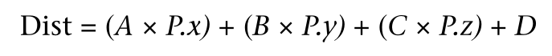
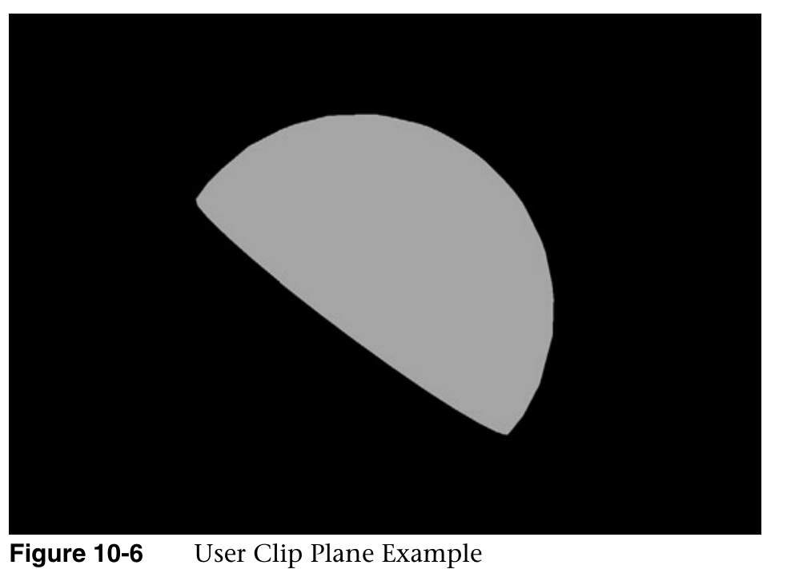

# 片段着色器

Fragment Shaders

在第9章“纹理”中，我们向您介绍了在片段着色器中创建和应用纹理的基础知识。在这一章中，我们提供了更多关于片段着色器的细节，并描述了它的一些用途。特别是，我们关注如何使用片段着色器实现固定函数技术。本章涵盖的主题包括:

In Chapter 9, “Texturing,” we introduced you to the basics of creating and  applying textures in the fragment shader. In this chapter, we provide more  details on the fragment shader and describe some of its uses. In particular, we  focus on how to implement fixed function techniques using the fragment shader.  The topics we cover in this chapter include:

- 修复了函数片段着色器。

  Fixed function fragment shaders.

- 片段着色器概述。

  Fragment shader overview.

回到图10-1中的管道图，我们已经讨论了管道的顶点着色器、图元装配和光栅化阶段。我们已经讨论过在片段着色器中使用纹理。现在，我们将重点放在管道的片段着色器部分，并填写编写片段着色器的其余细节。

Returning to our pipeline diagram in Figure 10-1, we have covered the vertex  shader, primitive assembly, and rasterization stages of the pipeline. We have  talked about using textures in the fragment shader. Now, we focus on the  fragment shader portion of the pipeline and fill in the remaining details on  writing fragment shaders.

## 固定功能片段着色器

Fixed Function Fragment Shaders

对于不熟悉可编程片段管道但使用过OpenGL  ES(或桌面OpenGL)早期版本的读者来说，您可能熟悉固定函数片段管道。在深入片段着色器的细节之前，我们认为有必要简要回顾一下旧的固定函数片段管道。这将让您了解旧的固定函数管道是如何映射到片段着色器的。在进入更高级的片段编程技术之前，这是一个很好的开始。

For readers who are new to the programmable fragment pipeline but have worked  with a previous version of OpenGL ES (or desktop OpenGL), you are probably  familiar with the fixed function fragment pipeline. Before diving into details  of the fragment shader, we think it is worthwhile to briefly review the old  fixed function fragment pipeline. This will give you an understanding of how the  old fixed function pipeline maps into fragment shaders. It’s a good way to start  before moving into more advanced fragment programming techniques.

在OpenGL  ES  1.1(和固定功能桌面OpenGL)中，可以用来确定如何将各种输入组合到片段着色器的等式非常有限。在固定函数管道中，基本上有三个输入可以使用:插值顶点颜色、纹理颜色和常量颜色。顶点颜色通常包含预先计算的颜色或顶点光照计算的结果。

In OpenGL ES 1.1 (and fixed function desktop OpenGL), you had a very limited  set of equations that could be used to determine how to combine the various  inputs to the fragment shader. In the fixed function pipeline, you essentially  had three inputs you could use: the interpolated vertex color, the texture  color, and the constant color. The vertex color would typically hold either a  precomputed color or the result of the vertex lighting computation.

纹理颜色来自于从任何纹理获取使用图元的纹理坐标绑定，并且可以为每个纹理单元设置恒定的颜色。

The texture color came from fetching from whichever texture was bound using the primitive’s texture coordinates and the constant color  could be set for each texture unit.

您可以用来将这些输入组合在一起的方程组非常有限。例如，在OpenGL  ES 1.1中，表10-1中列出的方程是可用的。

The set of equations you could use to combine these inputs together was quite  limited. For example, in OpenGL ES 1.1 the equations listed in Table 10-1 were  available.




这些方程的输入可以来自顶点颜色、纹理颜色或恒定颜色。事实上，人们可以获得大量有趣的效果，即使是用这有限的方程组。然而，这远不是可编程的，因为片段流水线只能以一组非常固定的方式进行配置。

The inputs A, B, and C to these equations could come from the vertex color,  texture color, or constant color. There actually was a great number of  interesting effects one could achieve, even with this limited set of equations.  However, this was far from programmable, as the fragment pipeline could only be  configured in a very fixed set of ways.

那我们为什么要在这里回顾呢？它有助于理解如何使用着色器实现传统的固定函数技术。例如，假设我们已经配置了一个单一的基础纹理贴图的固定功能管道，我们想通过顶点颜色来调整它。在固定函数OpenGL  ES(或OpenGL)中，我们将启用单个纹理单元，选择一个调制的组合方程，并将方程的输入设置为来自顶点颜色和纹理颜色。这里提供了OpenGL ES  1.1中做到这一点的代码，供参考。

So why are we reviewing this here? It helps give an understanding of how  traditional fixed function techniques can be achieved with shaders. For example,  let’s say we had configured the fixed function pipeline with a single base  texture map that we wanted to modulate by the vertex color. In fixed function  OpenGL ES (or OpenGL), we would enable a single texture unit, choose a combine  equation of MODULATE, and set up the inputs to the equation to come from the  vertex color and texture color. The code to do this in OpenGL ES 1.1 is provided  here for reference.

```c
glTexEnvi(GL_TEXTURE_ENV, GL_TEXTURE_ENV_MODE, GL_COMBINE);
glTexEnvi(GL_TEXTURE_ENV, GL_COMBINE_RGB, GL_MODULATE);
glTexEnvi(GL_TEXTURE_ENV, GL_SOURCE0_RGB, GL_PRIMARY_COLOR);
glTexEnvi(GL_TEXTURE_ENV, GL_SOURCE1_RGB, GL_TEXTURE);
glTexEnvi(GL_TEXTURE_ENV, GL_COMBINE_ALPHA, GL_MODULATE);
glTexEnvi(GL_TEXTURE_ENV, GL_SOURCE0_ALPHA, GL_PRIMARY_COLOR);
glTexEnvi(GL_TEXTURE_ENV, GL_SOURCE1_ALPHA, GL_TEXTURE);
```

此代码配置固定函数管道，以在原色(顶点颜色)和纹理颜色之间执行调制(A  × B)。如果这段代码对您没有意义，请不要担心，因为OpenGL ES  2.0中不存在这些。我们在这里试图说明的一点是，这将如何映射到一个片段着色器。在片段着色器中，同样的计算可以按如下方式完成。

This code configures the fixed function pipeline to perform a modulate (A × B)  between the primary color (the vertex color) and the texture color. If this code  doesn’t make sense to you, don’t worry, as none of this exists in OpenGL ES 2.0.  The point we are trying to make here is to show how this would map to a fragment  shader. In a fragment shader, this same computation could be accomplished as  follows.

```java
precision mediump float;
uniform sampler2D s_tex0;
varying vec2 v_texCoord;
varying vec4 v_primaryColor;
void main()
{
   gl_FragColor = texture2D(s_tex0, v_texCoord) * v_primaryColor;
}
```

片段着色器执行与固定函数设置完全相同的操作。从采样器(绑定到纹理单元0)获取纹理值，并使用2D纹理坐标来查找该值。然后，纹理提取的结果乘以v_primaryColor，这是一个从顶点着色器传入的可变值。在这种情况下，顶点着色器会将颜色传递给片段着色器。

The fragment shader performs the exact same operations that would be performed  by the fixed function setup. The texture value is fetched from a sampler (that  is bound to texture unit 0) and a 2D texture coordinate is used to look up that  value. Then, the result of that texture fetch is multiplied by v_primaryColor, a  varying value that is passed in from the vertex shader. In this case, the vertex  shader would have passed the color through to the fragment shader.

可以编写一个片段着色器来执行与任何可能的固定函数纹理组合设置相同的计算。当然，编写比固定函数允许的更复杂和更多样的计算的着色器也是可能的。然而，这一节的重点仅仅是为了说明我们是如何从固定功能过渡到可编程着色器的。现在，我们开始关注片段着色器的一些细节。

It is possible to write a fragment shader that would perform the equivalent  computation as any possible fixed function texture combine setup. It is also, of  course, possible to write shaders with much more complex and varied computations  than just fixed function would allow. However, the point of this section was  just to drive home the point of how we have transitioned from fixed function to  programmable shaders. Now, we begin to look at some specifics of fragment  shaders.

## 片段着色器的概括

片段着色器提供了对片段进行操作的通用可编程方法。片段着色器的输入包括以下内容:

The fragment shader provides a general-purpose programmable method for  operating on fragments. The inputs to the fragment shader consist of the  following:

- 变化-由顶点着色器生成的插值数据。

  Varyings—Interpolated data produced by the vertex shader.

- 制服-片段着色器使用的状态。

  Uniforms—State used by the fragment shader.

- 纹理—通过采样器访问的纹理图像。

  Textures—Texture images accessed through samplers.

片段着色器的输出是片段颜色，它被传递到管道的每个片段操作部分。片段着色器的输入和输出如图10-2所示。

The output of the fragment shader is the fragment color that gets passed on to  the per-fragment operations portion of the pipeline. The inputs and outputs to  the fragment shader are illustrated in Figure 10-2.



## 内置特殊变量

Built-In Special Variables

OpenGL  ES 2.0有内置的特殊变量，由片段着色器输出或输入到片段着色器。片段着色器可用的内置特殊变量如下:

OpenGL ES 2.0 has built-in special variables that are output by the fragment  shader or are input to the fragment shader. The built-in special variables  available to the fragment shader are the following:

- gl_FragColor—gl_FragColor用于从着色器输出片段颜色。然后，该颜色被传递给管道中的每个片段操作。如果片段着色器不写入gl_FragColor，则其值未定义。请注意，在着色器中不写入gl_FragColor可能是有效的。例如，如果您希望仅渲染到深度，可以使用glColorMask关闭对颜色缓冲区的写入。那么跳过在着色器中写入片段颜色是完全有效的。

  gl_FragColor—gl_FragColor is used to output the fragment color from the  shader. This color is then passed in to the per-fragment operations in the  pipeline. If a fragment shader does not write to gl_FragColor its value is  undefined. Note that it is potentially valid to not write to gl_FragColor in the  shader. If, for example, you wish to render only to depth, you can turn off  writes to the color buffer using glColorMask. Then it is perfectly valid to skip  writing the fragment color in the shader.

- gl_FragCoord—gl_FragCoord是片段着色器中可用的只读变量。该变量保持窗口相对碎片的坐标(x，y，z，1/w)。有许多算法可以用来知道当前片段的窗口坐标。例如，您可以使用窗口坐标作为纹理提取到随机噪声贴图中的偏移，随机噪声贴图的值用于旋转阴影贴图上的过滤器内核。这是一种用于减少阴影贴图混叠的技术。

  gl_FragCoord—gl_FragCoord is a read-only variable that is available in the  fragment shader.This variable holds the window relative  coordinates (x, y, z, 1/w) of the fragment.There are a number of algorithms where it can be useful to know the window  coordinates of the current fragment. For example, you can use the window  coordinates as offsets into a texture fetch into a random noise map whose value  is used to rotate a filter kernel on a shadow map. This is a technique that is  used to reduce shadow map aliasing.

- gl_FrontFacing—gl_FrontFacing是片段着色器中可用的只读变量。如果片段是面向前的原语的一部分，则该变量为布尔值true，否则为false。

  gl_FrontFacing—gl_FrontFacing is a read-only variable that is available in the  fragment shader. This variable is a boolean with a value of true if the fragment  is part of a front-facing primitive and false otherwise.

- gl_PointCoord—gl_PointCoord是一个只读变量，可以在渲染点精灵时使用。它保存点光栅化期间在[0，1]范围内自动生成的点精灵的纹理坐标。在第13章“OpenGL  ES 2.0高级编程”中，有一个渲染点精灵的例子使用了这个变量。

  gl_PointCoord—gl_PointCoord is a read-only variable that can be used when  rendering point sprites. It holds the texture coordinate for the point sprite  that is automatically generated in the [0, 1] range during point rasterization.  In Chapter 13, “Advanced Programming with OpenGL ES 2.0,” there is an example of  rendering point sprites that uses this variable.

## 内置常数

Built-In Constants

以下内置常量也与片段着色器相关。

The following built-in constants are also relevant to the fragment  shader.

```c
const mediump int gl_MaxTextureImageUnits = 8;
const mediump int gl_MaxFragmentUniformVectors = 16;
const mediump int gl_MaxDrawBuffers = 1;
```

内置常数描述了以下最大项:

The built-in constants describe the following maximum terms:

- 这是可用的纹理图像单元的最大数量。所有ES  2.0实现支持的最小值是8。

  gl_TextureImageUnits—This is the maximum number of texture image units that  are available. The minimum value supported by all ES 2.0 implementations is  eight.

- 这是片段着色器中可以使用的vec4统一条目的最大数量。所有ES  2.0实现支持的最小值是16个vec4条目。开发人员实际可以使用的vec4统一条目的数量因实现和片段着色器的不同而不同。这个问题在第8章“顶点着色器”中有所描述，同样的问题也适用于片段着色器。

  gl_MaxFragmentUniformVectors—This is the maximum number of vec4 uniform  entries that can be used inside a fragment shader. The minimum value supported  by all ES 2.0 implementations is 16 vec4 entries. The number of vec4 uniform  entries that can actually be used by a developer can vary from implementation to  implementation and from one fragment shader to another. This issue is described  in Chapter 8, “Vertex Shaders,” and the same issue applies to fragment  shaders.

- GL  _ MaxDrawBuffers—这是可用的最大绘制缓冲区数。所有ES  2.0实现支持的最小值为1。如果支持1个以上，这意味着实现支持多渲染目标。事实证明，ES 2.0没有提供对MRTs的支持，这个变量只是为将来的扩展留着。

  gl_MaxDrawBuffers—This is the maximum number of draw buffers available. The  minimum value supported by all ES 2.0 implementations is 1. If more than 1 were  supported, this would mean an implementation supported multiple-render targets  (MRTs). As it turns out,support for MRTs is not provided in ES 2.0 and this variable was just left  around for future expansion.

为每个内置常量指定的值是所有OpenGL  ES 2.0实现必须支持的最小值。实现可能支持大于所述最小值的值。可以使用以下代码查询实际支持的值。

The values specified for each built-in constant are the minimum values that  must be supported by all OpenGL ES 2.0 implementations. It is possible that  implementations may support values greater than the minimum values described.  The actual supported values can be queried using the following code.

```c
GLint   maxTextureImageUnits, maxFragmentUniformVectors;
glGetIntegerv(GL_MAX_TEXTURE_IMAGE_UNITS, &maxTextureImageUnits);
glGetIntegerv(GL_MAX_FRAGMENT_UNIFORM_VECTORS, 
              &maxFragmentUniformVectors);
```

##  精度限定符

Precision Qualifiers

精度限定符在关于顶点着色器的第8章中有详细介绍，在第5章“OpenGL  ES着色语言”中也有介绍有关精确限定符的完整详细信息，请查看这些部分。我们在这里提醒您，片段着色器没有默认精度。这意味着每个片段着色器必须声明一个默认精度(或者为所有变量声明提供精度限定符)。

Precision qualifiers were covered in detail in Chapter 8 on vertex shaders and  also introduced in Chapter 5, “OpenGL ES Shading Language.” Please review those  sections for full details on precision qualifiers. We remind you here that there  is no default precision for fragment shaders. This means that every fragment  shader must declare a default precision (or provide precision qualifiers for all  variable declarations).

OpenGL  ES  2.0要求实现在片段着色器中至少支持中等精度，但不要求支持高精度。确定片段着色器中是否支持高精度的方法是确定是否定义了GL_FRAGMENT_PRECISION_HIGH预处理器宏(此外，实现将导出GL_OES_fragment_precision_high扩展字符串)

OpenGL ES 2.0 mandates that implementations support at least medium precision  in the fragment shader, but does not require support for high precision. The way  to determine whether high precision is supported in the fragment shader is  determining whether the GL_FRAGMENT_PRECISION_HIGH preprocessor macro is defined  (in addition, the implementation will export the GL_OES_fragment_precision_high  extension string).

## ES  2.0片段着色器限制

ES 2.0 Fragment Shader Limitations

在第8章中，我们详细回顾了顶点着色器的局限性以及如何编写可移植的着色器。如果您需要复习，请复习该材料，因为几乎所有相同的限制都适用于片段着色器。片段着色器限制的唯一区别是，统一数组只能用常数积分表达式进行索引。在顶点着色器中，要求所有实现都支持使用计算表达式对统一数组进行索引。然而，片段着色器的情况并非如此。ES  2.0实现不保证支持使用常量积分表达式之外的任何内容对制服进行索引。

In Chapter 8, we provided a detailed review of the limitations on vertex  shaders and how to write portable shaders. If you need a refresher, review that  material, as almost all of the same limitations apply to fragment shaders. The  only difference in limitations for fragment shaders is that uniform arrays can  only be indexed with constant integral expressions. In the vertex shader, it is  required that all implementations support indexing of uniform arrays using  computed expressions. However, this is not the case for the fragment shader.  Indexing of uniforms using anything other than constant integral expressions is  not guaranteed to be supported by an ES 2.0 implementation.

## 使用着色器实现固定函数测试技术

Implementing Fixed Function T echniques Using Shaders

既然我们已经给出了片段着色器的概述，我们将向您展示如何使用着色器实现几种固定功能技术。OpenGL  ES 1.x和桌面OpenGL中的固定功能管道提供了执行多纹理、雾、阿尔法测试和用户剪辑平面的API。虽然OpenGL ES  2.0中没有明确提供这些技术，但它们仍然可以使用着色器来实现。本节回顾了这些固定函数过程中的每一个，并提供了演示每种技术的片段着色器示例。

Now that we have given an overview of fragment shaders, we are going to show  you how to implement several fixed function techniques using shaders. The  fixed-function pipeline in OpenGL ES 1.x and desktop OpenGL provided APIs to  perform multitexturing, fog, alpha test, and user clip planes. Although none of  these techniques is provided explicitly in OpenGL ES 2.0, all of them are still  possible to implement using shaders. This section reviews each of these fixed  function processes and provides example fragment shaders that demonstrate each  technique.

## Multitexturing

我们从多重纹理开始，这是片段着色器中非常常见的操作，用于组合多个纹理贴图。例如，在许多游戏中使用的一种技术，如地震三，是将光能传递计算中预先计算的光照存储在纹理贴图中。然后，该贴图与片段着色器中的基本纹理贴图相结合，以表示静态照明。还有许多其他使用多重纹理的例子，其中一些我们将在第13章讨论。例如，纹理贴图通常用于存储镜面指数和遮罩，以衰减和遮罩镜面照明效果。许多游戏也使用法线贴图，法线贴图是以比每个顶点法线更高的细节级别存储法线信息的纹理，以便可以在片段着色器中计算光照。

We start with multitexturing, which is a very common operation in fragment  shaders used for combining multiple texture maps. For example, a technique that  has been used in many games such as Quake III is to store precomputed lighting  from radiosity calculations in a texture map. That map is then combined with the  base texture map in the fragment shader to represent static lighting. There are  many other examples of using multiple textures, some of which we cover in  Chapter 13. For example, often a texture map is used to store a specular  exponent and mask to attenuate and mask specular lighting contributions. Many  games also use normal maps, which are textures that store normal information at  a higher level of detail than per-vertex normals so that lighting can be  computed in the fragment shader.

在这里提及所有这些的要点是，您现在已经了解了完成多纹理技术所需的应用编程接口的所有部分。在第9章中，您学习了如何在各种纹理单元上加载纹理，并在片段着色器中从它们中获取。在片段着色器中以各种方式组合纹理只需使用着色语言中存在的许多运算符和内置函数。使用这些技术，您可以轻松实现OpenGL  ES早期版本中固定功能片段管道可能实现的所有效果。

The point of mentioning all this here is that you now have learned about all  of the parts of the API that are needed to accomplish multitexturing techniques.  In Chapter 9, you learned how to load textures on various texture units and  fetch from them in the fragment shader. Combining the textures in various ways  in the fragment shader is simply a matter of employing the many operators and  built-in functions that exist in the shading language. Using these techniques,  you can easily achieve all of the effects that were made possible with the fixed  function fragment pipeline in previous versions of OpenGL ES.

在第10章/多重纹理示例中提供了一个使用多重纹理的例子，它在图10-3中渲染图像

An example of using multiple textures is provided in the Chapter_10/  MultiTexture example, which renders the image in Figure 10-3.

这个例子加载了一个基础纹理贴图和一个光照贴图纹理，并在一个四元体上的片段着色器中组合它们。示例程序的片段着色器在示例10-1中提供。

This example loads a base texture map and light map texture and combines them  in the fragment shader on a single quad. The fragment shader for the sample  program is provided in Example 10-1.



```c
precision mediump float;                            
varying vec2 v_texCoord;                            
uniform sampler2D s_baseMap;                        
uniform sampler2D s_lightMap;                       
void main()                                         
{                                                   
   vec4 baseColor;                                   
   vec4 lightColor;                                  
                                                    
   baseColor = texture2D(s_baseMap, v_texCoord);   
   lightColor = texture2D(s_lightMap, v_texCoord); 
   gl_FragColor = baseColor * (lightColor + 0.25);   
}             
```

片段着色器有两个采样器，每个纹理一个。接下来是设置纹理单元和采样器的相关代码。

The fragment shader has two samplers, one for each of the textures. The  relevant code for setting up the texture units and samplers is next.

```c
// Bind the base map
glActiveTexture(GL_TEXTURE0);
glBindTexture(GL_TEXTURE_2D, userData->baseMapTexId);
// Set the base map sampler to texture unit 0
glUniform1i(userData->baseMapLoc, 0);
// Bind the light map
glActiveTexture(GL_TEXTURE1);
glBindTexture(GL_TEXTURE_2D, userData->lightMapTexId);
   
// Set the light map sampler to texture unit 1
glUniform1i(userData->lightMapLoc, 1);
```

如您所见，该代码将每个单独的纹理对象绑定到纹理单元0和1。采样器被设置了值，以将采样器绑定到各自的纹理单元。在这个例子中，一个单独的纹理坐标被用来从两个贴图中提取。在典型的光照贴图中，基础贴图和光照贴图会有一组单独的纹理坐标。灯光贴图通常被分页到一个大的纹理中，纹理坐标可以使用离线工具生成。

As you can see, this code binds each of the individual texture objects to  textures units 0 and 1. The samplers are set with values to bind the samplers to  the respective texture units. In this example, a single texture coordinate is  used to fetch from both of the maps. In typical light mapping, there would be a  separate set of texture coordinates for the base map and light map. The light  maps are typically paged into a single large texture and the texture coordinates  can be generated using offline tools.

## 雾

渲染3D场景时使用的一种常见技术是雾的应用。在OpenGL  ES  1.1(和桌面OpenGL)中，雾是作为固定功能操作提供的。雾是一种如此流行的技术的原因之一是，它可以用来减少绘制距离，并消除几何图形在靠近观察者时的“弹出”。

A common technique that is used in rendering 3D scenes is the application of  fog. In OpenGL ES 1.1 (and desktop OpenGL), fog was provided as a fixed function  operation. One of the reasons fog is such a prevalent technique is that it can  be used to reduce draw distances and remove “popping” of geometry as it comes in  closer to the viewer.

有许多可能的方法来计算雾和可编程片段着色器，你不局限于任何特定的方程。这里我们向您展示如何使用片段着色器来计算线性雾。为了计算任何类型的雾，我们需要两个输入:像素到眼睛的距离和雾的颜色。为了计算线性雾，我们还需要雾应该覆盖的最小和最大距离范围。

There are a number of possible ways to compute fog and with programmable  fragment shaders you are not limited to any particular equation. Here we show  you how you would go about computing linear fog with a fragment shader. To  compute any type of fog, there are two inputs we will need: the distance of the  pixel to the eye and the color of the fog. To compute linear fog, we also need  the minimum and maximum distance range that the fog should cover.

线性雾因子的方程式

The equation for the linear fog factor



计算雾因子以乘以雾颜色。此颜色被固定在[0.0，1.0]范围内，然后用片段的整体颜色进行线性插值，以计算最终颜色。到眼睛的距离最好在顶点着色器中计算，并使用变化的。

computes a fog factor to multiply the fog color by. This color gets clamped in  the [0.0, 1.0] range and then is linear interpolated with the overall color of a  fragment to compute the final color. The distance to the eye is best computed in  the vertex shader and interpolated across the primitive using a  varying.

第10章/  RM_LinearFog文件夹中提供了一个演示雾计算的渲染猴子工作空间示例。图10-4提供了工作空间的截图。

A RenderMonkey workspace is provided as an example in the Chapter_10/  RM_LinearFog folder that demonstrates the fog computation. A screenshot of the  workspace is provided in Figure 10-4.




计算到眼睛的距离的顶点着色器的代码在示例10-2中提供。

The code for the vertex shader that computes the distance to the eye is  provided in Example 10-2.

```c
Example 10-2 Vertex Shader for Computing Distance to Eye
uniform mat4 matViewProjection;
uniform mat4 matView;
uniform vec4 u_eyePos;
attribute vec4 rm_Vertex;
attribute vec2 rm_TexCoord0;
varying vec2 v_texCoord;
varying float v_eyeDist;
void main(void)
{
    // Transform vertex to view-space
    vec4 vViewPos = matView * rm_Vertex;
    
    // Compute the distance to eye
    v_eyeDist = sqrt((vViewPos.x - u_eyePos.x) *
                     (vViewPos.x - u_eyePos.x) +
                     (vViewPos.y - u_eyePos.y) *
                     (vViewPos.y - u_eyePos.y) +
                                    (vViewPos.z - u_eyePos.z) *
                     (vViewPos.z - u_eyePos.z) );
    gl_Position = matViewProjection * rm_Vertex;
    v_texCoord  = rm_TexCoord0.xy;
}
```

这个顶点着色器的重要部分是v_eyeDist可变变量的计算。首先，使用视图矩阵将输入顶点转换到视图空间，并存储在vViewPos中。然后，计算从该点到u  _ eyePos均匀变量的距离。这种计算给出了从观察者到变换顶点的眼睛空间距离。我们可以在片段着色器中使用该值来计算雾因子，如示例10-3所示。

The important part of this vertex shader is the computation of the v_eyeDist  varying variable. First, the input vertex is transformed into view space using  the view matrix and stored in vViewPos. Then, the distance from this point to  the u_eyePos uniform variable is computed. This computation gives us the  distance in eye space from the viewer to the transformed vertex. We can use this  value in the fragment shader to compute the fog factor as provided in Example  10-3.

```c
Example 10-3 Fragment Shader for Rendering Linear Fog
precision mediump float;
uniform vec4 u_fogColor;
uniform float u_fogMaxDist;
uniform float u_fogMinDist;
uniform sampler2D baseMap;
varying vec2 v_texCoord;
varying float v_eyeDist;
float computeLinearFogFactor()
{
   float factor;
   
   // Compute linear fog equation
   factor = (u_fogMaxDist - v_eyeDist) /
            (u_fogMaxDist - u_fogMinDist);
   
   // Clamp in the [0,1] range
   factor = clamp(factor, 0.0, 1.0);
            
   return factor;            
}
void main(void)
{
    float fogFactor = computeLinearFogFactor();
    vec4  fogColor  = fogFactor * u_fogColor;
    vec4 baseColor = texture2D( baseMap, v_texCoord );
     // Compute final color as a lerp with fog factor
    gl_FragColor = baseColor * fogFactor +
                   fogColor  * (1.0 - fogFactor);
}
```


在片段着色器中，computeLinearFogFactor()函数执行线性雾方程的计算。最小和最大雾距离存储在统一变量中，在顶点着色器中计算的插值眼睛距离用于计算雾因子。雾因子随后用于在基本纹理颜色和雾颜色之间执行线性插值。结果是，我们现在有线性雾，可以很容易地通过改变均匀的值来调整距离和颜色。

In the fragment shader, the computeLinearFogFactor() function performs the  computation for the linear fog equation. The minimum and maximum fog distances  are stored in uniform variables and the interpolated eye distance that was  computed in the vertex shader is used to compute the fog factor. The fog factor  is then used to perform a linear interpolation between the base texture color  and the fog color. The result is that we now have linear fog and can easily  adjust the distances and colors by changing the uniform values.

请注意，由于可编程片段着色器的灵活性，很容易实现其他方法来计算雾。例如，人们可以通过简单地改变雾方程来容易地计算指数雾。此外，您可以根据到地面的距离来计算雾，而不是根据到眼睛的距离来计算雾，从而获得地面雾。通过对这里提供的雾计算进行小的修改，可以很容易地实现许多可能的雾效果。

Note that with the flexibility of programmable fragment shaders, it is very  easy to implement other methods to compute fog. For example, one could easily  compute exponential fog by simply changing the fog equation. Further, rather  than computing fog based on distance to the eye, you could compute fog based on  distance to the ground to have ground-based fog. There are a number of possible  fog effects that can be easily achieved with small modifications to the fog  computations provided here.

## 阿尔法测试(使用丢弃)

Alpha Test (Using Discard)

3D应用程序中使用的一个非常常见的效果是绘制在某些片段中完全透明的图元。这对于渲染像链式栅栏这样的东西非常有用。使用几何图形表示栅栏需要大量的图元。然而，使用几何图形的另一种方法是在纹理中存储一个遮罩值，指定哪些纹理元素应该是透明的。例如，可以将链式栅栏存储在单个RGBA纹理中，其中RGB值表示栅栏的颜色，A值表示纹理是否透明的遮罩。然后，人们可以很容易地使用一个或两个三角形渲染栅栏，并在片段着色器中屏蔽掉像素。

A very common effect used in 3D applications is to draw primitives that are  fully transparent in certain fragments. This is very useful for rendering  something like a chain-link fence. Representing a fence using geometry would  require a significant amount of primitives. However, an alternative to using  geometry is to store a mask value in a texture that specifies which texels  should be transparent. For example, one could store the chain-link fence in a  single RGBA texture where the RGB values represent the color of the fence and  the A value represents the mask of whether the texture is transparent. Then one  can easily render a fence using just one or two triangles and masking off pixels  in the fragment shader.

在传统的固定函数渲染中，这种效果是使用alpha测试实现的。阿尔法测试允许您指定一个比较测试，如果片段的阿尔法值与参考值进行比较失败，该片段将被杀死。也就是说，如果一个片段没有通过alpha测试，该片段将不会被呈现。在OpenGL  ES 2.0中，没有固定的函数alpha测试，但是在使用discard关键字的片段着色器中可以达到同样的效果。

In traditional fixed function rendering, this effect was achieved using the  alpha test. The alpha test allowed you to specify a comparison test whereby if  an alpha value of a fragment compared against a reference value failed, that  fragment would be killed. That is, if a fragment failed the alpha test, the  fragment would not be rendered. In OpenGL ES 2.0, there is no fixed function  alpha test, but the same effect can be achieved in the fragment shader using the  discard keyword.

第10章/RM_AlphaTest中的RenderMonkey示例显示了一个在片段着色器中进行alpha测试的非常简单的示例，如图10-5所示

The RenderMonkey example in Chapter_10/RM_AlphaTest shows a very simple  example of doing the alpha test in the fragment shader as shown in Figure  10-5.




本示例的片段着色器代码在示例10-4中提供。

The fragment shader code for this example is provided in Example  10-4.

```c
Example 10-4 Fragment Shader for Alpha Test Using Discard
precision mediump float;
uniform sampler2D baseMap;
varying vec2 v_texCoord;
void main(void)
{
   vec4 baseColor = texture2D(baseMap, v_texCoord);
    
   if(baseColor.a < 0.25)
   {
      discard;
   }
   else
   {
      gl_FragColor = baseColor;
   }
}
```

在这个片段着色器中，纹理是一个四通道RGBA纹理。阿尔法通道用于阿尔法测试。阿尔法颜色与0.25进行比较，如果小于0.25，碎片将被丢弃。否则，使用纹理颜色绘制片段。这种技术可以通过简单地改变比较或阿尔法参考值来实现阿尔法测试。

In this fragment shader, the texture is a four-channel RGBA texture. The alpha  channel is used for the alpha test. The alpha color is compared against 0.25 and  if it less than that, the fragment is killed using discard. Otherwise, the  fragment is drawn using the texture color. This technique can be used for  implementing the alpha test by simply changing the comparison or alpha reference  value.

## 用户裁剪平面

User Clip Planes

如第7章“图元装配和光栅化”中所述，所有图元都被裁剪在构成视图平截头体的六个平面上。然而，有时用户可能想要对着一个或多个附加的用户剪辑平面进行剪辑。有许多可能的原因，您可能希望对用户剪辑平面进行剪辑。例如，在渲染反射时，您需要围绕反射平面翻转几何体，然后将其渲染为屏幕外纹理。当渲染到纹理中时，需要根据反射平面裁剪几何图形，这需要用户裁剪平面

As described in Chapter 7, “Primitive Assembly and Rasterization,” all  primitives are clipped against the six planes that make up the view frustum.  However, sometimes a user might want to clip against one or more additional user  clip planes. There are a number of possible reasons you might want to clip  against user clip planes. For example, when rendering reflections, you need to  flip the geometry about the reflection plane and then render it into an  off-screen texture. When rendering into the texture, you need to clip the  geometry against the reflection plane, which requires a user clip  plane.

在OpenGL  ES 1.1中，用户裁剪平面可以通过平面方程提供给应用编程接口，裁剪将自动手持。在OpenGL ES  2.0中，你仍然可以完成同样的效果，但是现在你需要自己在着色器中完成。实现用户剪辑平面的关键是使用上一节中介绍的discard关键字。

In OpenGL ES 1.1, user clip planes could be provided to the API via a plane  equation and the clipping would be handheld automatically. In OpenGL ES 2.0, you  can still accomplish this same effect, but now you need to do it yourself in the  shader. The key to implementing user clip planes is using the discard keyword  that was introduced in the previous section.

在向您展示如何实现用户裁剪平面之前，让我们回顾一下数学基础。平面由以下等式指定

Before showing you how to implement user clip planes, let’s review the basics  of the mathematics. A plane is specified by the equation




向量(A，B，C)表示平面的法线，值D是平面沿该向量到原点的距离。为了确定一个点是否应该被夹在一个平面上，我们需要用下面的等式来计算从点P到一个平面的距离

The vector (A, B, C) represents the normal of the plane and the value D is the  distance of the plane along that vector from the origin. To figure out whether a  point should or should not be clipped against a plane, we need to evaluate the  distance from a point P to a plane with the equation:




如果距离小于0，我们知道该点在平面后面，应该被剪裁，如果距离大于或等于0，则不应该被剪裁。注意平面方程和P必须在同一坐标空间。第10章/  RM_ClipPlane工作空间中提供了一个渲染猴子的例子，如图10-6所示。

If the distance is less than 0, we know the point is behind the plane and  should be clipped and if the distance is greater than or equal to 0, it should  not be clipped. Note that the plane equation and P must be in the same  coordinate space. A RenderMonkey example is provided in Chapter_10/ RM_ClipPlane  workspace as shown in Figure 10-6.




着色器需要做的第一件事是计算到平面的距离，如前所述。这可以在顶点着色器(并传递到一个变量)或片段着色器中完成。在顶点着色器中进行这种计算比在每个片段中计算距离更便宜。示例10-5中的顶点着色器列表显示了到平面的距离计算。

The first thing the shader needs to do is compute the distance to the plane as  mentioned earlier. This could be done in either the vertex shader (and passed  into a varying) or the fragment shader. It is cheaper to do this computation in  the vertex shader rather than having to compute the distance in every fragment.  The vertex shader listing in Example 10-5 shows the distance to plane  computation.

```c
Example 10-5 User Clip Plane Vertex Shader
uniform vec4 u_clipPlane;
uniform mat4 matViewProjection;
attribute vec4 rm_Vertex;
varying float u_clipDist;
void main(void)
{
   // Compute the distance between the vertex and the clip plane
   u_clipDist = dot(rm_Vertex.xyz, u_clipPlane.xyz) + 
                u_clipPlane.w;
   gl_Position = matViewProjection * rm_Vertex;
}
```

u_clipPlane统一变量保存剪辑平面的平面方程。然后u_clipDist变量存储计算的剪辑距离。该值被传递到片段着色器，片段着色器使用如示例10-6所示，插入距离以确定是否应该裁剪片段。

The u_clipPlane uniform variable holds the plane equation for the clip plane.  The u_clipDist varying variable then stores the computed clip distance. This  value is passed into the fragment shader, which uses the interpolated distance to determine whether the fragment should be clipped 
as shown in Example 10-6.

```java
Example 10-6 User Clip Plane Fragment Shader
precision mediump float;
varying float u_clipDist;
void main(void)
{
    // Reject fragments behind the clip plane
    if(u_clipDist < 0.0)
       discard;
       
    gl_FragColor = vec4(0.5, 0.5, 1.0, 0.0);    
}
```

如您所见，如果u_clipDist变量为负，这意味着片段位于剪辑平面之后，必须被丢弃。否则，片段将照常处理。这个简单的例子只是演示了实现用户裁剪平面所需的计算。您可以通过简单地计算多个片段距离并进行多次丢弃测试来轻松实现多个用户片段平面。

As you can see, if the u_clipDist varying variable is negative, this means the  fragment is behind the clip plane and must be discarded. Otherwise, the fragment  is processed as usual. This simple example just demonstrates the computations  needed to implement user clip planes. You can easily implement multiple user  clip planes by simply computing multiple clip distances and having multiple  discard tests.