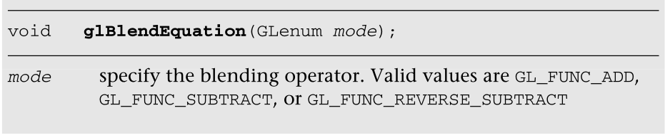

# 每个片段进行操作

本章讨论在OpenGL  ES  2.0片段流水线中执行片段着色器后，可以应用于整个帧缓冲区或单个片段的操作。您会记得，片段着色器的输出是片段的颜色和深度值。片段着色器执行后发生的操作会影响像素的可见性和最终颜色:

This chapter discusses the operations that can be applied either to the entire  framebuffer or to individual fragments after the execution of the fragment  shader in the OpenGL ES 2.0 fragment pipeline. As you’ll recall, the output of  the fragment shader is the fragment’s color and depth value. The operations that  occur after fragment shader execution and can affect the visibility and final  color of a pixel are:

- 模板缓冲测试 
- 深度缓冲测试
- 多重采样
- 混合
-  

图11-1显示了片段在到达帧缓冲区的过程中所经历的测试和操作。

The tests and operations that a fragment goes through on its way to the  framebuffer are shown in Figure 11-1.


正如你可能已经注意到的，没有一个阶段叫做“多重采样”多重采样是一种抗锯齿技术，它在子片段级别复制操作。我们将在本章后面描述多采样如何影响片段处理。本章最后讨论了从帧缓冲区读取像素和向帧缓冲区写入像素的方法。

As you might have noticed, there isn’t a stage named “multisampling.”  Multisampling is an antialiasing technique that duplicates operations at a  subfragment level. We describe more about how multisampling affects fragment  processing later in the chapter. The chapter concludes with a discussion of  methods for reading pixels from and writing pixels to the framebuffer.

## 缓冲区

OpenGL  ES支持三种类型的缓冲区，每种缓冲区都为帧缓冲区中的每个像素存储不同的数据:

OpenGL ES supports three types of buffers, each of which stores different data  for every pixel in the framebuffer:

- 色彩缓冲区(由正面和背面色彩缓冲区组成)。

  Color buffer (composed of front and back color buffers).

- 深度缓冲。

  Depth buffer.

- 模板缓冲区。

  Stencil buffer.

缓冲区的大小——通常称为“缓冲区深度”(但不要与深度缓冲区混淆)——是由可用于存储**单个像素信息的位数**来衡量的。例如，**颜色缓冲区将有三个组件用于存储红色、绿色和蓝色组件，以及可选的alpha组件存储**。颜色缓冲区的**深度是其所有组件的位数总和**。另一方面，对于深度和模板缓冲区，单个值表示这些缓冲区中像素的位深度。例如，深度缓冲区可能每个像素有16位。缓冲区的总大小是所有组件的位深度之和。常见的帧缓冲区深度包括16位RGB缓冲区，5位用于红色和蓝色，6位用于绿色(人类视觉系统对绿色比对红色或蓝色更敏感)，32位等分用于RGBA缓冲区。


The size of a buffer—commonly referred to as the “depth of the buffer” (but  not to be confused with the depth buffer)—is measured by the number of bits that  are available for storing information for a single pixel. The color buffer, for  example, will have three components for storing the red, green, and blue color  components, and optional storage for the alpha component. The depth of the color  buffer is the sum of the number of bits for all of its components. For the depth  and stencil buffers, on the other hand, a single value represents the bit depth  of a pixel in those buffers. For example, a depth buffer might have 16 bits per  pixel. The overall size of the buffer is the sum of the bit depths of all of the  components. Common framebuffer depths include 16-bit RGB buffers, with five bits  for red and blue, and six bits for green (the human visual system is more  sensitive to green than red or blue), and 32 bits divided equally for an RGBA  buffer.

此外，颜色缓冲区可以是双缓冲的，其中它将包含两个缓冲区:一个显示在输出设备(通常是监视器或液晶显示器)上，称为“前”缓冲区；和另一个对观众隐藏的缓冲区，但是用于构建要显示的下一个图像，并被称为“后”缓冲区。在双缓冲应用程序中，动画是通过绘制到后缓冲区，然后交换前缓冲区和后缓冲区来显示新图像来完成的。缓冲区的这种交换通常与显示设备的刷新周期同步，这将给出连续平滑动画的幻觉。回想一下，双缓冲在第三章“EGL导论”中讨论过

Additionally, the color buffer may be double buffered, where it will contain  two buffers: one that is displayed on the output device (usually a monitor or  LCD display) named the “front” buffer; and another buffer that is hidden from  the viewer, but used for constructing the next image to be displayed, and called  the “back” buffer. In double-buffered applications, animation is accomplished by  drawing into the back buffer, and then swapping the front and back buffers to  display the new image. This swapping of buffers is usually synchronized with the  refresh cycle of the display device, which will give the illusion of a  continuously smooth animation. Recall that double buffering was discussed in  Chapter 3, “An Introduction to EGL.”

虽然每个EGL配置都有一个颜色缓冲区，但深度和模板缓冲区是可选的。然而，每个EGL实现必须提供至少一个包含所有三个缓冲区的配置，深度缓冲区至少为16位，模板缓冲区至少为8位。

Although every EGL configuration will have a color buffer, the depth and  stencil buffers are optional. However, every EGL implementation must provide at  least one configuration that contains all three of the buffers, with the depth  buffer being at least 16 bits deep, and at least eight bits for the stencil  buffer.


**补充：**

**深度缓存：就是一个区域存储每个顶点的深度值**

## 请求附加缓冲区

Requesting Additional Buffers

要在颜色缓冲区中包含深度或模板缓冲区，您需要在指定EGL配置的属性时请求它们。您可能还记得第3章，您向EGL传递了一组属性-值对，这些属性-值对指定了应用程序需要的渲染表面的类型。要在颜色缓冲区之外包含深度缓冲区，您可以在属性列表中指定EGL  _深度_大小以及所需的位深度。同样，您可以添加EGL _模板_大小以及所需的位数来获得模板缓冲区。

To include a depth or stencil buffer along with your color buffer, you need to  request them when you specify the attributes for your EGL configuration. As you  might recall from Chapter 3, you pass a set of attribute–value pairs into the  EGL that specify the type of rendering surface your application needs. To  include a depth buffer in addition to the color buffer, you would specify  EGL_DEPTH_SIZE in the list of attributes with the desired bit depth you need.  Likewise, you would add EGL_STENCIL_SIZE along with the number of required bits  to obtain a stencil buffer.

我们的便利库esUtil简化了这些操作，它只允许您说您想要这些缓冲区和一个颜色缓冲区，并且它负责其余的工作(请求最大大小的缓冲区)。当使用我们的库时，您可以在调用esCreateWindow时添加(通过按位“或”运算)ES_WINDOW_DEPTH和ES  _ WINDOW _ DEPTH。比如，

Our convenience library, esUtil, simplifies those operations by merely  allowing you to say that you’d like those buffers along with a color buffer, and  it takes care of the rest of the work (requesting a maximally sized buffer).  When using our library, you would add (by means of a bitwise-or operation)  ES_WINDOW_DEPTH and ES_WINDOW_STENCIL in your call to esCreateWindow. For  example,

```c
esCreateWindow(&esContext, "Application Name",
               window_width, window_height,
               ES_WINDOW_RGB | ES_WINDOW_DEPTH | ES_WINDOW_STENCIL);
```

## 清除缓冲区

Clearing Buffers

OpenGL  ES是一个交互式渲染系统，假设在每一帧的开始，您希望将所有缓冲区初始化为默认值。通过调用glClear函数来清除缓冲区，该函数使用一个位掩码来表示应该清除到其指定清除值的各种缓冲区。

OpenGL ES is an interactive rendering system, and assumes that at the start of  each frame, you’ll want to initialize all of the buffers to their default value.  Buffers are cleared by calling the glClear function, which takes a bitmask  representing the various buffers that should be cleared to their specified clear  values.


您既不需要清除每个缓冲区，也不需要同时清除所有缓冲区，但是您可以通过每帧只调用一次glClear并同时清除所有缓冲区来获得最佳性能。

You’re neither required to clear every buffer, nor clear them all at the same  time, but you might obtain the best performance by only calling glClear once per  frame with all the buffers you want simultaneously cleared.

每个缓冲区都有一个默认值，在您请求清除该缓冲区时使用。对于每个缓冲区，您可以使用此处显示的函数指定所需的清除值。

Each buffer has a default value that’s used when you request that buffer be  cleared. For each buffer, you can specify your desired clear value using the  functions shown here.


## 使用掩码控制对帧缓冲区的写入

Using Masks to Control Writing to Framebuffers

您还可以通过指定缓冲区写掩码来控制哪些缓冲区或组件(在颜色缓冲区的情况下)是可写的。在像素值写入缓冲区之前，缓冲区的掩码用于验证缓冲区是否可写。

You can also control which buffers, or components, in the case of the color  buffer, are writable by specifying a buffer write mask. Before a pixel’s value  is written into a buffer, the buffer’s mask is used to verify that the buffer is  writable.

对于颜色缓冲区，glColorMask例程指定如果写入像素，颜色缓冲区中的哪些组件将被更新。如果特定组件的掩码设置为GL_FALSE，则该组件在写入时不会更新。默认情况下，所有颜色组件都是可写的。

For the color buffer, the glColorMask routine specifies which components in  the color buffer will be updated if a pixel is written. If the mask for a  particular component is set to GL_FALSE, that component will not be updated if  written to. By default, all color components are writable.


同样，对深度缓冲区的写入是通过用GL_TRUE或GL_FALSE调用glDepthMask来指定深度缓冲区是否可写来控制的。

Likewise, the writing to the depth buffer is controlled by calling glDepthMask  with GL_TRUE or GL_FALSE to specify if the depth buffer is writable.

在渲染半透明对象时，通常会禁用对深度缓冲区的写入。最初，您将渲染场景中的所有不透明对象，并启用对深度缓冲区的写入(即，设置为GL_TRUE)。这将确保所有不透明对象都正确地进行了深度排序，并且深度缓冲区包含场景的适当深度信息。然后，在渲染半透明对象之前，您可以通过调用GlDeptMask(GL  _  FALSE)来禁用对深度缓冲区的写入。当写入深度缓冲区被禁用时，仍然可以从中读取值并用于深度比较。这允许被不透明对象遮挡的半透明对象被正确地深度缓冲，但是不修改深度缓冲，使得不透明对象被半透明对象遮挡。

Quite often, disabling writing to the depth buffer is used when rendering  translucent objects. Initially, you would render all of the opaque objects in  the scene with writing to the depth buffer enabled (i.e., set to GL_TRUE). This  would make sure that all of the opaque objects are correctly depth sorted, and  the depth buffer contains the appropriate depth information for the scene. Then,  before rendering the translucent objects, you would disable writing to the depth  buffer by calling glDepthMask(GL_FALSE). While writing to the depth buffer is  disabled, values can still be read from it and used for depth comparisons. This  allows translucent objects that are obscured by opaque objects to be correctly  depth buffered, but not modify the depth buffer such that opaque objects would  be obscured by translucent ones.


最后，您也可以通过调用GL模板掩码来禁用对模板缓冲区的写入，但是与glColorMask或glDepthMask相比，您可以通过提供掩码来指定模板缓冲区的哪些位是可写的。

Finally, you can also disable writing to the stencil buffer by calling  glStencilMask, but as compared to glColorMask or glDepthMask, you specify which  bits of the stencil buffer are writable by providing a mask.


GL模板遮罩分离例程允许您根据图元的面顶点顺序(有时称为“面性”)来设置模板遮罩。这允许正面和背面图元使用不同的模板遮罩。GL模板遮罩分离(GL_FRONT_AND_BACK，遮罩)与调用GL模板遮罩相同，后者为正面和背面多边形面设置相同的遮罩。

The glStencilMaskSeparate routine allows you to set the stencil mask based on  the face vertex order (sometimes called “facedness”) of the primitive. This  allows different stencil masks for front- and back-facing primitives.  glStencilMaskSeparate(GL_FRONT_AND_BACK, mask) is identical to calling  glStencilMask, which sets the same mask for the front and back polygon  faces.


## 片段测试和操作

Fragment T ests and Operations

以下几节描述了OpenGL  ES中可以应用于片段的各种测试。默认情况下，所有片段测试和操作都被禁用，片段按接收顺序写入帧缓冲区时会变成像素。通过启用各种片段，可以应用操作测试来选择哪些片段成为像素并影响最终图像。

The following sections describe the various tests that can be applied to a  fragment in OpenGL ES. By default, all fragment tests and operations are  disabled, and fragments become pixels as they are written to the framebuffer in  the order in which they’re received. By enabling the various fragments,  operational tests can be applied to choose which fragments become pixels and  affect the final image.

通过使用表11-1中列出的适当令牌调用glEnable，可以单独启用每个片段测试

Each fragment test is individually enabled by calling glEnable with the  appropriate token listed in Table 11-1


## 使用剪刀测试

Using the Scissor Test

剪式测试通过指定一个矩形区域来进一步限制帧缓冲区中的哪些像素是可写的，从而提供了额外的裁剪级别。使用剪刀盒有两个步骤。首先，您需要使用Gl剪刀函数指定矩形区域。

The scissor test provides an additional level of clipping by specifying a  rectangular region that further limits which pixels in the framebuffer are  writable. Using the scissor box is a two-step process. First, you need to  specify the rectangular region using the glScissor function.


在指定了剪刀框之后，您需要通过调用Glenable(GL  _剪刀_TEST)来启用它，以使用额外的裁剪。所有渲染(包括清除视口)都仅限于剪式框。

After specifying the scissor box, you’ll need to enable it by calling  glEnable(GL_SCISSOR_TEST) to employ the additional clipping. All rendering,  including clearing the viewport, is restricted to the scissor box.

通常，剪刀框是视口中的一个子区域，但不要求两个区域实际相交。

Generally, the scissor box is a subregion in the viewport, but there’s no  requirement that the two regions actually intersect.


**可以实现游戏中的全局查看，或者换个角度进行预览**

## 模板缓冲测试

Stencil Buffer Testing

下一个可能应用于片段的操作是模板测试。模板缓冲区是一个每像素掩码，它保存可用于确定像素是否应该更新的值。模板测试由应用程序启用或禁用

The next operation that might be applied to a fragment is the stencil test.  The stencil buffer is a per-pixel mask that holds values that can be used to  determine whether a pixel should be updated or not. The stencil test is enabled  or disabled by the application。

使用模板缓冲区可被视为两步操作。第一步是用每像素掩码初始化模板缓冲区，这是通过渲染几何图形并指定模板缓冲区应该如何更新来完成的。第二步通常是使用这些值来控制颜色缓冲区的后续渲染。在这两种情况下，都需要指定模板测试中参数的使用方式。

Using the stencil buffer can be considered a two-step operation. The first  step is to initialize the stencil buffer with the per-pixel masks, which is done  by rendering geometry and specifying how the stencil buffer should be updated.  The second step is generally to use those values to control subsequent rendering  into the color buffer. In both cases, you specify how the parameters are to be  used in the stencil test.

模板测试本质上是一个位测试，例如，你可以在一个C程序中使用掩码来确定是否设置了位。控制模板测试的操作符和值的模板函数由GL模版函数或GL模版函数单独控制。

The stencil test is essentially a bit test, as you might do in a C program  where you use a mask to determine if a bit is set, for example. The stencil  function, which controls the operator and values of the stencil test, is  controlled by the glStencilFunc or glStencilFuncSeparate functions.


为了更好地控制模板测试，使用屏蔽参数来选择测试中应该考虑模板值的哪些位。选择这些位后，使用提供的运算符将它们的值与参考值进行比较。例如，要指定模板测试在模板缓冲区的最低三位等于2时通过，您可以调用

To allow finer control of the stencil test, a masking parameter is used to  select which bits of the stencil values should be considered for the test. After  selecting those bits, their value is compared with a reference value using the  operator provided. For example, to specify that the stencil test passes where  the lowest three bits of the stencil buffer are equal to 2, you would  call：

```c
glStencilFunc(GL_EQUAL, 2, 0x7);
```

并启用模板测试。

and enable the stencil test.

配置了模板测试后，通常还需要让OpenGL  ES  2.0知道当模板测试通过时如何处理模板缓冲区中的值。事实上，修改模板缓冲区中的值不仅仅依赖于模板测试，还包括深度测试的结果(在下一节中讨论)。结合模板和深度测试，片段有三种可能的结果:

With the stencil test configured, you generally also need to let OpenGL ES 2.0  know what to do with the values in the stencil buffer when the stencil test  passes. In fact, modifying the values in the stencil buffer relies on more than  just the stencil tests, but also incorporates the results of the depth test  (discussed in the next section). There are three possible outcomes that can  occur for a fragment with the combined stencil and depth tests:

- 该片段未通过模板测试。如果出现这种情况，则不对该片段进行进一步测试(即深度测试)。

  The fragment fails the stencil tests. If this occurs, no further testing  (i.e., the depth test) is applied to that fragment.

- 片段通过了模板测试，但未通过深度测试。

  The fragment passes the stencil test, but fails the depth test.

- 碎片通过了模板和深度测试。

  The fragment passes both the stencil and depth tests.

这些可能的结果中的每一个都可以用来影响模板缓冲区中该像素位置的值。GL模版操作和GL模版操作单独的函数控制对每一个测试结果的模版缓冲值所做的操作，对模版值的可能操作如表11-2所示。

Each of those possible outcomes can be used to affect the value in the stencil  buffer for that pixel location. The glStencilOp and glStencilOpSeparate  functions control the actions done on the stencil buffer’s value for each of  those test outcomes, and the possible operations on the stencil values are shown  in Table 11-2.


以下示例说明了如何使用Gl模板函数和Gl模板操作来控制视口各个部分的渲染。

The following example illustrates using glStencilFunc and glStencilOp to  control rendering in various parts of the viewport.

```c
GLfloat vVertices[] = 
   { 
       -0.75f,  0.25f,  0.50f, // Quad #0
       -0.25f,  0.25f,  0.50f,
       -0.25f,  0.75f,  0.50f,
       -0.75f,  0.75f,  0.50f,
        0.25f,  0.25f,  0.90f, // Quad #1
        0.75f,  0.25f,  0.90f,
        0.75f,  0.75f,  0.90f,
        0.25f,  0.75f,  0.90f,
       -0.75f, -0.75f,  0.50f, // Quad #2
       -0.25f, -0.75f,  0.50f,
       -0.25f, -0.25f,  0.50f,
       -0.75f, -0.25f,  0.50f,
        0.25f, -0.75f,  0.50f, // Quad #3
        0.75f, -0.75f,  0.50f,
        0.75f, -0.25f,  0.50f,
        0.25f, -0.25f,  0.50f,
       -1.00f, -1.00f,  0.00f, // Big Quad
        1.00f, -1.00f,  0.00f,
        1.00f,  1.00f,  0.00f,
       -1.00f,  1.00f,  0.00f
   };
GLubyte indices[][6] = 
   { 
       {  0,  1,  2,  0,  2,  3 }, // Quad #0
       {  4,  5,  6,  4,  6,  7 }, // Quad #1
       {  8,  9, 10,  8, 10, 11 }, // Quad #2
       { 12, 13, 14, 12, 14, 15 }, // Quad #3
       { 16, 17, 18, 16, 18, 19 }  // Big Quad
   };
   
#define NumTests  4
GLfloat  colors[NumTests][4] = 
   { 
       { 1.0f, 0.0f, 0.0f, 1.0f },
       { 0.0f, 1.0f, 0.0f, 1.0f },
       { 0.0f, 0.0f, 1.0f, 1.0f },
       { 1.0f, 1.0f, 0.0f, 0.0f }
   };
   GLint   numStencilBits;
   GLuint  stencilValues[NumTests] = 
   { 
      0x7, // Result of test 0
      0x0, // Result of test 1
      0x2, // Result of test 2
      0xff // Result of test 3. We need to fill this
           // value in a run-time
   };
   // Set the viewport
   glViewport(0, 0, esContext->width, esContext->height);
   
   // Clear the color, depth, and stencil buffers. At this
   // point, the stencil buffer will be 0x1 for all pixels
   glClear(GL_COLOR_BUFFER_BIT | GL_DEPTH_BUFFER_BIT |
           GL_STENCIL_BUFFER_BIT);
   // Use the program object
   glUseProgram(userData->programObject);
   // Load the vertex position
   glVertexAttribPointer(userData->positionLoc, 3, GL_FLOAT, 
                         GL_FALSE, 0, vVertices);
   glEnableVertexAttribArray(userData->positionLoc);
   // Test 0:
   //
   // Initialize upper-left region. In this case, the stencil-
   // buffer values will be replaced because the stencil test
 // for the rendered pixels will fail the stencil test, which is
 //
   //        ref   mask   stencil  mask
   //      ( 0x7 & 0x3 ) < ( 0x1 & 0x7 )
   //
   // The value in the stencil buffer for these pixels will
   // be 0x7.
   //
   glStencilFunc(GL_LESS, 0x7, 0x3);
   glStencilOp(GL_REPLACE, GL_DECR, GL_DECR);
   glDrawElements(GL_TRIANGLES, 6, GL_UNSIGNED_BYTE, indices[0]);
   // Test 1:
   //
   // Initialize the upper right region. Here, we'll decrement
   // the stencil-buffer values where the stencil test passes
   // but the depth test fails. The stencil test is
   //
   //        ref  mask    stencil  mask
   //      ( 0x3 & 0x3 ) > ( 0x1 & 0x3 )
   //
   //    but where the geometry fails the depth test.  The
   //    stencil values for these pixels will be 0x0.
   //
   glStencilFunc(GL_GREATER, 0x3, 0x3);
   glStencilOp(GL_KEEP, GL_DECR, GL_KEEP);
   glDrawElements(GL_TRIANGLES, 6, GL_UNSIGNED_BYTE, indices[1]);
   // Test 2:
   //
   // Initialize the lower left region. Here we'll increment 
   // (with saturation) the stencil value where both the
   // stencil and depth tests pass. The stencil test for
   // these pixels will be
   //
   //        ref  mask     stencil  mask
   //      ( 0x1 & 0x3 ) == ( 0x1 & 0x3 )
   //
   // The stencil values for these pixels will be 0x2.
   //
   glStencilFunc(GL_EQUAL, 0x1, 0x3);
   glStencilOp(GL_KEEP, GL_INCR, GL_INCR);
   glDrawElements(GL_TRIANGLES, 6, GL_UNSIGNED_BYTE, indices[2]);
   // Test 3:
   //
   // Finally, initialize the lower right region. We'll invert
   // the stencil value where the stencil tests fails. The
// stencil test for these pixels will be
   //
   //        ref   mask    stencil  mask
   //      ( 0x2 & 0x1 ) == ( 0x1 & 0x1 )
   //
   // The stencil value here will be set to ~((2^s-1) & 0x1),
   // (with the 0x1 being from the stencil clear value),
   // where 's' is the number of bits in the stencil buffer
   //
   glStencilFunc(GL_EQUAL, 0x2, 0x1);
   glStencilOp(GL_INVERT, GL_KEEP, GL_KEEP);
   glDrawElements(GL_TRIANGLES, 6, GL_UNSIGNED_BYTE, indices[3]);
   
   // As we don't know at compile time how many stencil bits are
   // present, we'll query, and update the correct value in the
   // stencilValues arrays for the fourth tests. We'll use this 
   // value later in rendering.
   glGetIntegerv(GL_STENCIL_BITS, &numStencilBits);
   
   stencilValues[3] = ~(((1 << numStencilBits) - 1) & 0x1) & 0xff;
   // Use the stencil buffer for controlling where rendering will
   // occur. We disable writing to the stencil buffer so we can
   // test against them without modifying the values we generated.
   glStencilMask(0x0);
   
   for(i = 0; i < NumTests; ++i)
   {
      glStencilFunc(GL_EQUAL, stencilValues[i], 0xff);
      glUniform4fv(userData->colorLoc, 1, colors[i]);
      glDrawElements(GL_TRIANGLES, 6, GL_UNSIGNED_BYTE, indices[4]);
   }
```

## 深度缓冲测试

Depth Buffer Testing	

深度缓冲区通常用于隐藏表面移除。传统上，它会为渲染表面中的每个像素保留距离视点最近的对象的距离值，并为每个新输入的片段将它与视点的距离与存储的值进行比较。默认情况下，如果传入片段的深度值小于存储在深度缓冲区中的值(意味着它更靠近查看器)，则传入片段的深度值会替换存储在深度缓冲区中的值，然后其颜色值会替换颜色缓冲区中的颜色值。这是深度缓冲的标准方法，如果这是您想要做的，您需要做的就是在创建窗口时请求一个深度缓冲，然后通过用GL_DEPTH_TEST调用glEnable来启用深度测试。如果没有深度缓冲区与颜色缓冲区相关联，则深度测试总是通过。

The depth buffer is usually used for hidden-surface removal. It traditionally  keeps the distance value of the closest object to the viewpoint for each pixel  in the rendering surface, and for every new incoming fragment, compares its  distance from the viewpoint with the stored value. By default, if the incoming  fragment’s depth value is less than the value stored in the depth buffer  (meaning it’s closer to the viewer) the incoming fragment’s depth value replaced  the values stored in the depth buffer, and then its color value replaces the  color value in the color buffer. This is the standard method for depth  buffering, and if that’s what you would like to do, all you need to do is  request a depth buffer when you create a window, and then enable the depth test  by calling glEnable with GL_DEPTH_TEST. If no depth buffer is associated with  the color buffer, the depth test always passes.

当然，这只是使用深度缓冲区的一种方式。您可以通过调用glDepthFunc来修改深度比较运算符。

Of course, that’s only one way to use the depth buffer. You can modify the  depth comparison operator by calling glDepthFunc.


## 混合

在这一节中，我们讨论混合像素颜色。一旦片段通过所有启用的片段测试，其颜色就可以与片段像素位置中已经存在的颜色相结合。在这两种颜色组合之前，它们被乘以一个比例因子，并使用指定的混合运算符进行组合。混合方程式是

In this section, we discuss blending pixel colors. Once a fragment passes all  of the enabled fragment tests, its color can be combined with the color that’s  already present in the fragment’s pixel location. Before the two colors are  combined, they’re multiplied by a scaling factor and combined using the  specified blending operator. The blending equation is


其中fsource和Csource分别是传入片段的缩放因子和颜色。同样，FD  esting和Cdesting是像素的比例因子和颜色。op是用于组合缩放值的数学运算符。

where fsource and Csource are the incoming fragment’s scaling factor and  color, respectively. Likewise, fdestingation and Cdestination are the pixel’s  scaling factor and color. op is the mathematical operator for combining the  scaled values.

缩放因子是通过调用glBlendFunc或Glblend  FuncTion来指定的。

The scaling factors are specified by calling either glBlendFunc or  glBlendFuncSeparate.


混合系数的可能值如表11-3所示。

The possible values for the blending coefficients are shown in Table  11-3.


表11-3  (Rs，Gs，Bs，As)是与输入片段颜色相关联的颜色分量，(Rd，Gd，Bd，Ad)是与颜色缓冲区中已有的像素颜色相关联的分量，(Rc，Gc，Bc，Ac)表示通过调用glBlendColor设置的恒定颜色。在GL  _ SRC _ ALHPA _ SUCCUST的情况下，计算的最小值仅应用于源颜色。

n Table 11-3 (Rs, Gs, Bs, As) are the color components associated with the  incoming fragment color, (Rd, Gd, Bd, Ad) are the components associated with the  pixel color already in the color buffer, and (Rc, Gc, Bc, Ac) represent a  constant color that you set by calling glBlendColor. In the case of  GL_SRC_ALHPA_SATURATE, the minimum value that’s computed is applied to the  source color only.


一旦传入的片段和像素颜色乘以它们各自的缩放因子，它们就使用由glBlendEquation或glBlendEquationSeparate指定的运算符进行组合。默认情况下，混合颜色是使用GL_FUNC_ADD运算符累积的。GL  _ FUNC _减法运算符从传入片段的值中减去帧缓冲区中的缩放颜色。同样地，GL _ FUNC _ REVERSE _  SUCCEST反转混合方程式，以便从当前像素值中减去引入的片段颜色。

Once the incoming fragment and pixel color have been multiplied by their  respective scaling factors, they’re combined using the operator specified by  glBlendEquation or glBlendEquationSeparate. By default, blended colors are  accumulated using the GL_FUNC_ADD operator. The GL_FUNC_SUBTRACT operator  subtracts the scaled color from the framebuffer from the incoming fragment’s  value. Likewise, the GL_FUNC_REVERSE_SUBTRACT reverses the blending equation  such that the incoming fragment colors are subtracted from the current pixel  value.




## 抖动

在一个系统中，由于帧缓冲区中每个组件的位数，帧缓冲区中可用的颜色数量有限，我们可以使用抖动来模拟更大的颜色深度。抖动算法以这样的方式排列颜色，使得图像看起来比实际存在的颜色更多。OpenGL  ES 2.0没有指定使用哪种抖动算法来支持其抖动阶段；该技术非常依赖于实现。

On a system where the number of colors available in the framebuffer is limited  due to the number of bits per component in the framebuffer, we can simulate  greater color depth using dithering. Dithering algorithms arrange colors in such  ways that the image appears to have more available colors than are really  present. OpenGL ES 2.0 doesn’t specify which dithering algorithm is to be used  in supporting its dithering stage; the technique is very implementation  dependent.

您的应用程序对抖动的唯一控制是它是否应用于最终像素，这完全是通过调用glEnable或glDisable来指定抖动在管道中的使用来控制的。

The only control your application has over dithering is whether it is applied  to the final pixels or not, which is entirely controlled by calling glEnable or  glDisable to specify dithering’s use in the pipeline.


**抖动的作用：帧缓存区的每个组件的位数，可用颜色有限，使用抖动来模拟更大的颜色深度**

## 多采样抗锯齿

Multisampled Antialiasing

抗锯齿是一种重要的技术，通过减少渲染到离散像素的视觉伪像来提高生成图像的质量。OpenGL  ES 2.0渲染的几何图元被光栅化到网格上，在此过程中，它们的边缘可能会变形。我们都见过斜着画在显示器上的线条会产生阶梯效应。

Antialiasing is an important technique for improving the quality of generated  images by trying to reduce the visual artifacts of rendering into discrete  pixels. The geometric primitives that OpenGL ES 2.0 renders get rasterized onto  a grid, and their edges may become deformed in that process. We’ve all seen that  staircase effect that happens to lines drawn diagonally across a  monitor.

有各种各样的技术试图减少这些混叠效应，OpenGL  ES  2.0支持一种称为多采样的变体。多重采样将每个像素分成一组样本，在光栅化过程中，每个样本都被视为一个“小像素”。也就是说，当渲染一个几何图元时，它就像渲染到一个帧缓冲区中，该帧缓冲区的像素比实际的显示表面多得多。每个样本都有自己的颜色、深度和模板值，这些值会一直保留到图像准备好显示为止。当合成最终图像的时候，样本被分解成最终的像素颜色。这个过程的特殊之处在于，除了使用每个样本的颜色信息之外，OpenGL  ES  2.0还提供了关于特定样本在光栅化过程中占用了多少样本的附加信息。像素的每个样本在样本覆盖掩码中被分配一个位。使用该覆盖遮罩，我们可以控制最终像素的解析方式。为OpenGL  ES 2.0应用程序创建的每个渲染表面都将被配置为多采样，即使每个像素只有一个样本。

There are various techniques for trying to reduce those aliasing effects, and  OpenGL ES 2.0 supports a variant called multisampling. Multisampling divides  every pixel into a set of samples, each of which is treated like a “mini-pixel”  during rasterization. That is, when a geometric primitive is rendered, it’s like  rendering into a framebuffer that has many more pixels than the real display  surface. Each sample has its own color, depth, and stencil value, and those  values are preserved until the image is ready for display. When it’s time to  compose the final image, the samples are resolved into the final pixel color.  What makes this process special is that in addition to using every sample’s  color information, OpenGL ES 2.0 also has additional information about how many  samples for a particular sample were occupied during rasterization. Each sample  for a pixel is assigned a bit in the sample coverage mask. Using that coverage  mask, we can control how the final pixels are resolved. Every rendering surface  created for an OpenGL ES 2.0 application will be configured for multisampling,  even if there’s only a single sample per pixel.

多重采样有多个可以打开和关闭的选项(使用glEnable和glDisable)来控制样本覆盖率值的使用。

Multisampling has multiple options that can be turned on and off (using  glEnable and glDisable) to control the usage of sample coverage value.

首先，您可以通过启用GL  _ Sample _ alpha _ To _  COVERATION来指定样本的ALPHA值用于确定覆盖率值。在这种模式下，如果几何图元覆盖一个样本，则输入片段的阿尔法值用于确定计算的附加样本覆盖掩码，该覆盖掩码按位“与”到使用片段样本计算的覆盖掩码中。这个新计算的覆盖率值取代了直接从样本覆盖率计算中生成的原始值。这些示例计算依赖于实现。

First, you can specify that the sample’s alpha value should be used to  determine the coverage value by enabling GL_SAMPLE_ALPHA_TO_COVERAGE. In this  mode, if the geometric primitive covers a sample, the alpha value of incoming  fragment is used to determine an additional sample coverage mask computed that  is bitwise AND’ed into the coverage mask that is computed using the samples of  the fragment. This newly computed coverage value replaces the original one  generated directly from the sample coverage calculation. These sample  computations are implementation dependent.

此外，您可以指定GL  _ SAMPLE _  COVERATION，它使用片段的(可能被前面列出的操作修改过的)覆盖率值，并使用glSampleCoverage函数指定的值计算该值的按位与。用glSampleCoverage指定的值用于生成特定于实现的覆盖掩码，并包括一个反转标志“反转”，用于反转生成的掩码中的位。使用这个反转标志，可以创建两个不使用完全不同的样本集的透明遮罩。

Additionally you can specify GL_SAMPLE_COVERAGE, which uses the fragment’s  (potentially modified by previous operations listed earlier) coverage value, and  computes the bitwise-and of that value with one specified using the  glSampleCoverage function. The value specified with glSampleCoverage is used to  generate an implementation-specific coverage mask, and includes an inversion  flag, invert, that inverts the bits in the generated mask. Using this inversion  flag, it is possible to create two transparency masks that don’t use entirely  distinct sets of samples.


虽然多采样有助于减少场景中的混叠，但它也容易产生视觉上不愉快的伪像。这通常是由像素的采样位置造成的。这个问题可以通过使用质心采样来纠正，不幸的是，在撰写本文时，这不是OpenGL  ES 2.0支持的功能。

Although multisampling helps reduce aliasing in scenes, it is also prone to  artifacts that may be visually displeasing. This usually occurs due to the  sample locations with a pixel. This problem can be rectified by using centroid  sampling, which is unfortunately not a feature that OpenGL ES 2.0 supports at  the time of this writing.

### 向帧缓冲区读写像素

Reading and Writing Pixels to the Framebuffer

如果你想保留你的渲染图像以备后用，你可以从颜色缓冲区读取像素值，但不能从深度或模板缓冲区读取。通过调用glReadPixels，颜色缓冲区中的像素以先前分配的数组形式返回给应用程序。

If you would like to preserve your rendered image for posterity’s sake, you  can read the pixel values back from the color buffer, but not from the depth or  stencil buffers. By calling glReadPixels, the pixels in the color buffer are  returned to your application in an array that has been previously  allocated.


除了固定格式(GL_RGB)和类型(GL_UNSIGNED_BYTE)，您会注意到有些依赖于实现的值应该为您正在使用的实现返回最佳的格式和类型组合。可以按如下方式查询特定于实现的值:

Aside from the fixed format (GL_RGB), and type (GL_UNSIGNED_BYTE), you’ll  notice there are implementation-dependent values that should return the best  format and type combination for the implementation you’re using. The  implementation-specific values can be queried as follows:

```java
GLenum    readType, readFormat;
GLubyte  *pixels;
glGetIntegerv(GL_IMPLEMENTATION_COLOR_READ_TYPE, &readType);
glGetIntegerv(GL_IMPLEMENTATION_COLOR_READ_FORMAT, &readFormat);
unsigned int  bytesPerPixel = 0;
switch(readType)
{
    case GL_UNSIGNED_BYTE:
        switch(readFormat)
        {
            case GL_RGBA:
                bytesPerPixel = 4;
                break;
                  case GL_RGB:
                bytesPerPixel = 3;
                break;
            case GL_LUMINANCE_ALPHA:
                bytesPerPixel = 2;
                break;
            case GL_ALPHA:
            case GL_LUMINANCE:
                bytesPerPixel = 1;
                break;
        }
        break;
    case GL_UNSIGNED_SHORT_4444:   // GL_RGBA format
    case GL_UNSIGNED_SHORT_555_1:  // GL_RGBA format
    case GL_UNSIGNED_SHORT_565:    // GL_RGB  format
        bytesPerPixel = 2;
        break;
}
pixels = (GLubyte*) malloc(width * height * bytesPerPixel);
glReadPixels(0, 0, windowWidth, windowHeight, readFormat, 
             readType, pixels );
```

您可以从任何当前绑定的帧缓冲区读取像素，无论它是由窗口系统分配的还是从帧缓冲区对象读取的。因为每个缓冲区可以有不同的布局，您可能需要查询您想要读取的每个缓冲区的类型和格式。

You can read pixels from any currently bound framebuffer, whether it’s one  allocated by the windowing system, or from a framebuffer object. Because each  buffer can have a different layout, you’ll probably need to query the type and  format for each buffer you want to read.

OpenGL  ES 2.0没有直接将一个像素块复制到帧缓冲区的功能。相反，可用的方法是从像素块创建纹理映射，并使用第9章“纹理”中描述的纹理映射技术来开始写入像素。

OpenGL ES 2.0 doesn’t have a function to directly copy a block of pixels into  the framebuffer. Instead, the available method is to create a texture map from  the block of pixels, and use the texture-mapping technique described in Chapter  9, “Texturing,” to initiate writing the pixels.