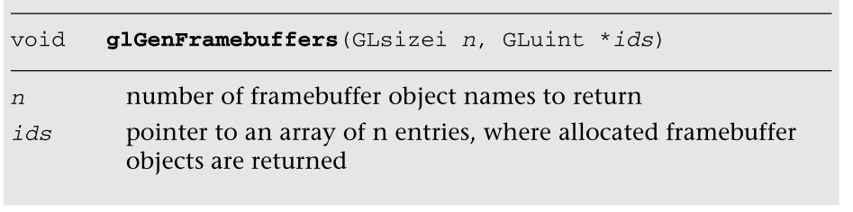

# FrameBuffer

在本章中，我们描述了什么是帧缓冲区对象，应用程序如何创建它们，以及应用程序如何使用它们来渲染到屏幕外缓冲区或渲染到纹理。我们从讨论为什么需要framebuffer对象开始。然后我们介绍帧缓冲区对象，并讨论它们是什么，它们添加到OpenGL  ES的新对象类型，以及它们与我们在第3章“EGL简介”中读到的EGL曲面有何不同我们继续讨论如何创建framebuffer对象；如何指定framebuffer对象的颜色、深度和模具附件；然后提供演示如何呈现framebuffer对象的示例。最后但同样重要的是，我们讨论应用程序的性能提示和技巧，在使用framebuffer对象时，我们应该注意并使用这些提示和技巧来确保良好的性能。

In this chapter we describe what framebuffer objects are, how applications can  create them, and how applications can use them for rendering to an offscreen  buffer or rendering to a texture. We start by discussing why we need framebuffer  objects. We then introduce framebuffer objects and discuss what they are, new  object types they add to OpenGL ES, and how they differ from EGL surfaces that  we read about in Chapter 3, “An Introduction to EGL.” We go on to discuss how to  create framebuffer objects; how to specify color, depth, and stencil attachments  to a framebuffer object; and then provide examples that demonstrate rendering to  a framebuffer object. Last but not least, we discuss performance tips and tricks  applications that we should be aware of and use to ensure good performance when  using framebuffer objects.

## 为什么是帧缓冲区对象？

Why Framebuffer Objects?

在应用程序调用任何OpenGL  ES命令之前，需要首先创建渲染上下文和绘图表面，并使其成为最新的。渲染上下文和绘图表面通常由本地窗口系统通过诸如EGL这样的应用编程接口提供。第3章描述了如何创建EGL上下文和表面，以及如何将它们附加到渲染线程。呈现上下文包含正确操作所需的适当状态。本机窗口系统提供的绘图表面可以是将在屏幕上显示的表面，称为窗口系统提供的帧缓冲区，也可以是屏幕外表面，称为缓冲区。创建EGL绘图表面的调用允许您以像素为单位指定表面的宽度和高度，表面是否使用颜色、深度和模具缓冲区，以及这些缓冲区的位深度。

A rendering context and a drawing surface need to be first created and made  current before any OpenGL ES commands can be called by an application. The  rendering context and the drawing surface are usually provided by the native  windowing system through an API such as EGL. Chapter 3 describes how to create  an EGL context and surface and how to attach them to a rendering thread. The  rendering context contains appropriate state required for correct operation. The  drawing surface provided by the native windowing system can be a surface that  will be displayed on the screen, referred to as the window system provided  framebuffer, or can be an off-screen surface, referred to as a pbuffer. The  calls to create the EGL drawing surfaces let you specify the width and height of  the surface in pixels, whether the surface uses color-, depth-, and stencil  buffers, and bit depths of these buffers.

默认情况下，OpenGL  ES使用窗口系统提供的帧缓冲区作为绘图表面。如果应用程序只绘制到屏幕表面，窗口系统提供的帧缓冲区通常就足够了。然而，许多应用程序需要渲染到纹理，为此，使用窗口系统提供的帧缓冲作为您的绘图表面通常不是一个理想的选择。渲染到纹理很有用的例子有动态反射和环境映射、景深的多通道技术、运动模糊效果和后期处理效果。

By default, OpenGL ES uses the window system provided framebuffer as the  drawing surface. If the application is only drawing to an on-screen surface, the  window system provided framebuffer is usually sufficient. However, many  applications need to render to a texture, and for this using the window system  provided framebuffer as your drawing surface is usually not an ideal option.  Examples of where render to texture is useful are dynamic reflections and  environment-mapping, multipass techniques for depth-of- field, motion blur  effects, and post-processing effects.

应用程序可以使用两种技术来渲染纹理:

There are two techniques that applications can use to render to a  texture:

通过绘制到窗口系统提供的帧缓冲区，然后将帧缓冲区的适当区域复制到纹理，实现渲染到纹理。这可以使用glCopyTexImage2D和glCopyTexSubImage2D  APIs来实现。顾名思义，这些应用编程接口执行从帧缓冲区到纹理缓冲区的复制，这种复制操作通常会对性能产生负面影响。此外，这仅在纹理的尺寸小于或等于帧缓冲区的尺寸时有效。

Implement render to texture by drawing to the window system provided  framebuffer and then copy the appropriate region of the framebuffer to the  texture. This can be implemented using glCopyTexImage2D and glCopyTexSubImage2D  APIs. As the name implies, these APIs perform a copy from the framebuffer to the  texture buffer and this copy operation can often adversely impact performance.  In addition, this only works if the dimensions of the texture are less than or  equal to the dimensions of the framebuffer.

通过使用附加到纹理上的缓冲区来实现纹理渲染。我们知道，窗口系统提供的表面必须附加到渲染上下文。在一些需要为每个缓冲区和窗口表面提供单独上下文的实现中，这可能是低效的。此外，在窗口系统提供的可绘制对象之间进行切换有时可能需要实现在切换之前完全完成所有先前的渲染。这会在渲染管道中引入昂贵的“气泡”。在这样的系统上，我们的建议是避免使用pbuffers来渲染纹理，因为上下文和窗口系统提供了可绘制的切换。

Implement render to texture by using a pbuffer that is attached to a texture.  We know that a window system provided surface must be attached to a rendering  context. This can be inefficient on some implementations that require separate  contexts for each pbuffer and window surface. Additionally, switching between  window system provided drawables can sometimes require the implementation to  completely finish all previous rendering prior to the switch. This can introduce  expensive “bubbles” into the rendering pipeline. On such systems, our  recommendation is to avoid using pbuffers to render to textures because of the  overhead associated with context and window system provided drawable  switching.

这两种方法都不适合渲染到纹理或其他屏幕外表面。需要的是允许应用程序直接渲染到纹理的应用程序接口，或者在OpenGL  ES应用程序接口中创建屏幕外表面并将其用作渲染目标的能力。Framebuffer对象和renderbuffer对象允许应用程序完全这样做，而不需要创建额外的呈现上下文。我们不再需要担心上下文和可绘制开关的开销，当使用窗口系统提供的可绘制开关时，会发生这种情况。因此，帧缓冲区对象为渲染到纹理或屏幕外表面提供了更好、更高效的方法。

Neither of these two methods are ideal for rendering to a texture or other  off-screen surface. What is needed are APIs that allow applications to directly  render to a texture or the ability to create an off-screen surface within the  OpenGL ES API and use it as a rendering target. Framebuffer objects and  renderbuffer objects allow applications to do exactly this without requiring  additional rendering contexts to be created. We no longer have to worry about  the overhead of a context and drawable switch that can occur when using window  system provided drawables. Framebuffer objects therefore provide a better and  more efficient method for rendering to a texture or an off-screen  surface.

框架缓冲区对象应用编程接口支持以下操作:

The Framebuffer objects API supports the following operations:

- 仅使用OpenGL  ES命令创建帧缓冲区对象。

  Creating framebuffer objects using OpenGL ES commands only.

- 在单个EGL上下文中创建和使用多个帧缓冲区对象；也就是说，每个帧缓冲区不需要渲染上下文。

  Creating and using multiple framebuffer objects within a single EGL context;  that is, without requiring a rendering context per framebuffer.

- 创建屏幕外颜色、深度或模具渲染缓冲区和纹理，并将它们附加到framebuffer对象。

  Creating off-screen color, depth, or stencil renderbuffers and textures, and  attaching these to a framebuffer object.

- 跨多个框架缓冲区共享颜色、深度或模具缓冲区。

  Sharing color, depth or stencil buffers across multiple  framebuffers.

- 将纹理作为颜色或深度直接附加到帧缓冲区，避免了复制操作。

  Attaching textures directly to a framebuffer as color or depth and avoiding  the need to do a copy operation.

## 帧缓冲区和渲染缓冲区对象

Framebuffer and Renderbuffer Objects

我们描述了什么是渲染缓冲区和帧缓冲区对象，它们与窗口系统提供的可绘制对象有何不同，以及何时使用渲染缓冲区而不是纹理。

We describe what a renderbuffer and a framebuffer object are, how they differ  from window system provided drawables, and when to use a renderbuffer instead of  a texture.

renderbuffer对象是由应用程序分配的2D图像缓冲区。renderbuffer可用于分配和存储颜色、深度或模具值，并可用作framebuffer对象中的颜色、深度或模具附件。渲染缓冲区类似于提供可绘制表面的屏幕外窗口系统，如缓冲区。但是，渲染缓冲区不能直接用作GL纹理。

A renderbuffer object is a 2D image buffer allocated by the application. The  renderbuffer can be used to allocate and store color, depth, or stencil values  and can be used as a color, depth, or stencil attachment in a framebuffer  object. A renderbuffer is similar to an off-screen window system provided  drawable surface, such as a pbuffer. A renderbuffer, however, cannot be directly  used as a GL texture.

框架缓冲区对象(通常称为FBO)是颜色、深度和模板缓冲区连接点的集合；描述附加到FBO的颜色、深度和模板缓冲区的大小和格式等属性的状态；以及附加到FBO的纹理和渲染缓冲对象的名称。各种2D图像可以附着到帧缓冲区对象中的颜色附着点。其中包括存储颜色值的渲染缓冲对象、2D纹理或立方体贴图面的mip级，甚至3D纹理中2D切片的mip级。类似地，包含深度值的各种2D图像可以附着到FBO的深度附着点。这些可以包括渲染缓冲区、2D纹理的mip级或存储深度值的立方体贴图面。唯一可以附加到FBO的模具连接点的2D图像是存储模具值的renderbuffer对象。

A framebuffer object (often referred to as an FBO) is a collection of color,  depth, and stencil buffer attachment points; state that describes properties  such as the size and format of the color, depth, and stencil buffers attached to  the FBO; and the names of the texture and renderbuffer objects attached to the  FBO. Various 2D images can be attached to the color attachment point in the  framebuffer object. These include a renderbuffer object that stores color  values, a mip-level of a 2D texture or a cubemap face, or even a mip-level of a  2D slice in a 3D texture. Similarly, various 2D images containing depth values  can be attached to the depth attachment point of an FBO. These can include a  renderbuffer, a mip-level of a 2D texture or a cubemap face that stores depth  values. The only 2D image that can be attached to the stencil attachment point  of an FBO is a renderbuffer object that stores stencil values.

图12-1显示了帧缓冲区对象、渲染缓冲区对象和纹理之间的关系。请注意，在framebuffer对象中只能有一种颜色、深度和模具附件。

Figure 12-1 shows the relationship among framebuffer objects, renderbuffer  objects, and textures. Note that there can only be one color, depth, and stencil  attachment in a framebuffer object.

注意:GL_OES_texture_3D可选扩展允许3D纹理的2D切片用作帧缓冲区附件。纹理可选扩展允许2D和立方体贴图深度纹理。GL  _ OES _ packed _ depth _模板扩展允许应用程序使用一个打包深度模板纹理作为深度和模板缓冲附件。

Note: The GL_OES_texture_3D optional extension allows a 2D slice of a 3D  texture to be used as a framebuffer attachment. The GL_OES_depth_texture  optional extension allows for 2D and cubemap depth textures. The  GL_OES_packed_depth_stencil extension allows the application to use a packed  depth stencil texture as a depth and stencil buffer attachment.


## 选择渲染缓冲区还是纹理作为帧缓冲区附件

Choosing a Renderbuffer Versus a Texture as a Framebuffer Attachment

对于渲染到纹理用例，将纹理对象附加到帧缓冲区对象。示例包括渲染到将用作颜色纹理的颜色缓冲区，或者渲染到将用作阴影的深度纹理的深度缓冲区。

For render to texture use cases, attach a texture object to the framebuffer  object. Examples include rendering to a color buffer that will be used as a  color texture, or rendering into a depth buffer that will be used as a depth  texture for shadows.

使用渲染缓冲区代替纹理还有几个原因。其中包括以下内容:

There are also several reasons to use renderbuffers instead of textures. These  include the following:

- 某些图像格式不支持纹理，例如模板索引值。必须改用renderbuffer。

  Certain image formats do not support texturing, such as stencil index values.  A renderbuffer must be used instead.

- 如果图像不用作纹理，使用渲染缓冲区可能会有性能优势。这是因为该实现可能能够以更高效的格式存储renderbuffer，更适合渲染而不是纹理化。然而，实现只能这样做，如果它事先知道图像不会被用作纹理。

  If the image will not be used as a texture, using a renderbuffer may have a  performance advantage. This is because the implementation might be able to store  the renderbuffer in a much more efficient format, better suited for rendering  than for texturing. The implementation can only do so, however, if it knows in  advance that the image will not be used as a texture.


## 帧缓冲对象与EGL曲面

Framebuffer Objects Versus EGL Surfaces翻译：

FBO和窗户系统提供的可绘制表面之间的区别如下:

The differences between an FBO and the window system provided drawable surface  are as follows:

- 翻译：

  像素所有权测试—该测试确定帧缓冲区中位置(xw，yw)的像素当前是否属于OpenGL  ES。该测试允许窗口系统控制帧缓冲区中的哪些像素属于当前OpenGL ES上下文。例如，如果一个由OpenGL  ES渲染的窗口被遮挡。对于应用程序创建的帧缓冲区对象，像素所有权测试总是成功的，因为帧缓冲区对象拥有所有像素。

  Pixel ownership test—This test determines if the pixel at location (xw, yw) in  the framebuffer is currently owned by OpenGL ES. This test allows the window  system to control which pixels in the framebuffer belong to the current OpenGL  ES context. An example would be if a window that is being rendered into by  OpenGL ES is obscured. For an application-created framebuffer object, the pixel  ownership test always succeeds as the framebuffer object owns all the  pixels.

- 窗户系统可能只支持双缓冲表面。另一方面，Framebuffer对象只支持单缓冲附件。

  The window system might support only double-buffered surfaces. Framebuffer  objects, on the other hand, only support single-buffered attachments.

- 用framebuffer对象可以在framebuffer之间共享模具和深度缓冲区，但通常不使用窗口系统提供的frame  buffer。模板和深度缓冲区及其对应的状态通常由窗口系统提供的可绘制表面隐式分配，因此不能在可绘制表面之间共享。使用应用程序创建的框架缓冲区对象，可以独立创建模具和深度渲染缓冲区，然后通过将这些缓冲区附加到多个框架缓冲区对象中的适当连接点(如果需要)来与框架缓冲区对象相关联。

  Sharing of stencil and depth buffers between framebuffers is possible using  framebuffer objects but usually not with the window system provided framebuffer.  Stencil and depth buffers and their corresponding state are usually allocated  implicitly with the window system provided drawable surface and therefore cannot  be shared between drawable surfaces. With application-created framebuffer  objects, stencil and depth renderbuffers can be created independently and then  associated with a framebuffer object by attaching these buffers to appropriate  attachment points in multiple framebuffer objects, if desired.

- 窗口系统提供的帧缓冲区可能支持多重采样。多采样缓冲区可以通过使用窗口系统表面创建应用编程接口来指定。在EGL，可以通过在用于创建窗口系统提供的帧缓冲区的配置文件中设置EGL  _采样_缓冲区值来指定多采样缓冲区。应用程序创建的framebuffer对象不支持将多样本缓冲区作为附件。

  Window system provided framebuffers might support multisampling. Multisample  buffers can be specified by using the window system surface creation API. In  EGL, multisample buffers can be specified by setting the EGL_SAMPLE_BUFFERS  value in EGLconfig used to create the window system provided framebuffer.  Application-created framebuffer objects do not support multisample buffers as  attachments.

## 创建帧缓冲区和渲染缓冲区对象

Creating Framebuffer and Renderbuffer Objects

创建帧缓冲区和渲染缓冲区对象类似于OpenGL  ES 2.0中创建纹理或顶点缓冲区对象的方式。

Creating framebuffer and renderbuffer objects is similar to how texture or  vertex buffer objects are created in OpenGL ES 2.0.

glGenRenderbuffers  API调用用于分配renderbuffer对象名称。接下来描述这个API。

The glGenRenderbuffers API call is used to allocate renderbuffer object names.  This API is described next.


glGenRenderbuffers分配n个renderbuffer对象名称，并在Renderbuffers中返回它们。glGenRenderbuffers返回的renderbuffer对象名称是0以外的无符号整数。返回的renderbuffer名称被标记为正在使用，但没有任何与之关联的状态。值0由OpenGL  ES保留，不引用renderbuffer对象。试图修改或查询renderbuffer对象0的缓冲区对象状态的应用程序将生成适当的错误。

glGenRenderbuffers allocates n renderbuffer object names and returns them in  renderbuffers. The renderbuffer object names returned by glGenRenderbuffers are  unsigned integer numbers other than 0. The renderbuffer names returned are  marked in use but do not have any state associated with them. The value 0 is  reserved by OpenGL ES and does not refer to a renderbuffer object. Applications  trying to modify or query buffer object state for renderbuffer object 0 will  generate an appropriate error.

glGenFramebuffers  API调用用于分配帧缓冲区对象名称。这里描述一下这个API。

The glGenFramebuffers API call is used to allocate framebuffer object names.  This API is described here.



glGenFramebuffers分配n个framebuffer对象名，并在id中返回它们。glGenFramebuffers返回的framebuffer对象名称是0以外的无符号整数。返回的framebuffer名称被标记为正在使用，但没有任何与之关联的状态。值0由OpenGL  ES保留，指的是窗口系统提供的帧缓冲区。试图修改或查询framebuffer对象0的缓冲区对象状态的应用程序将生成适当的错误。

glGenFramebuffers allocates n framebuffer object names and returns them in  ids. The framebuffer object names returned by glGenFramebuffers are unsigned  integer numbers other than 0. The framebuffer names returned are marked in use  but do not have any state associated with them. The value 0 is reserved by  OpenGL ES and refers to the window system provided framebuffer. Applications  trying to modify or query buffer object state for framebuffer object 0 will  generate an appropriate error.

## 使用渲染缓冲区对象

Using Renderbuffer Objects

在本节中，我们将描述如何指定renderbuffer图像的数据存储、格式和维度。要为特定的renderbuffer对象指定此信息，我们需要将此对象设为当前renderbuffer对象。glBindRenderbuffer命令用于设置当前的Renderbuffer对象。

In this section, we describe how to specify the data storage, format, and  dimensions of the renderbuffer image. To specify this information for a specific  renderbuffer object, we need to make this object the current renderbuffer  object. The glBindRenderbuffer command is used to set the current renderbuffer  object.


请注意，在使用glBindRenderbuffer绑定之前，glGenRenderbuffers不需要分配renderbuffer对象名称。虽然调用glGenRenderbuffers是一个很好的实践，但是有很多应用程序为它们的缓冲区指定编译时常数。应用程序可以为glBindRenderbuffer指定一个未使用的renderbuffer对象名。但是，我们确实建议OpenGL  ES应用程序调用glGenRenderbuffers，并使用glGenRenderbuffers返回的renderbuffer对象名称，而不是指定它们自己的缓冲区对象名称。

Note that glGenRenderbuffers is not required to assign a renderbuffer object  name before it is bound using glBindRenderbuffer. Although it is a good practice  to call glGenRenderbuffers, there are lots of applications that specify  compile-time constants for their buffers. An application can specify an unused  renderbuffer object name to glBindRenderbuffer. However, we do recommend that  OpenGL ES applications call glGenRenderbuffers and use renderbuffer object names  returned by glGenRenderbuffers instead of specifying their own buffer object  names.

第一次通过调用glBindRenderbuffer绑定renderbuffer对象名称时，Renderbuffer对象将被分配适当的默认状态，如果分配成功，该分配的对象将成为新绑定的renderbuffer对象。

The first time the renderbuffer object name is bound by calling  glBindRenderbuffer, the renderbuffer object is allocated with the appropriate  default state and if the allocation is successful, this allocated object will  become the newly bound renderbuffer object.

以下状态和默认值与renderbuffer对象相关联:

The following state and default values are associated with a renderbuffer  object:

- 以像素为单位的宽度和高度-默认值为零。

  Width and height in pixels—The default value is zero.

- 内部格式—描述渲染缓冲区中存储的像素格式。它必须是颜色、深度或模板可渲染格式。

  Internal format—This describes the format of the pixels stored in the  renderbuffer. It must be a color-, depth-, or stencil-renderable  format.

- 颜色位深度-仅当内部格式是可颜色渲染格式时才有效。默认值为零。

  Color bit-depth—This is valid only if the internal format is a colorrenderable  format. The default value is zero.

- 深度位深度—仅当内部格式是可深度解析的格式时，此选项才有效。默认值为零。

  Depth bit-depth—This is valid only if the internal format is a depthrenderable  format. The default value is zero.

- 模具位深度-仅当内部格式为可模具渲染格式时，此选项才有效。默认值为零。

  Stencil bit-depth—This is valid only if the internal format is a  stencilrenderable format. The default value is zero.

glBindRenderbuffer还可以用于绑定到现有的Renderbuffer对象(即，以前分配和使用过并因此具有与之相关联的有效状态的对象)。bind命令不会对新绑定的renderbuffer对象的状态进行任何更改。

glBindRenderbuffer can also be used to bind to an existing renderbuffer object  (i.e., an object that has been assigned and used before and therefore has valid  state associated with it). No changes to the state of the newly bound  renderbuffer object are made by the bind command.

一旦renderbuffer对象被绑定，我们就可以指定renderbuffer中存储的图像的尺寸和格式。glRenderbufferStorage命令可用于指定此信息。

Once a renderbuffer object is bound, we can specify the dimensions and format  of the image stored in the renderbuffer. The glRenderbufferStorage command can  be used to specify this information.


glRenderbufferStorage看起来非常类似于glTexImage2D，只是没有提供图像数据。renderbuffer的宽度和高度以像素为单位指定，并且必须小于实现支持的最大renderbuffer大小。最小尺寸值都必须支持为1

glRenderbufferStorage looks very similar to glTexImage2D except that no image  data is supplied. The width and height of the renderbuffer is specified in  pixels and must be values that are smaller than the maximum renderbuffer size  supported by the implementation.The minimum size value。

```java
GLint maxRenderbufferSize;
glGetIntegerv(GL_MAX_RENDERBUFFER_SIZE, &maxRenderbufferSize);
```

internalformat参数指定应用程序用来在renderbuffer对象中存储像素的格式。

The internalformat argument specifies the format that the application would  like to use to store pixels in the renderbuffer object.

- 如果内部格式是GL_RGB565、GL_RGBA4、GL_RGB5_A1、GL_RGB8_OES或GL_RGBA8_OES，则渲染缓冲区存储一个可渲染的颜色缓冲区。

  I f internalformat is GL_RGB565, GL_RGBA4, GL_RGB5_A1, GL_RGB8_OES, or  GL_RGBA8_OES, the renderbuffer stores a color-renderable buffer.

- 如果内部格式是GL  _ DEPTH _ COMPONANENT16、GL _ DEPTH _ COMPONANENT24 _ OES或GL _ DEPTH _  COMPONANENT32 _ OES，则渲染缓冲区存储深度可渲染缓冲区。

  I f internalformat is GL_DEPTH_COMPONENT16, GL_DEPTH_COMPONENT24_OES, or  GL_DEPTH_COMPONENT32_OES, the renderbuffer stores a depth-renderable  buffer.

- 如果内部格式是GL  _ SCOTE _ INDEX 8、GL _ SCOTE _ INDEX 4 _ OES或GL _ SCOTE _ INDEX 1 _  OES，则renderbuffer存储一个可呈现模板的缓冲区。

  I f internalformat is GL_STENCIL_INDEX8, GL_STENCIL_INDEX4_OES, or  GL_STENCIL_INDEX1_OES, the renderbuffer stores a stencil-renderable  buffer.\

renderbuffer对象可以附加到framebuffer对象的颜色、深度或模具附件，而无需指定renderbuffer的存储格式和维度。renderbuffer的存储格式和维度可以在renderbuffer对象附加到framebuffer对象之前或之后指定。但是，在使用framebuffer对象和renderbuffer附件进行呈现之前，需要正确指定这些信息。

The renderbuffer object can be attached to the color, depth, or stencil  attachment of the framebuffer object without the renderbuffer’s storage format  and dimensions specified. The renderbuffer’s storage format and dimensions can  be specified before or after the renderbuffer object has been attached to the  framebuffer object. This information will, however, need to be correctly  specified before the framebuffer object and renderbuffer attachment can be used  for rendering.

如果支持GL_OES_rgb8_rgba8扩展，则可以使用GL_RGB8_OES和GL_RGBA8_OES格式。

The GL_RGB8_OES and GL_RGBA8_OES formats can be used if the GL_OES_rgb8_rgba8  extension is supported.

如果分别支持GL_OES_depth24或GL_OES_depth32扩展，则可以使用GL  _ DEPTH _ ENT24 _ OES或GL _ DEPTH _ ENT32 _ OES格式。

The GL_DEPTH_COMPONENT24_OES or GL_DEPTH_COMPONENT32_OES formats can be used  if the GL_OES_depth24 or GL_OES_depth32 extensions are supported,  respectively.

如果支持GL  _ OES _ packed _ depth 24 _ SCOTE 8 _ OES扩展，则可以使用GL _ DEPT 24 _ SCOTE 8 _  OES格式。

The GL_DEPTH24_STENCIL8_OES format can be used if the  GL_OES_packed_depth_stencil extension is supported.

## 使用帧缓冲区对象

Using Framebuffer Objects

我们描述了如何使用帧缓冲区对象渲染到屏幕外缓冲区(即渲染缓冲区)或渲染到纹理。在使用framebuffer对象并指定其附件之前，我们需要使其成为当前的framebuffer对象。glBindFramebuffer命令用于设置当前的Framebuffer对象.

We describe how to use framebuffer objects to render to an off-screen buffer  (i.e., renderbuffer) or to render to a texture. Before we can use a framebuffer  object and specify its attachments, we need to make it the current framebuffer  object. The glBindFramebuffer command is used to set the current framebuffer  object.


请注意，在使用glBindFramebuffer绑定之前，glGenFramebuffers不需要分配帧缓冲区对象名称。应用程序可以为glBindFramebuffer指定一个未使用的帧缓冲区对象名。但是，我们确实建议OpenGL  ES应用程序调用glGenFramebuffers，并使用glGenFramebuffers返回的帧缓冲区对象名称，而不是指定它们自己的缓冲区对象名称。

Note that glGenFramebuffers is not required to assign a framebuffer object  name before it is bound using glBindFramebuffer. An application can specify an  unused framebuffer object name to glBindFramebuffer. However, we do recommend  that OpenGL ES applications call glGenFramebuffers and use framebuffer object  names returned by glGenFramebuffers instead of specifying their own buffer  object names.

第一次通过调用glBindFramebuffer绑定framebuffer对象名称时，将为Framebuffer对象分配适当的默认状态，如果分配成功，此分配的对象将被绑定为呈现上下文的当前framebuffer对象。

The first time a framebuffer object name is bound by calling  glBindFramebuffer, the framebuffer object is allocated with appropriate default  state, and if the allocation is successful, this allocated object is bound as  the current framebuffer object for the rendering context.

以下状态与framebuffer对象相关联:

The following state is associated with a framebuffer object:

- 颜色附着点-颜色缓冲区的附着点。

  Color attachment point—The attachment point for the color buffer.

- 深度附着点-深度缓冲区的附着点。

  Depth attachment point—The attachment point for the depth buffer.

- 模具连接点—模具缓冲区的连接点。

  Stencil attachment point—The attachment point for the stencil  buffer.

- 帧缓冲区完整性状态—帧缓冲区是否处于完整状态，是否可以呈现给。

  Framebuffer completeness status—Whether or not the framebuffer is in a  complete state and can be rendered to.

对于每个附着点，指定以下信息:

For each attachment point, the following information is specified:

- 对象类型-指定与附着点关联的对象类型。如果附加了RENDERBUFFER对象，则可以是GL_RENDERBUFFER，如果附加了纹理对象，则可以是GL  _ TRIBUTE。默认值为GL_NONE。

  Object type—Specifies the type of object that is associated with the  attachment point. This can be GL_RENDERBUFFER if a renderbuffer object is  attached or GL_TEXTURE if a texture object is attached. The default value is  GL_NONE.

- 对象名称-指定附着的对象的名称。这可以是renderbuffer对象名称，也可以是纹理对象名称。默认值为0。

  Object name—Specifies the name of the object attached. This can be either the  renderbuffer object name or the texture object name. The default value is  0.

- 纹理级别-如果附着了纹理对象，则指定与附着点相关联的纹理的mip级别。默认值为0。

  Texture level—If a texture object is attached, then this specifies the  mip-level of the texture associated with the attachment point. The default value  is 0.

- 纹理立方体贴图面-如果附着了一个纹理对象，并且该纹理是立方体贴图，则指定六个立方体贴图面中的哪一个用作附着点。默认值为GL_TEXTURE_CUBE_MAP_POSITIVE_X。

  Texture cubemap face—If a texture object is attached and the texture is a  cubemap, then this specifies which one of the six cubemap faces is to be used as  the attachment point. The default value is  GL_TEXTURE_CUBE_MAP_POSITIVE_X.

- 纹理Z偏移-这是一个可选值，仅当OpenGL  ES 2.0实现支持GL_OES_texture_3D扩展时可用。它指定3D纹理的2D切片用作附着点。默认值为0。

  Texture Z offset—This is an optional value only available if the  GL_OES_texture_3D extension is supported by the OpenGL ES 2.0 implementation. It  specifies the 2D slice of the 3D texture to be used as the attachment point. The  default value is 0.

  glBindFramebuffer还可以用于绑定到现有的帧缓冲区对象(即，以前分配和使用过的对象，因此具有与之相关联的有效状态)。不会对新绑定的framebuffer对象的状态进行任何更改。

  glBindFramebuffer can also be used to bind to an existing framebuffer object  (i.e., an object that has been assigned and used before and therefore has valid  state associated with it). No changes are made to the state of the newly bound  framebuffer object.

  一旦绑定了framebuffer对象，当前绑定的framebuffer对象的颜色、深度和模具附件就可以设置为renderbuffer对象或纹理。如图12-1所示，颜色附件可以设置为存储颜色值的渲染缓冲区，或者设置为2D纹理或立方体贴图面的mip级，或者设置为3D纹理中2D切片的mip级。深度附件可以设置为存储深度值的渲染缓冲区、2D深度纹理的mip级或深度立方体贴图面。模具附件必须设置为存储模具值的renderbuffer。

  Once a framebuffer object has been bound, the color, depth, and stencil  attachments of the currently bound framebuffer object can be set to a  renderbuffer object or a texture. As shown in Figure 12-1, the color attachment  can be set to a renderbuffer that stores color values, or to a mip-level of a 2D  texture or a cubemap face, or to a mip-level of a 2D slice in a 3D texture. The  depth attachment can be set to a renderbuffer that stores depth values, to a  mip-level of a 2D depth texture, or to a depth cubemap face. The stencil  attachment must be set to a renderbuffer that stores stencil values.

  ## 将渲染缓冲区附加为帧缓冲区附件

  Attaching a Renderbuffer as a Framebuffer Attachment

  glFramebufferRenderbuffer命令用于将Renderbuffer对象附加到帧缓冲区连接点。

  The glFramebufferRenderbuffer command is used to attach a renderbuffer object  to a framebuffer attachment point.

  


如果在Renderbuffer不等于零的情况下调用glFramebufferRenderbuffer，则此renderbuffer对象将用作附件参数值指定的新颜色、深度或模具连接点。

If glFramebufferRenderbuffer is called with renderbuffer not equal to zero,  this renderbuffer object will be used as the new color, depth, or stencil  attachment point as specified by value of attachment argument.

连接点的状态将修改为:

The attachment point’s state will be modified to:

- Object type = GL_RENDERBUFFER
- ObejectNamez =  renderbuffer
-  Texture level, texture cubemap face, and texture Z offset = 0

新附加的renderbuffer对象的状态或其缓冲区的内容不会改变。

The newly attached renderbuffer object’s state or contents of its buffer do  not change.

如果调用glFramebufferRenderbuffer时Renderbuffer等于零，则附件指定的颜色、深度或模具缓冲区将被分离并重置为零

If glFramebufferRenderbuffer is called with renderbuffer equal to zero, then  the color, depth, or stencil buffer as specified by attachment is detached and  reset to zero

## 将2D纹理附加为帧缓冲区附件

Attaching a 2D Texture as a Framebuffer Attachment

glFramebufferTexture2D命令用于将2D纹理的mip级或立方体贴图面附着到帧缓冲区附着点。它可以用来附加纹理作为颜色或深度附件。不允许将纹理作为模具附件。

The glFramebufferTexture2D command is used to attach a mip-level of a 2D  texture or a cubemap face to a framebuffer attachment point. It can be used to  attach a texture as a color or depth attachment. A texture as a stencil  attachment is not allowed.


如果调用glFramebufferTexture2D时纹理不等于零，则颜色或深度附件将被设置为纹理。另一方面，如果glFramebufferTexture2D生成错误，则不会更改帧缓冲区的状态。

If glFramebufferTexture2D is called with texture not equal to zero, then the  color or depth attachment will be set to texture. If, on the other hand,  glFramebufferTexture2D generates an error, no change is made to the state of  framebuffer.

连接点的状态将修改为:

The attachment point’s state will be modified to:


新附着的纹理对象的状态或其图像内容不会被glFramebufferTexture2D修改。请注意，纹理对象的状态和图像可以在附加到帧缓冲区对象后进行修改。

The newly attached texture object’s state or contents of its image are not  modified by glFramebufferTexture2D. Note that the texture object’s state and  image can be modified after it has been attached to a framebuffer  object.

如果调用glFramebufferTexture2D时纹理等于零，则颜色或深度附件将被分离并重置为零。

If glFramebufferTexture2D is called with texture equal to zero, then the color  or depth attachment is detached and reset to zero.

## 将3D纹理图像作为帧缓冲区附件进行附加

Attaching an Image of a 3D Texture as a Framebuffer Attachment

glFramebufferTexture3DOES命令用于将2D切片和3D纹理的特定mip级附加到帧缓冲区连接点。它只能用于将纹理附加为颜色附件。不允许使用3D纹理作为深度或模具附件。关于3D纹理工作原理的详细描述，请参考第9章“纹理”。

The glFramebufferTexture3DOES command is used to attach a 2D slice and a  specific mip-level of a 3D texture to a framebuffer attachment point. It can  only be used to attach a texture as a color attachment. A 3D texture as a depth  or stencil attachment is not allowed. Refer to Chapter 9, “Texturing,” for a  detailed description of how 3D textures work.


如果在纹理不等于0的情况下调用glFramebufferTexture3DOES，则颜色附件将被设置为纹理。另一方面，如果glFramebufferTexture3DOES出现错误，则不会对帧缓冲区的状态进行任何更改。

f glFramebufferTexture3DOES is called with texture not equal to 0, then the  color attachment will be set to texture. If, on the other hand,  glFramebufferTexture3DOES generates an error, no change is made to the state of  framebuffer.

连接点的状态将修改为:

The attachment point’s state will be modified to:


新附着的纹理对象的状态或其图像的内容不会被glFramebufferTexture3DOES修改。请注意，纹理对象的状态和图像可以在附加到帧缓冲区对象后进行修改。

The newly attached texture object’s state or contents of its image are not  modified by glFramebufferTexture3DOES. Note that the texture object’s state and  image can be modified after it has been attached to a framebuffer  object.

如果调用glFramebufferTexture3DOES时纹理等于零，则颜色附件将被分离并重置为零。

If glFramebufferTexture3DOES is called with texture equal to zero, then the  color attachment is detached and reset to zero.