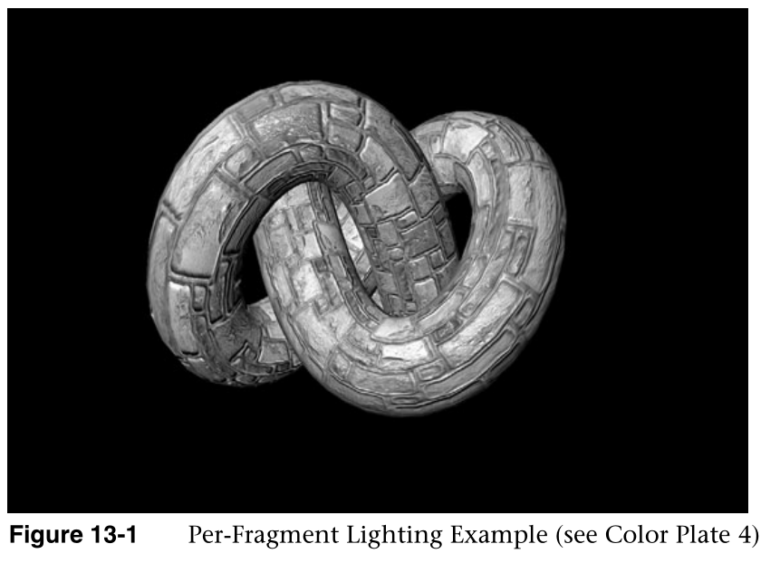
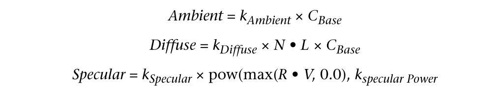
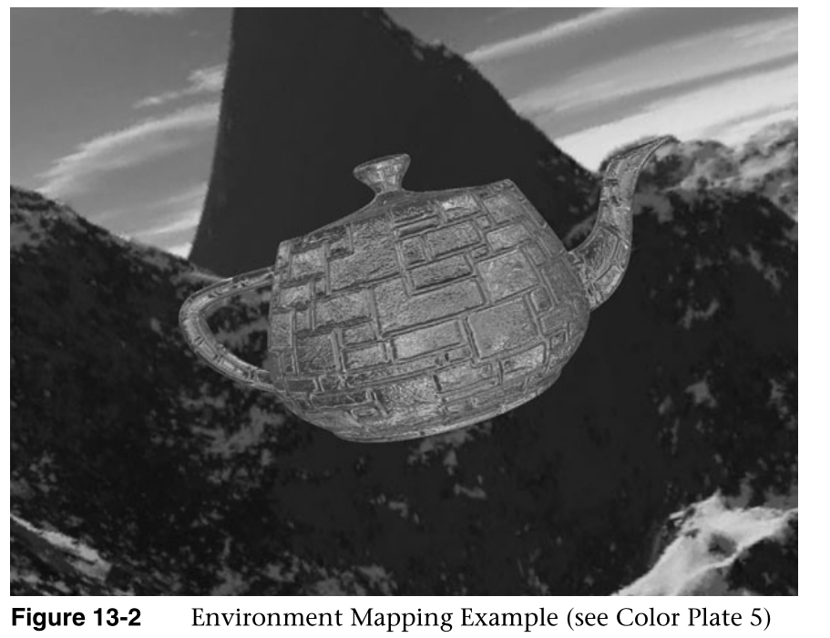
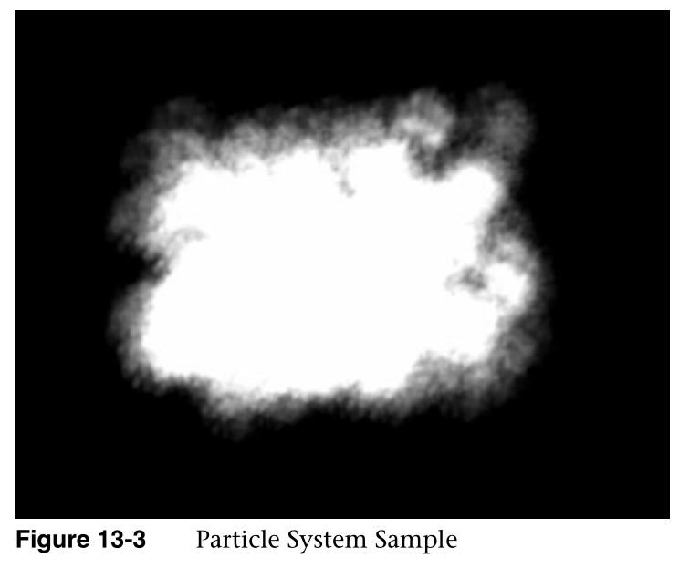

# 高级编程

在这一章中，我们将您在整本书中学到的许多技术放在一起，讨论OpenGL  ES 2.0的一些高级用途。OpenGL ES 2.0的可编程灵活性可以完成大量的高级渲染技术。在本章中，我们将介绍以下高级渲染技术:

In this chapter, we put together many of the techniques you have learned  throughout the book to discuss some advanced uses of OpenGL ES 2.0. There are a  large number of advanced rendering techniques that can be accomplished with the  programmable flexibility of OpenGL ES 2.0. In this chapter, we cover the  following advanced rendering techniques:

- 每片段照明。

  Per-fragment lighting.

- 环境制图

  Environment mapping

- 带有点精灵的粒子系统。

  Particle system with point sprites.
  
- 图像后处理。

  Image postprocessing.

- 投影纹理。

  Projective texturing.

- 用3D纹理的

  Noise using a 3D texture.

- 程序纹理。

  Procedural textures.

## 逐片段照明

Per-Fragment Lighting

在第8章“顶点着色器”中，我们讲述了可以在顶点着色器中用于计算每个顶点光照的光照方程。通常，为了获得更高质量的照明，我们寻求在每个片段的基础上评估照明方程。在本节中，我们将介绍一个基于每个片段评估环境、漫射和镜面照明的示例。

In Chapter 8, “Vertex Shaders,” we covered the lighting equations that can be  used in the vertex shader to calculate per-vertex lighting. Commonly, to achieve  higher quality lighting, we seek to evaluate the lighting equations on a  per-fragment basis. In this section, we cover an example of evaluating ambient,  diffuse, and specular lighting on a per-fragment basis.

我们280第13章:OpenGL  ES 2.0高级编程的例子是一个渲染猴子工作空间，可以在第13章/性能照明/性能照明中找到，如图13-1所示

The example we 280 Chapter 13: Advanced Programming with OpenGL ES 2.0 cover  is a RenderMonkey workspace that can be found in Chapter_13/  PerFragmentLighting/PerFragmentLighting.rfx as pictured in Figure 13-1.



## 用法线贴图照明

Lighting with a Normal Map

在我们进入渲染猴子工作空间中使用的着色器的细节之前，有必要首先讨论一下示例中使用的一般方法。对每个片段进行照明的最简单方法是在片段着色器中使用插值的顶点法线，然后将照明计算移动到片段着色器中。然而，对于漫射项，这真的不会产生比逐顶点照明更好的结果。这样做的好处是可以对法向量进行重整，这将消除由于线性插值而产生的伪影，但整体质量只会稍微好一点。为了真正利用基于每个片段进行计算的能力，使用法线贴图来存储每个纹理元素的法线可以提供更多的细节。

Before we get into the details of the shaders used in the RenderMonkey  workspace, it’s necessary to first discuss the general approach that is used in  the example. The simplest way to do lighting per-fragment would be to use the  interpolated vertex normal in the fragment shader and then move the lighting  computations into the fragment shader. However, for the diffuse term, this would  really not yield much better results than doing the lighting per-vertex. There  would be the advantage that the normal vector could be renormalized, which would  remove artifacts due to linear interpolation, but the overall quality would be  only minimally better. To really take advantage of the ability to do  computations on a per-fragment basis, using a normal map to store per-texel  normals can provide significantly more detail.

法线贴图是一种2D纹理，它在每个纹理元素上存储一个法线向量。红色通道代表x分量，绿色通道代表y分量，蓝色通道代表z分量。对于存储为GL_RGB8且带有GL_UNSIGNED_BYTE数据的普通映射，值都将在[0，1]范围内。为了表示法线，这些值需要在着色器中进行缩放和偏移，以重新映射到[–1，1]。以下片段着色器代码块显示了如何从普通贴图中获取。

A normal map is a 2D texture that stores at each texel a normal vector. The  red channel represents the x component, the green channel the y component, and  the blue channel the z component. For a normal map stored as GL_RGB8 with  GL_UNSIGNED_BYTE data, the values will all be in the range [0, 1]. To represent  a normal, these values need to be scaled and biased in the shader to remap to  [–1, 1]. The following block of fragment shader code shows how you would go  about fetching from a normal map.

```java
// Fetch the tangent space normal from normal map
vec3 normal = texture2D(s_bumpMap, v_texcoord).xyz;
   
// Scale and bias from [0, 1] to [-1, 1] and normalize
normal = normalize(normal * 2.0 - 1.0);
```

如您所见，这一小部分着色器代码将从纹理贴图中获取颜色值，然后将结果乘以2再减去1。结果是数值从[0，1]范围重新调整到[–1，1]范围。此外，如果法线贴图中的数据没有标准化，您还需要在片段着色器中标准化结果。如果法线贴图包含所有单位矢量，则可以跳过这一步。

As you can see, this small bit of shader code will fetch the color value from  a texture map and then multiply the results by two and subtract one. The result  is that the values are rescaled into the [–1, 1] range from the [0, 1] range. In  addition, if the data in your normal map are not normalized, you will also need  to normalize the results in the fragment shader. This step can be skipped if  your normal map contains all unit vectors.

每片段光照需要解决的另一个重要问题是纹理中的法线存储在哪个空间。为了最小化片段着色器中的计算，我们不希望必须转换从法线贴图提取的法线的结果。实现这一点的一种方法是在法线贴图中存储世界空间法线。也就是说，法线贴图中的每个法向量都代表一个世界空间的法向量。然后，光线和方向向量可以在顶点着色器中转换到世界空间，并可以直接与从法线贴图获取的值一起使用。然而，在世界空间中存储普通地图存在重大问题。最重要的是，必须假设对象是静态的，因为对象上不会发生任何转换。另一个重要的问题是，空间中不同方向的相同表面不能在法线贴图中共享相同的纹理元素，这可能导致更大的贴图。

The other significant issue to tackle with per-fragment lighting has to do  with in which space the normals in the texture are stored. To minimize  computations in the fragment shader, we do not want to have to transform the  result of the normal fetched from the normal map. One way to accomplish this  would be to store world-space normals in your normal map. That is, the normal  vectors in the normal map would each represent a worldspace normal vector. Then,  the light and direction vectors could be transformed into world space in the  vertex shader and could be directly used with the value fetched from the normal  map. However, there are significant issues with storing normal maps in world  space. The most significant is that the object has to be assumed to be static  because no transformation can happen on the object. Another significant issue is  that the same surface oriented in different directions in space would not be  able to share the same texels in the normal map, which can result in much larger  maps.

比使用世界空间法线贴图更好的解决方案是将法线贴图存储在切线空间中。切线空间背后的思想是，我们通过三个坐标轴为每个顶点定义一个空间:法线、副法线和切线。存储在纹理贴图中的法线都存储在这个切线空间中。然后，当我们想要计算任何照明方程时，我们将入射照明向量转换到切线空间，然后这些照明向量可以直接与法线贴图中的值一起使用。切线空间通常作为预处理来计算，副法线和切线被添加到顶点属性数据。这项工作由渲染猴子自动完成，它为任何具有顶点法线和纹理坐标的模型计算切线空间。

A better solution than using world-space normal maps is to store normal maps  in tangent space. The idea behind tangent space is that we define a space for  each vertex by three coordinate axes: the normal, binormal, and tangent. The  normals stored in the texture map are then all stored in this tangent space.  Then, when we want to compute any lighting equations, we transform our incoming  lighting vectors into the tangent space and those light vectors can then  directly be used with the values in the normal map. The tangent space is  typically computed as a preprocess and the binormal and tangent are added to the  vertex attribute data. This work is done automatically by RenderMonkey, which  computes a tangent space for any model that has a vertex normal and texture  coordinates.

## 照明着色器

Lighting Shaders

一旦我们建立了切线空间法线贴图和切线空间向量，我们就可以进行每个片段的光照。首先，让我们看看示例13-1中的顶点着色器。

Once we have tangent space normal maps and tangent space vectors set up, we  can proceed with per-fragment lighting. First, let’s take a look at the vertex  shader in Example 13-1.

```java
Example 13-1 Per-Fragment Lighting Vertex Shader
uniform mat4 u_matViewInverse;
uniform mat4 u_matViewProjection;
uniform vec3 u_lightPosition;
uniform vec3 u_eyePosition;
varying vec2 v_texcoord;
varying vec3 v_viewDirection;
varying vec3 v_lightDirection;
attribute vec4 a_vertex;
attribute vec2 a_texcoord0;
attribute vec3 a_normal;
attribute vec3 a_binormal;
attribute vec3 a_tangent;
   
void main(void)
{
   // Transform eye vector into world space
   vec3 eyePositionWorld = 
             (u_matViewInverse * vec4(u_eyePosition, 1.0)).xyz;
   
   // Compute world space direction vector
   vec3 viewDirectionWorld = eyePositionWorld - a_vertex.xyz;
      
   // Transform light position into world space
   vec3 lightPositionWorld = 
             (u_matViewInverse * vec4(u_lightPosition, 1.0)).xyz;
   
   // Compute world space light direction vector
   vec3 lightDirectionWorld = lightPositionWorld - a_vertex.xyz;
   
   // Create the tangent matrix
   mat3 tangentMat = mat3(a_tangent, 
                          a_binormal,
                          a_normal);   
   
   // Transform the view and light vectors into tangent space
   v_viewDirection = viewDirectionWorld * tangentMat;
   v_lightDirection = lightDirectionWorld * tangentMat;
      
   // Transform output position
   gl_Position = u_matViewProjection * a_vertex;
   
   // Pass through texture coordinate
   v_texcoord = a_texcoord0.xy;
}
```

我们需要两个统一的矩阵作为顶点着色器的输入:u  _ matViewInverse和u_matViewProjection。u _  matViewInverse包含视图矩阵的逆。该矩阵用于将光矢量和眼矢量(在视图空间中)转换成世界空间。main中的前四个语句用于执行该转换，并计算世界空间中的光矢量和视图矢量。着色器的下一步是创建切线矩阵。顶点的切线空间存储在三个顶点属性中:a_normal、a  _ binormal和a_tangent。这三个向量为每个顶点定义了切线空间的三个坐标轴。我们用这些向量构造了一个3 ×  3的矩阵，形成正切矩阵tangentMat。

We have two uniform matrices that we need as input to the vertex shader:  u_matViewInverse and u_matViewProjection. The u_matViewInverse contains the  inverse of the view matrix. This matrix is used to transform the light vector  and eye vector (which are in view space) into world space. The first four  statements in main are used to perform this transformation and compute the light  vector and view vector in world space. The next step in the shader is to create  a tangent matrix. The tangent space for the vertex is stored in three vertex  attributes: a_normal, a_binormal, and a_tangent. These three vectors define the  three coordinate axes of the tangent space for each vertex. We construct a 3 × 3  matrix out of these vectors to form the tangent matrix tangentMat. 

下一步是通过将视图向量和方向向量乘以切线矩阵，将它们转换成切线空间。请记住，我们这里的目的是让视图和方向向量进入与切线空间法线贴图中的法线相同的空间。通过在顶点着色器中进行这种转换，我们可以避免在片段着色器中进行任何转换。最后，我们计算最终的输出位置，并将其放在gl_Position中，并将纹理坐标传递给v_texcoord中的片段着色器。

The next step is to transform the view and direction vectors into tangent  space by multiplying them by the tangentMat matrix. Remember, our purpose here  is to get the view and direction vectors into the same space as the normals in  the tangent-space normal map. By doing this transformation in the vertex shader,  we avoid doing any transformations in the fragment shader. Finally, we compute  the final output position and place it in gl_Position and pass the texture  coordinate along to the fragment shader in v_texcoord.

现在我们有了视图空间中的视图和方向向量，以及作为变量传递给片段着色器的纹理坐标。下一步是使用片段着色器实际照亮片段，如示例13-2所示

Now we have the view and direction vector in view space and a texture  coordinate passed in as varyings to the fragment shader. The next step is to  actually light the fragments using the fragment shader as shown in Example  13-2.

```java
Example 13-2 Per-Fragment Lighting Fragment Shader
precision mediump float;
uniform vec4 u_ambient;
uniform vec4 u_specular;
uniform vec4 u_diffuse;
uniform float u_specularPower;
uniform sampler2D s_baseMap;
uniform sampler2D s_bumpMap;
varying vec2 v_texcoord;
varying vec3 v_viewDirection;
varying vec3 v_lightDirection;
void main(void)
{ // Fetch basemap color
   vec4 baseColor = texture2D(s_baseMap, v_texcoord);
   
   // Fetch the tangent-space normal from normal map
   vec3 normal = texture2D(s_bumpMap, v_texcoord).xyz;
   
   // Scale and bias from [0, 1] to [-1, 1] and normalize
   normal = normalize(normal * 2.0 - 1.0);
   
   // Normalize the light direction and view direction
   vec3 lightDirection = normalize(v_lightDirection);
   vec3 viewDirection = normalize(v_viewDirection);
   
   // Compute N.L
   float nDotL = dot(normal, lightDirection);
   
   // Compute reflection vector
   vec3 reflection = (2.0 * normal * nDotL) - lightDirection;
   
   // Compute R.V
   float rDotV = max(0.0, dot(reflection, viewDirection));
   
   // Compute Ambient term
   vec4 ambient = u_ambient * baseColor;
   
   // Compute Diffuse term
   vec4 diffuse = u_diffuse * nDotL * baseColor;
   
   // Compute Specular term
   vec4 specular = u_specular * pow(rDotV, u_specularPower);
   
   // Output final color
   gl_FragColor = ambient + diffuse + specular;     
}
```

片段着色器的第一部分是一系列环境、漫射和镜面颜色的统一声明。这些值存储在统一变量u  _ environmental、u_diffuse和u _ mirror中。着色器还配置了两个采样器，s  _底图和s_bumpMap，这两个采样器分别绑定到基础颜色贴图和普通贴图。

The first part of the fragment shader is a series of uniform declarations for  the ambient, diffuse, and specular colors. These values are stored in the  uniform variables u_ambient, u_diffuse, and u_specular. The shader is also  configured with two samplers, s_baseMap and s_bumpMap, which are bound to a base  color map and the normal map, respectively.

片段着色器的第一部分从基础贴图获取基础颜色，从法线贴图获取法线值。如前所述，从纹理贴图提取的法向量经过缩放和偏置，然后进行归一化，使其成为一个单位向量，其分量在[–1，1]范围内。接下来，光矢量和视图矢量被归一化并存储在光方向和视图方向。标准化之所以是必要的，是因为可变变量在图元上的插值方式。可变变量在图元上线性插值。当在两个向量之间进行线性插值时，结果可能会在插值过程中变得不规范。为了补偿这种伪影，矢量必须在片段着色器中进行归一化。

The first part of the fragment shader fetches the base color from the base map  and the normal values from the normal map. As described earlier, the normal  vector fetched from the texture map is scaled and biased and then normalized so  that it is a unit vector with components in the [–1, 1] range. Next, the light  vector and view vector are normalized and stored in light-Direction and viewDirection. The reason that normalization is necessary is  because of the way varying variables are interpolated across a primitive. The  varying variables are linearly interpolated across the primitive. When linear  interpolation is done between two vectors, the results can become denormalized  during interpolation. To compensate for this artifact, the vectors must be  normalized in the fragment shader.

## 照明方程

Lighting Equations

在片段着色器的这一点上，我们现在有一个法线、光矢量和方向矢量，它们都在同一个空间中被规范化。这给了我们计算光照方程所需的输入。该着色器中执行的光照计算如下:

At this point in the fragment shader, we now have a normal, light vector, and  direction vector all normalized and in the same space. This gives us the inputs  that are needed to compute the lighting equations. The lighting computations  performed in this shader are as follows:



环境色、漫射色和镜面色的k常数来自u  _环境光、u _漫射色和u  _镜面色均匀变量。CBase是从基础纹理贴图中提取的基础颜色。光矢量和法向矢量之间的点积被计算并存储在着色器的nDotL变量中。该值用于计算漫射照明项。最后，镜面计算需要R，它是从方程计算的反射向量

The k constants for ambient, diffuse, and specular colors come from the  u_ambient, u_diffuse, and u_specular uniform variables. The CBase is the base  color fetched from the base texture map. The dot product between the light  vector and normal vector N • L is computed and stored in the nDotL variable in  the shader. This value is used to compute the diffuse lighting term. Finally,  the specular computation reuires R,which is the reflection vector computed from  the equation


请注意，反射向量也需要n1，因此用于漫射照明项的计算可以在反射向量计算中重复使用。最后，照明项存储在着色器的环境、漫射和镜面变量中。这些结果相加并最终存储在gl_FragColor输出变量中。结果是一个每个片段的光照对象，正常数据来自正常地图。

Notice that the reflection vector also requires N • L, so the computation used  for the diffuse lighting term can be reused in the reflection vector  computation. Finally, the lighting terms are stored in the ambient, diffuse, and  specular variables in the shader. These results are summed and finally stored in  the gl_FragColor output variable. The result is a per-fragment lit object with  normal data coming from the normal map.

每片段照明可能有许多变化。一种常见的技术是在纹理中存储镜面指数以及镜面遮罩值。这允许镜面照明在整个表面上变化。这个例子的主要目的是让你了解每片段照明的典型计算类型。切线空间的使用以及片段着色器中光照方程的计算是许多现代游戏的典型特征。当然，也可以添加额外的灯光、更多的材质信息等等。

Many variations are possible on per-fragment lighting. One common technique is  to store the specular exponent in a texture along with a specular mask value.  This allows the specular lighting to vary across a surface. The main purpose of  this example is to give you an idea of the types of computations that are  typically done for per-fragment lighting. The use of tangent space along with  the computation of the lighting equations in the fragment shader is typical of  many modern games. Of course, it is also possible to add additional lights, more  material information, and much more.

## 环境制图

Environment Mapping

我们讨论的下一个渲染技术——与前面的技术相关——是使用立方体贴图执行环境贴图。我们讨论的例子是RenderMonkey工作空间第13章/环境映射/环境映射.  rfx。

The next rendering technique we cover—related to the previous technique—is  performing environment mapping using a cubemap. The example we cover is the  RenderMonkey workspace Chapter_13/Environment Mapping/ EnvironmentMapping.rfx.  The results are shown in Figure 13-2.



环境映射背后的概念是在对象上渲染环境的反射。在第9章“纹理”中，我们向您介绍了立方体贴图，它通常用于存储环境贴图。在渲染猴子示例工作空间中，山景的环境存储在立方体贴图中。生成这种立方体贴图的方法是通过将相机定位在场景的中心，并使用90度的视场沿着正主轴方向和负主轴方向渲染。对于动态变化的反射，可以使用帧缓冲区对象为每个帧动态渲染这样的立方体贴图。对于静态环境，这个过程可以作为一个预处理来完成，结果存储在静态立方体图中。

The concept behind environment mapping is to render the reflection of the  environment on an object. In Chapter 9, “Texturing,” we introduced you to  cubemaps, which are commonly used to store environment maps. In the RenderMonkey  example workspace, the environment of a mountain scene is stored in a cubemap.  The way such cubemaps can be generated is by positioning a camera at the center  of a scene and rendering along each of the positive and negative major axis  directions using a 90-degree field of view. For reflections that change  dynamically, one can render such a cubemap using a framebuffer object  dynamically for each frame. For a static environment, this process can be done  as a preprocess and the results stored in a static cubemap.

示例13-3中提供了环境映射示例的顶点着色器。

The vertex shader for the environment mapping example is provided in Example  13-3.

```c
Example 13-3 Environment Mapping Vertex Shader
uniform mat4 u_matViewInverse;
uniform mat4 u_matViewProjection;
uniform vec3 u_lightPosition;
uniform vec3 u_eyePosition;
varying vec2 v_texcoord;
varying vec3 v_lightDirection;
varying vec3 v_normal;
varying vec3 v_binormal;
varying vec3 v_tangent;
attribute vec4 a_vertex;
attribute vec2 a_texcoord0;
attribute vec3 a_normal;
attribute vec3 a_binormal;
attribute vec3 a_tangent;
   
void main(void)
{
   // Transform light position into world space
   vec3 lightPositionWorld = 
        (u_matViewInverse * vec4(u_lightPosition, 1.0)).xyz;   
   
   // Compute world-space light direction vector
   vec3 lightDirectionWorld = lightPositionWorld - a_vertex.xyz;
   
   // Pass the world-space light vector to the fragment shader
   v_lightDirection = lightDirectionWorld;
      
   // Transform output position
   gl_Position = u_matViewProjection * a_vertex;
   
   // Pass through other attributes
   v_texcoord = a_texcoord0.xy;
   v_normal   = a_normal;
   v_binormal = a_binormal;
   v_tangent  = a_tangent;
}
```


本例中的顶点着色器与前面的性能照明示例非常相似。最主要的区别是，我们不是把光的方向向量转化为正切空间，而是把光的向量保留在世界空间。我们必须这样做的原因是因为我们最终想要使用世界空间反射向量从立方体贴图中获取。因此，我们将把法线向量从切线空间转换到世界空间，而不是把光向量转换到切线空间。为此，顶点着色器将法线、副法线和切线作为变量传递给片段着色器，以便构建切线矩阵。

The vertex shader in this example is very similar to the previous perfragment  lighting example. The primary difference is that rather than transforming the  light direction vector into tangent space, we keep the light vector in world  space. The reason we must do this is because weultimately want to fetch from the cubemap using a world-space reflection vector.  As such, rather than transforming the light vectors into tangent space, we are  going to transform the normal vector from tangent into world space. To do so,  the vertex shader passes the normal, binormal, and tangent as varyings into the  fragment shader so that a tangent matrix can be constructed.

示例13-4中提供了环境映射示例的片段着色器列表。

The fragment shader listing for the environment mapping sample is provided in  Example 13-4.

```c
Example 13-4 Environment Mapping Fragment Shader
precision mediump float;
uniform vec4 u_ambient;
uniform vec4 u_specular;
uniform vec4 u_diffuse;
uniform float u_specularPower;
uniform sampler2D s_baseMap;
uniform sampler2D s_bumpMap;
uniform samplerCube s_envMap;
varying vec2 v_texcoord;
varying vec3 v_lightDirection;
varying vec3 v_normal;
varying vec3 v_binormal;
varying vec3 v_tangent;
void main(void)
{
   // Fetch basemap color
   vec4 baseColor = texture2D(s_baseMap, v_texcoord);
   
   // Fetch the tangent-space normal from normal map
   vec3 normal = texture2D(s_bumpMap, v_texcoord).xyz;
   
   // Scale and bias from [0, 1] to [-1, 1]
   normal = normal * 2.0 - 1.0;
   
   // Construct a matrix to transform from tangent to world space
   mat3 tangentToWorldMat = mat3(v_tangent, 
                                 v_binormal, 
                                 v_normal);
     // Transform normal to world space and normalize
   normal = normalize(tangentToWorldMat * normal);
   
   // Normalize the light direction 
   vec3 lightDirection = normalize(v_lightDirection);
   
   // Compute N.L
   float nDotL = dot(normal, lightDirection);
   
   // Compute reflection vector
   vec3 reflection = (2.0 * normal * nDotL) - lightDirection;
   
   // Use the reflection vector to fetch from the environment map
   vec4 envColor = textureCube(s_envMap, reflection);
   
   // Output final color
   gl_FragColor = 0.25 * baseColor + envColor;
}
```

在片段着色器中，您会注意到法线向量是以与每个片段照明示例中相同的方式从法线贴图中获取的。这个例子的不同之处在于，片段着色器不是将法向量留在切线空间，而是将法向量转换到世界空间。这是通过从v  _正切、v _副法线和v  _法线变化向量中构造tangentToWorld矩阵，然后将该矩阵乘以提取的法线向量来实现的。然后使用世界空间中的光方向向量和法向向量来计算反射向量。计算的结果是世界空间中的一个反射向量，这正是我们需要从立方体贴图中获取的环境贴图。该矢量用于使用纹理贴图功能获取环境贴图，反射矢量作为纹理坐标。最后，生成的gl_FragColor被写入底图颜色和环境地图颜色的组合中。在本例中，基色被衰减了0.25，因此环境图清晰可见。

n the fragment shader, you will notice that the normal vector is fetched from  the normal map in the same way as in the per-fragment lighting example. The  difference in this example is that rather than leaving the normal vector in  tangent space, the fragment shader transforms the normal vector into world  space. This is done by constructing the tangentToWorld matrix out of the  v_tangent, v_binormal, and v_normal varying vectors and then multiplying that  matrix by the fetched normal vector. The reflection vector is then calculated  using the light direction vector and normal both in world space. The result of  the computation is a reflection vector that is in world space, exactly what we  need to fetch from the cubemap as an environment map. This vector is used to  fetch into the environment map using the textureCube function with the  reflection vector as a texture coordinate. Finally, the resultant gl_FragColor  is written as a combination of the basemap color and the environment map color.  The base color is attenuated by 0.25 for the purposes of this example so that  the environment map is clearly visible.

这个例子展示了环境映射的基础。这种基本技术可以用来完成各种各样的效果。例如，一种额外的技术是使用菲涅耳项来衰减反射，以更精确地模拟光在给定材料上的反射。如前所述，另一种常见的技术是将场景动态渲染到立方体贴图中，以便当对象在场景中移动时环境反射发生变化，场景本身也会发生变化。使用我们在这里向您展示的基本技术，您可以扩展该技术来实现更高级的反射效果。

This example shows the basics of environment mapping. This basic technique can  be used to accomplish a large variety of effects. For example, one additional  technique is attenuating the reflection using a fresnel term to more accurately  model the reflection of light on a given material. As mentioned earlier, another  common technique is to dynamically render a scene into a cubemap so that the  environment reflection varies as an object moves through a scene and the scene  itself changes. Using the basic technique we have shown you here, you can extend  the technique to accomplish more advanced reflection effects.

## 具有点精灵的粒子系统

Particle System with Point Sprites

我们下一个例子是使用点精灵渲染粒子爆炸。此示例的目的是演示如何在顶点着色器中设置粒子的动画，以及如何使用点精灵渲染粒子。我们讨论的例子是第13章/粒子系统中的示例程序，其结果如图13-3所示。

The next example we cover is rendering a particle explosion using point  sprites. The purpose of this example is to demonstrate how to animate a particle  in a vertex shader and how to render particles using point sprites. The example  we cover is the sample program in Chapter_13/ParticleSystem, the results of  which are pictured in Figure 13-3.



## 粒子系统设置

Particle System Setup

在深入研究这个示例的代码之前，从较高的层次上介绍这个示例使用的方法是有帮助的。这个例子的目标之一是展示如何在没有任何动态顶点数据被中央处理器修改的情况下渲染粒子爆炸。也就是说，除了统一变量之外，随着爆炸动画的进行，任何顶点数据都不会发生变化。为了实现这个目标，有许多输入被输入到着色器中。

Before diving into the code for this example, it’s helpful to cover at a high  level the approach this sample uses. One of the goals of this sample was to show  how to render a particle explosion without having any dynamic vertex data  modified by the CPU. That is, with the exception of uniform variables, there are  no changes to any of the vertex data as the explosion animates. To accomplish  this goal, there are number of inputs that are fed into the shaders.

在初始化时，程序根据随机值初始化顶点数组中的以下值，每个粒子一个值:

At initialization time, the program initializes the following values in a  vertex array, one for each particle, based on a random value:

- 寿命——以秒为单位的粒子寿命。

Lifetime—The lifetime of a particle in seconds.

开始位置—爆炸中粒子的开始位置。

- Start position—The start position of a particle in the explosion.

结束位置-粒子在爆炸中的最终位置(粒子通过在开始位置和结束位置之间进行线性插值而被激活)。

- End position—The final position of a particle in the explosion (the particles  are animated by linearly interpolating between the start and end  position).

此外，每个爆炸都有几个全局设置作为制服传递:

In addition, each explosion has several global settings that are passed in as  uniforms:

- 中心位置—爆炸的中心(每个顶点的位置偏离该中心)。
- 颜色—爆炸的整体颜色。
- 时间—以秒为单位的当前时间。

• Center position—The center of the explosion (the per-vertex positions are  offset from this center). • Color—An overall color of the explosion. • Time—The  current time in seconds.


290page