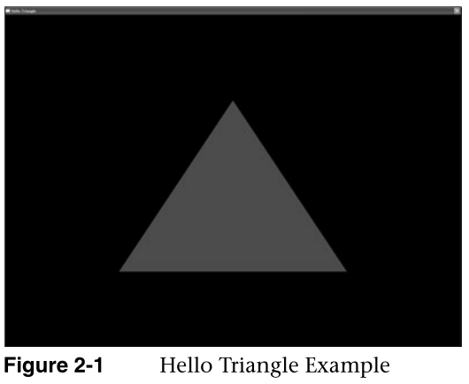

# 第二章 你好三角:一个OpenGL  ES 2.0的例子

.Hello Triangle: An OpenGL ES 2.0 Example

为了介绍OpenGL  ES 2.0的基本概念，我们从一个简单的例子开始。在本章中，我们展示了创建一个绘制单个三角形的OpenGL ES  2.0程序需要什么。我们将要编写的程序只是一个绘制几何图形的OpenGL ES 2.0应用程序的最基本的例子。本章涵盖了许多概念:

To introduce the basic concepts of OpenGL ES 2.0, we begin with a simple  example. In this chapter, we show what is required to create an OpenGL ES 2.0  program that draws a single triangle. The program we will write is just about  the most basic example of an OpenGL ES 2.0 application that draws geometry.  There are number of concepts that we cover in this chapter:

- 使用EGL创建屏幕渲染表面。

  Creating an on-screen render surface with EGL.

- 加载顶点和片段着色器

  Loading vertex and fragment shaders

- 创建程序对象，附加顶点和片段着色器，以及链接程序对象

  Creating a program object, attaching vertex and fragment shaders, and linking  a program object

- 设置视口

  Setting the viewport

- 清除颜色缓冲区

  Clearing the color buffer

- 渲染一个简单的图元

  Rendering a simple primitive

- 使颜色缓冲区的内容在EGL窗口表面可见。

  Making the contents of the color buffer visible in the EGL window  surface.

事实证明，在我们开始用OpenGL  ES  2.0绘制三角形之前，需要相当多的步骤。本章将介绍这些步骤的基础知识。在本书的后面，我们将详细介绍这些步骤，并进一步记录应用编程接口。我们在这里的目的是让你运行你的第一个简单的例子，这样你就可以知道用OpenGL  ES 2.0创建一个应用程序需要什么。

As it turns out, there are quite a significant number of steps required before  we can start drawing a triangle with OpenGL ES 2.0. This chapter goes over the  basics of each of these steps. Later in the book, we fill in the details on each  of these steps and further document the API. Our purpose here is to get you  running your first simple example so that you get an idea of what goes into  creating an application with OpenGL ES 2.0.

**EGL：作为渲染表面和openGL的一个中间层，我认为它是跨平台的，但是opengl又是一定的，所以需要一个中间层。**

## 代码框架

Code Framework

在整本书中，我们将建立一个实用函数库，为编写OpenGL  ES 2.0程序形成一个有用的函数框架。在为本书开发示例程序时，我们对这个代码框架有几个目标: 

Throughout the book, we will be building up a library of utility functions  that form a framework of useful functions for writing OpenGL ES 2.0 programs. In  developing example programs for the book, we had several goals for this code  framework:

1.应该简单，小巧，易懂。我们希望将我们的例子集中在相关的OpenGL  ES  2.0调用上，而不是我们发明的大型代码框架上。相反，我们将框架的重点放在简单性上，并使示例程序易于阅读和理解。该框架的目标是让您将注意力集中在每个示例中的重要OpenGL  ES 2.0应用编程接口概念上

It should be simple, small, and easy to understand. We wanted to focus our  examples on the relevant OpenGL ES 2.0 calls and not on a large code framework  that we invented. Rather, we focused our framework on simplicity and making the  example programs easy to read and understand. The goal of the framework was to  allow you to focus your attention on the important OpenGL ES 2.0 API concepts in  each example.

2.应该是便携的。虽然我们在微软视窗系统上开发了我们的示例程序，但是我们希望示例程序能够容易地移植到其他操作系统和环境中。此外，由于C++在许多手持平台上的不同限制，我们选择使用C作为语言，而不是C++。我们也避免使用全局数据，这在许多手持平台上也是不允许的。

It should be portable. Although we develop our example programs on Microsoft  Windows, we wanted the sample programs to be easily portable to other operating  systems and environments. In addition, we chose to use C as the language rather  than C++ due to the differing limitations of C++ on many handheld platforms. We  also avoid using global data, something that is also not allowed on many  handheld platforms.

当我们浏览书中的例子时，我们会介绍我们使用的任何新的代码框架函数。此外，您可以在附录D中找到代码框架的完整文档。您在示例代码中看到的任何以es开头的函数(例如，esInitialize())都是我们为本书中的示例程序编写的代码框架的一部分。

As we go through the examples in the book, we introduce any new code framework  functions that we use. In addition, you can find full documentation for the code  framework in Appendix D. Any functions you see in the example code that are  called that begin with es (e.g., esInitialize()) are part of the code framework  we wrote for the sample programs in this book.

## 从哪里下载示例

Where to Download the Examples

你可以从www.opengles-book.com的图书网站上下载这些例子。

You can download the examples from the book Web site at  www.opengles-book.com.

这些例子都是针对运行在微软Windows  XP或微软Windows Vista上的桌面图形处理单元(GPU)支持OpenGL 2.0。示例程序是以源代码形式提供给微软Visual Studio  2005项目解决方案的。示例在AMD OpenGL ES  2.0仿真器上构建和运行。书中的几个高级着色器示例是在AMD的着色器开发工具RenderMonkey中实现的。这本书的网站提供了下载所需工具的链接。OpenGL  ES 2.0仿真器和RenderMonkey都是免费提供的工具。不拥有Visual Studio的读者可以使用免费的微软Visual Studio  2008速成版，该版可在www.microsoft.com/express/.下载

The examples are all targeted to run on Microsoft Windows XP or Microsoft  Windows Vista with a desktop graphics processing unit (GPU) supporting OpenGL  2.0. The example programs are provided in source code form with Microsoft Visual  Studio 2005 project solutions. The examples build and run on the AMD OpenGL ES  2.0 emulator. Several of the advanced shader examples in the book are  implemented in RenderMonkey, a shader development tool from AMD. The book Web  site provides links on where to download any of the required tools. The OpenGL  ES 2.0 emulator and RenderMonkey are both freely available tools. Readers who do  not own Visual Studio can use the free Microsoft Visual Studio 2008 Express  Edition available for download at www.microsoft.com/express/.

## 你好三角形示例

Hello Triangle Example

让我们看看我们的Hello  Triangle示例程序的完整源代码，它在示例2-1中列出。对于那些熟悉固定函数桌面OpenGL的读者来说，你可能会认为这只是为了画一个简单的三角形而编写的大量代码。对于那些不熟悉桌面OpenGL的人来说，你可能也会认为这是一大堆代码，只是为了画一个三角形！请记住，OpenGL  ES  2.0是完全基于着色器的，这意味着如果没有加载和绑定适当的着色器，您就不能绘制任何几何图形。这意味着渲染所需的设置代码比使用固定函数处理的桌面OpenGL多。

Let’s take a look at the full source code for our Hello Triangle example  program, which is listed in Example 2-1. For those readers familiar with fixed  function desktop OpenGL, you will probably think this is a lot of code just to  draw a simple triangle. For those of you not familiar with desktop OpenGL, you  will also probably think this is a lot of code just to draw a triangle! Remember  though, OpenGL ES 2.0 is fully shader based, which means you can’t draw any  geometry without having the appropriate shaders loaded and bound. This means  there is more setup code required to render than there was in desktop OpenGL  using fixed function processing.

open gl es2.0是需要自己定义找色器的，所以需要比固定管线更多的步骤。

```c
Example 2-1 Hello Triangle Example 
#include "esUtil.h"
typedef struct
{
   // Handle to a program object
   GLuint programObject;
} UserData;
///
// Create a shader object, load the shader source, and
// compile the shader.
//
GLuint LoadShader(const char *shaderSrc, GLenum type)
{
   GLuint shader;
   GLint compiled;
   
   // Create the shader object
   shader = glCreateShader(type);
   if(shader == 0)
      return 0;
   // Load the shader source
   glShaderSource(shader, 1, &shaderSrc, NULL);
   
   // Compile the shader
   glCompileShader(shader);
   // Check the compile status
   glGetShaderiv(shader, GL_COMPILE_STATUS, &compiled);
   if(!compiled) 
   {
      GLint infoLen = 0;
      glGetShaderiv(shader, GL_INFO_LOG_LENGTH, &infoLen);
      
      if(infoLen > 1)
      {
         char* infoLog = malloc(sizeof(char) * infoLen);
         glGetShaderInfoLog(shader, infoLen, NULL, infoLog);
         esLogMessage("Error compiling shader:\n%s\n", infoLog);
         free(infoLog);
      }
      glDeleteShader(shader);
      return 0;
   }
   return shader;
}
///
// Initialize the shader and program object
//
int Init(ESContext *esContext)
{
   UserData *userData = esContext->userData;
   GLbyte vShaderStr[] =  
      "attribute vec4 vPosition;   \n"
      "void main()                 \n"
      "{                           \n"
      "   gl_Position = vPosition; \n"
      "}                           \n";
   
   GLbyte fShaderStr[] =  
      "precision mediump float;                   \n"
      "void main()                                \n"
      "{                                          \n"
      "  gl_FragColor = vec4(1.0, 0.0, 0.0, 1.0); \n"
      "}                                          \n";
   GLuint vertexShader;
   GLuint fragmentShader;
   GLuint programObject;
   GLint linked;
   // Load the vertex/fragment shaders
   vertexShader = LoadShader(GL_VERTEX_SHADER, vShaderStr);
   fragmentShader = LoadShader(GL_FRAGMENT_SHADER, fShaderStr);
   // Create the program object
   programObject = glCreateProgram();
   if(programObject == 0)
      return 0;
   glAttachShader(programObject, vertexShader);
   glAttachShader(programObject, fragmentShader);
   // Bind vPosition to attribute 0   
   glBindAttribLocation(programObject, 0, "vPosition");
   // Link the program
   glLinkProgram(programObject);
   // Check the link status
   glGetProgramiv(programObject, GL_LINK_STATUS, &linked);
   if(!linked) 
   {
      GLint infoLen = 0;
      glGetProgramiv(programObject, GL_INFO_LOG_LENGTH, &infoLen);
      
      if(infoLen > 1)
      {
         char* infoLog = malloc(sizeof(char) * infoLen);
         glGetProgramInfoLog(programObject, infoLen, NULL, infoLog);
         esLogMessage("Error linking program:\n%s\n", infoLog);
         
         free(infoLog);
      }
      glDeleteProgram(programObject);
      return FALSE;
   }
   // Store the program object
   userData->programObject = programObject;
   glClearColor(0.0f, 0.0f, 0.0f, 1.0f);
   return TRUE;
}
///
// Draw a triangle using the shader pair created in Init()
//
void Draw(ESContext *esContext)
{
   UserData *userData = esContext->userData;
   GLfloat vVertices[] = {0.0f,  0.5f, 0.0f, 
                          -0.5f, -0.5f, 0.0f,
                          0.5f, -0.5f,  0.0f};
      
   // Set the viewport
   glViewport(0, 0, esContext->width, esContext->height);
   
   // Clear the color buffer
   glClear(GL_COLOR_BUFFER_BIT);
   // Use the program object
   glUseProgram(userData->programObject);
   // Load the vertex data
   glVertexAttribPointer(0, 3, GL_FLOAT, GL_FALSE, 0, vVertices);
   glEnableVertexAttribArray(0);
   glDrawArrays(GL_TRIANGLES, 0, 3);
   eglSwapBuffers(esContext->eglDisplay, esContext->eglSurface);
}
int main(int argc, char *argv[])
{
   ESContext esContext;
   UserData  userData;
   esInitialize(&esContext);
   esContext.userData = &userData;
   esCreateWindow(&esContext, "Hello Triangle", 320, 240,
                  ES_WINDOW_RGB);
   
   if(!Init(&esContext))
      return 0;
   esRegisterDrawFunc(&esContext, Draw);
   
   esMainLoop(&esContext);
}
Building and Running the Examples 25
```

## 构建和运行示例

Building and Running the Examples

本书开发的示例程序都运行在AMD的OpenGL  ES 2.0仿真器之上。这个模拟器提供了EGL 1.3和OpenGL ES  2.0应用程序接口的Windows实现。Khronos提供的标准GL2和EGL头文件被用作仿真器的接口。模拟器是OpenGL ES  2.0的完整实现，这意味着模拟器上编写的图形代码应该无缝地移植到真实设备上。请注意，模拟器要求您有一个支持桌面OpenGL 2.0 API的桌面GPU。

The example programs developed in this book all run on top of AMD’s OpenGL ES  2.0 emulator. This emulator provides a Windows implementation of the EGL 1.3 and  OpenGL ES 2.0 APIs. The standard GL2 and EGL header files provided by Khronos  are used as an interface to the emulator. The emulator is a full implementation  of OpenGL ES 2.0, which means that graphics code written on the emulator should  port seamlessly to real devices. Note that the emulator requires that you have a  desktop GPU with support for the desktop OpenGL 2.0 API.

我们已经设计了可移植到各种平台的代码框架。然而，出于本书的目的，所有的例子都是使用微软的Visual  Studio 2005构建的，并在AMD的OpenGL ES 2.0仿真器上实现了Win32。OpenGL ES 2.0示例组织在以下目录中:

We have designed the code framework to be portable to a variety of platforms.  However, for the purposes of this book all of the examples are built using  Microsoft Visual Studio 2005 with an implementation for Win32 on AMD’s OpenGL ES  2.0 emulator. The OpenGL ES 2.0 examples are organized in the following  directories:

公共/—包含OpenGL  ES 2.0框架项目、代码和仿真器。第十章—包含每章的示例程序。每个项目都有一个Visual Studio 2005解决方案文件。

Common/—Contains the OpenGL ES 2.0 Framework project, code, and the emulator.  Chapter_X/—Contains the example programs for each chapter. A Visual Studio 2005  solution file is provided for each project.

要构建和运行本例中使用的Hello三角形程序，请在Visual  Studio 2005中打开第2章/Hello三角形/Hello三角形. sln。该应用程序可以直接从Visual Studio  2005项目中构建和运行。运行时，您应该会看到如图2-1所示的图像。

To build and run the Hello Triangle program used in this example, open  Chapter_2/Hello_Triangle/Hello_Triangle.sln in Visual Studio 2005. The  application can be built and run directly from the Visual Studio 2005 project.  On running, you should see the image shown in Figure 2-1.



请注意，除了提供示例程序之外，在本书的后面，我们还提供了几个例子，其中使用了AMD的免费着色器开发工具RenderMonkey  v1.80。在一个例子中，RenderMonkey工作空间用于我们希望只关注着色器代码的地方。RenderMonkey为开发着色器效果提供了一个非常灵活的集成开发环境(IDE)。有一个。rfx扩展可以使用渲染猴子1.80来查看。带有OpenGL  ES 2.0效果的渲染猴子集成开发环境的屏幕截图显示在色板2中

Note that in addition to providing sample programs, later in the book we  provide several examples with a free shader development tool from AMD called  RenderMonkey v1.80. RenderMonkey workspaces are used where we want to focus on  just the shader code in an example. RenderMonkey provides a very flexible  integrated development environment (IDE) for developing shader effects. The  examples that have an .rfx extension can be viewed using RenderMonkey v1.80. A  screenshot of the RenderMonkey IDE with an OpenGL ES 2.0 effect is shown in  Color Plate 2。

## 使用OpenGL  ES 2.0框架

Using the OpenGL ES 2.0 Framework

在Hello  Triangle的主函数中，你会看到对几个ES实用函数的调用。主函数做的第一件事是声明一个ESContext并初始化它:

In the main function in Hello Triangle, you will see calls into several ES  utility functions. The first thing the main function does is declare an  ESContext and initialize it:

```java
ESContext esContext;
UserData  userData;
esInitialize(&esContext);
esContext.userData = &userData
```

本书中的每个示例程序都做同样的事情。ESContext被传递到所有的ES框架实用程序函数中，并包含了ES框架所需的关于程序的所有必要信息。传递上下文的原因是示例程序和ES代码框架不需要使用任何全局数据。

Every example program in this book does the same thing. The ESContext is  passed into all of the ES framework utility functions and contains all of the  necessary information about the program that the ES framework needs. The reason  for passing around a context is that the sample programs and the ES code  framework do not need to use any global data.

**将上下文传递给使用函数中的，好处就是可以减少全局函数。，有的设备是不允许存在静态函数数据的**

许多手持平台不允许应用程序在其应用程序中声明全局静态数据。不允许这样做的平台包括BREW和Symbian。因此，我们通过在函数之间传递上下文来避免在示例程序或代码框架中声明全局数据.

Many handheld platforms do not allow applications to declare global static  data in their applications. Examples of platforms that do not allow this include  BREW and Symbian. As such, we avoid declaring global data in either the sample  programs or the code framework by passing a context between functions.

ESContext有一个名为userData的成员变量，它是一个空*。每个示例程序都将应用程序所需的任何数据存储在用户数据中。样例程序调用esInitialize函数来初始化上下文和ES代码框架。ESContext结构中的其他元素在头文件中描述，只供用户应用程序读取。电子内容结构中的其他数据包括窗口宽度和高度、EGL上下文和回调函数指针等信息。

The ESContext has a member variable named userData that is a void*. Each of  the sample programs will store any of the data that are needed for the  application in userData. The esInitialize function is called by the sample  program to initialize the context and the ES code framework. The other elements  in the ESContext structure are described in the header file and are intended  only to be read by the user application. Other data in the ESContext structure  include information such as the window width and height, EGL context, and  callback function pointers.

主函数的其余部分负责创建窗口、初始化draw回调函数以及进入主循环:

The rest of the main function is responsible for creating the window,  initializing the draw callback function, and entering the main loop:

```java
esCreateWindow(&esContext, "Hello Triangle", 320, 240,
               ES_WINDOW_RGB);
if(!Init(&esContext))
   return 0;
esRegisterDrawFunc(&esContext, Draw);
   
esMainLoop(&esContext);
```

调用esCreateWindow创建一个指定宽度和高度的窗口(本例中为320  ×  240)。最后一个参数是指定窗口创建选项的位字段。在这种情况下，我们请求一个RGB帧缓冲区。在第三章“EGL简介”中，我们更详细地讨论了电子创作窗口的作用。这个函数使用EGL创建一个附着在窗口上的屏幕渲染表面。EGL是一个平台独立的应用编程接口，用于创建渲染表面和上下文。现在，我们将简单地说，这个函数创建了一个渲染表面，并在下一章留下它如何工作的细节。

The call to esCreateWindow creates a window of the specified width and height  (in this case, 320 × 240). The last parameter is a bit field that specifies  options for the window creation. In this case, we request an RGB framebuffer. In  Chapter 3, “An Introduction to EGL,” we discuss what esCreateWindow does in more  detail. This function uses EGL to create an on-screen render surface that is  attached to a window. EGL is a platformindependent API for creating rendering  surfaces and contexts. For now, we will simply say that this function creates a  rendering surface and leave the details on how it works for the next  chapter.

调用esCreateWindow后，主函数接下来要做的就是调用Init来初始化运行程序所需的一切。最后，它注册了一个回调函数，Draw，将被调用来渲染帧。最后一个调用，esMainLoop，进入主消息处理循环，直到窗口关闭。

After calling esCreateWindow, the next thing the main function does is to call  Init to initialize everything needed to run the program. Finally, it registers a  callback function, Draw, that will be called to render the frame. The final  call, esMainLoop, enters into the main message processing loop until the window  is closed.

## 创建简单的顶点和片段着色器

Creating a Simple Vertex and Fragment Shader.

在OpenGL  ES 2.0中，除非加载了有效的顶点和片段着色器，否则无法绘制任何东西。在第一章，“OpenGL ES 2.0简介”中，我们介绍了OpenGL ES  2.0可编程流水线的基础知识。在那里，您学习了顶点和片段着色器的概念。这两个着色器程序描述顶点的变换和片段的绘制。要进行任何渲染，OpenGL ES  2.0程序必须同时具有顶点和片段着色器。

In OpenGL ES 2.0, nothing can be drawn unless a valid vertex and fragment  shader have been loaded. In Chapter 1, “Introduction to OpenGL ES 2.0,” we  covered the basics of the OpenGL ES 2.0 programmable pipeline. There you learned  about the concepts of a vertex and fragment shader. These two shader programs  describe the transformation of vertices and drawing of fragments. To do any  rendering at all, an OpenGL ES 2.0 program must have both a vertex and fragment  shader.

Hello  Triangle中Init函数完成的最大任务是加载一个顶点和片段着色器。程序中给出的顶点着色器非常简单:

The biggest task that the Init function in Hello Triangle accomplishes is the  loading of a vertex and fragment shader. The vertex shader that is given in the  program is very simple:

```c
GLbyte vShaderStr[] =  
   "attribute vec4 vPosition;   \n"
   "void main()                 \n"
   "{                           \n"
   "   gl_Position = vPosition; \n"
   "};                          \n";
```

这个着色器声明一个输入属性，它是一个名为vPosition的四分量向量。稍后，“你好三角形”中的“绘制”功能将为每个放置在该变量中的顶点发送位置。着色器声明一个标记着色器执行开始的主函数。着色器的主体非常简单；它将位置输入属性复制到一个名为gl_Position的特殊输出变量中。每个顶点着色器都必须向gl_Position变量输出一个位置。该变量定义了传递到管道中下一个阶段的位置。编写着色器的主题是我们在本书中讨论的很大一部分，但现在我们只想给你一个顶点着色器的样子。在第5章“OpenGL  ES着色语言”中，我们介绍了OpenGL ES着色语言，在第8章“顶点着色器”中，我们具体介绍了如何编写顶点着色器。

This shader declares one input attribute that is a four-component vector named  vPosition. Later on, the Draw function in Hello Triangle will send in positions  for each vertex that will be placed in this variable. The shader declares a main  function that marks the beginning of execution of the shader. The body of the  shader is very simple; it copies the vPosition input attribute into a special  output variable named gl_Position. Every vertex shader must output a position  into the gl_Position variable. This variable defines the position that is passed  through to the next stage in the pipeline. The topic of writing shaders is a  large part of what we cover in this book, but for now we just want to give you a  flavor of what a vertex shader looks like. In Chapter 5, “OpenGL ES Shading  Language,” we cover the OpenGL ES shading language and in Chapter 8, “Vertex  Shaders,” we specifically cover how to write vertex shaders.

示例中的片段着色器也非常简单:

The fragment shader in the example is also very simple:

```c
GLbyte fShaderStr[] =  
   "precision mediump float;                   \n"
   "void main()                                \n"
   "{                                          \n"
   "  gl_FragColor = vec4(1.0, 0.0, 0.0, 1.0); \n"
   "}      
```

片段着色器中的第一条语句声明着色器中浮点变量的默认精度。有关这方面的更多详细信息，请参见第5章中关于精度限定符的部分。现在，只需关注主函数，它将一个值(1.0，0.0，0.0，1.0)输出到gl_FragColor中。gl_FragColor是一个特殊的内置变量，包含片段着色器的最终输出颜色。在这种情况下，着色器为所有片段输出红色。开发片段着色器的细节在第9章“纹理”和第10章“片段着色器”中有所介绍同样，这里我们只是向您展示片段着色器是什么样子的。

The first statement in the fragment shader declares the default precision for  float variables in the shader. For more details on this, please see the section  on precision qualifiers in Chapter 5. For now, simply pay attention to the main  function, which outputs a value of (1.0, 0.0, 0.0, 1.0) into the gl_FragColor.  The gl_FragColor is a special built-in variable that contains the final output  color for the fragment shader. In this case, the shader is outputting a color of  red for all fragments. The details of developing fragment shaders are covered in  Chapter 9, “Texturing,” and Chapter 10, “Fragment Shaders.” Again, here we are  just showing you what a fragment shader looks like.

通常，游戏或应用程序不会像我们在本例中所做的那样内嵌着色器源字符串。在大多数实际应用中，着色器将从某种文本或数据文件加载，然后加载到应用编程接口。然而，为了简单和让示例程序独立，我们直接在程序代码中提供着色器源字符串。

Typically, a game or application would not inline shader source strings in the  way we have done in this example. In most real applications, the shader would be  loaded from some sort of text or data file and then loaded to the API. However,  for simplicity and having the example program be self-contained, we provide the  shader source strings directly in the program code.

## 编译和加载着色器

Compiling and Loading the Shaders

现在我们已经定义了着色器源代码，我们可以开始将着色器加载到OpenGL  ES中了。Hello三角形示例中的LoadShader函数负责加载着色器源代码，编译它，并检查以确保没有错误。它返回一个着色器对象，这是一个OpenGL ES  2.0对象，稍后可以用于附加到程序对象(这两个对象在第4章“着色器和程序”中有详细介绍)。

Now that we have the shader source code defined, we can go about loading the  shaders to OpenGL ES. The LoadShader function in the Hello Triangle example is  responsible for loading the shader source code, compiling it, and checking to  make sure that there were no errors. It returns a shader object, which is an  OpenGL ES 2.0 object that can later be used for attachment to a program object  (these two objects are detailed in Chapter 4, “Shaders and Programs”).

让我们看看LoadShader函数是如何工作的。着色器对象首先使用glCreateShader创建，它创建指定类型的新着色器对象。

Let’s take a look at how the LoadShader function works. The shader object is  first created using glCreateShader, which creates a new shader object of the  type specified.

```java
GLuint LoadShader(GLenum type, const char *shaderSrc)
{
   GLuint shader;
   GLint compiled;
   
   // Create the shader object
   shader = glCreateShader(type);
   if(shader == 0)
   return 0;
}
```

着色器源代码本身使用glShaderSource加载到着色器对象中。然后使用glCompileShader函数编译着色器。

The shader source code itself is loaded to the shader object using  glShaderSource. The shader is then compiled using the glCompileShader function.  

```JAVA
// Load the shader source
   glShaderSource(shader, 1, &shaderSrc, NULL);
   
   // Compile the shader
   glCompileShader(shader);
```

编译着色器后，将确定编译的状态，并打印出生成的任何错误。

After compiling the shader, the status of the compile is determined and any  errors that were generated are printed out.

```c
// Check the compile status
   glGetShaderiv(shader, GL_COMPILE_STATUS, &compiled);
   if(!compiled) 
   {
      GLint infoLen = 0;
      glGetShaderiv(shader, GL_INFO_LOG_LENGTH, &infoLen);
      
      if(infoLen > 1)
            {
         char* infoLog = malloc(sizeof(char) * infoLen);
         glGetShaderInfoLog(shader, infoLen, NULL, infoLog);
         esLogMessage("Error compiling shader:\n%s\n", infoLog);
         
         free(infoLog);
      }
      glDeleteShader(shader);
      return 0;
   }
   return shader;
}
```

如果着色器编译成功，将返回一个新的着色器对象，该对象将在以后附加到程序中。这些着色器对象函数的细节将在第4章的前几节中介绍。

If the shader compiles successfully, a new shader object is returned that will  be attached to the program later. The details of these shader object functions  are covered in the first sections of Chapter 4.

## 创建程序对象并链接着色器

Creating a Program Object and Linking the Shaders

一旦应用程序为顶点和片段着色器创建了着色器对象，它就需要创建一个程序对象。从概念上讲，程序对象可以被认为是最终的链接程序。一旦每个着色器被编译成一个着色器对象，它们必须在绘制前附加到一个程序对象并链接在一起。

Once the application has created a shader object for the vertex and fragment  shader, it needs to create a program object. Conceptually, the program object  can be thought of as the final linked program. Once each shader is compiled into  a shader object, they must be attached to a program object and linked together  before drawing.

创建程序对象和链接的过程将在第4章中详细描述。现在，我们提供该过程的简要概述。第一步是创建程序对象，并将顶点着色器和片段着色器附加到其上。

The process of creating program objects and linking is fully described in  Chapter 4. For now, we provide a brief overview of the process. The first step  is to create the program object and attach the vertex shader and fragment shader  to it.

```java
// Create the program object
programObject = glCreateProgram();
if(programObject == 0)
   return 0;
glAttachShader(programObject, vertexShader);
glAttachShader(programObject, fragmentShader);
```

一旦连接了两个着色器，示例应用程序的下一步就是设置顶点着色器属性的位置:

Once the two shaders have been attached, the next step the sample application  does is to set the location for the vertex shader attribute vPosition:

```java
// Bind vPosition to attribute 0   
glBindAttribLocation(programObject, 0, "vPosition");
```

在第6章“顶点属性、顶点数组和缓冲区对象”中，我们将详细讨论绑定属性。现在，请注意对glBindAttribLocation的调用将顶点着色器中声明的vPosition属性绑定到位置0。后来，当我们指定顶点数据时，这个位置被用来指定位置。

In Chapter 6, “Vertex Attributes, Vertex Arrays, and Buffer Objects,” we go  into more detail on binding attributes. For now, note that the call to  glBindAttribLocation binds the vPosition attribute declared in the vertex shader  to location 0. Later, when we specify the vertex data, this location is used to  specify the position.

最后，我们准备好链接程序并检查错误:

Finally, we are ready to link the program and check for errors:

```java
// Link the program
glLinkProgram(programObject);
// Check the link status
glGetProgramiv(programObject, GL_LINK_STATUS, &linked);
if(!linked) 
{
   GLint infoLen = 0;
   glGetProgramiv(programObject, GL_INFO_LOG_LENGTH, &infoLen);
      
   if(infoLen > 1)
   {
      char* infoLog = malloc(sizeof(char) * infoLen);
      glGetProgramInfoLog(programObject, infoLen, NULL, infoLog);
      esLogMessage("Error linking program:\n%s\n", infoLog);
         
      free(infoLog);
   }
   glDeleteProgram(programObject);
   return FALSE;
}
// Store the program object
userData->programObject = programObject;
```

在所有这些步骤之后，我们最终编译了着色器，检查了编译错误，创建了程序对象，附加了着色器，链接了程序，并检查了链接错误。程序对象链接成功后，我们现在终于可以使用程序对象进行渲染了！为了使用程序对象进行渲染，我们使用glUseProgram绑定它。

After all of these steps, we have finally compiled the shaders, checked for  compile errors, created the program object, attached the shaders, linked the  program, and checked for link errors. After successful linking of the program  object, we can now finally use the program object for rendering! To use the  program object for rendering, we bind it using glUseProgram.

```c
// Use the program object
glUseProgram(userData->programObject);
```

在用程序对象句柄调用glUseProgram之后，所有后续的渲染将使用附加到程序对象的顶点和片段着色器进行

After calling glUseProgram with the program object handle, all subsequent  rendering will occur using the vertex and fragment shaders attached to the  program object.

## 设置视口并清除颜色缓冲区

Setting the Viewport and Clearing the Color Buffer

现在我们已经用EGL创建了一个渲染表面，并初始化和加载了着色器，我们准备好实际绘制一些东西了。绘图回调函数绘制框架。我们在Draw中执行的第一个命令是glViewport，它通知OpenGL  ES将要绘制的2D渲染表面的原点、宽度和高度。在OpenGL ES中，视口定义了2D矩形，所有OpenGL ES渲染操作最终都将在该矩形中显示。

Now that we have created a rendering surface with EGL and initialized and  loaded shaders, we are ready to actually draw something. The Draw callback  function draws the frame. The first command that we execute in Draw is  glViewport, which informs OpenGL ES of the origin, width, and height of the 2D  rendering surface that will be drawn to. In OpenGL ES, the viewport defines the  2D rectangle in which all OpenGL ES rendering operations will ultimately be  displayed.

```java
// Set the viewport
glViewport(0, 0, esContext->width, esContext->height);
```

视口由原点(x，y)以及宽度和高度定义。当我们讨论坐标系和裁剪时，我们将在第7章“基本装配和光栅化”中更详细地讨论glViewport。

The viewport is defined by an origin (x, y) and a width and height. We cover  glViewport in more detail in Chapter 7, “Primitive Assembly and Rasterization,”  when we discuss coordinate systems and clipping.

设置好视口后，下一步就是清除屏幕。在OpenGL  ES中，绘图涉及多种类型的缓冲区:颜色、深度和模具。我们将在第11章“片段操作”中更详细地介绍这些缓冲区在Hello三角形示例中，只绘制了颜色缓冲区。在每一帧的开始，我们使用glClear函数清除颜色缓冲区。

After setting the viewport, the next step is to clear the screen. In OpenGL  ES, there are multiple types of buffers that are involved in drawing: color,  depth, and stencil. We cover these buffers in more detail in Chapter 11,  “Fragment Operations.” In the Hello Triangle example, only the color buffer is  drawn to. At the beginning of each frame, we clear the color buffer using the  glClear function.

```c
// Clear the color buffer
glClear(GL_COLOR_BUFFER_BIT);
```

缓冲区将被清除为glClearColor指定的颜色。在初始化结束时的示例程序中，清除颜色被设置为(0.0，0.0，0.0，1.0)，因此屏幕被清除为黑色。在对颜色缓冲区调用glClear之前，应用程序应该设置清晰的颜色。

The buffer will be cleared to the color specified with glClearColor. In the  example program at the end of Init, the clear color was set to (0.0, 0.0, 0.0,  1.0) so the screen is cleared to black. The clear color should be set by the  application prior to calling glClear on the color buffer.

## 加载几何图形并绘制图元

Loading the Geometry and Drawing a Primitive

现在我们已经清除了颜色缓冲区，设置了视口，并加载了程序对象，我们需要为三角形指定几何图形。三角形的顶点在垂直数组中用三个(x，y，z)坐标指定。

Now that we have the color buffer cleared, viewport set, and program object  loaded, we need to specify the geometry for the triangle. The vertices for the  triangle are specified with three (x, y, z) coordinates in the vVertices  array.

```c
GLfloat vVertices[] = {0.0f,  0.5f, 0.0f, 
                       -0.5f, -0.5f, 0.0f,
                       0.5f, -0.5f, 0.0f};
…
// Load the vertex data
glVertexAttribPointer(0, 3, GL_FLOAT, GL_FALSE, 0, vVertices);
glEnableVertexAttribArray(0);
glDrawArrays(GL_TRIANGLES, 0, 3);
```

顶点位置需要加载到GL中，并连接到顶点着色器中声明的vPosition属性。您会记得，之前我们将vPosition变量绑定到属性位置0。顶点着色器中的每个属性都有一个由无符号整数值唯一标识的位置。为了将数据加载到顶点属性0中，我们调用glVertexAttribPointer函数。在第6章中，我们将全面介绍如何加载顶点属性和使用顶点数组。

The vertex positions need to be loaded to the GL and connected to the  vPosition attribute declared in the vertex shader. As you will remember, earlier  we bound the vPosition variable to attribute location 0. Each attribute in the  vertex shader has a location that is uniquely identified by an unsigned integer  value. To load the data into vertex attribute 0, we call the  glVertexAttribPointer function. In Chapter 6, we cover how to load vertex  attributes and use vertex arrays in full.

画三角形的最后一步，其实是告诉OpenGL  ES画图元。在本例中，这是使用函数glDrawArrays完成的。此函数绘制一个图元，如三角形、直线或条形。我们将在第7章更详细地讨论原语。

The final step to drawing the triangle is to actually tell OpenGL ES to draw  the primitive. That is done in this example using the function glDrawArrays.  This function draws a primitive such as a triangle, line, or strip. We get into  primitives in much more detail in Chapter 7.

## 显示后台缓冲区

Displaying the Back Buffer

我们终于到了我们的三角形被绘制到帧缓冲区的点。我们必须解决最后一个细节:如何在屏幕上实际显示帧缓冲区。在我们开始之前，让我们先回顾一下，讨论一下双缓冲的概念。

We have finally gotten to the point where our triangle has been drawn into the  framebuffer. There is one final detail we must address: how to actually display  the framebuffer on the screen. Before we get into that, let’s back up a little  bit and discuss the concept of double buffering.

屏幕上可见的帧缓冲区由像素数据的二维数组表示。我们可以考虑在屏幕上显示图像的一种可能的方法是在我们绘制时简单地更新可见帧缓冲区中的像素数据。然而，直接更新可显示缓冲区上的像素有一个严重的问题。也就是说，在典型的显示系统中，物理屏幕从帧缓冲存储器以固定的速率更新。

The framebuffer that is visible on the screen is represented by a  two-dimensional array of pixel data. One possible way one could think about  displaying images on the screen is to simply update the pixel data in the  visible framebuffer as we draw. However, there is a significant issue with  updating pixels directly on the displayable buffer. That is, in a typical  display system, the physical screen is updated from framebuffer memory at a  fixed rate。

如果一种是直接绘制到框架缓冲区中，用户可以看到工件作为显示的框架缓冲区的部分更新

if one were to draw directly into the framebuffer, the user could see artifacts  as partial updates to the framebuffer where displayed。

为了解决这个问题，使用了一种称为双缓冲的系统。在这个方案中，有两个缓冲区:前缓冲区和后缓冲区。所有渲染都发生在后台缓冲区，该缓冲区位于屏幕不可见的内存区域。**所有渲染完成后，该缓冲区将与前缓冲区(或可见缓冲区)进行“交换”。然后，前缓冲区成为下一帧的后缓冲区。**

To address this problem, a system known as double buffering is used. In this  scheme, there are two buffers: a front buffer and back buffer. All rendering  occurs to the back buffer, which is located in an area of memory that is not  visible to the screen. When all rendering is complete, this buffer is “swapped”  with the front buffer (or visible buffer). The front buffer then becomes the  back buffer for the next frame.

使用这种技术，我们不显示一个可见的表面，**直到一个帧的所有渲染完成**。在OpenGL  ES应用程序中，这一切都是通过EGL控制的。这是通过一个名为eglSwapBuffers的EGL函数实现的:

Using this technique, we do not display a visible surface until all rendering  is complete for a frame. The way this is all controlled in an OpenGL ES  application is through EGL. This is done using an EGL function called  eglSwapBuffers:

```java
eglSwapBuffers(esContext->eglDisplay, esContext->eglSurface);
```

该功能通知EGL更换前缓冲器和后缓冲器。发送到eglSwapBuffers的参数是EGL显示和表面。这两个参数分别代表物理显示和渲染表面。在下一章中，我们将更详细地解释eglSwapBuffers，并进一步阐明表面、上下文和缓冲区管理的概念。现在，可以说在交换缓冲区之后，我们终于在屏幕上看到了我们的三角形！

This function informs EGL to swap the front buffer and back buffer. The  parameters sent to eglSwapBuffers are the EGL display and surface. These two  parameters represent the physical display and the rendering surface,  respectively. In the next chapter, we explain eglSwapBuffers in more detail and  further clarify the concepts of surface, context, and buffer management. For  now, suffice to say that after swapping buffers we now finally have our triangle  on screen!