# EGL简介

An Introduction to EGL.

在第二章“你好，三角形:一个OpenGL  ES 2.0的例子”中，我们使用OpenGL ES  2.0在一个窗口中画了一个三角形，但是我们使用了一些自己设计的自定义函数来打开和管理这个窗口。虽然这简化了我们的例子，但它掩盖了您可能需要如何在自己的系统上使用OpenGL  ES 2.0。

**使用Open GL ES绘制一个三角形，但是看不到细节。**

In Chapter 2, “Hello, Triangle: An OpenGL ES 2.0 Example,” we drew a triangle  into a window using OpenGL ES 2.0, but we used some custom functions of our own  design to open and manage the window. Although that simplifies our examples, it  obscures how you might need to work with OpenGL ES 2.0 on your own  systems.

作为由Khronos集团提供的用于开发内容的应用编程接口系列的一部分，一个(大部分)独立于平台的应用编程接口，EGL，可用于管理绘图表面(窗口只是一种类型；其他的我们以后再说)。EGL提供以下机制:

**绘制管理表面EGL,一个独立于平台的应用编程接口**，它会做以下几件事：

- 创建绘制表面
- 查询绘制表面的信息
- 在Open gl es和其他的绘制渲染API之间进行同步渲染
- 管理渲染资源

As part of the family of APIs provided by the Khronos Group for developing  content, a (mostly) platform-independent API, EGL, is available for managing  drawing surfaces (windows are just one type; we’ll talk about others later). EGL  provides the mechanisms for the following:

- 与系统的本地窗口系统通信。

  Communicating with the native windowing system of your system.

- 查询可用的工程图曲面类型和配置。

  Querying the available types and configurations of drawing surfaces.

- 创建绘图表面。

  Creating drawing surfaces.

- 在OpenGL  ES 2.0和其他图形渲染API(如OpenVG，或您的窗口系统的本机绘图命令)之间同步渲染。

  Synchronizing rendering between OpenGL ES 2.0 and other graphicsrendering APIs  (like OpenVG, or the native drawing commands of your windowing  system).

- 管理渲染资源，如纹理贴图。

  Managing rendering resources such as texture maps.

在本章中，我们将介绍打开一个窗口所需的基础知识。当我们描述其他操作时，比如创建纹理贴图，我们讨论必要的EGL命令。

We introduce the fundamentals required to open a window in this chapter. As we  describe other operations, such as creating a texture map, we discuss the  necessary EGL commands.

补充：

需要绘制图形，那么就使用opengl,如果使用显示出来，就需要通过调用硬件，通过egl.

open gl es是一个跨平台的api,在特定的设备上使用需要一个中间层适配，这个就是egl.

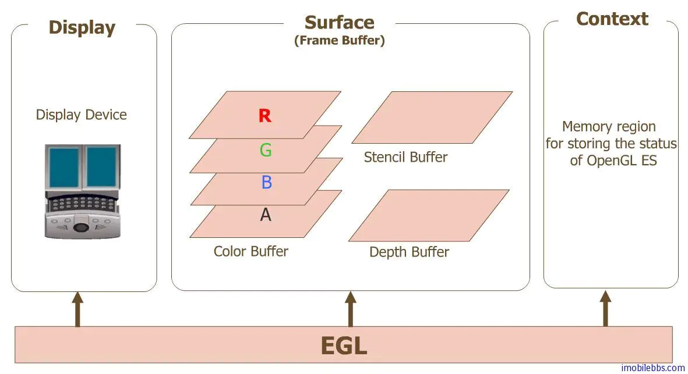

## 与窗口系统通信

Communicating with the Windowing System.

EGL在OpenGL  ES  2.0(和其他Khronos图形应用编程接口)和运行在您计算机上的本机窗口系统之间提供了一个“粘合剂”层，如GNU/Linux系统上常见的X窗口系统、微软窗口或麦克OS  X的石英。在EGL能够确定什么类型的绘图表面，或者底层系统的任何其他特性之前，它需要打开与窗口系统的通信通道。

EGL provides a “glue” layer between OpenGL ES 2.0 (and other Khronos graphics  APIs) and the native windowing system running on your computer, like the X  Window System common on GNU/Linux systems, Microsoft Windows, or Mac OS X’s  Quartz. Before EGL can determine what types of drawing surfaces, or any other  characteristics of the underlying system for that matter, it needs to open a  communications channel with the windowing system.

因为每个窗口系统都有不同的语义，EGL提供了一个基本的不透明类型——EGLDisplay——它封装了所有与本地窗口系统接口的系统依赖。任何使用EGL的应用程序需要做的第一个操作是**创建并初始化与本地EGL显示器的连接**。这是在两个调用序列中完成的，如示例3-1所示。 

**个窗口的语义是不一样的，所以有一个EGLDisplay，封装了所有与本地窗口系统的依赖，第一步操作就是建立与本地窗口的链接。**

Because every windowing system has different semantics, EGL provides a basic  opaque type—the EGLDisplay—that encapsulates all of the system dependencies for  interfacing with the native windowing system. The first operation that any  application using EGL will need to do is create and initialize a connection with  the local EGL display. This is done in a two-call sequence, as shown in Example  3-1.

```c
Example 3-1 Initializing EGL
EGLint  majorVersion;
EGLint  minorVersion;
EGLDisplay  display;
display = eglGetDisplay(EGL_DEFAULT_DISPLAY);
if(display == EGL_NO_DISPLAY)
{
   // Unable to open connection to local windowing system
}
if(!eglInitialize(display, &majorVersion, &minorVersion))
{
   // Unable to initialize EGL. Handle and recover
}
```

要打开与EGL显示服务器的连接，请调用   

**创建并初始化与本地EGL显示器进行连接。**

To open a connection to the EGL display server, call.

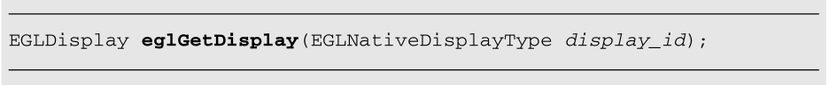

EGLNativeDisplayType被定义为匹配本机窗口系统的显示类型。例如，在微软视窗系统上，一个活动显示类型将被定义为一个HDC——一个微软视窗设备上下文的句柄。但是，为了便于将代码移动到不同的操作系统和平台，令牌EGL_DEFAULT_DISPLAY被接受，并将返回到默认本机显示的连接，就像我们所做的那样。

EGLNativeDisplayType is defined to match the native window system’s display  type. On Microsoft Windows, for example, an EGLNativeDisplayType would be  defined to be an HDC—a handle to the Microsoft Windows device context. However,  to make it easy to move your code to different operating systems and platforms,  the token EGL_DEFAULT_DISPLAY is accepted and will return a connection to the  default native display, as we did.

如果显示连接不可用，则显示将返回EGL_NO_DISPLAY。此错误表明EGL不可用，您将无法使用OpenGL ES 2.0

**如果显示不可用，那么就返回GL_NO_DISPLAY,表明无法使用**

If a display connection isn’t available, eglGetDisplay will return  EGL_NO_DISPLAY. This error indicates that EGL isn’t available, and you won’t be  able to use OpenGL ES 2.0。

在我们继续讨论更多的EGL操作之前，我们需要简要描述EGL如何处理并向您的应用程序报告错误。

Before we continue discussing more EGL operation, we need to briefly describe  how EGL processes and reports errors to your application.

## 检查错误

Checking for Errors

**说明一下：执行失败的时候，返回的是假，成功是真，错误是查询错误不是返回错误，。**

EGL的大多数函数成功时返回EGL为真，否则返回EGL为假。然而，EGL不仅仅会告诉你如果通话失败，它还会记录一个错误来指出失败的原因。但是，错误代码不会直接返回给您；您需要显式查询EGL的错误代码，这可以通过调用

Most functions in EGL return EGL_TRUE when successful and EGL_FALSE otherwise.  However, EGL will do more than just tell you if the call failed, it will record  an error to indicate the reason for failure. However, that error code isn’t  returned to you directly; you need to query EGL explicitly for the error code,  which you can do by calling

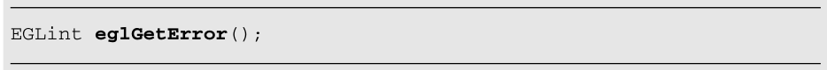、

您可能想知道为什么这是一种谨慎的方法，而不是在调用完成时直接返回错误代码。虽然我们从不鼓励忽略函数返回代码，但允许可选的错误代码恢复可以减少应用程序中被验证为正常工作的冗余代码。您当然应该在开发和调试期间，以及在关键应用程序中的所有时间检查错误，但是一旦您确信您的应用程序按预期工作，您就可以减少错误检查。

You might wonder why this is a prudent approach, as compared to directly  returning the error code when the call completes. Although we never encourage  ignoring function return codes, allowing optional error code recovery reduces  redundant code in applications verified to work properly. You should certainly  check for errors during development and debugging, and all the time in critical  applications, but once you’re convinced your application is working as expected,  you can likely reduce your error checking.

## 初始化EGL

Initializing EGL

一旦您成功地打开了一个连接，EGL需要初始化，这是通过调用

Once you’ve successfully opened a connection, EGL needs to be initialized,  which is done by calling

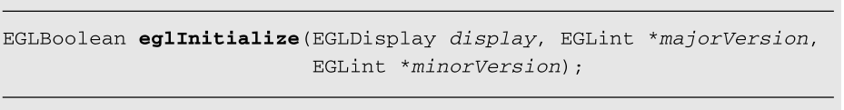

这将初始化EGL的内部数据结构，并返回EGL实现的主要和次要版本号。如果EGL无法初始化，此调用将返回EGL  _假，并将EGL的错误代码设置为:

This initializes EGL’s internal data structures and returns the major and  minor version numbers of the EGL implementation. If EGL is unable to be  initialized, this call will return EGL_FALSE, and set EGL’s error code  to:

- 如果DISPLAY没有指定有效的EGLDisplay，则显示EGL。

  EGL_BAD_DISPLAY if display doesn’t specify a valid EGLDisplay. 

- 如果EGL不能被初始化，则EGL不能被初始化。

  EGL_NOT_INITIALIZED if the EGL cannot be initialized.

**在建立连接之后就可以进行初始化，并且返回主次版本。初始化之后会返回主次版本。**

## 确定可用的表面配置

Determining the Available Surface Configurations

一旦我们初始化了EGL，我们就能够确定哪些类型和配置的渲染表面是可用的。有两种方法可以解决这个问题:

Once we’ve initialized EGL, we’re able to determine what types and  configurations of rendering surfaces are available to us. There are two ways to  go about this:

- 查询每一个曲面配置，自己寻找最佳选择。

  Query every surface configuration and find the best choice  ourselves.

- 指定一组要求，让EGL推荐最佳匹配。

  Specify a set of requirements and let EGL make a recommendation for the best  match.

**初始化之后表面有两种方式，一种是自己进行选择合适的，一种是通过指定要求，让EGL自己选择最优的。一般地都会使用第一种的结果，最后返回一个EGLConfig**、

**EGLConfig是一个包含了特定表面和特性的信息，每个颜色分量的位数，是否有相关的深度缓存区，都可以进行查询**

在许多情况下，第二个选项更容易实现，并且很可能会产生您使用第一个选项会发现的结果。无论是哪种情况，EGL都会返回一个EGLConfig，它是一个EGLinternal数据结构的标识符，该数据结构包含关于特定表面及其特征的信息，例如每个颜色分量的位数，或者是否有与该EGLConfig相关联的深度缓冲区。您可以使用eglGetConfigAttribute函数查询EGLConfig的任何属性，我们稍后将对此进行描述。

In many situations, the second option is simpler to implement, and most likely  yields what you would have found using the first option. In either case, EGL  will return an EGLConfig, which is an identifier to an EGLinternal data  structure that contains information about a particular surface and its  characteristics, such as number of bits for each color component, or if there’s  a depth buffer associated with that EGLConfig. Y ou can query any of the  attributes of an EGLConfig, using the eglGetConfigAttribute function, which we  describe later.

要查询底层窗口系统支持的所有EGL表面配置，请调用

To query all EGL surface configurations supported by the underlying windowing  system, call

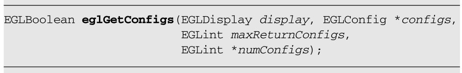

如果调用成功，返回EGL  _真。

which returns EGL_TRUE if the call succeeded.

有两种方法可以调用eglGetConfigs:首先，如果您为配置的值指定空，系统将返回EGL  _真并将numConfigs设置为可用EGLConfigs的数量。不会返回关于系统中任何EGLConfigs的附加信息，但是知道可用配置的数量允许您分配足够的内存来获取整个EGLConfigs集，如果您愿意的话。

**指定的配置为空，将num设置为EGLConfig的数量，不会返回任何附加信息，但是可以分配足够内存来获取EGLConfigs集**

There are two ways to call eglGetConfigs: First, if you specify NULL for the  value of configs, the system will return EGL_TRUE and set numConfigs to the  number of available EGLConfigs. No additional information about any of the  EGLConfigs in the system is returned, but knowing the number of available  configurations allows you to allocate enough memory to get the entire set of  EGLConfigs, should you care to.

或者，也许更有用的是，您可以分配一个未初始化的EGLConfig值数组，并将这些值作为Configs参数传递给eglGetConfigs。将maxReturnConfigs设置为您分配的数组的大小，这也将指定将返回的最大配置数。当调用完成时，numConfigs将被更新为配置中已修改的条目数。然后，您可以开始处理返回列表，查询配置的特征，以确定哪一个最符合我们的需求。

**给条件，我遇到都是使用这种方式的。**

Alternatively, and perhaps more useful, is that you can allocate an array of  uninitialized EGLConfig values, and pass those into eglGetConfigs as the configs  parameter. Set maxReturnConfigs to the size of the array you allocated, which  will also specify the maximum number of configs that will be returned. When the  call completes, numConfigs will be updated with the number of entries in configs  that were modified. You can then begin processing the list of returns, querying  the characteristics of the configurations to determine which one matches our  needs the best.

## 查询配置属性

Querying EGLConfig Attributes

我们现在描述EGL与一个EGLConfig关联的值，以及如何检索这些值。

We now describe the values that EGL associates with an EGLConfig, and how you  can retrieve those values.

一个EGL配置包含了提供的关于一个表面的所有信息。这包括关于可用颜色数量、与配置相关的附加缓冲区(如深度和模板缓冲区，我们稍后讨论)、表面类型和许多其他特征的信息。接下来是一个可以从EGLConfig查询的所有属性的列表。在本章中，我们只讨论其中的一部分，但是我们在表3-1中提供了整个列表作为参考。

**一个配置表包含了提供关于表面的所有信息，使用函数可以返回关联EGLConfig的特定属性，这可以最终创建渲染表面的选择配置**

An EGLConfig contains all of the information about a surface made available by  EGL. This includes information about the number of available colors, additional  buffers associated with the configuration (like depth and stencil buffers, which  we discuss later), the type of surfaces, and numerous other characteristics.  What follows is a list of all of the attributes that can be queried from an  EGLConfig. We only discuss a subset of these in this chapter, but we provide the  entire list in Table 3-1 as a reference.\

要查询与EGLConfig关联的特定属性，请使用

To query a particular attribute associated with an EGLConfig, use

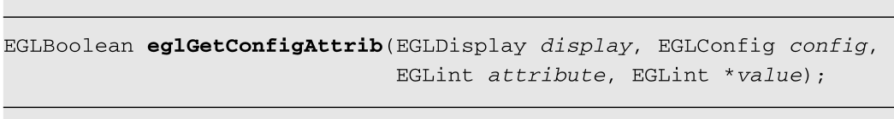

它将返回关联的EGLConfig的特定属性的值。这使您可以完全控制最终创建渲染表面时选择的配置。然而，看看表3.1，考虑到选项的数量，你可能会有些害怕。EGL提供了另一个例程，eglChooseConfig，它允许您指定对您的应用程序来说什么是重要的，并将返回与您的请求最匹配的配置。

which will return the value for the specific attribute of the associated  EGLConfig. This allows you total control over which configuration you choose for  ultimately creating rendering surfaces. However, looking at Table 3.1, you might  be somewhat intimidated given the number of options. EGL provides another  routine, eglChooseConfig, that allows you to specify what’s important for your  application, and will return the best matching configuration to your  requests.

## 让EGL选择配置

Letting EGL Choose the Config

要让EGL选择匹配的EGLConfigs，请使用

To have EGL make the choice of matching EGLConfigs, use

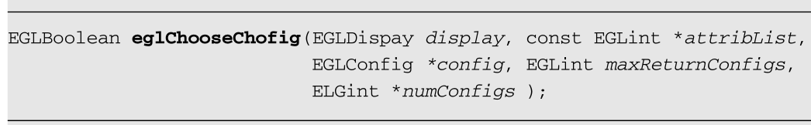


您需要提供一个属性列表，以及对您的应用程序的正确操作很重要的所有属性的相关首选值。例如，如果您需要一个支持五位红色和蓝色、六位绿色(常见的“RGB  565”格式)、深度缓冲区和支持OpenGL ES 2.0的渲染表面的EGLConfig，您可以声明示例3-2中所示的数组。


**提供一个属性列表，指定颜色类型，缓存区等表面信息。**

You need to provide a list of the attributes, with associated preferred values  for all the attributes that are important for the correct operation of your  application. For example, if you need an EGLConfig that supports a rendering  surface having five bits red and blue, six bits green (the common “RGB 565”  format), a depth buffer, and supporting OpenGL ES 2.0, you might declare the  array shown in Example 3-2.

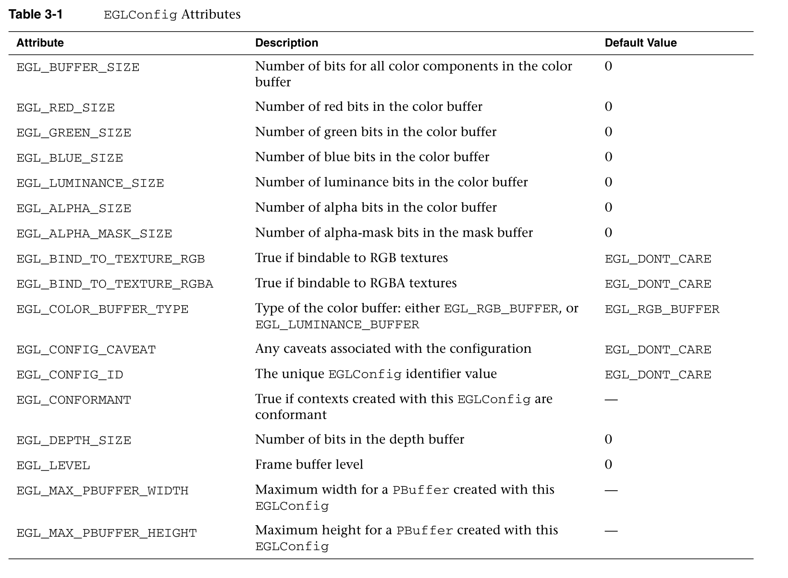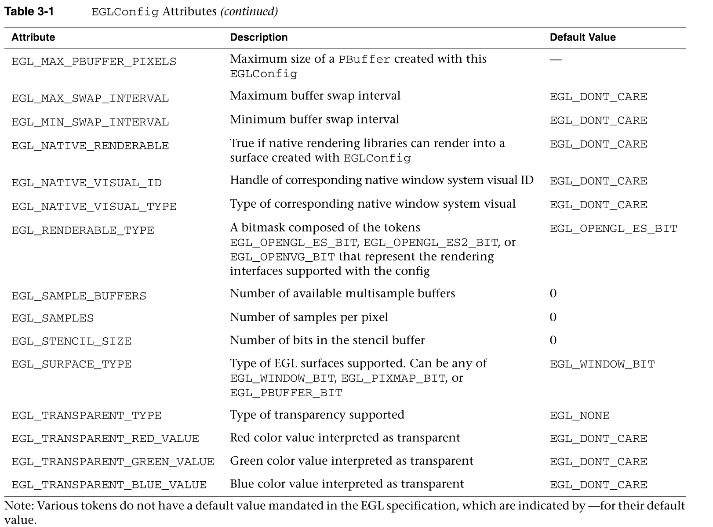


##  指定EGL属性

Specifying EGL Attributes

```c
EGLint attribList[] = 
{
   EGL_RENDERABLE_TYPE, EGL_OPENGL_ES2_BIT,
   EGL_RED_SIZE, 5,
   EGL_GREEN_SIZE, 6,
   EGL_BLUE_SIZE, 5,
   EGL_DEPTH_SIZE, 1,
   EGL_NONE
};
```

对于属性列表中没有明确指定的值，EGL将使用表3-1中指定的默认值。此外，当为属性指定一个数值时，如果有匹配的EGLConfig可用，EGL将保证返回的配置至少具有该最小值。

For values that aren’t explicitly specified in the attribute list, EGL will  use their default value as specified in Table 3-1. Additionally, when specifying  a numeric value for an attribute, EGL will guarantee the returned configuration  will have at least that value as a minimum if there’s a matching EGLConfig  available.

要使用这组属性作为选择标准，请遵循示例3-3。

To use this set of attributes as a selection criteria, follow Example  3-3.

```java
const EGLint MaxConfigs = 10;
EGLConfig  configs[MaxConfigs];  // We'll only accept 10 configs
EGLint  numConfigs;
if(!eglChooseConfig(dpy, attribList, configs, MaxConfigs,
   &numConfigs)) 
{
   // Something didn't work … handle error situation
}
else
{
   // Everything's okay. Continue to create a rendering surface
}
```

如果eglChooseConfig成功返回，将返回一组符合您条件的EGLConfigs。如果一个以上的配置匹配(最多使用您指定的最大配置数)，eglChooseConfig将使用以下顺序对配置进行排序:

If eglChooseConfig returns successfully, a set of EGLConfigs matching your  criteria will be returned. If more than one EGLConfig matches (with at most the  maximum number of configurations you specify), eglChooseConfig will sort the  configurations using the following ordering:

- EGL  _配置_警告的值。优先考虑没有配置警告的配置(当GL _配置_警告的值为GL_NONE时)，然后是慢速渲染配置(GL _慢速_配置)，最后是非一致性配置(GL  _非一致性_配置)。

  By the value of EGL_CONFIG_CAVEAT. Precedence is given to configurations where  there are no configuration caveats (when the value of EGL_CONFIG_CAVEAT is  GL_NONE), then slow rendering configurations (EGL_SLOW_CONFIG), and finally  nonconformant configurations (EGL_NON_CONFORMANT_CONFIG).

- 由EGL_COLOR_BUFFER_TYPE.指定的缓冲区类型。

  By the type of buffer as specified by EGL_COLOR_BUFFER_TYPE.

- 按颜色缓冲区中的位数降序排列。缓冲区中的位数取决于EGL颜色缓冲区类型，并且至少是为特定颜色通道指定的值。当缓冲区类型为EGL_RGB_BUFFER时，位数计算为RGB  _红色_大小、RGB _绿色_大小和RGB _蓝色_大小的总和。当颜色缓冲类型为EGL _亮度_缓冲时，位数为EGL _亮度_大小和EGL  _阿尔法_大小之和。

  By the number of bits in the color buffer in descending sizes. The number of  bits in a buffer depends on the EGL_COLOR_BUFFER_TYPE, and will be at least the  value specified for a particular color channel. When the buffer type is  EGL_RGB_BUFFER, the number of bits is computed as the total of EGL_RED_SIZE,  EGL_GREEN_SIZE, and EGL_BLUE_SIZE. When the color buffer type is  EGL_LUMINANCE_BUFFER, the number of bits is the sum of EGL_LUMINANCE_SIZE and  EGL_ALPHA_SIZE.

- 按EGL缓冲区大小升序排列。

  By the EGL_BUFFER_SIZE in ascending order.

- 按EGL_SAMPLE_BUFFERS的值升序排列。

  By the value of EGL_SAMPLE_BUFFERS in ascending order.

- 按升序排列的EGL_SAMPLES样本数。

  By the number of EGL_SAMPLES in ascending order.

- 按 EGL_DEPTH_SIZE值升序排列。

  By the value of EGL_DEPTH_SIZE in ascending order.

- 按升序排列的EGL_STENCIL_SIZE的值。

  By the value of the EGL_STENCIL_SIZE in ascending order.

- 由EGL_ALHPA_MASK_SIZE的值决定(仅适用于OpenVG曲面)。

  By the value of the EGL_ALHPA_MASK_SIZE (which is applicable only to OpenVG  surfaces).

- 由EGL  _原生_视觉_类型以依赖于实现的方式实现。

  By the EGL_NATIVE_VISUAL_TYPE in an implementation-dependent manner.

- 按EGL_CONFIG_ID的值升序排列。

  By the value of the EGL_CONFIG_ID in ascending order.

此列表中未提及的参数不会在排序过程中使用。

Parameters not mentioned in this list are not used in the sorting  process.

如示例中所述，如果eglChooseConfig成功返回，我们就有足够的信息来继续创建一些可以借鉴的东西。默认情况下，如果您没有指定您想要的渲染表面类型(通过指定EGL  _表面_类型属性)，EGL假设您想要一个屏幕窗口。

As mentioned in the example, if eglChooseConfig returns successfully, we have  enough information to continue to create something to draw into. By default, if  you don’t specify what type of rendering surface type you would like (by  specifying the EGL_SURFACE_TYPE attribute), EGL assumes you want an on-screen  window.

## 创建屏幕渲染区域:EGL窗口

Creating an On-Screen Rendering Area: The EGL Window

一旦我们有了一个合适的符合我们渲染要求的EGLConfig，我们就可以创建我们的窗口了。要创建窗口，请调用

**创建并连接窗口，然后进行初始化，返回主次版本，，选择渲染的配置，选择之后进行创建渲染区域。**

Once we have a suitable EGLConfig that meets our requirements for rendering,  we’re set to create our window. To create a window, call

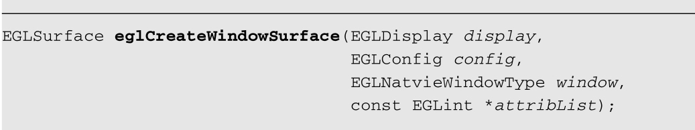


这个函数将我们的连接带到本地显示管理器，以及我们在上一步中获得的EGLConfig。此外，它需要以前创建的本机窗口系统中的一个窗口。因为EGL是许多不同窗口系统和OpenGL  ES 2.0之间的软件层，所以演示如何创建本机窗口不在本指南的范围内。请参考本机窗口系统的文档，以确定在该环境中创建窗口需要什么。

**连接到本地显示器**

This function takes our connection to the native display manager, and the  EGLConfig that we obtained in the previous step. Additionally, it requires a  window from the native windowing system that was created previously. Because EGL  is a software layer between many different windowing systems and OpenGL ES 2.0,  demonstrating how to create a native window is outside the scope of this guide.  Please reference the documentation for your native windowing system to determine  what’s required to create a window in that environment.

最后，这个调用还需要一个属性列表；然而，该列表不同于表3-1所示的列表。因为EGL支持其他渲染应用程序接口(特别是OpenVG)，所以在使用OpenGL  ES  2.0时，有些属性不适用(见表3-2)。出于我们的目的，有一个被eglCreateWindowSurface接受的属性，它用于指定我们想要渲染到前缓冲区还是后缓冲区的哪个缓冲区。

Finally, this call also takes a list of attributes; however this list differs  from those shown in Table 3-1. Because EGL supports other rendering APIs  (notably OpenVG), there are attributes accepted by eglCreateWindowSurface that  don’t apply when working with OpenGL ES 2.0 (see Table 3-2). For our purposes,  there is a single attribute that’s accepted by eglCreateWindowSurface, and it’s  used to specify which buffer of the front- or back-buffer we’d like to render  into.

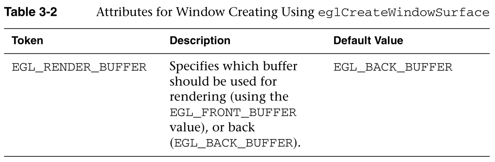


注意:对于OpenGL  ES 2.0窗口渲染表面，只支持双缓冲窗口。

Note: For OpenGL ES 2.0 window rendering surfaces, only double-buffered  windows are supported.

属性列表可能为空(即传递空指针作为属性集的值)，或者它可能是一个以EGL_NONE 作为第一个元素填充的列表。在这种情况下，所有相关属性都使用默认值。

The attribute list might be empty (i.e., passing a NULL pointer as the value  for attribList), or it might be a list populated with an EGL_NONE token as the  first element. In such cases, all of the relevant attributes use their default  values.

eglCreateWindowSurface有多种可能失败的方法，如果出现其中任何一种，调用将返回EGL  _否_表面，并设置特定的错误。如果出现这种情况，我们可以通过调用eglGetError来确定失败的原因，这将返回表3-3所示的以下原因之一。

There are a number of ways that eglCreateWindowSurface could fail, and if any  of them occur, EGL_NO_SURFACE is returned from the call, and the particular  error is set. If this situation occurs, we can determine the reason for the  failure by calling eglGetError, which will return one of the following reasons  shown in Table 3-3.

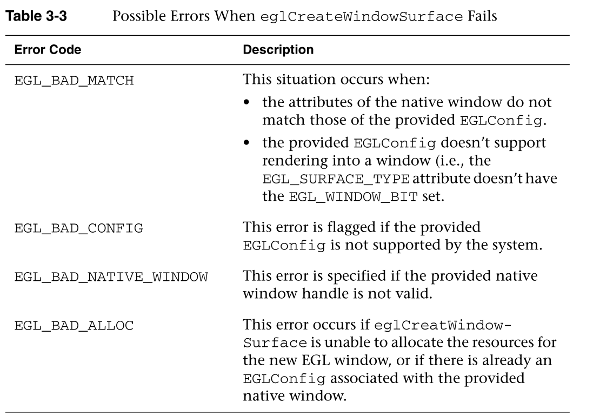


综上所述，我们创建窗口的代码如示例3-4所示。

Putting this all together, our code for creating a window is shown in Example  3-4.

```c
EGLRenderSurface  window;
EGLint attribList[] = 
{
   EGL_RENDER_BUFFER, EGL_BACK_BUFFER,
   EGL_NONE
);
window = eglCreateWindowSurface(dpy, window, config, attribList);
if(window == EGL_NO_SURFACE) 
{
   switch(eglGetError()) 
   {
      case EGL_BAD_MATCH:
         // Check window and EGLConfig attributes to determine
         // compatibility, or verify that the EGLConfig 
         // supports rendering to a window, 
         break;
           case EGL_BAD_CONFIG:
         // Verify that provided EGLConfig is valid
         break;
      case EGL_BAD_NATIVE_WINDOW:
         // Verify that provided EGLNativeWindow is valid
         break;
      case EGL_BAD_ALLOC:
         // Not enough resources available. Handle and recover
         break;
   } 
}
```


这为我们创造了一个可以借鉴的地方，但是在我们能够成功地将OpenGL  ES  2.0用于我们的窗口之前，我们还有两个步骤。然而，窗口并不是你可能发现有用的唯一渲染表面。在完成我们的讨论之前，我们接下来介绍另一种类型的渲染表面。

This creates a place for us to draw into, but we still have two more steps  before we’ll be able to successfully use OpenGL ES 2.0 with our window. Windows,  however, aren’t the only rendering surfaces that you might find useful. We  introduce another type of rendering surface next before completing our  discussion.

## 创建一个屏幕外的渲染区域:EGL·Pbuffers

Creating an Off-Screen Rendering Area: EGL Pbuffers

除了能够使用OpenGL  ES 2.0渲染到屏幕上的窗口之外，您还可以渲染到不可见的屏幕外表面，称为p buffer(像素缓冲区的简称)。Pbuffers可以充分利用OpenGL ES  2.0可用的任何硬件加速，就像一个窗口一样。Pbuffers最常用于生成纹理贴图。如果你想做的只是渲染一个纹理，我们建议使用帧缓冲区对象(在第12章“帧缓冲区对象”)来代替缓冲区，因为它们更有效。然而，在某些无法使用帧缓冲区对象的情况下，pbuffers仍然很有用，例如用OpenGL  ES渲	染屏幕外的表面，然后在另一个API(如OpenVG)中将其用作纹理。

**第二种是渲染到不可见的外表面，创建的时候 也很方便，在属性列表中加一个属性就可以了。**

In addition to being able to render into an on-screen window using OpenGL ES  2.0, you can also render into nonvisible off-screen surfaces called pbuffers  (short for pixel buffer). Pbuffers can take full advantage of any hardware  acceleration available to OpenGL ES 2.0, just as a window does. Pbuffers are  most often used for generating texture maps. If all you want to do is render to  a texture, we recommend using framebuffer objects (covered in Chapter 12,  “Framebuffer Objects”) instead of pbuffers because they are more efficient.  However, pbuffers can still be useful for some cases where framebuffer objects  cannot be used, such as when rendering an off-screen surface with OpenGL ES and  then using it as a texture in another API such as OpenVG.

创建一个缓冲区与创建一个EGL窗口非常相似，只是有一些小的不同。为了创建一个缓冲区，我们需要找到一个EGLConfig，就像我们为一个窗口所做的那样，只需要做一个修改:我们需要增加EGL  _表面_类型的值，以包括EGL _缓冲区_位。一旦我们有了合适的EGLConfig，我们就可以使用函数创建一个缓冲区

Creating a pbuffer is very similar to creating an EGL window, with a few minor  differences. To create a pbuffer, we need to find an EGLConfig just as we did  for a window, with one modification: We need to augment the value of  EGL_SURFACE_TYPE to include EGL_PBUFFER_BIT. Once we have a suitable EGLConfig,  we can create a pbuffer using the function

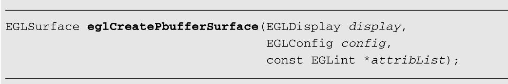


和窗口创建一样，这个函数将我们的连接带到本地显示管理器，以及我们选择的EGLConfig。

As with window creation, this function takes our connection to the native  display manager, and the EGLConfig that we selected.

该调用还采用了表3-4中描述的属性列表。

This call also takes a list of attributes described in Table 3-4.

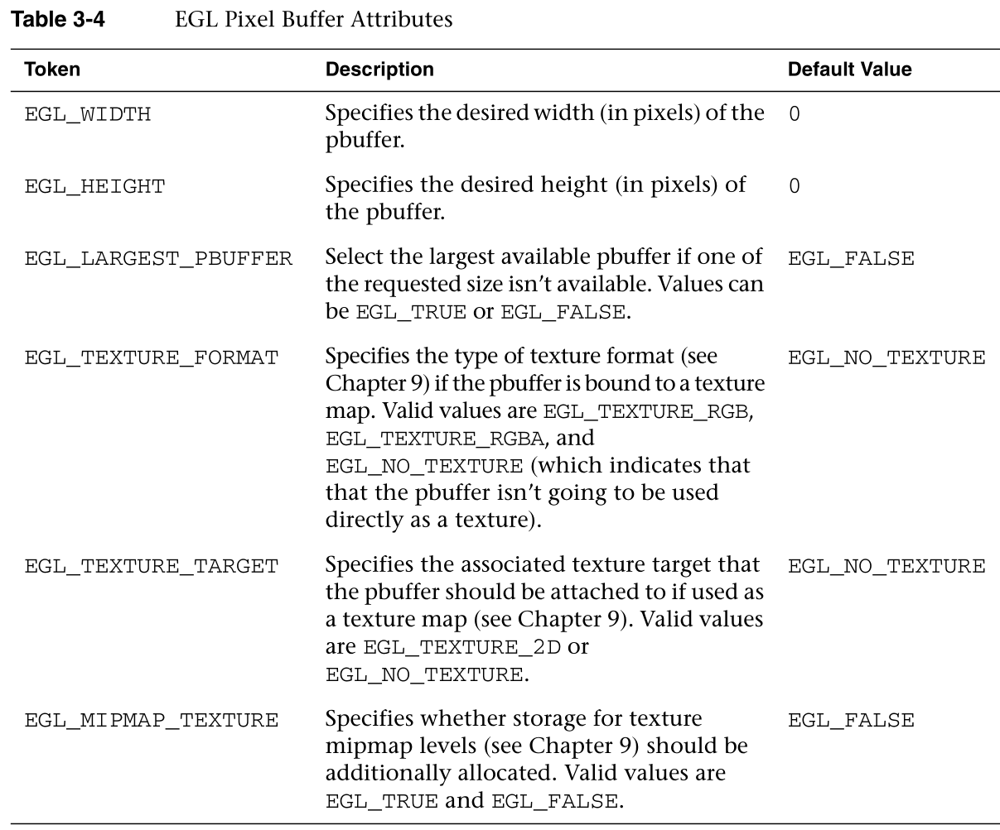


eglCreatePbufferSurface有多种可能失败的方法，就像创建窗口一样，如果其中任何一种发生了，就会从调用中返回EGL_NO_SURFACE，并设置特定的错误。在这种情况下，eglGetError将返回表3-5中列出的错误之一。

There are a number of ways that eglCreatePbufferSurface could fail, and just  as with window creation, if any of them occur, EGL_NO_SURFACE is returned from  the call, and the particular error is set. In this situation, eglGetError will  return one of the errors listed in Table 3-5.

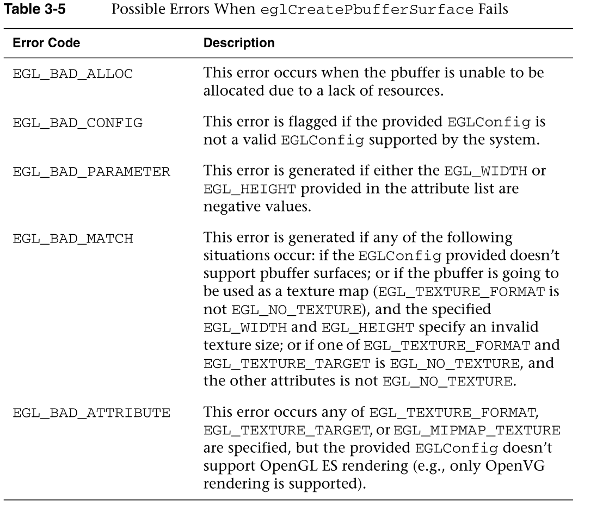


综上所述，我们将创建一个缓冲区，如示例3-5所示。

Putting this all together, we would create a pbuffer as shown in Example  3-5.

```c
EGLint attribList[] = 
{
   EGL_SURFACE_TYPE, EGL_PBUFFER_BIT,
   EGL_RENDERABLE_TYPE, EGL_OPENGL_ES2_BIT,
   EGL_RED_SIZE, 5,
   EGL_GREEN_SIZE, 6,
   EGL_BLUE_SIZE, 5,
   EGL_DEPTH_SIZE, 1,
   EGL_NONE
};
const EGLint MaxConfigs = 10;
EGLConfig  configs[MaxConfigs];  // We'll only accept 10 configs
EGLint  numConfigs;
if(!eglChooseConfig(dpy, attribList, configs, MaxConfigs,
   &numConfigs)) 
{
   // Something didn't work … handle error situation
}
else
{
   // We've found a pbuffer-capable EGLConfig
}
// Proceed to create a 512 x 512 pbuffer (or the largest available)
EGLRenderSurface  pbuffer;
EGLint attribList[] = 
{
   EGL_WIDTH, 512,
   EGL_HEIGHT, 512,
   EGL_LARGEST_PBUFFER, EGL_TRUE,
   EGL_NONE
);
pbuffer = eglCreatePbufferSurface(dpy, config, attribList);
if(pbuffer == EGL_NO_SURFACE) 
{
   switch(eglGetError()) 
   {
      case EGL_BAD_ALLOC:
         // Not enough resources available. Handle and recover
         break;
      case EGL_BAD_CONFIG:
         // Verify that provided EGLConfig is valid
         break;
      case EGL_BAD_PARAMETER:
         // Verify that the EGL_WIDTH and EGL_HEIGHT are 
         // non-negative values
         break;
      case EGL_BAD_MATCH:
         // Check window and EGLConfig attributes to determine
         // compatibility and pbuffer-texture parameters 
         break;
      
   } 
}// Check to see what size pbuffer we were allocated
EGLint  width;
EGLint  height;
if(!eglQuerySurface(dpy, pbuffer, EGL_WIDTH, &width) ||
   !eglQuerySurface(dpy, pbuffer, EGL_HEIGHT, &height))
{
   // Unable to query surface information.
}
```

Pbuffers和windows一样支持所有OpenGL  ES  2.0渲染工具。除了不能在屏幕上显示pbuffer之外，最大的区别是，当你完成窗口渲染时，你可以将pbuffer中的值复制到你的应用程序中，或者将pbuffer的绑定修改为纹理，而不是交换缓冲区。

Pbuffers support all OpenGL ES 2.0 rendering facilities just as windows do.  The major difference—aside from you can’t display a pbuffer on the screen—is  that instead of swapping buffers when you’re finished rendering as you do with a  window, you will either copy the values from a pbuffer to your application, or  modify the binding of the pbuffer as a texture.

## 创建渲染上下文

Creating a Rendering Context

渲染上下文是OpenGL  ES 2.0内部的数据结构，包含操作所需的所有状态。例如，它包含对第2章示例程序中使用的顶点和片段着色器以及顶点数据数组的引用。在OpenGL ES  2.0可以绘制之前，它需要有一个上下文可供使用。

**渲染上下文是一个内部结构，包含所需要的所有操作，所以在开始之前需要创建一个上下文。**

A rendering context is a data structure internal to OpenGL ES 2.0 that  contains all of the state required for operation. For example, it contains  references to the vertex and fragment shaders and the array of vertex data used  in the example program in Chapter 2. Before OpenGL ES 2.0 can draw it needs to  have a context available for its use.

若要创建上下文，请使用

To create a context, use

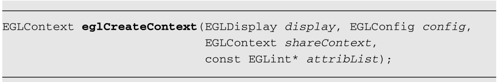


同样，您将需要显示连接以及最能代表您的应用程序需求的EGLConfig。第三个参数，共享上下文，允许多个环境上下文共享特定类型的数据，如着色器程序和纹理映射。在上下文中共享资源是我们在第13章“用OpenGL  ES 2.0进行高级编程”中讨论的一个高级概念目前，我们将EGL _否_上下文作为共享上下文的值传入，这表明我们没有与任何其他上下文共享资源。

Once again, you’ll need the display connection as well as the EGLConfig best  representing your application’s requirements. The third parameter, shareContext,  allows multiple EGLContexts to share specific types of data, like shader  programs and texture maps. Sharing resources among contexts is an advanced  concept that we discuss in Chapter 13, “Advanced Programming with OpenGL ES  2.0.” For the time being, we pass EGL_NO_CONTEXT in as the value for  shareContext, indicating that we’re not sharing resources with any other  contexts.

最后，和许多EGL调用一样，指定了一个特定于eglCreateContext操作的属性列表。在这种情况下，有一个被接受的属性，EGL  _上下文_客户端_版本，在表3-6中讨论。

Finally, as with many EGL calls, a list of attributes specific to  eglCreateContext’s operation is specified. In this case, there’s a single  attribute that’s accepted, EGL_CONTEXT_CLIENT_VERSION, discussed in Table  3-6

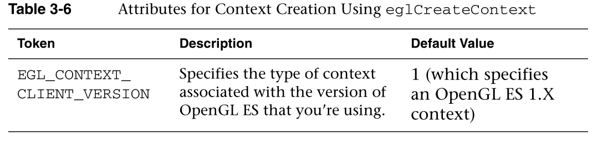


因为我们想要使用OpenGL  ES 2.0，所以我们总是必须指定这个属性来获得正确的上下文类型。

As we want to use OpenGL ES 2.0, we will always have to specify this attribute  to obtain the right type of context.

当eglCreateContext成功时，它会返回新创建的上下文的句柄。如果一个上下文不能被创建，那么eglCreateContext返回EGL_NO_CONTEXT，失败的原因被设置，可以通过调用eglGetError获得。根据我们目前的知识，eglCreateContext失败的唯一原因是我们提供的EGLConfig无效，在这种情况下，eglGetError返回的错误是EGL_BAD_CONFIG。

When eglCreateContext succeeds, it returns a handle to the newly created  context. If a context is not able to be created, then eglCreateContext returns  EGL_NO_CONTEXT, and the reason for the failure is set, and can be obtained by  calling eglGetError. With our current knowledge, the only reason that  eglCreateContext would fail is if the EGLConfig we provide isn’t valid, in which  case the error returned by eglGetError is EGL_BAD_CONFIG.

示例3-6展示了如何在选择适当的EGLConfig之后创建上下文。

Example 3-6 shows how to create a context after selecting an appropriate  EGLConfig.

```java
const ELGint attribList[] = {
   EGL_CONTEXT_CLIENT_VERSION, 2,
   EGL_NONE
};
EGLContext  context;
context = eglCreateContext(dpy, config, EGL_NO_CONTEXT, attribList);
if(context == EGL_NO_CONTEXT) 
{
   EGLError error = eglGetError();
   if(error == EGL_BAD_CONFIG) 
   {
      // Handle error and recover
   }
}
```

eglCreateContext可能会产生其他错误，但目前，我们将只检查错误的EGLConfig错误。

Other errors may be generated by eglCreateContext, but for the moment, we’ll  only check for bad EGLConfig errors.

在成功创建一个EGLContext后，我们需要完成最后一步才能渲染。

After successfully creating an EGLContext, we need to complete one final step  before we can render.

## 使一个环境上下文成为当前

Making an EGLContext Current

由于一个应用程序可能已经为各种目的创建了多个环境上下文，我们需要一种方法来将一个特定的环境上下文与我们的渲染表面相关联——这一过程通常被称为“使当前”。

As an application might have created multiple EGLContexts for various  purposes, we need a way to associate a particular EGLContext with our rendering  surface—a process commonly called “make current.

要将特定的环境上下文与环境曲面相关联，请使用调用

To associate a particular EGLContext with an EGLSurface, use the  call

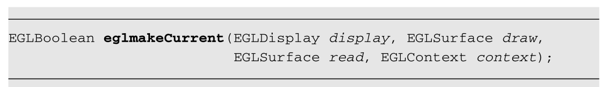


您可能注意到这个调用需要两个EGLSurfaces。虽然这允许我们在讨论高级EGL用法时利用灵活性，但是我们将读取和绘制设置为相同的值，即我们之前创建的窗口。

You probably noticed that this call takes two EGLSurfaces. Although this  allows flexibility that we exploit in our discussion of advanced EGL usage, we  set both read and draw to the same value, the window that we created  previously.

## 把我们所有的EGL知识放在一起

Putting All Our EGL Knowledge T ogether

我们用一个完整的例子来结束这一章，这个例子展示了从EGL的初始化开始，通过将一个EGLContext绑定到一个EGLRenderSurface的整个过程。我们假设已经创建了一个本地窗口，如果出现任何错误，应用程序将终止。

We conclude this chapter with a complete example showing the entire process  starting with the initialization of the EGL through binding an EGLContext to an  EGLRenderSurface. We’ll assume that a native window has already been created,  and that if any errors occur, the application will terminate.

事实上，示例3-7非常类似于第2章中所示的在创建窗口中所做的，除了那些例程将窗口的创建和上下文分开(原因我们将在后面讨论)。

In fact, Example 3-7 is very similar to what is done in esCreateWindow as  shown in Chapter 2, except those routines separate the creation of the window  and the context (for reasons that we discuss later).

```c
EGLBoolean initializeWindow(EGLNativeWindow nativeWindow)
{
   //创建渲染表面的属性
   const EGLint  configAttribs[] = 
   {
      EGL_RENDER_TYPE, EGL_WINDOW_BIT,
      EGL_RED_SIZE, 8,
      EGL_GREEN_SIZE, 8,
      EGL_BLUE_SIZE, 8,
       EGL_DEPTH_SIZE, 24,
      EGL_NONE
   };
   //
   const EGLint  contextAttribs[] = 
   {
      EGL_CONTEXT_CLIENT_VERSION, 2,
      EGL_NONE
   };
   EGLDisplay dpy;
   //创建并连接屏幕
   dpy = eglGetNativeDispay(EGL_DEFAULT_DISPLAY);
   if(dpy == EGL_NO_DISPLAY) 
   {
      return EGL_FALSE;
   }
   EGLint major, minor;
   //初始化并返回主次版本
   if(!eglInitialize(dpy, &major, &minor)) 
   {
      return EGL_FALSE;
   }
   EGLConfig  config;
   EGLint  numConfigs;
   //自动选择
   if(!eglChooseConfig(dpy, configAttribs, &config, 1, 
      &numConfigs)) {
         return EGL_FALSE;
   }
   EGLSurface window;
   //创建渲染表面，真正的连接搭配屏幕
   window = eglCreateWindowSurface(dpy, config, nativeWindow, NULL);
   if(window == EGL_NO_SURFACE) 
   {
      return EGL_FALSE;
   }
   EGLContext context;
   //创建会hi上下文
   context = eglCreateContext(dpy, config, EGL_NO_CONTEXT,
                              contextAttribs);
   if(context == EGL_NO_CONTEXT) 
   {
      return EGL_FALSE;
   }
   //使用当前上下文
    if(!eglMakeCurrent(dpy, window, window, context)) 
   {
      return EGL_FALSE;
   }
   return EGL_TRUE;
}
```

如果应用程序调用示例3-8中的函数来打开一个512  × 512的窗口，那么这段代码将非常相似。

This code would be very similar if an application made the call in Example 3-8  to open a 512 × 512 window.

```c
ESContext  esContext;
const char* title = "OpenGL ES Application Window Title";
if(esCreateWindow(&esContext, title, 512, 512, 
                  ES_WINDOW_RGB | ES_WINDOW_DEPTH))
{
   // Window creation failed
}
```

esCreateWindow的最后一个参数指定了我们希望在窗口中显示的特征，并指定为以下值的位掩码:

- ES  _ WINDOW _ RGB指定基于RGB的颜色缓冲区。
- ES _ WINDOW _ ALPHA—分配目标ALPHA缓冲区。
- 深度-分配深度缓冲区。
- ES _  WINDOW _  SCOTE—分配一个模板缓冲区。
- 多采样——分配一个多采样缓冲区。在窗口配置位掩码中指定这些值会将适当的标记和值添加到EGLConfig属性列表中(即前面示例中的configAttribs)。

The last parameter to esCreateWindow specifies the characteristics we want in  our window, and specified as a bitmask of the following values: •  ES_WINDOW_RGB—Specify an RGB-based color buffer. • ES_WINDOW_ALPHA—Allocate a  destination alpha buffer. • ES_WINDOW_DEPTH—Allocate a depth buffer. •  ES_WINDOW_STENCIL—Allocate a stencil buffer. • ES_WINDOW_MULTISAMPLE—Allocate a  multisample buffer. Specifying these values in the window configuration bitmask  will add the appropriate tokens and values into the EGLConfig attribute list  (i.e., configAttribs in the preceding example).

## 同步渲染

Synchronizing Rendering

您可能会发现需要将多个图形应用编程接口的渲染协调到一个窗口中的情况。例如，您可能会发现使用OpenVG或本机窗口系统的字体渲染更容易比OpenGL  ES 2.0更适合在窗口中绘制字符的功能。在这种情况下，您需要让您的应用程序允许各种库呈现到共享窗口中。EGL有几个功能可以帮助您完成同步任务。

You might find situations in which you need to coordinate the rendering of  multiple graphics APIs into a single window. For example, you might find it  easier to use OpenVG or the native windowing system’s font rendering functions more suited for drawing characters into a window than OpenGL ES 2.0.  In such cases, you’ll need to have your application allow the various libraries  to render into the shared window. EGL has a few functions to help with your  synchronization tasks.

如果您的应用程序只使用OpenGL  ES 2.0进行渲染，那么您可以通过简单地调用glFinish来保证所有的渲染都已经发生。

If your application is only rendering with OpenGL ES 2.0, then you can  guarantee that all rendering has occurred by simply calling glFinish.

但是，如果您使用多个Khronos  API进行渲染(如OpenVG)，并且在切换到窗口系统本机渲染API之前，您可能不知道使用了哪个API，您可以调用以下内容。

However, if you’re using more than one Khronos API for rendering (such as  OpenVG), and you might not know which API is used before switching to the  window-system native rendering API, you can call the following.

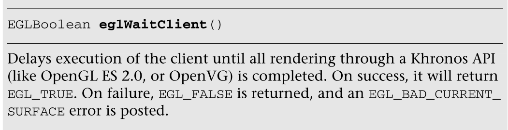


它的操作类似于glFinish的操作，但是不管当前运行的是哪个Khronos  API，它都可以工作。

Its operation is similar in operation to glFinish, but works regardless of  which Khronos API is currently in operation.

同样，如果您需要保证完成本机窗口系统呈现，请调用eglWaitNative。

Likewise, if you need to guarantee that the native windowing system rendering  is completed, call eglWaitNative.

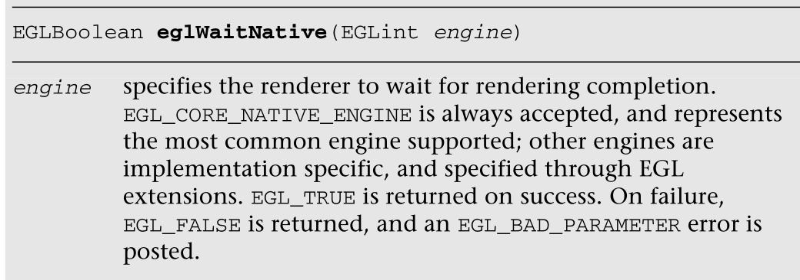


### 总结


