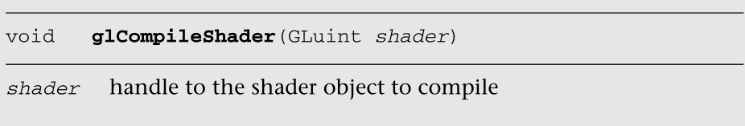

# 着色器和程序

Shaders and Programs

在第二章“你好，三角形:一个OpenGL  ES  2.0的例子”中，我们向你介绍了一个绘制单个三角形的简单程序。在那个例子中，我们创建了两个着色器对象(一个用于顶点着色器，一个用于片段着色器)和一个程序对象来渲染三角形。着色器对象和程序对象是OpenGL  ES  2.0中使用着色器的基本概念。在本章中，我们将向您介绍如何创建着色器、编译它们以及将它们链接到一个程序对象的全部细节。编写顶点和片段着色器的细节将在本书后面介绍。目前，我们专注于:

In Chapter 2, “Hello, Triangle: An OpenGL ES 2.0 Example,” we introduced you  to a simple program that draws a single triangle. In that example, we created  two shader objects (one for the vertex shader and one for the fragment shader)  and a single program object to render the triangle. Shader objects and program  objects are fundamental concepts in working with shaders in OpenGL ES 2.0. In  this chapter, we introduce you to the full details on how to create shaders,  compile them, and link them together into a program object. The details of  writing vertex and fragment shaders come later in the book. For now, we focus  on:

- 着色器和程序对象概述

  Shader and program object overview

- 创建和编译着色器。

  Creating and compiling a shader.

- 创建和链接程序。

  Creating and linking a program.

- 获取和设置一个uniform.

  Getting and setting uniforms.

- 获取和设置属性。

  Getting and setting attributes.

- 着色器编译器和着色器二进制文件

  Shader compiler and shader binaries

## 着色器和程序

Shaders and Programs

使用着色器渲染时，需要创建两种基本的对象类型:着色器对象和程序对象。考虑着色器对象和程序对象的最佳方式是通过与C编译器和链接器进行比较。C编译器生成目标代码(例如。obj或。o文件),用于一段源代码。创建完目标文件后，链接器将目标文件链接到最终的程序中。

C compiler generates object code (e.g., .obj or .o files) for a piece of  source code.There are two fundamental object types you need to create to render with  shaders: shader objects and program objects. The best way to think of a shader  object and a program object is by comparison to a C compiler and  linker.After the object files have been created, the C linker then links the object  files into a final program.

OpenGL  ES中使用了类似的范例来表示着色器。着色器对象是包含单个着色器的对象。源代码被提供给着色器对象，然后着色器对象被编译成对象形式(像。obj文件)。编译后，着色器对象可以附加到程序对象。一个程序对象可以附加多个着色器对象。在OpenGL  ES中，每个程序对象都需要附加一个顶点着色器对象和一个片段着色器对象(不多也不少)。然后，程序对象被链接成最终的“可执行文件”最终的程序对象可用于渲染。

**着色器编译只会形成obj文件，需要通过程序链接成为可以执行的文件。程序可以附加**

A similar paradigm is used in OpenGL ES for representing shaders. The shader  object is an object that contains a single shader. The source code is given to  the shader object and then the shader object is compiled into object form (like  an .obj file). After compilation, the shader object can then be attached to a  program object. A program object gets multiple shader objects attached to it. In  OpenGL ES, each program object will need to have one vertex shader object and  one fragment shader object attached to it (no more, and no less). The program  object is then linked into a final “executable.” The final program object can  then be used to render.

获取链接着色器对象的一般过程是首先创建一个顶点着色器对象和一个片段着色器对象，将源代码附加到openGLes，然后编译它们。然后，创建一个程序对象，将编译后的着色器对象附加到其上，并将其链接起来。如果没有错误，你可以随时告诉总账使用该程序进行绘图。接下来的部分详细介绍了执行这个过程所需的应用编程接口调用。

The general process for getting to a linked shader object is to first create a  vertex shader object and a fragment shader object, attach source code to each of  them, and compile them. Then, you create a program object, attach the compiled  shader objects to it, and link it. If there are no errors, you can then tell the  GL to use the program for drawing any time you like. The next sections detail  the API calls you need to use to execute this process.

## 创建和编译着色器

Creating and Compiling a Shader

使用着色器对象的第一步是创建它。这是使用glCreateShader完成的。

The first step to working with a shader object is to create it. This is done  using glCreateShader.


调用glCreateShader会根据传入的类型创建一个新的顶点或片段着色器。返回值是新着色器对象的句柄。完成着色器对象后，可以使用glDeleteShader将其删除。

Calling glCreateShader causes a new vertex or fragment shader to be created,  depending on the type passed in. The return value is a handle to the new shader  object. When you are finished with a shader object, you can delete it using  glDeleteShader.


请注意，如果一个着色器附加到一个程序对象上(稍后将详细介绍)，调用glDeleteShader不会立即删除该着色器。相反，着色器将被标记为删除，一旦着色器不再附加到任何程序对象，其内存将被释放。

Note that if a shader is attached to a program object (more on this later),  calling glDeleteShader will not immediately delete the shader. Rather, the  shader will be marked for deletion and its memory will be freed once the shader  is no longer attached to any program objects.

一旦创建了着色器对象，通常接下来要做的就	是使用glShaderSource提供着色器源代码。

Once you have a shader object created, typically the next thing you will do is  provide the shader source code using glShaderSource.


一旦指定了着色器源，下一步就是编译着色器。在我们进行到这一步之前，有一个大的假设，我们必须让你知道。**并非OpenGL  ES  2.0的所有实现都提供编译着色器的能力(**有些要求着色器离线编译)。这将在后面关于着色器二进制文件的章节中介绍。现在，我们继续，就好像一个着色器可以在线编译，并在稍后讨论着色器二进制文件。

Once the shader source has been specified, the next step is to compile the  shader. Before we get to that step, there is one big assumption we are making  here of which we must make you aware. Not all implementations of OpenGL ES 2.0  provide the ability to compile a shader (some require shaders to be compiled  offline). This is described later in the chapter in the section on shader  binaries. For now, we proceed as if a shader can be compiled online and discuss  shader binaries later.

假设OpenGL  ES的一个实现支持在线编译，并且您已经指定了它的源代码，那么您可以使用glCompileShader编译着色器。

Given an implementation of OpenGL ES supports online compilation and you have  specified its source, you can then compile the shader using  glCompileShader.



调用glCompileShader将导致存储在着色器对象中的着色器源代码被编译。和任何普通语言编译器一样，编译后首先要知道的是是否有错误。使用glGetShaderiv可以查询这一点以及关于着色器对象的其他信息。

Calling glCompileShader will cause the shader source code that has been stored  in the shader object to be compiled. As with any normal language compiler, the  first thing you want to know after compiling is whether there were any errors.  This, along with other information about the shader object, can be queried for  using glGetShaderiv.


要检查着色器是否已成功编译，您可以使用**pname**的参数：

- GL_COMPILE_STATUS参数在着色器对象上调用glGetShaderiv。如果着色器编译成功，结果将是GL_TRUE。如果着色器编译失败，结果将是GL_FALSE。如果着色器编译失败，编译错误将被写入信息日志。信息日志是由编译器编写的日志，包含任何错误消息或警告。即使编译成功，信息日志也可以写入信息。
- 要查看信息日志，可以使用GL_INFO_LOG_LENGTH查询信息日志的长度。信息日志本身可以使用glGetShaderInfoLog来检索(下面将描述)。
- 查询GL_SHADER_TYPE将返回该着色器是GL  _ VERTURE _ SHADER还是GL _ FRAGMENT _  SHADER。
- 查询GL_SHADER_SOURCE_LENGTH返回着色器源代码的长度，包括空终止符。
- 查询GL_DELETE_STATUS会返回着色器是否已使用glDeleteShader标记为删除。

To check whether a shader has compiled successfully, you can call  glGetShaderiv on the shader object with the GL_COMPILE_STATUS argument for  pname. If the shader compiled successfully, the result will be GL_TRUE. If the  shader failed to compile, the result will be GL_FALSE. If the shader does fail  to compile, the compile errors will be written into the info log. The info log  is a log written by the compiler with any error messages or warnings. The info  log can be written with information even if the compile is successful. To check  the info log, the length of the info log can be queried using  GL_INFO_LOG_LENGTH. The info log itself can be retrieved using  glGetShaderInfoLog (described next). Querying for GL_SHADER_TYPE will return  whether the shader is a GL_VERTEX_SHADER or GL_FRAGMENT_SHADER. Querying for  GL_SHADER_SOURCE_LENGTH returns the length of the shader source code, including  the null terminator. Finally, querying for GL_DELETE_STATUS returns whether the  shader has been marked for deletion using glDeleteShader.

编译着色器并检查信息日志长度后，您可能想要检索信息日志(尤其是在编译未能找出原因的情况下)。为此，您首先需要查询GL_INFO_LOG_LENGTH，并分配一个具有足够存储空间的字符串来存储信息日志。然后可以使用glGetShaderInfoLog检索信息日志。

After compiling the shader and checking the info log length, you might want to  retrieve the info log (especially if compilation failed to find out why). To do  so, you first need to query for the GL_INFO_LOG_LENGTH and allocate a string  with sufficient storage to store the info log. The info log can then be  retrieved using glGetShaderInfoLog.


信息日志没有任何强制格式或必需的信息。然而，大多数OpenGL  ES 2.0实现都会返回错误消息，其中包含编译器检测到错误时正在处理的源代码行的行号。有些实现还会在日志中提供警告或附加信息。

The info log does not have any mandated format or required information.  However, most OpenGL ES 2.0 implementations will return error messages that  contain the line number of the source code line the compiler was working on when  it detected the error. Some implementations will also provide warnings or  additional information in the log.

我们现在已经向您展示了创建着色器、编译它、找出编译状态以及查询信息日志所需的所有功能。回顾一下，我们在示例4-1中展示了我们在第2章中加载使用我们刚刚描述的函数的着色器的代码。

We now have shown you all of the functions you need to create a shader,  compile it, find out the compile status, and query the info log. For review, we  show in Example 4-1 the code we had in Chapter 2 to load a shader that uses the  functions we have just described.

```java
GLuint LoadShader(GLenum type, const char *shaderSrc)
{
   GLuint shader;
   GLint compiled;
   
   // Create the shader object
   shader = glCreateShader(type);
   if(shader == 0)
   return 0;
   // Load the shader source
   glShaderSource(shader, 1, &shaderSrc, NULL);
     // Compile the shader
   glCompileShader(shader);
   // Check the compile status
   glGetShaderiv(shader, GL_COMPILE_STATUS, &compiled);
   if(!compiled) 
   {
      GLint infoLen = 0;
      glGetShaderiv(shader, GL_INFO_LOG_LENGTH, &infoLen);
      
      if(infoLen > 1)
      {
         char* infoLog = malloc(sizeof(char) * infoLen);
         glGetShaderInfoLog(shader, infoLen, NULL, infoLog);
         esLogMessage("Error compiling shader:\n%s\n", infoLog);
         
         free(infoLog);
      }
      glDeleteShader(shader);
      return 0;
   }
   return shader;
}
```


**总结：首先创建一个着色器 ，然后设置源代码，然后进行编译**


## 创建和链接程序

Creating and Linking a Program

现在我们已经向您展示了如何创建着色器对象，下一步是创建一个程序对象。如前所述，程序对象是一个容器对象，您可以将着色器附加到该对象上并链接最终的可执行程序。操纵程序对象的函数调用与着色器对象非常相似。使用glCreateProgram创建程序对象。

Now that we have shown you how to create shader objects, the next step is to  create a program object. As previously described, a program object is a  container object to which you attach shaders and link a final executable  program. The function calls to manipulate program objects are very similar to  shader objects. A program object is created using glCreateProgram.


您可能会注意到glCreateProgram不接受任何参数；它只是返回一个新程序对象的句柄。可以使用glDeleteProgram删除程序对象。

You might notice that glCreateProgram does not take any arguments; it simply  returns a handle to a new program object. A program object can be deleted using  glDeleteProgram.


一旦创建了程序对象，下一步就是将着色器附加到其上。在OpenGL  ES 2.0中，每个程序对象都需要附加一个顶点着色器和一个片段着色器对象。将着色器附加到程序的功能是glAttachShader。

Once you have a program object created, the next step is to attach shaders to  it. In OpenGL ES 2.0, each program object will need to have one vertex shader  and one fragment shader object attached to it. The function to attach shaders to  a program is glAttachShader.


这个函数会将着色器附加到给定的程序。请注意，着色器可以附着在任何点。不一定需要编译甚至有源代码才可以附加到程序上。唯一的要求是每个程序对象必须有一个并且只有一个顶点着色器和片段着色器对象附加到它上面。除了附着着色器，您还可以使用glDetachShader分离着色器。

**程序只管附着，这个东西是否合法，是否有数据都是不关心的	**

This function will attach the shader to the given program. Note that a shader  can be attached at any point. It does not necessarily need to be compiled or  even have source code before being attached to a program. The only requirement  is that every program object will have to have one and only one vertex shader  and fragment shader object attached to it. In addition to attaching shaders, you  can also detach shaders using glDetachShader.


一旦着色器已经被附加(并且着色器已经被成功编译)，我们最终准备将着色器链接在一起。链接程序对象是使用glLinkProgram完成的。

Once the shaders have been attached (and the shaders have been successfully  compiled), we are finally ready to link the shaders together. Linking a program  object is accomplished using glLinkProgram.


**链接操作负责生成最终的可执行程序。链接器将检查许多东西以确保成功链接。我们现在提到了其中的一些条件，但是在我们详细描述顶点和片段着色器之前，这些条件可能会让您有点困惑。链接器将确保片段着色器使用的任何可变变量都由顶点着色器编写(并以相同类型声明)。链接器还将确保在顶点和片段着色器中声明的任何统一都有匹配的类型。链接器还将确保最终的程序符合实现的限制(例如，属性、制服、变量或指令消耗的数量)。通常，链接阶段是生成最终硬件指令以在硬件上运行的时候。**

**The link operation is responsible for generating the final executable program.  There are a number of things the linker will check for to ensure successful  linkage. We mention some of these conditions now, but until we describe vertex  and fragment shaders in detail these conditions might be a bit confusing to you.  The linker will make sure that any varying variables that are consumed by the  fragment shader are written by the vertex shader (and declared with the same  type). The linker will also make sure that any uniforms declared in both the  vertex and fragment shader have matching types. The linker will also make sure  that the final program fits within the limits of the implementation (e.g., the  number of attributes, uniforms, varyings, or instructions consumed). Typically,  the link phase is when the final hardware instructions are generated to run on  the hardware.**

链接程序后，您需要检查链接是否成功。可以使用glGetProgramiv检查链接状态。

After linking a program, you will need to check whether the link succeeded.  The link status can be checked by using glGetProgramiv.


- 要检查链接是否成功，您可以查询 GL_LINK_STATUS。
- 查询GL_ACTIVE_ATTRIBS返回顶点着色器中活动属性的计数。
- 查询GL_ACTIVE_ATTRIB_MAX_  LENGTH返回最大属性名的最大长度(以字符为单位)。这可用于确定分配多少内存来存储属性名字符串。
- 总帐_活动_制服和总帐_活动_制服_最大_长度返回活动制服的数量和最大统一名称的最大长度。
- 附加到程序对象的着色器的数量可以使用GL  _ ATTACHED _  SHADERS来查询。
- “总帐_删除_状态”查询返回一个程序对象是否已被标记为删除。
- 与着色器对象一样，程序对象存储一个信息日志，其长度可以使用GL_INFO_LOG_LENGTH来查询。
- 可以使用GL_VALIDATE_STATUS查询最后一次验证操作的状态。程序对象的验证将在本节后面描述。

To check whether a link was successful, you can query for GL_LINK_STATUS.  There are a large number of other queries available on program objects. Querying  for GL_ACTIVE_ATTRIBS returns a count of the number of active attributes in the  vertex shader. Querying for GL_ACTIVE_ATTRIB_MAX_ LENGTH returns the maximum  length (in characters) of the largest attribute name. This can be used to  determine how much memory to allocate to store attribute name strings. Likewise,  GL_ACTIVE_UNIFORMS and GL_ACTIVE_ UNIFORM_MAX_LENGTH return the number of active  uniforms and themaximum length of the largest uniform name. The number of shaders attached to  the program object can be queried using GL_ATTACHED_SHADERS. The  GL_DELETE_STATUS query returns whether a program object has been marked for  deletion. As with shader objects, program objects store an info log, the length  of which can be queried for using GL_INFO_LOG_LENGTH. Finally, the status of the  last validation operation can be queried for using GL_VALIDATE_STATUS. The  validation of program objects is described later in this section.

链接程序后，我们现在希望从程序信息日志中获取信息(尤其是在链接失败的情况下)。这样做非常类似于获取着色器对象的信息日志。

After linking the program, we will now want to get information from the  program info log (particularly if there was a link failure). Doing so is very  similar to getting the info log for shader objects.


一旦我们成功地链接了程序，我们就可以用它来渲染了。我们可能想检查的一件事是程序是否有效。也就是说，执行的某些方面是成功的链接所不能保证的。例如，应用程序可能从未将有效的纹理单元绑定到采样器。这不会在链接时知道，而是在绘制时知道。要检查您的程序是否将以当前状态执行，您可以调用glValidateProgram。

Once we have linked the program successfully, we are just about ready to  render with it. One thing we might want to check is whether the program  validates. That is, there are certain aspects of execution that a successful  link cannot guarantee. For example, it might be the case that the application  never binds valid texture units to samplers. This will not be known at link  time, but instead at draw time. To check that your program will execute with the  current state, you can call glValidateProgram.


验证的结果可以使用前面描述的GL_VALIDATE_STATUS来检查。信息日志也将被更新。

The result of the validation can be checked using GL_VALIDATE_STATUS described  earlier. The info log will also be updated.

注意:您真的只想使用glValidateProgram进行调试。这是一个缓慢的操作，当然不是你想在每次渲染前检查的。事实上，如果你有一个成功渲染的应用程序，你可以不使用它。我们想让你知道这个功能确实存在。

Note: You really only want to use glValidateProgram for debugging purposes. It  is a slow operation and certainly not something you want to check before every  render. Really, you can get away with never using it if you have an application  that is successfully rendering. We want to make you aware that this function  does exist though.

因此，我们现在已经向您展示了创建程序对象、将着色器附加到它、链接和获取信息日志所需的功能。在渲染一个程序对象之前，你还需要做一件事，那就是使用glUseProgram将它设置为活动程序。

So we now have shown you the functions needed for creating a program object,  attaching shaders to it, linking, and getting the info log. There is one more  thing you need to do with a program object before rendering and that is to set  it as the active program using glUseProgram.


现在我们已经激活了我们的程序，我们开始渲染。在示例4-2中，我们在第2章的示例中使用了这些函数。

Now that we have our program active, we are set to render. Here again in  Example 4-2 is the code from our sample in Chapter 2 that uses these  functions.

```java
Example 4-2 Create, Attach Shaders to, and Link a Program
   // Create the program object
   programObject = glCreateProgram();
   
   if(programObject == 0)
      return 0;
   glAttachShader(programObject, vertexShader);
   glAttachShader(programObject, fragmentShader);
   // Link the program
   glLinkProgram(programObject);
   // Check the link status
   glGetProgramiv(programObject, GL_LINK_STATUS, &linked);
   if(!linked) 
   {
      GLint infoLen = 0;
       glGetProgramiv(programObject, GL_INFO_LOG_LENGTH, &infoLen);
      
      if(infoLen > 1)
      {
         char* infoLog = malloc(sizeof(char) * infoLen);
         glGetProgramInfoLog(programObject, infoLen, NULL, infoLog);
         esLogMessage("Error linking program:\n%s\n", infoLog);
         
         free(infoLog);
      }
      glDeleteProgram(programObject);
      return FALSE;
   }
   // …
   // Use the program object
   glUseProgram(userData->programObject);
}
```

## 制服和属性

Uniforms and Attributes

一旦你有了一个链接的程序对象，你可能需要对它进行一些查询。首先，你可能需要了解你项目中的uniform。uniform——我们将在下一章的着色语言中详细介绍——是存储只读常量值的变量，这些常量值由应用程序通过OpenGL  ES 2.0  API**传递给着色器**。这套制服由一个程序对象共享。也就是说，**一个程序对象有一套制服**。如果在顶点着色器和片段着色器中都声明了同一个uniform，则它必须具有相同的类型，并且它的值在两个着色器中都是相同的。在链接阶段，链接器将为程序中的**每个活动制服分配制服位置**。这些位置是应用程序将用来为制服加载**值的标识符**。

Once you have a linked program object, there a number of queries that you  might want to do on it. The first is that you will likely need to find out about  the active uniforms in your program. Uniforms—as we detail more in the next  chapter on the shading language—are variables that store read-only constant  values that are passed in by the application through the OpenGL ES 2.0 API to  the shader. The set of uniforms is shared across a program object. That is,  there is one set of uniforms for a program object. If a uniform is declared in  both a vertex and fragment shader, it must have the same type and its value will  be the same in both shaders. During the link phase, the linker will assign  uniform locations to each of the active uniforms in the program. These locations  are the identifiers the application will use to load the uniform with a  value.

### 获取和设置制服

Getting and Setting Uniforms

要查询程序中活动制服的列表，首先要用GL  _ ACTIVE _  COMPLATIONS参数调用glGetProgramiv(如前一节所述)。这将告诉你程序中活动制服的数量。如果制服被程序使用，则被认为是“活动的”换句话说，如果您在一个着色器中声明了一个统一，但从未使用过它，链接器可能会优化它，而不会在活动的统一列表中返回它。还可以找出程序中最大的统一名称的字符数(包括空终止符)。这可以通过用GL  _ ACTIVE _ UNIFORM _ MAX _ LENGTH参数调用glGetProgramiv来实现。

活跃和不活跃主要看的是是否进行了使用，如果使用了就是活跃的，如果没有被使用就不是活跃的。

To query for the list of active uniforms in a program, you first call  glGetProgramiv with the GL_ACTIVE_UNIFORMS parameter (as described in the  previous section). This will tell you the number of active uniforms in the  program. A uniform is considered “active” if it was used by the  program.in other words, if you declare a uniform in one of your shaders but never use it,  the linker will likely optimize that away and not return it in the active  uniform list. You can also find out the number of characters (including null  terminator) that the largest uniform name has in the program. This can be done  by calling glGetProgramiv with the GL_ACTIVE_UNIFORM_MAX_ LENGTH  parameter.

一旦我们知道了活动制服的数量和存储制服名称所需的字符数量，我们就可以使用glGetActiveUniform找到每件制服的详细信息。

我们需要知道unforim的数量以及名称，通过它们来进行获取信息。

Once we know the number of active uniforms and the number of characters we  need to store the uniform names, we can find out details on each uniform using  glGetActiveUniform.


使用glGetActiveUniform，您可以确定制服的几乎所有属性。您可以确定统一变量的名称及其类型。此外，您可以找出变量是否是数组，如果是，数组中使用的最大元素是什么。找到制服的位置需要制服的名称,类型和大小也需要弄清楚如何加载数据。一旦我们有了制服的名字，我们就可以使用glGetUniformLocation找到它的位置。制服位置是一个整数值，用于标识制服在程序中的位置。该位置值被随后的调用用于加载带有值的制服(例如，glUniform1f)。

Using glGetActiveUniform you can determine nearly all of the properties of the  uniform. You can determine the name of the uniform variable along with its type.  In addition, you can find out if the variable is an array, and if so what the  maximum element used in the array was. The name of the uniform is necessary to  find the uniform’s location。and type and size are also needed to figure out how to load it with data. Once we have the name of the  uniform, we can find its location using glGetUniformLocation. The uniform  location is an integer value used to identify the location of the uniform in the  program. That location value is used by the subsequent calls for loading  uniforms with values (e.g., glUniform1f).


该函数将返回由名称给出的**制服的位置**。如果制服不是程序中的活动制服，则返回值为–1。一旦我们有了统一的位置以及它的类型和数组大小，我们就可以用值加载统一。加载制服有许多不同的功能，每个制服类型都有不同的功能。

This function will return the location of the uniform given by name. If the  uniform is not an active uniform in the program, then the return value will be  –1. Once we have the uniform location along with its type and array size, we can  then load the uniform with values. There are a number of different functions for  loading uniforms, with different functions for each uniform type.


加载制服的功能大多是不言自明的。根据glGetActiveUniform函数返回的类型来确定需要使用哪个函数来加载制服。例如，如果类型是GL_FLOAT_VEC4，则可以使用glUniform4f或glUniform4fv。如果glGetActiveUniform返回的大小大于1，那么glUniform4fv将用于在一次调用中加载整个数组。如果一致不是数组，那么可以使用glUniform4f或glUniform4fv。

The functions for loading uniforms are mostly self-explanatory. The  determination of which function you need to use for loading the uniform is based  on the type returned by the glGetActiveUniform function. For example, if the  type is GL_FLOAT_VEC4 then either glUniform4f or glUniform4fv can be used. If  the size returned by glGetActiveUniform is greater than one, then glUniform4fv  would be used to load the entire array in one call. If the uniform is not an  array, then either glUniform4f or glUniform4fv could be used.

这里值得注意的一点是，glUniform*调用没有将程序对象句柄作为参数。这样做的原因是因为glUniform*调用总是作用于与glUseProgram绑定的当前程序。统一值本身将与程序对象一起保存。也就是说，一旦您在程序对象中设置了一个统一的值，即使您激活了另一个程序，该值也将保持不变。从这个意义上说，我们可以说统一值是程序对象的局部值。

One point worth noting here is that the glUniform* calls do not take a program  object handle as a parameter. The reason for this is because the glUniform*  calls always act on the current program that is bound with glUseProgram. The  uniform values themselves will be kept with the program object. That is, once  you set a uniform to a value in a program object, that value will remain with it  even if you make another program active. In that sense, we can say that uniform  values are local to a program object.

示例4-3中的代码块演示了如何使用我们描述的函数来查询程序对象的统一信息。

The block of code in Example 4-3 demonstrates how one would go about querying  for uniform information on a program object using the functions we have  described.

```java
Example 4-3 Querying for Active Uniforms
GLint maxUniformLen;
GLint numUniforms;
char *uniformName;
GLint index;
   
glGetProgramiv(progObj, GL_ACTIVE_UNIFORMS, &numUniforms);
glGetProgramiv(progObj, GL_ACTIVE_UNIFORM_MAX_LENGTH, 
               &maxUniformLen);
uniformName = malloc(sizeof(char) * maxUniformLen);
for(index = 0; index < numUniforms; index++)
{
   GLint size;
   GLenum type;
   GLint location;
   // Get the Uniform Info
   glGetActiveUniform(progObj, index, maxUniformLen, NULL, 
                      &size, &type, uniformName);
   // Get the uniform location
   location = glGetUniformLocation(progObj, uniformName);
      
   switch(type)	
   {
   case GL_FLOAT:
      // ...
      break;
   case GL_FLOAT_VEC2:
      // ...
      break;
            case GL_FLOAT_VEC3:
      // ...
      break;
   case GL_FLOAT_VEC4:
      // ...
      break;
      
   case GL_INT:
      // ...
      break;
   // ... Check for all the types ...
    
   default:
      // Unknown type
      break;
   }      
}   
```

## 获取和设置属性

Getting and Setting Attributes 

除了查询程序对象的统一信息，您还需要使用程序对象来设置顶点属性。顶点属性的查询与统一查询非常相似。您可以使用GL_ACTIVE_ATTRIBUTES查询找到活动属性列表。您可以使用glGetActiveAttrib找到属性的属性。然后有一组设置顶点数组的例程来加载顶点属性值

In addition to querying for uniform information on the program object, you  will also need to use the program object to set up vertex attributes. The  queries for vertex attributes are very similar to the uniform queries. You can  find the list of active attributes using the GL_ACTIVE_ATTRIBUTES query. You can  find the properties of an attribute using glGetActiveAttrib. There are then a  set of routines for setting up vertex arrays to load the vertex attributes with  values.

然而，设置顶点属性确实需要对图元和顶点着色器有更多的理解，这比我们准备好要解释的要多。因此，我们专门用了整整一章(第6章，“顶点属性、顶点数组和缓冲对象”)来讨论顶点属性和顶点数组。如果你想现在就跳转到如何查询顶点属性信息，跳转到第6章和“在顶点着色器中声明顶点属性变量”一节

However, setting up vertex attributes really requires a bit more understanding  about primitives and the vertex shader than we are ready to explain yet. As  such, we have dedicated a whole chapter (Chapter 6, “Vertex Attributes, Vertex  Arrays, and Buffer Objects”) to vertex attributes and vertex arrays. If you want  to jump ahead now to find out how to query for vertex attribute info, jump to  Chapter 6 and the section “Declaring Vertex Attribute Variables in a Vertex  Shader.”

## 着色器编译器和着色器二进制文件

Shader Compiler and Shader Binaries

正如我们在本章前面提到的，到目前为止，我们的例子假设我们正在使用OpenGL  ES 2.0实现，它支持着色器源的在线编译。

这可能并不总是这样的。在OpenGL  ES  2.0的设计中，目标之一是尝试在内存非常有限的设备上实现该应用编程接口。事实证明，编写一个着色器编译器(尤其是一个好的编译器)需要相当多的代码和内存。

**并不是每一个都含有编辑器，编译器需要更多的代码和内存，手持设置一般内存限制。**

In the design of OpenGL ES 2.0, one of the goals was to try to enable  implementations of the API on devices with very limited memory. As it turns out,  writing a shader compiler (especially a good one) can take quite a bit of code  and memory.

As we mentioned earlier in this chapter, our examples thus far have assumed  that we are working with an OpenGL ES 2.0 implementation that supports online  compilation of shader source.That might not always be the case.

当你要求OpenGL  ES编译并链接一个着色器时，花一分钟想想实现要做什么。与大多数编译语言一样，着色器代码通常被解析为某种中间表示(例如，抽象语法树)。然后必须有一个编译器将抽象表示转换成硬件的机器指令。理想情况下，这个编译器还应该做大量的优化工作，比如删除死代码、常数传播等等。做这些工作都是有代价的，代价主要是CPU时间和内存。

**着色器代码会被编译称为某种中间表示，然后在硬件中使用，所以对应代码需要一定的优化，它会花费cpu和内存。**

When you ask OpenGL ES to compile and link a shader, take a minute to think  about what the implementation has to do. The shader code is typically parsed  into some sort of intermediate representation as most compiled languages are  (e.g., an Abstract Syntax Tree). There then must be a compiler that converts the  abstract representation into machine instructions for the hardware. Ideally,  this compiler should also do a great deal of optimization such as dead-code  removal, constant propagation, and more. Doing all this work comes at a price,  and the price is primarily CPU time and memory.

该规范不要求OpenGL  ES 2.0的所有实现都提供这样的编译器，而是允许实现只支持二进制着色器。二进制着色器背后的思想是OpenGL ES  2.0供应商提供了一个离线工具，该工具可以获取着色器源代码，并将其编译为实现可以使用的二进制格式。没有标准的二进制格式，所以每个供应商都有自己的一套工具。这显然意味着可移植性更低，但也意味着供应商可以创建一个负担更少的OpenGL  ES 2.0实现。在第15章“手持平台上的OpenGL  ES和EGL”中，我们讨论了二进制着色器的一些问题以及它们通常是如何生成的。现在，我们将向您介绍该应用编程接口以及如何使用它。

Instead of requiring that all implementations of OpenGL ES 2.0 provide such a  compiler, the specification allows an implementation to instead support only  binary shaders. The idea behind binary shaders is that the OpenGL ES 2.0 vendor  provides an offline tool that can take shader source code and compile it to a  binary format that can be consumed by the implementation. There is no standard  binary format, so each vendor will have its own set of tools. This obviously  means there is less portability, but it also means the vendor can create a less  burdensome implementation of OpenGL ES 2.0. In Chapter 15, “OpenGL ES and EGL on  Handheld Platforms,” we discuss some of the issues with binary shaders and how  they are typically generated. For now, we’re going to introduce you to the API  and how to use it.

首先，您可以通过使用glGetBooleanv检查GL_SHADER_COMPILER的值来确定一个实现是否支持在线着色器编译。如果该值为GL_TRUE，则实现支持在线着色器源编译。如果该值为GL_FALSE，则仅支持二进制着色器(下一节将详细介绍)。假设支持在线编译器，这意味着您可以使用glShaderSource指定着色器，就像我们在示例中所做的那样。您可以做一件事来减轻着色器编译的资源影响。为应用程序编译完任何着色器后，您可以调用glReleaseShaderCompiler。这个函数为实现提供了一个提示，即你已经完成了着色器编译器，它可以释放它的资源。请注意，这个函数只是一个提示，如果您决定使用glCompileShader编译更多着色器，实现将需要为编译器重新分配资源。

**加载资源可以使用glReleaseShaderCompiler，在加载完成之后就会释放掉**

First of all, you can determine whether an implementation supports online  shader compilation by checking for the value of GL_SHADER_COMPILER using  glGetBooleanv. If this value is GL_TRUE, then the implementation supports online  shader source compilation. If this value is GL_FALSE, then only binary shaders  are supported (more on that next). Given that an online compiler is supported,  this means you can specify your shaders using glShaderSource as we have done so  far in our examples. There is one thing you can do to try to mitigate the  resource impact of shader compilation. Once you are finished compiling any  shaders for your application, you can call glReleaseShaderCompiler. This  function provides a hint to the implementation that you are done with the shader  compiler and it can free its resources. Note that this function is only a hint,  if you decide to compile more shaders using glCompileShader, the implementation  will need to reallocate its resources for the compiler.


假设我们有一个只支持二进制着色器的实现，规范说这个实现至少需要支持一种二进制格式。也就是说，OpenGL  ES规范不要求任何特定的二进制格式。事实上，二进制格式本身完全由供应商决定。供应商将定义自己的扩展，定义二进制着色器格式。示例4-4中的代码演示了如何查询着色器编译器是否可用以及支持哪些二进制格式。

Given we have an implementation that supports only binary shaders, the spec  says that the implementation will need to support at least one binary format.  That said, the OpenGL ES specification does not mandate any particular binary  format. In fact, the binary format itself is left completely up to the vendor.  The vendor will define its own extension that defines a binary shader format.  The code in Example 4-4 demonstrates how you would query whether a shader  compiler is available and which binary formats are supported.

```java
Example 4-4 Querying for Whether a Shader Compiler is Available
GLboolean shaderCompiler;
GLint numBinaryFormats;
GLint *formats;
// Determine if a shader compiler available
glGetBooleanv(GL_SHADER_COMPILER, &shaderCompiler);
// Determine binary formats available
glGetIntegerv(GL_NUM_SHADER_BINARY_FORMATS, &numBinaryFormats);
formats = malloc(sizeof(GLint) * numBinaryFormats);
glGetIntegerv(GL_SHADER_BINARY_FORMATS, formats);
// "formats" now holds the list of supported binary formats
```

请注意，一些实现将支持源代码和二进制着色器。每个实现必须支持至少一种方法。假设我们正在使用二进制着色器(并且我们有一个供应商定义的二进制着色器令牌)，我们可以使用glShaderBinary加载二进制着色器。

Note that some implementations will support both source and binary shaders.  Every implementation must support at least one of the methods. Given that we are  using binary shaders (and we have a vendor-defined binary shader token), we can  load a binary shader using glShaderBinary.


一些供应商将要求顶点着色器和片段着色器都存在于着色器二进制文件中。一些供应商将允许二进制顶点着色器或二进制片段着色器单独指定，然后在线链接在一起。这将在其二进制格式的供应商特定扩展中定义。之所以有这两种选择，是因为对于一些设备来说，提供在线链接是一项昂贵的操作。对于这些实现，它们可能要求着色器对离线链接在一起。

Some vendors will require both a vertex shader and a fragment shader to be  present in the shader binary. Some vendors will allow a binary vertex shader or  binary fragment shader to be specified individually and then linked together  online. This will be defined in the vendor-specific extension for its binary  format. The reason that there are both options is that for some devices  providing online linking is an expensive operation. For these implementations,  they can require that shader pairs be linked together offline.

一旦提供了着色器二进制文件，着色器对象就可以用于程序对象中的链接。本质上，您可以将使用二进制数据指定的着色器视为处于已编译的源着色器对象的状态。唯一真正的区别是，源着色器对象允许您回读着色器源，而二进制着色器对象不允许。否则，它们在功能上是等效的。出于应用程序开发的目的，这意味着您可能希望有两条加载着色器的代码路径:源代码和二进制代码。根据实现支持的内容，您可以选择其中一个。如果你知道你永远不会在一个不支持在线着色器编译的平台上工作，那么这真的没有必要。然而，对于可以与任何实现一起工作的“工业级”应用程序，为源代码和二进制着色器开发代码路径是一个很好的实践。在着色器的对象加载了一个或另一个并处于编译状态后，它们可以互换使用，应用程序的其余部分也可以保持不变。

Once the shader binary is provided, the shader object can be used for linking  in a program object. You can essentially think of a shader specified with binary  data as being in the state of a compiled source shader object. The only real  difference is that the source shader object will allow you to read back the  shader source whereas the binary one will not. Otherwise, they are functionally  equivalent. For the purposes of application development, this means you might  want to have two code paths for loading shaders: source and binary. Depending on  what is supported by the implementation, you will choose one or the other. If  you know you will never be working with a platform that does not support online  shader compilation, then this is not really necessary. However, for  “industrial-strength” applications that will work with any implementation,  developing code paths for both source and binary shaders is a good practice.  After the shaders’ objects are loaded with one or the other and in a compiled  state, they can be used interchangeably and the rest of your application can  remain the same.