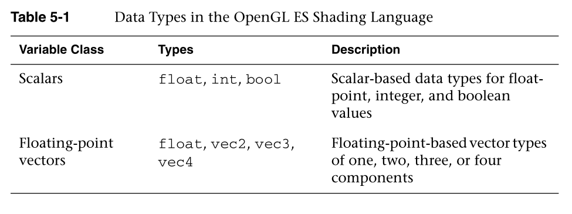
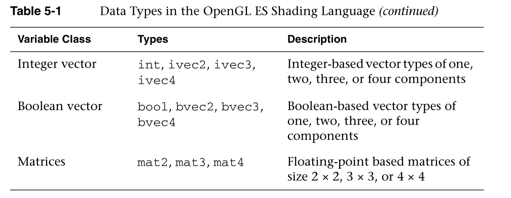

## OpenGL系统着色器语言

.OpenGL ES Shading Language

正如您在第1章“OpenGL  ES 2.0简介”、第2章“你好，三角形:OpenGL ES 2.0示例”和第4章“着色器和程序”中看到的，着色器是OpenGL ES 2.0  API的核心概念。每个OpenGL ES  2.0程序都需要一个顶点和片段着色器来渲染有意义的图片。鉴于着色器的概念在应用编程接口中的中心地位，我们希望在深入研究图形应用编程接口的更多细节之前，确保您已经掌握了编写着色器的基础知识。

As you have seen from Chapter 1, “Introduction to OpenGL ES 2.0,” Chapter 2,  “Hello, Triangle: An OpenGL ES 2.0 Example,” and Chapter 4, “Shaders and  Programs,” shaders are a fundamental concept that is at the heart of the OpenGL  ES 2.0 API. Every OpenGL ES 2.0 program requires both a vertex and fragment  shader to render a meaningful picture. Given the centrality of the concept of  shaders to the API, we want to make sure you are grounded in the fundamentals of  writing shaders before diving into more details of the graphics API.

本章的目标是确保您理解着色语言中的以下概念:

Our goal in this chapter is to make sure you understand the following concepts  in the shading language:

- 变量和变量类型

  Variables and variable typesx

- 向量和矩阵的构造和选择

  Vector and matrix construction and selection

- 常量

  Constants

- 结构和数组

  Structures and arrays

- 操作符、控制流程和功能

  Operators, control flow, and functions

- 属性、uniform和变化量

  Attributes, uniforms, and varyings

- 预处理器和指令

  Preprocessor and directives

- uniform和变化量的封装

  Uniform and varying packing

- 精度限定符和不变性

  Precision qualifiers and invariance

在第2章的Hello  Triangle示例中，您已经稍微详细地了解了其中的一些概念。现在我们将用更多的细节来填充概念，以确保您理解如何编写和读取着色器。

You were introduced to some of these concepts in a small amount of detail with  the Hello Triangle example in Chapter 2. Now we are going to fill in the  concepts with a lot more detail to make sure you understand how to write and  read shaders.

## OpenGL系统着色语言基础

OpenGL ES Shading Language Basics

当你通读这本书时，你会看到很多着色器。如果你开始开发自己的OpenGL  ES  2.0应用程序，很可能你会写很多着色器。到目前为止，您应该已经理解了着色器的基本概念，以及它如何适合流水线。如果没有，请回到第1章，我们在那里讨论了管道，并描述了顶点和片段着色器的位置。

As you read through this book, you are going to be looking at a lot of  shaders. If you ever start developing your own OpenGL ES 2.0 application,  chances are you will be writing a lot of shaders. By now, you should understand  the fundamental concepts of what a shader does and how it fits in the pipeline.  If not, please go back and review Chapter 1, where we covered the pipeline and  described where vertex and fragment shaders fit in.

我们现在想看的是着色器的具体组成。正如您可能已经观察到的，语法与C有很大的相似性。如果您能理解C代码，您可能在理解着色器的语法方面不会有太大困难。然而，从支持的本地数据类型开始，这两种语言之间肯定有一些主要差异。

What we want to look at now is what exactly makes up a shader. As you have  probably already observed, the syntax bears great similarity to C. If you can  understand C code, you likely will not have much difficulty understanding the  syntax of shaders. However, there are certainly some major differences between  the two languages, beginning with the native data types that are  supported.

## 变量和变量类型

Variables and Variable T ypes

在计算机图形学中，有两种基本的数据类型构成了变换的基础:向量和矩阵。这两种数据类型也是OpenGL  ES着色语言的核心。具体来说，表5-1描述了着色语言中存在的基于标量、矢量和矩阵的数据类型。

In computer graphics, there are two fundamental data types that form the basis  of transformations: vectors and matrices. These two data types are central to  the OpenGL ES Shading Language as well. Specifically, Table 5-1 describes the  scalar-, vector-, and matrix-based data types that exist in the shading  language.




着色语言中的变量必须用类型声明。例如，以下声明是如何声明标量、向量或矩阵的示例:

Variables in the shading language must be declared with a type. For example,  the following declarations are examples of how to declare a scalar, vector, or  matrix:

```c
float specularAtten;   // A floating-point-based scalar
vec4  vPosition;       // A floating-point-based 4-tuple vector
mat4  mViewProjection; // A 4 x 4 matrix variable declaration
ivec2 vOffset;         // An integer-based 2-tuple vector
```

变量可以在声明时或以后初始化。初始化是通过使用构造函数来完成的，构造函数也用于进行类型转换。

Variables can be initialized either at declaration time or later.  Initialization is done through the use of constructors, which are also used for  doing type conversions.

## 变量构造函数

Variable Constructors

OpenGL  ES着色语言对类型转换有非常严格的规则。也就是说，变量只能分配给其他同类型的变量或对其进行操作。为了处理类型转换，该语言中有许多可用的构造函数。您可以使用构造函数来初始化变量，并在不同类型的变量之间进行类型转换。变量可以在声明时(或稍后在着色器中)通过使用构造函数来初始化。每个内置变量类型都有一组关联的构造函数。

The OpenGL ES Shading Language has very strict rules regarding type  conversion. That is, variables can only be assigned to or operated on other  variables of the same type. To cope with type conversions, there are a number of  constructors available in the language. You can use constructors for  initializing variables and as a way of type-casting between variables of  different types. Variables can be initialized at declaration (or later in the  shader) through the use of constructors. Each of the built-in variable types has  a set of associated constructors.

让我们先来看看构造函数是如何在标量值之间进行初始化和类型转换的。

Let’s first take a look at how constructors can be used to initialize and type  cast between scalar values.

```java
float myFloat = 1.0;
bool  myBool = true;
int   myInt = 0;
myFloat = float(myBool); // Convert from bool -> float
myFloat = float(myInt);  // Convert from int -> float
myBool  = bool(myInt);   // Convert from int -> bool
```

同样，构造函数可以用来转换和初始化向量数据类型。向量构造函数的参数将被转换为与被构造的向量相同的基本类型(浮点型、整型或布尔型)。有两种基本方法可以将参数传递给向量构造函数:

Similarly, constructors can be used to convert to and initialize vector data  types. The arguments to a vector constructor will be converted to the same basic  type as the vector being constructed (float, int, or bool). There are two basic  ways to pass arguments to vector constructors:

- 如果只向向量构造函数提供一个标量参数，则该值用于设置向量的所有值。

  If only one scalar argument is provided to a vector constructor, that value is  used to set all values of the vector.

- 如果提供了多个标量或矢量参数，则使用这些参数从左到右设置矢量的值。如果提供了多个标量参数，则参数中的分量必须至少与向量中的分量一样多。

  If multiple scalar or vector arguments are provided, the values of the vector  are set from left to right using those arguments. If multiple scalar arguments  are provided, there must be at least as many components in the arguments as in  the vector.

下面显示了一些构造向量的示例:

The following shows some examples of constructing vectors:

```c
vec4 myVec4 = vec4(1.0);           // myVec4 = {1.0, 1.0, 1.0, 1.0}
vec3 myVec3 = vec3(1.0, 0.0, 0.5); // myVec3 = {1.0, 0.0, 0.5}
vec3 temp   = vec3(myVec3);        // temp = myVec3
vec2 myVec2 = vec2(myVec3);        // myVec2 = {myVec3.x, myVec3.y}
myVec4 = vec4(myVec2, temp, 0.0);  // myVec4 = {myVec2.x, myVec2.y,
                                   //           temp, 0.0 }    
```

对于矩阵构造，语言非常灵活。这些基本规则描述了如何构造矩阵:

For matrix construction, the language is very flexible. These basic rules  describe how matrices can be constructed:

- 如果只向矩阵构造函数提供一个标量参数，则该值位于矩阵的对角线上。例如，mat4(1.0)将创建一个4  × 4的单位矩阵。

  If only one scalar argument is provided to a matrix constructor, that value is  placed in the diagonal of the matrix. For example mat4(1.0) will create a 4 × 4  identity matrix.

- 矩阵可以由多个向量参数构成，例如mat2可以由两个向量构成。

  A matrix can be constructed out of multiple vector arguments, for example a  mat2 can be constructed from two vec2s.

- 一个矩阵可以由多个标量参数构成，矩阵中的每个值对应一个标量参数，从左到右消耗。

  A matrix can be constructed out of multiple scalar arguments, one for each  value in the matrix, consumed from left to right.

矩阵构造甚至比刚才陈述的基本规则更灵活，因为矩阵基本上可以由标量和向量的任何组合来构造，只要提供足够的组件来初始化矩阵。OpenGL  ES中的矩阵以列主顺序存储。使用矩阵构造函数时，将使用参数按列填充矩阵。以下示例中的注释显示了矩阵构造函数参数如何映射到列中

The matrix construction is even more flexible than the basic rules just stated  in that a matrix can basically be constructed from any combination of scalars  and vectors as long as enough components are provided to initialize the matrix.  Matrices in OpenGL ES are stored in column major order. When using a matrix  constructor, the arguments will be consumed to fill the matrix by column. The  comments in the following example show how the matrix constructor arguments will  map into columns.

```java
mat3 myMat3 = mat3(1.0, 0.0, 0.0,  // First column
                   0.0, 1.0, 0.0,  // Second column
                   0.0, 1.0, 1.0); // Third column
```

## 向量和矩阵分量

Vector and Matrix Components

向量的各个组成部分可以通过两种方式访问:要么使用“.”运算符或通过数组下标。根据组成给定矢量的分量数量，可以通过使用swizzles  {  x，y，z，w}、{r，g，b，a}或{s，t，r，q}来访问每个分量。这三种不同命名方案的原因是矢量可互换地用于表示数学矢量、颜色和纹理坐标。x、r或s分量总是指向量的第一个元素。提供不同的命名约定只是为了方便。也就是说，当访问一个向量时，不能混合命名约定(换句话说，不能做类似的事情。xgr，因为一次只能使用一种命名约定)。当使用“.”时运算符，也可以在运算中对向量的分量重新排序。下面的例子说明了如何做到这一点。

The individual components of a vector can be accessed in two ways: either  using the “.” operator or through array subscripting. Depending on the number of  components that make up a given vector, each of the components can be accessed  through the use of the swizzles {x, y, z, w}, {r, g, b, a}, or {s, t, r, q}. The  reason for the three different naming schemes is that vectors are used  interchangeably to represent mathematical vectors, colors, and texture  coordinates. The x, r, or s component will always refer to the first element of  a vector. The different naming conventions are just provided as a convenience.  That said, you cannot mix naming conventions when accessing a vector (in other  words, you cannot do something like .xgr, as you can only use one naming  convention at a time). When using the “.” operator, it is also possible to  reorder components of a vector in an operation. The following examples show how  this can be done.

```JAVA
vec3 myVec3 = vec3(0.0, 1.0, 2.0); // myVec3 = {0.0, 1.0, 2.0}
vec3 temp;
    
temp = myVec3.xyz;                 // temp = {0.0, 1.0, 2.0}
temp = myVec3.xxx;                 // temp = {0.0, 0.0, 0.0}
temp = myVec3.zyx;                 // temp = {2.0, 1.0, 0.0}
```

除了“.”运算符，也可以使用数组下标“[]”运算符来访问向量。在数组下标中，元素[0]对应x，元素[1]对应y，依此类推。不过，有一件事你需要小心，那就是如果你访问一个带有非常数积分表达式的向量(例如，使用一个整数变量索引)，那么OpenGL  ES 2.0可能不支持这种方式。原因是，对向量进行动态索引对某些硬件来说是一项困难的操作，因此OpenGL ES  2.0规范不要求支持这种行为，除非是在特定的变量类型(即统一变量)上。我们现在向您提到这一点只是为了让您意识到这个问题，但是当我们讨论着色语言的限制时，我们将在第8章“顶点着色器”中讨论这方面的全部细节。

In addition to the “.” operator, vectors can also be accessed using the array  subscript “[]” operator. In array subscripting, element [0] corresponds to x,  element [1] corresponds to y, and so forth. One thing you need to be careful of,  though, is that if you access a vector with a non-constant integral expression  (e.g., using an integer variable index), then this might not be supported in  OpenGL ES 2.0. The reason is because doing dynamic indexing on a vector turns  out to be a difficult operation for some hardware, so the OpenGL ES 2.0 spec  does not mandate support for this behavior except for on a specific variable  type (namely, uniform variables). We mention this to you now just to make you  aware of the issue, but we cover the full details on this in Chapter 8, “Vertex  Shaders,” when we discuss the limitations of the shading language.


