# 顶点属性、顶点数组和缓冲对象

Vertex Attributes, Vertex Arrays, and Buffer Objects

本章描述了在OpenGL  ES  2.0中如何指定顶点属性和数据。我们讨论什么是顶点属性，如何指定它们和它们支持的数据格式，以及如何将顶点属性索引绑定到顶点着色器中使用的适当顶点属性名称。看完这一章，你应该很好的掌握了什么是顶点属性，以及如何在OpenGL  ES 2.0中用顶点属性绘制图元。

**指定属性和数据，如何指定数据的格式，如何将顶点属性索引绑定到顶点着色器使用。**

This chapter describes how vertex attributes and data are specified in OpenGL  ES 2.0. We discuss what vertex attributes are, how to specify them and their  supported data formats, and how to bind vertex attribute indices to the  appropriate vertex attribute names used in a vertex shader. After reading this  chapter, you should have a good grasp of what vertex attributes are and how to  draw primitives with vertex attributes in OpenGL ES 2.0.

顶点数据，也称为顶点属性，指定每个顶点的数据。可以为每个顶点指定每个顶点的数据，或者可以为所有顶点使用一个常数值。例如，如果你想画一个有纯色的三角形(为了这个例子，假设颜色是黑色，如图6-1所示)，你可以指定一个常量值，该值将被三角形的所有三个顶点使用。然而，组成三角形的三个顶点的位置不会相同，因此我们需要指定一个存储三个位置值的顶点数组。

**顶点属性为每个顶点数据指定数据，可以为它们指定同一个数据，比如顶点可以使用一个数组存储多个顶点来绘制。 **

Vertex data, also referred to as vertex attributes, specify per-vertex data.  This per-vertex data can be specified for each vertex or a constant value can be  used for all vertices. For example, if you want to draw a triangle that has a  solid color (for the sake of this example say the color is black as shown in  Figure 6-1), you would specify a constant value that will be used by all three  vertices of the triangle. However, the position of the three vertices that make  up the triangle will not be the same and therefore we will need to specify a  vertex array that stores three position values.

在OpenGL  ES 1.1中，顶点属性有预定义的名称，如位置、法线、颜色和纹理坐标。这是可以接受的，因为OpenGL ES  1.1实现的固定函数管道只需要这些预定义的顶点属性。通过可编程管道，开发人员需要能够指定他们自己在顶点着色器中使用的顶点属性名称。因此，支持用户定义的(即通用的)顶点属性成为OpenGL  ES 2.0的一项要求。如果应用编程接口支持通用顶点属性，则不再需要支持预定义的顶点属性名称，因为它们可以由应用程序映射到通用顶点属性之一。

1.1有预定义的名称，2.0可以自定义名称  3.0可以在顶点熟悉中设置位置信息

**顶点属性：位置，法线，颜色纹理坐标**

In OpenGL ES 1.1, vertex attributes had predefined names such as position,  normal, color, and texture coordinates. This was acceptable because the fixed  function pipeline implemented by OpenGL ES 1.1 only required these predefined  vertex attributes. With a programmable pipeline, developers need to be able to  specify their own vertex attribute names used in vertex shaders. Support for  user-defined (i.e., generic) vertex attributes therefore became a requirement  for OpenGL ES 2.0. If generic vertex attributes are supported by the API then  there is no longer a need to support predefined vertex attribute names because  they can be mapped by the application to one of the generic vertex  attributes.

## 指定顶点属性数据

Specifying Vertex Attribute Data

如前所述，OpenGL  ES 2.0只支持通用顶点属性。属性数据可以使用顶点数组为每个顶点指定，也可以是用于图元所有顶点的常数值。

**顶点属性可以使用数组为每个顶点指定，也可以用于图元所有顶点的常数值。**

As mentioned before, only generic vertex attributes are supported by OpenGL ES  2.0. The attribute data can be specified for each vertex using a vertex array or  it can be a constant value that is used for all vertices of a  primitive.

所有OpenGL  ES  2.0实现必须支持最少八个顶点属性。应用程序可以查询特定实现支持的顶点属性的确切数量，该数量可能大于8。下面的代码描述了应用程序如何查询一个实现实际支持的顶点属性的数量。

查询open el es支持多少中属性。

All OpenGL ES 2.0 implementations must support a minimum of eight vertex  attributes. An application can query the exact number of vertex attributes that  are supported by a particular implementation, which might be greater than eight.  The following code describes how an application can query the number of vertex  attributes an implementation actually supports.

```java
GLint maxVertexAttribs;   // n will be >= 8
glGetIntegerv(GL_MAX_VERTEX_ATTRIBS, &maxVertexAttribs);
```

## 恒定顶点属性

Constant Vertex Attribute

常数顶点属性对于图元的所有顶点都是相同的，因此只需要为图元的所有顶点指定一个值。

A constant vertex attribute is the same for all vertices of a primitive, and  therefore only one value needs to be specified for all the vertices of a  primitive.

使用以下任一函数指定恒定的顶点属性值:

A constant vertex attribute value is specified using any of the following  functions:

```java
//顶点属性值设置  单个设置
void glVertexAttrib1f(GLuint index, GLfloat x);
void glVertexAttrib2f(GLuint index, GLfloat x, GLfloat y);
void glVertexAttrib3f(GLuint index, GLfloat x, GLfloat y, GLfloat z);
void glVertexAttrib4f(GLuint index, GLfloat x, GLfloat y, GLfloat z,GLfloat w);

example:
glVertexAttrib1f(1,1.0F);
// 设置常量值
void glVertexAttrib1fv(GLuint index, const GLfloat *values);
void glVertexAttrib2fv(GLuint index, const GLfloat *values);
void glVertexAttrib3fv(GLuint index, const GLfloat *values);
void glVertexAttrib4fv(GLuint index, const GLfloat *values);

example:
int []arr = new int[1];
arr [0] = 1.0F;
glVertexAttrib1f(2,arr);
```

glVertexAttrib*命令用于加载由索引指定的通用顶点属性。glVertexAttrib1f和glVertexAttrib1fv将(x，0.0，0.0，1.0)加载到通用顶点属性中。glVertexAttrib2f和glVertexAttrib2fv将(x，y，0.0，1.0)加载到通用顶点属性中。glVertexAttrib3f和glVertexAttrib3fv将(x，y，z，1.0)载入通用顶点属性。glVertexAttrib4f和glVertexAttrib4fv将(x，y，z，w)加载到通用顶点属性中。

The glVertexAttrib* commands are used to load the generic vertex attribute  specified by index. glVertexAttrib1f and glVertexAttrib1fv load (x, 0.0, 0.0,  1.0) into the generic vertex attribute. glVertexAttrib2f and glVertexAttrib2fv  load (x, y, 0.0, 1.0) into the generic vertex attribute. glVertexAttrib3f and  glVertexAttrib3fv load (x, y, z, 1.0) into the generic vertex attribute.  glVertexAttrib4f and glVertexAttrib4fv load (x, y, z, w) into the generic vertex  attribute.

出现了一个问题:OpenGL和更高版本支持将常量顶点属性数据指定为字节、无符号字节、短、无符号短、int、无符号int、float和double的函数。OpenGL  ES 2.0为什么只支持浮点数变体？这是因为不变的顶点属性没有被经常使用。因为它们的使用很少，并且因为它们很可能在内部存储为单精度浮点值，所以ES  2.0只支持浮点变量。

A question arises: OpenGL version 2.0 and higher supports functions that  specify the constant vertex attribute data as byte, unsigned byte, short,  unsigned short, int, unsigned int, float, and double. Why does OpenGL ES 2.0  only support the float variant? The reason for this is that constant vertex  attributes are not used that frequently. Because their use is infrequent, and  because they will most likely be stored as single precision floating-point  values internally, ES 2.0 only supports the float variant.

**恒定顶点通过glVertexAttribxfv传递恒定参数。**

## 顶点数组

Vertex Arrays

顶点数组指定每个顶点的属性数据，是存储在应用程序地址空间(OpenGL  ES称之为客户端空间)的缓冲区。它们为指定顶点属性数据提供了一种高效灵活的方法。顶点数组是使用glVertexAttribPointer函数指定的。

**通过顶点数组将值传递给着色器。**

Vertex arrays specify attribute data per vertex and are buffers stored in the  application’s address space (what OpenGL ES calls the client space). They  provide an efficient and flexible way for specifying vertex attribute data.  Vertex arrays are specified using the glVertexAttribPointer function.

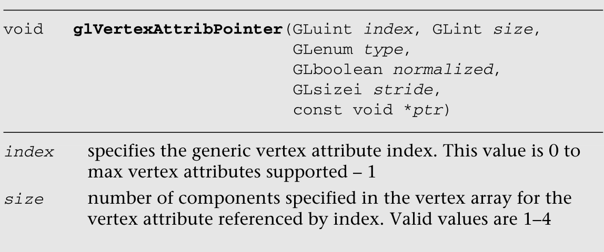

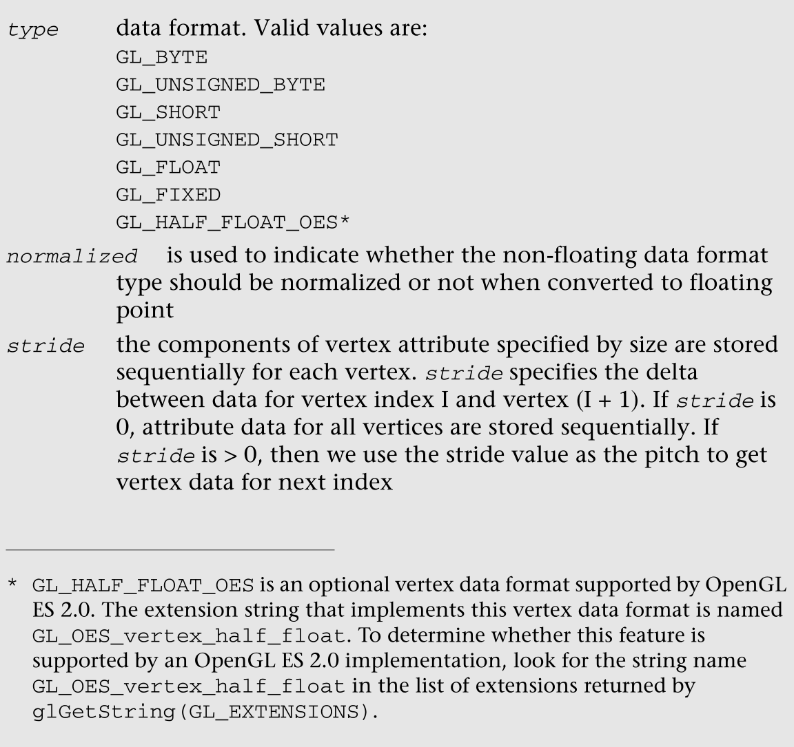


**参数：**

- 位置
- 大小
- 类型
- 是否归一化
- 跳过几个
- 数值

我们给出几个例子来说明如何用glVertexAttribPointer指定顶点属性。分配和存储顶点属性数据的常用方法有:

We present a few examples that illustrate how to specify vertex attributes  with glVertexAttribPointer. The commonly used methods for allocating and storing  vertex attribute data are:

- 将顶点属性一起存储在一个缓冲区中。这种存储顶点属性的方法称为结构数组。该结构表示一个顶点的所有属性，每个顶点有一个这些属性的数组。

  Store vertex attributes together in a single buffer. This method of storing  vertex attributes is called an array of structures. The structure represents all  attributes of a vertex and we have an array of these attributes per  vertex.

- 将每个顶点属性存储在单独的缓冲区中。这种存储顶点属性的方法称为数组结构。

  Store each vertex attribute in a separate buffer. This method of storing  vertex attributes is called structure of arrays.

假设每个顶点有四个顶点属性——位置、法线和两个纹理坐标——并且这些属性一起存储在一个为所有顶点分配的缓冲区中。顶点的属性是指定为三个浮动的向量(x，y，z)，顶点法线也指定为三个浮动的向量，每个纹理坐标指定为两个浮动的向量。图6-2给出了这个缓冲区的内存布局。

**参数传递 的方式有两种一种是将数据存储在一个数组中，还有 一种是将数据分开存储，其实将数据存储在一起的时候，需要在下一个数据设置的时候，设置一下它里面的位置，比如b.setPosition(4);**

Let us say that each vertex has four vertex attributes—position, normal, and  two texture coordinates—and that these attributes are stored together in one  buffer that is allocated for all vertices.The vertex position attribute is specified as a vector of three floats (x, y, z), the vertex normal is also  specified as a vector of three floats, and each texture coordinate is specified  as a vector of two floats. Figure 6-2 gives the memory layout of this  buffer.

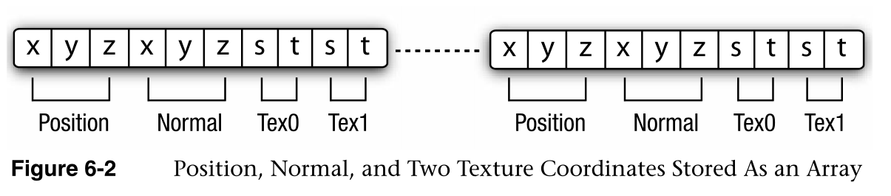


```java
Example 6-1 describes how these four vertex attributes are specified with 
glVertexAttribPointer.
Example 6-1 Array of Structures
#define VERTEX_POS_SIZE           3   // x, y and z
#define VERTEX_NORMAL_SIZE        3   // x, y and z
#define VERTEX_TEXCOORD0_SIZE     2   // s and t
#define VERTEX_TEXCOORD1_SIZE     2   // s and t
#define VERTEX_POS_INDX           0
#define VERTEX_NORMAL_INDX        1
#define VERTEX_TEXCOORD0_INDX     2
#define VERTEX_TEXCOORD1_INDX     3
// the following 4 defines are used to determine location of various
// attributes if vertex data is are stored as an array of structures
#define VERTEX_POS_OFFSET         0
#define VERTEX_NORMAL_OFFSET      3
#define VERTEX_TEXCOORD0_OFFSET   6
#define VERTEX_TEXCOORD1_OFFSET   8
#define VERTEX_ATTRIB_SIZE   VERTEX_POS_SIZE + \
                             VERTEX_NORMAL_SIZE + \
                             VERTEX_TEXCOORD0_SIZE + \
                             VERTEX_TEXCOORD1_SIZE
float *p  = malloc(numVertices * VERTEX_ATTRIB_SIZE 
                   * sizeof(float));
// position is vertex attribute 0
glVertexAttribPointer(VERTEX_POS_INDX, VERTEX_POS_SIZE, 
                      GL_FLOAT, GL_FALSE, 
                      VERTEX_ATTRIB_SIZE * sizeof(float),
                      p);
// normal is vertex attribute 1
glVertexAttribPointer(VERTEX_NORMAL_INDX, VERTEX_NORMAL_SIZE, 
                      GL_FLOAT, GL_FALSE, 
                      VERTEX_ATTRIB_SIZE * sizeof(float), 
                      (p +  VERTEX_NORMAL_OFFSET));
// texture coordinate 0 is vertex attribute 2
glVertexAttribPointer(VERTEX_TEXCOORD0_INDX, VERTEX_TEXCOORD0_SIZE,
                      GL_FLOAT, GL_FALSE, 
                      VERTEX_ATTRIB_SIZE * sizeof(float), 
                      (p +  VERTEX_TEXCOORD0_OFFSET));
// texture coordinate 1 is vertex attribute 3
glVertexAttribPointer(VERTEX_TEXCOORD1_INDX, VERTEX_TEXCOORD1_SIZE, 
                      GL_FLOAT, GL_FALSE, 
                      VERTEX_ATTRIB_SIZE * sizeof(float), 
                      (p + VERTEX_TEXCOORD1_OFFSET));
```

在接下来的示例6-2中，位置、法线和纹理坐标0和1存储在单独的缓冲区中。

In Example 6-2 that follows, position, normal, and texture coordinate 0 and 1  are stored in separate buffers.

```java
Example 6-2 Structure of Arrays
float *position  = malloc(numVertices * VERTEX_POS_SIZE * 
                          sizeof(float));
float *normal    = malloc(numVertices * VERTEX_NORMAL_SIZE * 
                          sizeof(float));
float *texcoord0 = malloc(numVertices * VERTEX_TEXCOORD0_SIZE * 
                          sizeof(float));
float *texcoord1 = malloc(numVertices * VERTEX_TEXCOORD1_SIZE * 
                          sizeof(float));
// position is vertex attribute 0
glVertexAttribPointer(VERTEX_POS_INDX, VERTEX_POS_SIZE, 
                      GL_FLOAT, GL_FALSE,
                      VERTEX_POS_SIZE * sizeof(float), position);
// normal is vertex attribute 1
glVertexAttribPointer(VERTEX_NORMAL_INDX, VERTEX_NORMAL_SIZE, 
                      GL_FLOAT, GL_FALSE, 
                      VERTEX_NORMAL_SIZE * sizeof(float), normal);
// texture coordinate 0 is vertex attribute 2
glVertexAttribPointer(VERTEX_TEXCOORD0_INDX, VERTEX_TEXCOORD0_SIZE,
                      GL_FLOAT, GL_FALSE, VERTEX_TEXCOORD0_SIZE * 
                      sizeof(float), texcoord0);
// texture coordinate 1 is vertex attribute 3
glVertexAttribPointer(VERTEX_TEXCOORD1_INDX, VERTEX_TEXCOORD1_SIZE, 
                      GL_FLOAT, GL_FALSE, 
                      VERTEX_TEXCOORD1_SIZE * sizeof(float),
                      texcoord1);
```


**性能提示**

Performance Hints

- 如何存储顶点的不同属性

  How to store different attributes of a vertex

  我们描述了存储顶点属性的两种最常见的方式——**结构数组和数组结构**。要问的问题是哪种分配方法对OpenGL  ES  2.0硬件实现最有效。答案是一系列的结构。**原因是每个顶点的属性数据可以按顺序读取，因此很可能会产生高效的内存访问模式**。使用结构数组的一个缺点是当应用程序想要修改特定的属性时。**如果顶点属性数据的子集需要修改(例如纹理坐标)，这将导致顶点缓冲区的逐行更新。当顶点缓冲区作为缓冲区对象提供时，需要重新加载整个顶点属性缓冲区**。通过将本质上是动态的顶点属性存储在单独的缓冲区中，可以避免这种低效。

  - 结构数组：将所有的数据存储在一个数组里面
  - 数组结构：将属性值分开存储。

  优缺点：结构数组很适合内存的读取方式，但是如果发生修改，就需要修改属性的子集，就需要逐行更新

  We described the two most common ways of storing vertex attributes— array of  structures and structure of arrays. The question to ask is which allocation  method would be the most efficient for OpenGL ES 2.0 hardware implementations.  The answer is array of structures. The reason is that the attribute data for  each vertex can be read in sequential fashion and so will most likely result in  an efficient memory access pattern. A disadvantage of using array of structures  is when an application wants to modify specific attributes. If a subset of  vertex attribute data needs to be modified (e.g., texture coordinates), this  will result in strided updates to the vertex buffer. When vertex buffer is  supplied as a buffer object, the entire vertex attribute buffer will need to be  reloaded. One can avoid this inefficiency by storing vertex attributes that are  dynamic in nature in a separate buffer.

- 顶点属性使用哪种数据格式

  Which data format to use for vertex attributes

  glVertexAttribPointer中类型参数指定的顶点属性数据格式不仅会影响顶点属性数据的图形内存存储要求，还会影响整体性能，这是渲染帧所需内存带宽的函数。数据占用空间越小，所需的内存带宽就越低。我们的建议是，应用程序应该尽可能使用GL_HALF_FLOAT_OES。纹理坐标、法线、副法线、切向量等等都是很好的候选对象，可以使用GL_HALF_FLOAT_OES为每个组件存储。颜色可以存储为每个顶点颜色有四个分量的GL_UNSIGNED_BYTE。我们也推荐GL_HALF_FLOAT_OES用于顶点位置，但是要认识到这在相当多的情况下是不可能的。在这种情况下，顶点位置可以存储为浮点型或固定型。

  The vertex attribute data format specified by the type argument in  glVertexAttribPointer cannot only impact the graphics memory storage  requirements for vertex attribute data, but can also impact the overall  performance, which is a function of memory bandwidth required to render the  frame(s). The smaller the data footprint, the lower the memory bandwidth  required. Our recommendation is that applications should use GL_HALF_FLOAT_OES  wherever possible. Texture coordinates, normals, binormals, tangent vectors, and  so on are good candidates to be stored using GL_HALF_FLOAT_OES for each  component. Color could be stored as GL_UNSIGNED_BYTE with four components per  vertex color. We also recommend GL_HALF_FLOAT_OES for vertex position, but  recognize that this might not be possible for quite a few cases. For such cases,  the vertex position could be stored as GL_FLOAT or GL_FIXED.

- glVertexAttribPointer中的规范化标志是如何工作的

  How the Normalized Flag in glVertexAttribPointer Works

  顶点属性在顶点着色器中使用之前，在内部存储为单精度浮点数。如果数据类型指示顶点属性不是浮点数，则顶点属性在顶点着色器中使用之前将被转换为单精度浮点数。规范化标志控制非浮动顶点属性数据到单精度浮点值的转换。如果规范化标志为假，顶点数据将直接转换为浮点值。这类似于将非浮点类型的变量转换为浮点类型。下面的代码给出了一个例子。

  Vertex attributes are internally stored as a single precision floating-point  number before they get used in a vertex shader. If the data type indicates that  the vertex attribute is not a float, then the vertex attribute will be converted  to a single precision floating-point number before it gets used in a vertex  shader. The normalized flag controls the conversion of the nonfloat vertex  attribute data to a single precision floating-point value. If the normalized  flag is false, the vertex data is converted directly to a floating-point value.  This would be similar to casting the variable that is not a float type to float.  The following code gives an example.

  ```java
  GLfloat   f;
  GLbyte    b;
  f = (GLfloat)b;  // f represents values in the range [-128.0, 127.0]
  ```

  如果规范化标志为真，如果数据类型为GL_BYTE、GL_SHORT或GL_FIXED，则顶点数据映射到[–1.0，1.0]范围，如果数据类型为GL_UNSIGNED_BYTE或GL_UNSIGNED_SHORT，则映射到[0.0，1.0]范围。

  If the normalized flag is true, the vertex data is mapped to the [–1.0, 1.0]  range if the data type is GL_BYTE, GL_SHORT or GL_FIXED or to the [0.0, 1.0]  range if the data type is GL_UNSIGNED_BYTE or GL_UNSIGNED_SHORT.

  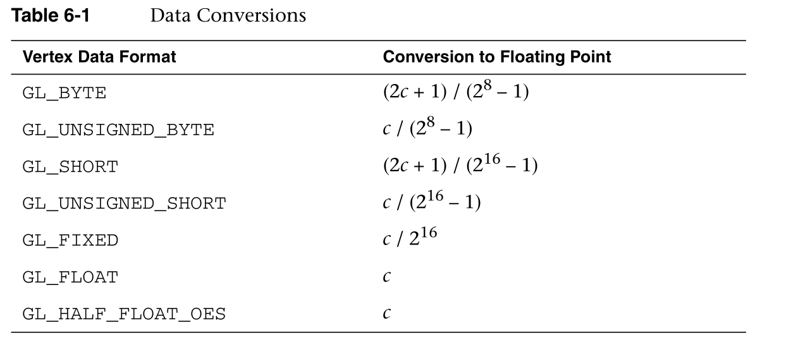

  

## 在恒定顶点属性或顶点数组之间进行选择

Selecting Between a Constant Vertex Attribute or a Vertex Array.

应用程序可以启用它是否希望OpenGL  ES使用常数数据或来自顶点数组的数据。图6-3描述了这在OpenGL ES 2.0中是如何工作的。

The application can enable whether it wants OpenGL ES to use the constant data  or data from vertex array. Figure 6-3 describes how this works in OpenGL ES  2.0.

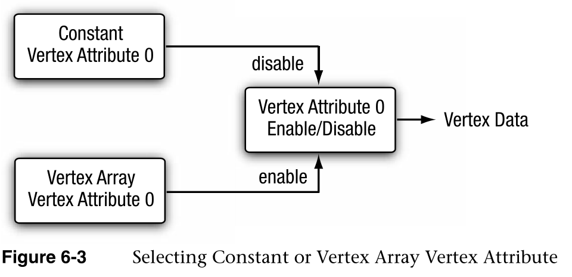

命令glEnableVertexAttribArray和glDisableVertexAttribArray用于启用和禁用通用顶点属性数组。如果对一般属性索引禁用顶点属性数组，将使用为该索引指定的恒定顶点属性数据。

设置数组的时候，我们需要执行enable，在绘制结束的时候需要执行disable

**禁用掉顶点属性数组，那么就会使用顶点属性数组。**

The commands glEnableVertexAttribArray and glDisableVertexAttribArray are used  to enable and disable a generic vertex attribute array. If the vertex attribute  array is disabled for a generic attribute index, the constant vertex attribute  data specified for that index will be used.


```c
Example 6-3 describes how to draw a triangle where one of the vertex 
attributes is constant and the other is specified using a vertex array. 
Example 6-3 Using Constant and Vertex Array Attributes
GLbyte vertexShaderSrc[] =  
      "attribute vec4 a_position;    \n"
      "attribute vec4 a_color;       \n"
      "varying vec4   v_color;       \n"
      "void main()                   \n"
      "{                             \n"
      "    v_color = a_color;        \n"
      "    gl_Position = a_position; \n"
      "}";
GLbyte fragmentShaderSrc[] =
      "varying vec4 v_color;         \n"
      "void main()                   \n"
    "{                             \n"
      "    gl_FragColor = v_color;   \n"
      "}";
GLfloat   color[4] = { 1.0f, 0.0f, 0.0f, 1.0f };
GLfloat   vertexPos[3 * 3];  // 3 vertices, with (x,y,z) per-vertex
GLuint    shaderObject[2];
GLuint    programObject;
shaderObject[0] = LoadShader(vertexShaderSrc, GL_VERTEX_SHADER);
shaderObject[1] = LoadShader(fragmentShaderSrc, GL_FRAGMENT_SHADER);
programObject = glCreateProgram();
glAttachShader(programObject, shaderObject[0]);
glAttachShader(programObject, shaderObject[1]);
//------------------------------------
glVertexAttrib4fv(0, color);
glVertexAttribPointer(1, 3, GL_FLOAT, GL_FALSE, 0, vertexPos);
glEnableVertexAttribArray(1);
//-------------------------------------
glBindAttribLocation(programObject, 0, "a_color");
glBindAttribLocation(programObject, 1, "a_position");
glLinkProgram(programObject);
glUseProgram(programObject);
glDrawArrays(GL_TRIANGLES, 0, 3);
```

代码示例中使用的顶点属性颜色是常数值，而顶点操作系统属性是使用顶点数组指定的。绘制的三角形的所有顶点的颜色值都是相同的，而绘制的三角形的顶点的顶点属性可能不同。

The vertex attribute color used in the code example is a constant value  whereas the vertexPos attribute is specified using a vertex array. The value of  color will be the same for all vertices of the triangle(s) drawn whereas the  vertexPos attribute could vary for vertices of the triangle(s) drawn.

## 在顶点着色器中声明顶点属性变量

Declaring Vertex Attribute Variables in a Vertex Shader

我们已经了解了什么是顶点属性，以及如何在OpenGL  ES中指定顶点属性。我们现在讨论如何在顶点着色器中声明顶点属性变量。

We have looked at what a vertex attribute is, and how to specify vertex  attributes in OpenGL ES. We now discuss how to declare vertex attribute  variables in a vertex shader.                                      

在顶点着色器中，使用属性限定符将变量声明为顶点属性。属性限定符只能在顶点着色器中使用。如果在片段着色器中使用了属性限定符，则在编译片段着色器时会导致错误。

In a vertex shader, a variable is declared as a vertex attribute by using the  attribute qualifier. The attribute qualifier can only be used in a vertex  shader. If the attribute qualifier is used in a fragment shader, it should  result in an error when the fragment shader is compiled.

这里给出了几个顶点属性声明的例子。 utes are given here.

```c
attribute vec4   a_position;
attribute vec2   a_texcoord;
attribute vec3   a_normal;
```

**属性限定符只能用于数据类型**float、vec2、vec3、vec4、mat2、mat3和mat4。属性变量不能声明为数组或结构。以下示例声明

The attribute qualifier can be used only with the data types float, vec2,  vec3, vec4, mat2, mat3, and mat4. Attribute variables cannot be declared as  arrays or structures. The following example declarations.

```c
attribute foo_t  a_A;   // foo_t is a structure
attribute vec4   a_B[10]; 
```

OpenGL  ES 2.0实现支持GL _ MAX _ VENTURE _ ATTRIBS vec  4顶点属性。声明为**float或vec2或vec3的顶点属性将被视为一个vec4属性**。声明为mat2、mat3或mat4的顶点属性将分别计为两个、三个或四个vec4属性。不同于由编译器自动打包的统一变量和可变变量，属性不会被打包。每个组件由实现内部存储为32位单精度浮点值。当声明尺寸小于vec4的顶点属性时，请仔细考虑，因为**可用顶点属性的最大数量是有限的资源**。最好将它们打包成一个vec4属性，而不是在顶点着色器中将它们声明为单独的顶点属性。

An OpenGL ES 2.0 implementation supports GL_MAX_VERTEX_ATTRIBS vec4 vertex  attributes. A vertex attribute that is declared as a float or vec2 or vec3 will  count as one vec4 attribute. Vertex attributes declared as mat2, mat3, or mat4  will count as two, three, or four vec4 attributes, respectively. Unlike uniform  and varying variables, which get packed automatically by the compiler,  attributes do not get packed. Each component is stored internally by the  implementation as a 32-bit single precision floating-point value. Please  consider carefully when declaring vertex attributes with sizes less than vec4,  as the maximum number of vertex attributes available is a limited resource. It  might be better to pack them together into one vec4 attribute instead of  declaring them as individual vertex attributes in the vertex shader.

在顶点着色器中声明为顶点属性的变量是只读变量，不能修改。下面的代码应该会导致编译错误。

Variables declared as vertex attributes in a vertex shader are read-only  variables and cannot be modified. The following code should cause a compilation  error.

```c
attribute vec4   a_pos;
uniform   vec4   u_v;
void main()
{
   a_pos = u_v; <--- cannot assign to a_pos as it is read-only
}
```

**补充，可以理解为常量**final

一个属性可以在顶点着色器中声明，但是如果它没有被使用，那么它就不被认为是活动的，并且不计算在内。如果顶点着色器中使用的属性数量大于GL_MAX_VERTEX_ATTRIBS，顶点着色器将无法链接。

An attribute can be declared inside a vertex shader but if it is not used then  it is not considered active and does not count against the limit. If the number  of attributes used in a vertex shader is greater than GL_MAX_VERTEX_ATTRIBS, the  vertex shader will fail to link.

一旦一个程序被成功链接，我们需要找出附加到它的顶点着色器所使用的活动顶点属性的数量

Once a program has been successfully linked, we need to find out the number of  active vertex attributes used by the vertex shader attached to this program,wo followers line of code destribes how to get the number of actives vertex attributes.

```java
glGetProgramiv(progam, GL_ACTIVE_ATTRIBUTES, &numActiveAttribs);
```

glGetProgamiv的详细描述在第4章“着色器和程序”中给出

A detailed description of glGetProgamiv is given in Chapter 4, “Shaders and  Programs.”

程序使用的活动顶点属性列表及其数据类型可以使用glGetActiveAttrib命令进行查询。

The list of active vertex attributes used by a program and their data types  can be queried using the glGetActiveAttrib command.

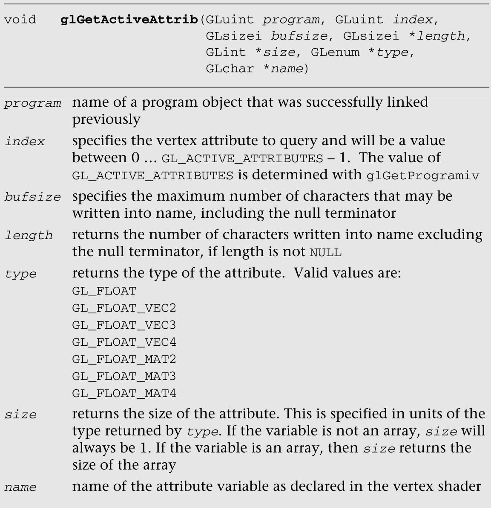

```c
void GlGetActiveAttribb(Gluint program，GLuint index，GLsizei bufsize，GLsizei *length，GLint * size，GLenum *type，GLchar *name)
```

- 以前成功链接的程序对象的名称索引指定

  name of a program object that was successfully linked previously index .

- 指定要查询的顶点属性，其值介于0…GL  _ ACTIVE _ ATTRIBUTES–1之间。GL_ACTIVE_ATTRIBUTES的值由glGetProgramiv确定

  specifies the vertex attribute to query and will be a value between 0 …  GL_ACTIVE_ATTRIBUTES – 1. The value of GL_ACTIVE_ATTRIBUTES is determined with  glGetProgramiv

- 指定可以写入名称的最大字符数，包括空终止符

  specifies the maximum number of characters that may be written into name,  including the null terminator

- 如果长度不为空，则返回写入名称的字符数，不包括空终止符

  returns the number of characters written into name excluding the null  terminator, if length is not NULL

- 返回属性的类型。有效值包括:

  returns the type of the attribute. Valid values are:

  ```java
  GL_FLOAT
  GL_FLOAT_VEC2
  GL_FLOAT_VEC3
  GL_FLOAT_VEC4
  GL_FLOAT_MAT2
  GL_FLOAT_MAT3
  GL_FLOAT_MAT4
  ```

- 返回属性的大小。这是以类型返回的类型为单位指定的。如果变量不是数组，大小将始终为1。如果变量是一个数组，那么size返回数组的大小

  returns the size of the attribute. This is specified in units of the type  returned by type. If the variable is not an array, size will always be 1. If the  variable is an array, then size returns the size of the array

- 顶点着色器中声明的属性变量的名称

  name of the attribute variable as declared in the vertex shader

glGetActiveAttrib调用提供了有关索引所选属性的信息。如上所述，索引必须是介于0和GL  _ ACTIVE _  ATTRIBUTES–1之间的值。GL_ACTIVE_ATTRIBUTES的值是使用glGetProgramiv查询的。索引0选择第一个活动属性，索引GL _  ACTIVE _ ATTRIBUTES–1选择最后一个顶点属性。

The glGetActiveAttrib call provides information about the attribute selected  by index. As described above, index must be a value between 0 and  GL_ACTIVE_ATTRIBUTES – 1. The value of GL_ACTIVE_ATTRIBUTES is queried using  glGetProgramiv. An index of 0 selects the first active attributes and an index  of GL_ACTIVE_ATTRIBUTES – 1 selects the last vertex attribute.

## 在顶点着色器中将顶点属性绑定到属性变量

Binding Vertex Attributes to Attribute Variables in a Vertex Shader

我们讨论了在顶点着色器中，顶点属性变量由属性限定符指定，活动属性的数量可以使用glGetProgamiv查询，程序中的活动属性列表可以使用GlGetActiveAttribute查询。

我们还描述了范围从0到(GL  _ MAX _ VERTEX _  ATTRIBS–1)的通用属性索引用于启用通用顶点属性，并使用glVertexAttrib*和glVertexAttribPointer命令指定常数或每个顶点(即顶点数组)的值。

现在我们描述如何将这个通用属性索引映射到顶点着色器中声明的适当属性变量。该映射将允许适当的顶点数据被读入顶点着色器中正确的顶点属性变量。

**顶点着色器中，顶点属性由属性限定符指定，程序中活动的属性可以使用GLGetActiveAttribute查询。我们通过方法将属性值给属性限定符**属性限定符就是一个属性的映射，给限定符就类似于给属性值。

We discussed that in a vertex shader, vertex attribute variables are specified  by the attribute qualifier, the number of active attributes can be queried using  glGetProgamiv and the list of active attributes in a program can be queried  using glGetActiveAttrib. We also described that generic attribute indices that  range from 0 to (GL_MAX_VERTEX_ATTRIBS – 1) are used to enable a generic vertex  attribute and specify a constant or per-vertex (i.e., vertex array) value using  the glVertexAttrib* and glVertexAttribPointer commands. Now we describe how to  map this generic attribute index to the appropriate attribute variable declared  in the vertex shader. This mapping will allow appropriate vertex data to be read  into the correct vertex attribute variable in the vertex shader.

图6-4描述了如何在顶点着色器中指定通用顶点属性并将其绑定到属性名。

Figure 6-4 describes how generic vertex attributes are specified and bound to  attribute names in a vertex shader.

OpenGL  ES 2.0有两种方法可以将通用顶点属性索引映射到顶点着色器中的属性变量名。这些方法可以分类如下:

**两种方法将顶点属性索引映射到顶点着色器的属性变量名**

There are two approaches that OpenGL ES 2.0 enables to map a generic vertex  attribute index to an attribute variable name in the vertex shader. These  approaches can be categorized as follows:

- OpenGL  ES 2.0将把通用顶点属性索引绑定到属性名上。

  OpenGL ES 2.0 will bind the generic vertex attribute index to the attribute  name.

- 应用程序可以将顶点属性索引绑定到属性名。

  The application can bind the vertex attribute index to an attribute  name.

**通用属性绑定   顶点属性绑定**

glBindAttribLocation命令可用于将通用顶点属性索引绑定到顶点着色器中的属性变量。该绑定在程序下次链接时生效。它不会更改当前链接程序使用的绑定。（索引绑定属性名）

The glBindAttribLocation command can be used to bind a generic vertex  attribute index to an attribute variable in a vertex shader. This binding takes  effect when the program is linked the next time. It does not change the bindings  used by the currently linked program.

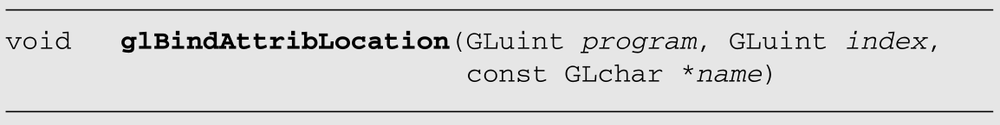

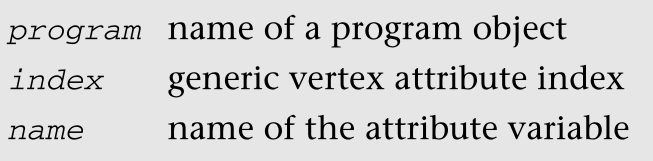

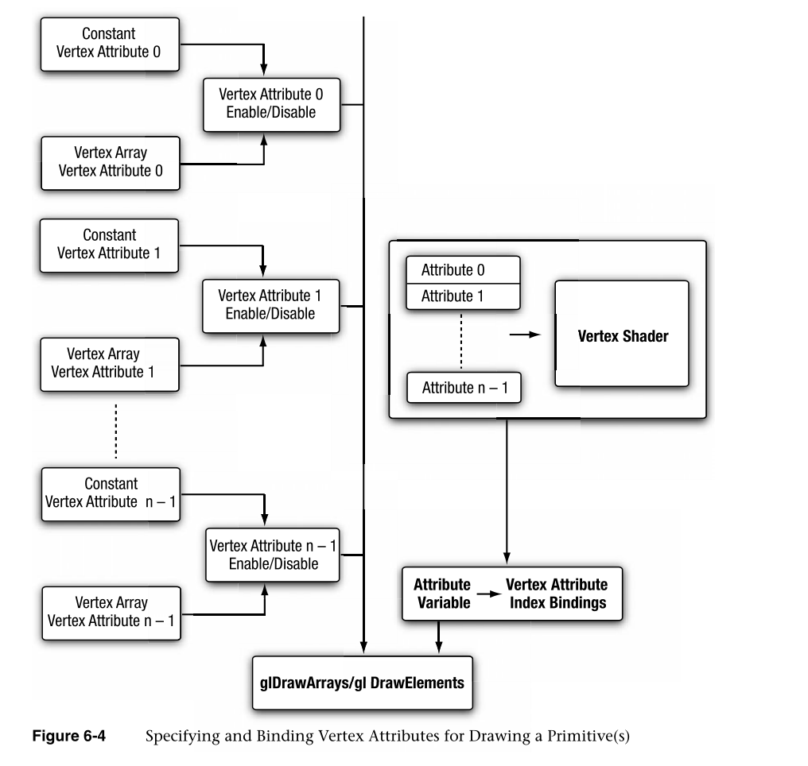

如果名称以前绑定过，则其分配的绑定将**替换为索引**。甚至在顶点着色器附加到程序对象之前，就可以调用glBindAttribLocation。这意味着这个调用可以用来绑定任何属性名。附加到程序对象的顶点着色器中不存在或不活动的属性名将被忽略。

**已经存在就覆盖，不存在就忽略**

If name was bound previously, its assigned binding is replaced with an index.  glBindAttribLocation can be called even before a vertex shader is attached to a  program object. This means that this call can be used to bind any attribute  name. Attribute names that do not exist or are not active in a vertex shader  attached to the program object are ignored.

另一个选项是让OpenGL  ES 2.0将属性变量名绑定到一个通用的顶点属性索引。该绑定在程序链接时执行。在链接阶段，OpenGL ES 2.0实现对每个属性变量执行以下操作:

The other option is to let OpenGL ES 2.0 bind the attribute variable name to a  generic vertex attribute index. This binding is performed when the program is  linked. In the linking phase, the OpenGL ES 2.0 implementation performs the  following operation for each attribute variable:

对于每个属性变量，检查是否已经通过glBindAttribLocation指定了绑定。如果指定了绑定，则使用指定的适当属性索引。如果没有，实现将分配一个通用顶点属性索引。（**属性索引  如没有  就分配**）

For each attribute variable, check if a binding has been specified via  glBindAttribLocation. If a binding is specified, the appropriate attribute index  specified is used. If not, the implementation will assign a generic vertex  attribute index。

这种分配是特定于实现的，并且可能因OpenGL  ES 2.0的实现而异。应用程序可以通过使用glGetAttribLocation命令来查询分配的绑定。

This assignment is implementation specific and can vary from one OpenGL ES 2.0  implementation to another. An application can query the assigned binding by  using the glGetAttribLocation command.

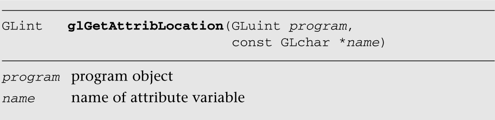

当程序定义的程序对象最后一次链接时，glGetAttribLocation返回绑定到属性变量名的通用属性索引。如果名称不是活动的属性变量，或者如果程序不是有效的程序对象或链接不成功，则返回–1，表示无效的属性索引。

glGetAttribLocation returns the generic attribute index bound to attribute  variable name when the program object defined by program was last linked. If  name is not an active attribute variable, or if program is not a valid program  object or was not linked successfully, then –1 is returned, indicating an  invalid attribute index.

## 顶点缓冲对象

Vertex Buffer Objects

使用顶点数组指定的顶点数据存储在客户端内存中。当调用glDrawArrays或glDrawElements时，这些数据必须从客户端内存复制到图形内存。这两个命令在第7章“图元装配和光栅化”中有详细描述然而，如果我们不必在每次绘图调用时复制顶点数据GLoGetAttriblocation(Gluint程序，const  GLchar *  name)程序对象名称属性变量名称116第6章:顶点属性、顶点数组和缓冲对象，而是**将数据缓存在图形内存中**，那就更好了。这可以显著提高渲染性能，并额外降低内存带宽和功耗要求，这两者对于手持设备都非常重要。这是顶点缓冲对象可以提供帮助的地方。顶点缓冲区对象允许OpenGL  ES  2.0应用程序在高性能图形内存中分配和缓存顶点数据，并从该内存中进行渲染，从而避免每次绘制图元时重新发送数据。不仅顶点数据，甚至描述图元顶点索引并作为参数传递给glDrawElements的元素索引也可以缓存。

The vertex data specified using vertex arrays is stored in client memory. This  data has to be copied from client memory to graphics memory when a call to  glDrawArrays or glDrawElements is made. These two commands are described in  detail in Chapter 7, “Primitive Assembly and Rasterization.” It would, however,  be much better if we did not have to copy the vertex data GLint  glGetAttribLocation(GLuint program, const GLchar *name) program program object  name name of attribute variable 116 Chapter 6: Vertex Attributes, Vertex Arrays,  and Buffer Objects on every draw call and instead cache the data in graphics  memory. This can significantly improve the rendering performance and  additionally reduce the memory bandwidth and power consumption requirements,  both of which are quite important for handheld devices. This is where vertex  buffer objects can help. Vertex buffer objects allow OpenGL ES 2.0 applications  to allocate and cache vertex data in high-performance graphics memory and render  from this memory, thus avoiding resending data every time a primitive is drawn.  Not only the vertex data, but even the element indices that describe the vertex  indices of the primitive and are passed as an argument to glDrawElements can  also be cached.

OpenGL  ES支持两种类型的缓冲对象:**数组缓冲对象和元素数组缓冲对象**。

- GL_ARRAY_BUFFER标记指定的数组缓冲区对象用于创建存储顶点数据的缓冲区对象
- GL_ELEMENT_ARRAY_BUFFER标记指定的元素数组缓冲区对象用于创建缓冲区对象，该对象将存储基元的索引。

There are two types of buffer objects supported by OpenGL ES: array buffer  objects and element array buffer objects. The array buffer objects specified by  the GL_ARRAY_BUFFER token are used to create buffer objects that will store  vertex data. The element array buffer objects specified by the  GL_ELEMENT_ARRAY_BUFFER token are used to create buffer objects that will store  indices of a primitive.

**注意**:为了获得最佳性能，我们建议OpenGL  ES 2.0应用程序尽可能使用顶点缓冲对象来存储顶点属性数据和元素索引。

Note: To get best performance, we recommend that OpenGL ES 2.0 applications  use vertex buffer objects for vertex attribute data and element indices wherever  possible.

在我们可以使用缓冲对象渲染之前，我们需要分配缓冲对象，并将顶点数据和元素索引上传到适当的缓冲对象中。示例6-4中的示例代码证明了这一点。

Before we can render using buffer objects, we need to allocate the buffer  objects and upload the vertex data and element indices into appropriate buffer  objects. This is demonstrated by the sample code in Example 6-4.

```java
void   initVertexBufferObjects(vertex_t *vertexBuffer,
                               GLushort *indices,
                               GLuint numVertices, GLuint numIndices
                               GLuint *vboIds)
{
    glGenBuffers(2, vboIds);
    glBindBuffer(GL_ARRAY_BUFFER, vboIds[0]);
    glBufferData(GL_ARRAY_BUFFER, numVertices * sizeof(vertex_t), 
                 vertexBuffer, GL_STATIC_DRAW);
    // bind buffer object for element indices
    glBindBuffer(GL_ELEMENT_ARRAY_BUFFER, vboIds[1]);
    glBufferData(GL_ELEMENT_ARRAY_BUFFER, 
                 numIndices * sizeof(GLushort),indices, 
                 GL_STATIC_DRAW);
}
```

示例6-4中描述的代码创建了两个缓冲对象:一个缓冲对象用于存储实际的顶点属性数据，另一个缓冲对象用于存储构成图元的元素索引。在本例中，调用glGenBuffers命令来获取vboIds中两个未使用的缓冲区对象名称。vboIds中返回的未使用的缓冲区对象名称随后用于创建数组缓冲区对象和元素数组缓冲区对象。数组缓冲区对象用于存储一个或多个图元的顶点的顶点属性数据。元素数组缓冲区对象存储图元的索引。实际的数组或元素数据是使用glBufferData指定的。请注意作为参数传递给glBufferData的GL_STATIC_DRAW。这用于描述应用程序如何访问缓冲区，这将在本节后面描述。

The code described in Example 6-4 creates two buffer objects: a buffer object  to store the actual vertex attribute data, and a buffer object to store the  element indices that make up the primitive. In this example, the glGenBuffers  command is called to get two unused buffer object names in vboIds. The unused  buffer object names returned in vboIds are then used to create an array buffer  object and an element array buffer object. The array buffer object is used to  store vertex attribute data for vertices of one or more primitives. The element  array buffer object stores the indices of a primitive(s). The actual array or  element data is specified using glBufferData. Note the GL_STATIC_DRAW that is  passed as an argument to glBufferData. This is used to describe how the buffer  is accessed by the application and will be described later in this  section.

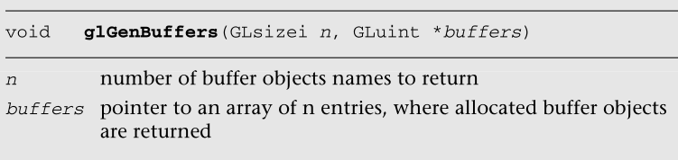


glGenBuffers分配n个缓冲区对象名，并在缓冲区中返回它们。glGenBuffers返回的缓冲区对象名称是0以外的无符号整数。值0由OpenGL  ES保留，不引用缓冲对象。试图修改或查询缓冲区对象0的缓冲区对象状态的应用程序将生成适当的错误。

glGenBuffers assigns n buffer object names and returns them in buffers. The  buffer object names returned by glGenBuffers are unsigned integer numbers other  than 0. The value 0 is reserved by OpenGL ES and does not refer to a buffer  object. Applications trying to modify or query buffer object state for buffer  object 0 will generate an appropriate error.

glBindBuffer命令用于使缓冲区对象成为当前数组缓冲区对象或当前元素数组缓冲区对象。第一次通过调用glBindBuffer来绑定缓冲区对象名称时，缓冲区对象将被分配适当的默认状态，如果分配成功，此分配的对象将被绑定为渲染上下文的当前数组缓冲区对象或当前元素数组缓冲区对象。

The glBindBuffer command is used to make a buffer object the current array  buffer object or the current element array buffer object. The first time a  buffer object name is bound by calling glBindBuffer, the buffer object is  allocated with appropriate default state, and if the allocation is successful,  this allocated object is bound as the current array buffer object or the current  element array buffer object for the rendering context.

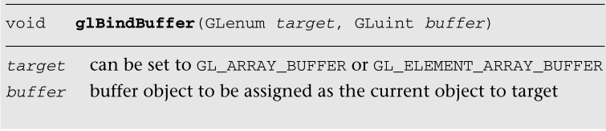


请注意，在使用glBindBuffer绑定之前，glGenBuffers不需要分配缓冲区对象名称。应用程序可以为glBindBuffer指定一个未使用的缓冲区对象名。但是，我们确实建议OpenGL  ES应用程序调用glGenBuffers，并使用glGenBuffers返回的缓冲区对象名称，而不是指定它们自己的缓冲区对象名称。

Note that glGenBuffers is not required to assign a buffer object name before  it is bound using glBindBuffer. An application can specify an unused buffer  object name to glBindBuffer. However, we do recommend that OpenGL ES  applications call glGenBuffers and use buffer object names returned by  glGenBuffers instead of specifying their own buffer object names.

与缓冲区对象相关联的状态可以分类如下:

The state associated with a buffer object can be categorized as  follows:

- GL_BUFFER_SIZE。这是指由glBufferData指定的缓冲区对象数据的大小。首次使用glBindBuffer绑定缓冲区对象时的初始值为零。

  GL_BUFFER_SIZE. This refers to the size of the buffer object data that is  specified by glBufferData. The initial value when the buffer object is first  bound using glBindBuffer is zero.

- GL_BUFFER_USAGE。这是一个关于应用程序如何使用存储在缓冲区对象中的数据的提示。这在表6-2中有详细描述。初始值是GL_STATIC_DRAW。

  GL_BUFFER_USAGE. This is a hint as to how the application is going to use the  data stored in the buffer object. This is described in detail in Table 6-2. The  initial value is GL_STATIC_DRAW.

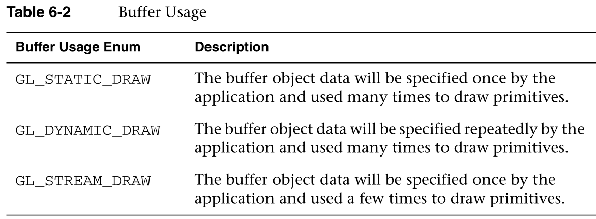


前面提到过，GL_BUFFER_USAGE是给OpenGL  ES的提示，不是保证。因此，应用程序可以分配一个使用设置为GL_STATIC_DRAW的缓冲对象数据存储，并经常修改它。

As mentioned earlier, GL_BUFFER_USAGE is a hint to OpenGL ES and not a  guarantee. Therefore, an application could allocate a buffer object data store  with usage set to GL_STATIC_DRAW and frequently modify it.

注意:OpenGL支持的GL_STATIC_READ、GL_STATIC_COPY、GL_DYNAMIC_READ、GL_DYNAMIC_COPY、GL_STREAM_READ、GL_STREAM_COPY枚举不是OpenGL  ES定义的。这是因为这些枚举意味着数据存储内容将通过从GL中读取数据来指定。OpenGL允许应用程序读取顶点缓冲存储器的内容，但是OpenGL  ES中缺少这些API调用。由于OpenGL ES中没有读取缓冲区数据的机制，这些枚举不再有效，因此不受支持。

Note: The GL_STATIC_READ, GL_STATIC_COPY, GL_DYNAMIC_READ, GL_DYNAMIC_COPY,  GL_STREAM_READ, and GL_STREAM_COPY enums supported by OpenGL are not defined by  OpenGL ES. This is because these enums imply that the data store contents will  be specified by reading data from the GL. OpenGL allows applications to read the  contents of the vertex buffer storage but these API calls are missing from  OpenGL ES. As there is no mechanism to read buffer data in OpenGL ES, these  enums are no longer valid and are therefore not supported.

顶点数组数据或元素数组数据存储是使用glBufferData命令创建和初始化的。

The vertex array data or element array data storage is created and initialized  using the glBufferData command.

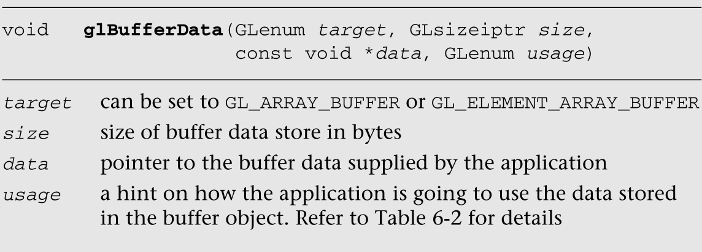

glBufferData将根据大小值保留适当的数据存储。数据参数可以是空值，表示保留的数据存储仍未初始化。如果数据是有效的指针，那么数据的内容被复制到分配的数据存储中。缓冲区对象数据存储的内容可以使用glBufferSubData命令进行初始化或更新。

glBufferData will reserve appropriate data storage based on the value of size.  The data argument can be a NULL value indicating that the reserved data store  remains uninitialized. If data is a valid pointer, then contents of data are  copied to the allocated data store. The contents of the buffer object data store  can be initialized or updated using the glBufferSubData command.

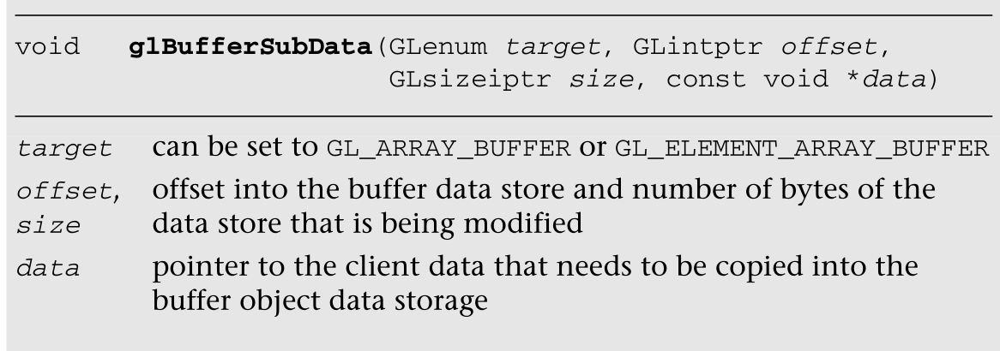


使用glBufferData或glBufferSubData初始化或更新缓冲区对象数据存储后，不再需要客户端数据存储，可以将其释放。对于静态几何，应用程序可以释放客户端数据存储，并减少应用程序消耗的整体系统内存。这对于动态几何可能是不可能的。

After the buffer object data store has been initialized or updated using  glBufferData or glBufferSubData, the client data store is no longer needed and  can be released. For static geometry, applications can free the client data  store and reduce the overall system memory consumed by the application. This  might not be possible for dynamic geometry.

我们现在来看看有无缓冲对象的图元。示例6-5描述了带有和不带有顶点缓冲对象的图元。请注意，设置顶点属性的代码非常相似。

We now look at drawing primitives with and without buffer objects. Example 6-5  describes drawing primitives with and without vertex buffer objects. Notice that  the code to set up vertex attributes is very similar.

例如，我们对顶点的所有属性使用相同的缓冲对象。当使用GL_ARRAY_BUFFER缓冲区对象时，glVertexAttribPointer中的指针参数从指向实际数据的指针变为使用glBufferData分配的顶点缓冲区存储中的字节偏移量。同样，如果使用了有效的GL_ELEMENT_ARRAY_BUFFER对象，glDrawElements中的indexes参数将从指向实际元素索引的指针变为使用glBufferData分配的元素索引缓冲存储的字节偏移量。

example, we use the same buffer object for all attributes of a vertex. When a  GL_ARRAY_BUFFER buffer object is used, the pointer argument in  glVertexAttribPointer changes from being a pointer to the actual data to being  an offset in bytes into the vertex buffer store allocated using glBufferData.  Similarly if a valid GL_ELEMENT_ARRAY_BUFFER object is used, the indices  argument in glDrawElements changes from being a pointer to the actual element  indices to being an offset in bytes to the element index buffer store allocated  using glBufferData.

```java
Example 6-5 Drawing with and without Vertex Buffer Objects
#define VERTEX_POS_SIZE         3   // x, y and z
#define VERTEX_NORMAL_SIZE      3   // x, y and z
#define VERTEX_TEXCOORD0_SIZE   2   // s and t
#define VERTEX_POS_INDX         0
#define VERTEX_NORMAL_INDX      1
#define VERTEX_TEXCOORD0_INDX   2
//
// vertices   – pointer to a buffer that contains vertex attribute 
                data
// vtxStride  – stride of attribute data / vertex in bytes
// numIndices – number of indices that make up primitive 
//              drawn as triangles
// indices    - pointer to element index buffer.
//
void   drawPrimitiveWithoutVBOs(GLfloat *vertices, GLint vtxStride,
                                GLint numIndices, GLushort *indices)
{
    GLfloat   *vtxBuf = vertices;
    glBindBuffer(GL_ARRAY_BUFFER, 0);
    glBindBuffer(GL_ELEMENT_ARRAY_BUFFER, 0);
    glEnableVertexAttribArray(VERTEX_POS_INDX);
    glEnableVertexAttribArray(VERTEX_NORMAL_INDX); 
    glEnableVertexAttribArray{VERTEX_TEXCOORD0_INDX);
    glVertexAttribPointer(VERTEX_POS_INDX, VERTEX_POS_SIZE, 
                          GL_FLOAT, GL_FALSE, vtxStride, vtxBuf);
    vtxBuf += VERTEX_POS_SIZE;
    glVertexAttribPointer(VERTEX_NORMAL_INDX, VERTEX_NORMAL_SIZE, 
                          GL_FLOAT, GL_FALSE, vtxStride, vtxBuf);
    vtxBuf += VERTEX_NORMAL_SIZE;
                              glVertexAttribPointer(VERTEX_TEXCOORD0_INDX,
                          VERTEX_TEXCOORD0_SIZE, GL_FLOAT, 
                          GL_FALSE, vtxStride, vtxBuf);
    glBindAttribLocation(program, VERTEX_POS_INDX, "v_position");
    glBindAttribLocation(program, VERTEX_NORMAL_INDX, "v_normal");
    glBindAttribLocation(program, VERTEX_TEXCOORD0_INDX, 
                         "v_texcoord");
    glDrawElements(GL_TRIANGLES, numIndices, GL_UNSIGNED_SHORT, 
                   indices);
}
void   drawPrimitiveWithVBOs(GLint numVertices, GLfloat *vtxBuf, 
                             GLint vtxStride, GLint numIndices, 
                             GLushort *indices)
{
    GLuint   offset = 0;
    GLuint   vboIds[2];
    // vboIds[0] – used to store vertex attribute data
    // vboIds[1] – used to store element indices
    glGenBuffers(2, vboIds);
    glBindBuffer(GL_ARRAY_BUFFER, vboIds[0]);
    glBufferData(GL_ARRAY_BUFFER, vtxStride * numVertices, 
                 vtxBuf, GL_STATIC_DRAW);
    glBindBuffer(GL_ELEMENT_ARRAY_BUFFER, vboIds[1]);
    glBufferData(GL_ELEMENT_ARRAY_BUFFER, 
                 sizeof(GLushort) * numIndices, 
                 indices, GL_STATIC_DRAW);
    glEnableVertexAttribArray(VERTEX_POS_INDX);
    glEnableVertexAttribArray(VERTEX_NORMAL_INDX); 
    glEnableVertexAttribArray{VERTEX_TEXCOORD0_INDX);
    glVertexAttribPointer(VERTEX_POS_INDX, VERTEX_POS_SIZE, 
                          GL_FLOAT, GL_FALSE, vtxStride, 
                          (const void*)offset);
    offset += VERTEX_POS_SIZE * sizeof(GLfloat);
    glVertexAttribPointer(VERTEX_NORMAL_INDX, VERTEX_NORMAL_SIZE, 
                          GL_FLOAT, GL_FALSE, vtxStride, 
                          (const void*)offset);
    offset += VERTEX_NORMAL_SIZE * sizeof(GLfloat);
    glVertexAttribPointer(VERTEX_TEXCOORD0_INDX,   
                          VERTEX_TEXCOORD0_SIZE,
                          GL_FLOAT, GL_FALSE, vtxStride, 
                          (const void*)offset);
                              glBindAttribLocation(program, VERTEX_POS_INDX, "v_position");
    glBindAttribLocation(program, VERTEX_NORMAL_INDX, "v_normal");
    glBindAttribLocation(program, VERTEX_TEXCOORD0_INDX, 
                         "v_texcoord");
    glDrawElements(GL_TRIANGLES, numIndices, GL_UNSIGNED_SHORT, 0);
    glDeleteBuffers(2, vboIds);
}
```


在示例6-5中，我们使用一个缓冲对象来存储所有顶点数据。这表示示例6-1中描述的存储顶点属性的结构数组方法。每个顶点属性也可以有一个缓冲对象。这将是示例6-2中描述的存储顶点属性的数组结构方法。示例6-6描述了drawPrimitiveWithVBOs如何为每个顶点属性使用单独的缓冲对象。

In Example 6-5, we used one buffer object to store all the vertex data. This  represents the array of structures method of storing vertex attributes described  in Example 6-1. It is also possible to have a buffer object for each vertex  attribute. This would be the structure of arrays method of storing vertex  attributes described in Example 6-2. Example 6-6 describes how  drawPrimitiveWithVBOs would look with a separate buffer object for each vertex  attribute.

```java
Example 6-6 Drawing with a Buffer Object per Attribute
#define VERTEX_POS_SIZE         3   // x, y and z
#define VERTEX_NORMAL_SIZE      3   // x, y and z
#define VERTEX_TEXCOORD0_SIZE   2   // s and t
#define VERTEX_POS_INDX         0
#define VERTEX_NORMAL_INDX      1
#define VERTEX_TEXCOORD0_INDX   2
//
// numVertices – number of vertices
// vtxBuf – an array of pointers describing attribute data
// vtxStrides – an array of stride values for each attribute
// numIndices – number of element indices of primitive
// indices – actual element index buffer
//
void   drawPrimitiveWithVBOs(GLint numVertices, 
                             GLfloat **vtxBuf, GLint *vtxStrides, 
                             GLint numIndices, GLushort *indices)
{
    GLuint   vboIds[4];
    // vboIds[0] – used to store vertex position
    // vboIds[1] – used to store vertex normal
    // vboIds[2] – used to store vertex texture coordinate 0
     // vboIds[3] – used to store element indices
    glGenBuffers(4, vboIds);
    glBindBuffer(GL_ARRAY_BUFFER, vboIds[0]);
    glBufferData(GL_ARRAY_BUFFER, vtxStrides[0] * numVertices, 
                 vtxBuf[0], GL_STATIC_DRAW);
    glBindBuffer(GL_ARRAY_BUFFER, vboIds[1]);
    glBufferData(GL_ARRAY_BUFFER, vtxStrides[1] * numVertices, 
                 vtxBuf[1], GL_STATIC_DRAW);
    glBindBuffer(GL_ARRAY_BUFFER, vboIds[2]);
    glBufferData(GL_ARRAY_BUFFER, vtxStrides[2] * numVertices, 
                 vtxBuf[2], GL_STATIC_DRAW);
    glBindBuffer(GL_ELEMENT_ARRAY_BUFFER, vboIds[3]);
    glBufferData(GL_ELEMENT_ARRAY_BUFFER, 
                 sizeof(GLushort) * numIndices, 
                 indices, GL_STATIC_DRAW);
    glBindBuffer(GL_ARRAY_BUFFER, vboIds[0]);
    glEnableVertexAttribArray(VERTEX_POS_INDX);
    glBindBuffer(GL_ARRAY_BUFFER, vboIds[1]);
    glEnableVertexAttribArray(VERTEX_NORMAL_INDX); 
    glBindBuffer(GL_ARRAY_BUFFER, vboIds[2]);
    glEnableVertexAttribArray{VERTEX_TEXCOORD0_INDX);
    glVertexAttribPointer(VERTEX_POS_INDX, VERTEX_POS_SIZE, 
                          GL_FLOAT, GL_FALSE, vtxStrides[0], 0);
    glVertexAttribPointer(VERTEX_NORMAL_INDX, VERTEX_NORMAL_SIZE,
                          GL_FLOAT, GL_FALSE, vtxStrides[1], 0);
    glVertexAttribPointer(VERTEX_TEXCOORD0_INDX,
                          VERTEX_TEXCOORD0_SIZE,
                          GL_FLOAT, GL_FALSE, vtxStrides[2], 0);
    glBindAttribLocation(program, VERTEX_POS_INDX, "v_position");
    glBindAttribLocation(program, VERTEX_NORMAL_INDX, "v_normal");
    glBindAttribLocation(program, VERTEX_TEXCOORD0_INDX, 
                         "v_texcoord");
    glDrawElements(GL_TRIANGLES, numIndices, GL_UNSIGNED_SHORT, 0);
    glDeleteBuffers(4, vboIds)
}
```


使用缓冲区对象完成应用程序后，可以使用glDeleteBuffers命令删除它们。

After the application is done using buffer objects, they can be deleted using  the glDeleteBuffers command.


glDeleteBuffers删除缓冲区中指定的缓冲区对象。一旦缓冲区对象被删除，它可以被重新用作新的缓冲区对象，存储不同图元的顶点属性或元素索引。

glDeleteBuffers deletes the buffer objects specified in buffers. Once a buffer  object has been deleted, it can be reused as a new buffer object that stores  vertex attributes or element indices for a different primitive.

从这些例子中可以看出，使用顶点缓冲对象非常容易，并且只需要很少的额外工作就可以在顶点数组上实现。考虑到该特性提供的性能增益，支持顶点缓冲区所需的最小额外工作是非常值得的。在下一章中，我们将讨论如何使用glDrawArrays和glDrawElements绘制图元，以及OpenGL  ES 2.0中图元组装和光栅化管道阶段是如何工作的。

As you can see from these examples, using vertex buffer objects is very easy  and requires very little extra work to implement over vertex arrays. This  minimal extra work involved in supporting the vertex buffer is well worth it,  considering the performance gain this feature provides. In the next chapter we  discuss how to draw primitives using glDrawArrays and glDrawElements, and how  the primitive assembly and rasterization pipeline stages in OpenGL ES 2.0  work.


## 映射缓冲区对象

Mapping Buffer Objects

OES_map_buffer扩展允许应用程序将顶点缓冲对象的数据存储映射和取消映射到应用程序的地址空间。map命令返回一个指向该数据存储的指针。应用程序可以使用该指针来更新缓冲区对象的内容。unmap命令用于指示更新已经完成，并释放映射的指针。以下段落深入描述了这些命令和具体的性能提示。

The OES_map_buffer extension allows applications to map and unmap a vertex  buffer object’s data storage into the application’s address space. The map  command returns a pointer to this data storage. This pointer can be used by the  application to update the contents of the buffer object. The unmap command is  used to indicate that the updates have been completed and to release the mapped  pointer. The following paragraphs provide an indepth description of these  commands and specific performance tips.