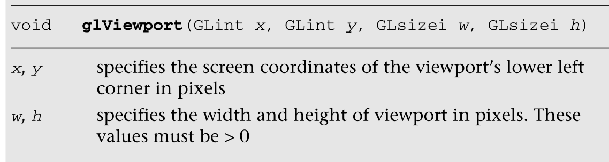

# 图元装配和光栅化

Primitive Assembly and Rasterization

在本章中，我们描述了图元的类型、OpenGL  ES支持的几何对象以及如何绘制它们。然后我们描述图元装配阶段，这发生在顶点着色器处理图元的顶点之后。在基本装配状态下，执行剪裁、透视分割和视口变换操作。详细讨论了这些操作。然后我们以光栅化阶段的描述结束。光栅化是将图元转换成一组二维片段的过程，这些片段由片段着色器处理。这些二维片段表示可以在屏幕上绘制的像素。

In this chapter, we describe the types of primitives, the geometric objects  that are supported by OpenGL ES, and how to draw them. We then describe the  primitive assembly stage, which occurs after the vertices of a primitive are  processed by the vertex shader. In the primitive assembly state, clipping,  perspective divide, and viewport transformation operations are performed. These  operations are discussed in detail. We then conclude with a description of the  rasterization stage. Rasterization is the process that converts primitives into  a set of two-dimensional fragments, which are processed by the fragment shader.  These two-dimensional fragments represent pixels that may be drawn on the  screen.

有关顶点着色器的详细描述，请参考第8章“顶点着色器”。第9章“纹理”和第10章“片段着色器”描述了应用于光栅化阶段生成的片段的处理。

Refer to Chapter 8, “Vertex Shaders,” for a detailed description of vertex  shaders. Chapter 9, “Texturing,” and Chapter 10, “Fragment Shaders,” describe  processing that is applied to fragments generated by the rasterization  stage.

## Primitives

图元

图元是一种几何对象，可以使用OpenGL  ES中的glDrawArrays和glDrawElements命令来绘制。图元由一组描述顶点位置的顶点以及其他信息(如颜色、纹理坐标和法线)来描述。

A primitive is a geometric object that can be drawn using the glDrawArrays and  glDrawElements commands in OpenGL ES. The primitive is described by a set of  vertices that describe the vertex position, and other information such as color,  texture coordinates, and normals.

以下是OpenGL  ES 2.0中可以绘制的图元:

The following are the primitives that can be drawn in OpenGL ES 2.0:

- 三角形
- 点
- 线

## 三角形

Triangles

三角形是描述3D应用程序渲染的几何对象最常用的方法。OpenGL  ES支持的三角形图元有GL _三角形、GL _三角形_条带、GL _三角形_FAN。图7-1显示了支持的三角形基本类型的例子。

Triangles represent the most common method used to describe a geometry object  rendered by a 3D application. The triangle primitives supported by OpenGL ES are  GL_TRIANGLES, GL_TRIANGLE_STRIP, and GL_TRIANGLE_FAN. Figure 7-1 shows examples  of supported triangle primitive types. 

GL  _  TRIANGLES绘制一系列独立的三角形。在图7-1中，画出了由顶点(V0，V1，V2)和(V3，V4，V5)给出的两个三角形。总共绘制了n/3个三角形，其中n是在glDrawArrays或glDrawElements中指定为计数的索引数。

GL_TRIANGLES draws a series of separate triangles. In Figure 7-1, two  triangles given by vertices (V0, V1, V2) and (V3,V4,V5) are drawn. A total of  n/3 triangles are drawn, where n is the number of indices specified as count in  glDrawArrays or glDrawElements.

GL  _ TRIANGLE _  STRIP绘制一系列相连的三角形。在图7-1所示的例子中，三个三角形由(V0，V1，V2)，(V2，V1，V3)(注意顺序)和(V2，V3，V4)给出。总共绘制了(n–2)个三角形，其中n是在glDrawArrays或glDrawElements中指定为计数的索引数。

GL_TRIANGLE_STRIP draws a series of connected triangles. In the example shown  in Figure 7-1, three triangles are drawn given by (V0, V1,V2), (V2,V1,V3) (note  the order), and (V2,V3,V4). A total of (n – 2) triangles are drawn, where n is  the number of indices specified as count in glDrawArrays or  glDrawElements.

GL  _ TRIANGLE _  FAN也画一系列相连的三角形。在图7-1所示的例子中，画出的三角形是(V0，V1，V2)，(V0，V2，V3)和(V0，V3，V4)。总共绘制了(n–2)个三角形，其中n是在glDrawArrays或glDrawElements中指定为计数的索引数。

GL_TRIANGLE_FAN also draws a series of connected triangles. In the example  shown in Figure 7-1, the triangles drawn are (V0,V1,V2), (V0,V2,V3), and  (V0,V3,V4). A total of (n – 2) triangles are drawn, where n is the number of  indices specified as count in glDrawArrays or glDrawElements.

## Line

OpenGL  ES支持的线图元有GL_LINES、GL_LINE_STRIP、GL_LINE_LOOP。图7-2显示了支持的线条基本类型的例子。

The line primitives supported by OpenGL ES are GL_LINES, GL_LINE_STRIP, and  GL_LINE_LOOP. Figure 7-2 shows examples of supported line primitive  types.

GL_LINES绘制一系列不相连的线段。在图7-2所示的例子中，由(V0，V1)，(V2，V3)和(V4，V5)给出了三条单独的线。总共绘制了n/2个线段，其中n是在glDrawArrays或glDrawElements中指定为计数的索引数。

GL_LINES draws a series of unconnected line segments. In the example shown in  Figure 7-2, three individual lines are drawn given by (V0,V1), (V2,V3), and  (V4,V5). A total of n/2 segments are drawn, where n is the number of indices  specified as count in glDrawArrays or glDrawElements.

GL_LINE_STRIP绘制一系列相连的线段。在图7-2所示的例子中，三条线段由(V0，V1)，(V1，V2)和(V2，V3)给出。总共绘制了(n–1)条线段，其中n是在glDrawArrays或glDrawElements中指定为计数的索引数。

GL_LINE_STRIP draws a series of connected line segments. In the example shown  in Figure 7-2, three line segments are drawn given by (V0,V1), (V1,V2), and  (V2,V3). A total of (n – 1) line segments are drawn, where n is the number of  indices specified as count in glDrawArrays or glDrawElements.

除了从Vn-1到V0绘制最后一条线段之外，GL_LINE_LOOP的工作方式与GL_LINE_STRIP相似。在图7-2所示的例子中，绘制的线段是(V0，V1)，(V1，V2)，(V2，V3)，(V3，V4)和(V4，V0)。总共绘制了n条线段，其中n是在glDrawArrays或glDrawElements中指定为计数的索引数。

GL_LINE_LOOP works similar to GL_LINE_STRIP, except that a final line segment  is drawn from Vn-1 to V0. In the example shown in Figure 7-2, the line segments  drawn are (V0,V1), (V1,V2), (V2,V3), (V3,V4), and (V4,V0). A total of n line  segments are drawn, where n is the number of indices specified as count in  glDrawArrays or glDrawElements.

线的宽度可以使用glLineWidth  API调用来指定。	

The width of a line can be specified using the glLineWidth API call.


glLineWidth指定的宽度将被限制在OpenGL  ES 2.0实现支持的线宽范围内。可以使用以下命令查询支持的线宽范围。不要求支持宽度大于1的线条。

The width specified by glLineWidth will be clamped to the line width range  supported by the OpenGL ES 2.0 implementation. The supported line width range  can be queried using the following command. There is no requirement for lines  with widths greater than one to be supported.

```java
GLfloat   lineWidthRange[2];
glGetFloatv(GL_ALIASED_LINE_WIDTH_RANGE, lineWidthRange);
```

## 点精灵

Point Sprites

OpenGL  ES支持的点精灵图元是GL _  POINTS。为每个指定的顶点绘制一个点精灵。点精灵通常用于通过将粒子绘制为点而不是四边形来有效地渲染粒子效果(粒子是通过点来绘制的，不是通过四边形绘制的)。点精灵是一个屏幕对齐的四边形，指定为位置和半径。位置描述了正方形的中心，然后半径被用来计算描述点精灵的四边形的四个坐标。

The point sprite primitive supported by OpenGL ES is GL_POINTS. A point sprite  is drawn for each vertex specified. Point sprites are typically used for  rendering particle effects efficiently by drawing them as points instead of  quads. A point sprite is a screen-aligned quad specified as a position and a  radius. The position describes the center of the square and the radius is then  used to calculate the four coordinates of the quad that describes the point  sprite. 

gl_PointSize是内置变量，可用于在顶点着色器中输出点半径(或点大小)。与点图元输出gl_PointSize相关联的顶点着色器非常重要，否则点大小的值将被视为未定义，很可能会导致绘制错误。顶点着色器输出的gl_PointSize值将被限制在OpenGL  ES 2.0实现支持的混叠点大小范围内。可以使用以下命令查询该范围。

gl_PointSize is the built-in variable that can be used to output the point  radius (or point size) in the vertex shader. It is important that a vertex  shader associated with the point primitive output gl_PointSize, otherwise the  value of point size is considered undefined and will most likely result in  drawing errors. The gl_PointSize value output by a vertex shader will be clamped  to the aliased point size range supported by the OpenGL ES 2.0 implementation.  This range can be queried using the following command.

```c
GLfloat   pointSizeRange[2];
glGetFloatv(GL_ALIASED_POINT_SIZE_RANGE, pointSizeRange);
```

默认情况下，OpenGL  ES 2.0将窗口原点(0，0)描述为(左，下)区域。但是，对于点精灵，点坐标原点是(左侧，顶部)。

By default, OpenGL ES 2.0 describes the window origin (0, 0) to be the (left,  bottom) region. However, for point sprites, the point coordinate origin is  (left, top).

gl_PointCoord是一个内置变量，当渲染的图元是一个点精灵时，它只在片段着色器中可用。gl_PointCoord使用mediump  precision限定符声明为vec2变量。当我们从左到右或从上到下移动时，分配给gl_PointCoord的值从0.0到1.0，如图7-3所示。

gl_PointCoord is a built-in variable available only inside a fragment shader  when the primitive being rendered is a point sprite. gl_PointCoord is declared  as a vec2 variable using the mediump precision qualifier. The values assigned to  gl_PointCoord go from 0.0 to 1.0 as we move from left to right or from top to  bottom, as illustrated by Figure 7-3.


下面的片段着色器代码说明了如何使用gl_PointCoord作为纹理坐标来绘制纹理点精灵。

The following fragment shader code illustrates how gl_PointCoord can be used  as a texture coordinate to draw a textured point sprite.

```c
uniform sampler2D s_texSprite;
void
main(void)
{
   gl_FragColor = texture2D(s_texSprite, gl_PointCoord);
}
```

## 绘图图元

Drawing Primitives

OpenGL  ES中有两个API调用可以用来绘制图元:glDrawArrays和glDrawElements。

There are two API calls in OpenGL ES that can be used to draw primitives:  glDrawArrays and glDrawElements.


**glDrawArrays：**

- 参数一：绘制模式（三角形、线、点）
- 从那个点开始的
- 一共有几个点

example：绘制的时候一共6个点，从第一个开始，然后执行到最后一个6个点。


glDrawArrays使用元素索引从第一个到第一个+count–1给定的顶点绘制由模式指定的图元。一个对gldrawarrays(GL_TRIANGLES，0，6)的调用将绘制两个三角形，一个三角形由元素索引(0，1，2)给出，另一个三角形由元素索引(3，4，5)给出。类似地，对gldrawArrays(GL _ TRIAGE _  STRIP，0，5)的调用将绘制三个三角形:由元素索引(0，1，2)给出的三角形，由元素索引(2，1，3)给出的第二个三角形，以及由元素索引(2，3，4)给出的最后一个三角形。

glDrawArrays draws primitives specified by mode using vertices given by  element index first to first + count – 1. A call to glDrawArrays (GL_TRIANGLES,  0, 6) will draw two triangles, a triangle given by element indices ( 0 , 1 , 2 )  and another triangle given by element indices (3, 4, 5). Similarly, a call to  glDrawArrays(GL_TRIANGLE_STRIP, 0, 5) will draw three triangles: a triangle  given by element indices ( 0 , 1 , 2 ), the second triangle given by element  indices (2, 1, 3), and the final triangle given by element indices (2, 3,  4).

如果您有一个由一系列元素索引描述的图元，并且几何图形的顶点不共享，那么glDrawArrays是很棒的。然而，游戏或其他3D应用程序使用的典型对象由多个三角形网格组成，其中元素索引不一定按顺序排列，顶点通常在网格的三角形之间共享。

glDrawArrays is great if you have a primitive described by a sequence of  element indices and if vertices of geometry are not shared. However, typical  objects used by games or other 3D applications are made up of multiple triangle  meshes where element indices may not necessarily be in sequence and vertices  will typically be shared between triangles of a mesh.

考虑图7-4所示的立方体。如果我们使用glDrawArrays绘制这个，代码如下:

Consider the cube shown in Figure 7-4. If we were to draw this using  glDrawArrays, the code would be as follows:

```c
#define VERTEX_POS_INDX 0
#define NUM_FACES       6
GLfloat vertices[] = { … };  // (x, y, z) per vertex
glEnableVertexAttribArray(VERTEX_POS_INDX);
glVertexAttribPointer(VERTEX_POS_INDX, 3, GL_FLOAT, GL_FALSE, 
                      0, vertices);
for (i=0; i<NUM_FACES; i++)
{
   glDrawArrays(GL_TRIANGLE_FAN, first, 4);
   first += 4;
}
or
glDrawArrays(GL_TRIANGLES, 0, 36);
```

为了用Gldraw  Arrales绘制这个立方体，我们将为立方体的每个面调用Gldraw  Arrales。共享的顶点将需要复制，这意味着我们现在需要分配24个(如果我们将每个面绘制为GL _三角形_扇形)或36个顶点(如果我们使用GL  _三角形)，而不是8个顶点。这不是一个非常有效的方法。

To draw this cube with glDrawArrays, we would call glDrawArrays for each face  of the cube. Vertices that are shared would need to be replicated, which means  that instead of having eight vertices, we would now need to allocate 24 (if we  draw each face as a GL_TRIANGLE_FAN) or 36 vertices (if we use GL_TRIANGLES).  This is not a very efficient approach.

这是使用glDrawElements绘制同一个立方体的方式。

This is how the same cube would be drawn using glDrawElements.

```java
#define VERTEX_POS_INDX 0
GLfloat vertices[] = { … };// (x, y, z) per vertex
GLubyte indices[36] = { 0, 1, 2, 0, 2, 3, 
                        0, 3, 4, 0, 4, 5, 
                        0, 5, 6, 0, 6, 1, 
                        7, 6, 1, 7, 1, 2,
                        7, 4, 5, 7, 5, 6,
                        7, 2, 3, 7, 3, 4 };
glEnableVertexAttribArray(VERTEX_POS_INDX);
glVertexAttribPointer(VERTEX_POS_INDX, 3, GL_FLOAT, GL_FALSE, 
                      0, vertices);
glDrawElements(GL_TRIANGLES, sizeof(indices)/sizeof(GLubyte),
               GL_UNSIGNED_BYTE, indices);
```

即使我们在用glDrawElements画三角形，用glDrawArrays画一个三角扇，glDrawElements在一个GPU上运行速度会比glDrawArrays快很多；例如，当顶点被重用时，使用glDrawElements时，顶点属性数据的大小会更小。这也降低了内存占用和内存带宽要求。

Even though we are drawing triangles with glDrawElements and a triangle fan  with glDrawArrays, glDrawElements will run faster than glDrawArrays on a GPU for  many reasons; for example, the size of vertex attribute data will be smaller  with glDrawElements as vertices are reused. This also gives you a lower memory  footprint and memory bandwidth requirement.

## 性能提示

Performance Tips

应用程序应该确保调用glDrawElements时使用尽可能大的原始大小。如果我们在画GL  _  TRIANGLES，这很容易做到。然而，如果我们有三角形条或扇形的网格，而不是为每个三角形条网格单独调用glDrawElements，这些网格可以通过添加导致退化三角形的元素索引来连接在一起。退化三角形是三角形的两个或多个顶点重合的三角形。GPU可以非常容易地检测和拒绝退化的三角形，所以这是一个很好的性能增强，允许我们排队一个大的图元由GPU渲染。

Applications should make sure that glDrawElements should be called with as  large a primitive size as possible. This is very easy to do if we are drawing  GL_TRIANGLES. However, if we have meshes of triangle strips or fans, instead of  making individual calls to glDrawElements for each triangle strip mesh, these  meshes could be connected together by adding element indices that result in  degenerate triangles. A degenerate triangle is a triangle where two or more  vertices of the triangle are coincident. GPUs can detect and reject degenerate  triangles very easily, so this is a good performance enhancement that allows us  to queue a big primitive to be rendered by the GPU.

为了连接不同的网格，我们需要添加的元素索引(或退化三角形)的数量将取决于每个网格是三角形扇形还是三角形条以及每个条中定义的索引的数量。作为三角形条带的网格中的索引数量很重要，因为当我们从一个三角形到条带的下一个三角形穿过正在连接的不同网格时，我们需要保持缠绕顺序

The number of element indices (or degenerate triangles) we need to add to  connect distinct meshes will depend on whether each mesh is a triangle fan or a  triangle strip and the number of indices defined in each strip. The number of  indices in a mesh that is a triangle strip matters, as we need to preserve the  winding order as we go from one triangle to the next triangle of the strip  across distinct meshes that are now being connected

当连接单独的三角形带时，我们需要检查被连接的两个带的最后一个三角形和第一个三角形的顺序。如图7-2所示，描述三角形条带偶数三角形的顶点顺序不同于描述同一条带奇数三角形的顶点顺序。

When connecting separate triangle strips we need to check the order of the  last triangle and the first triangle of the two strips being connected. As seen  in Figure 7-2, the ordering of vertices that describe even-numbered triangles of  a triangle strip is different from the ordering of vertices that describe  oddnumbered triangles of the same strip.


需要处理两种情况:

Two cases need to be handled:

- 第一个三角形条的奇数三角形连接到第二个三角形条的第一个(因此也是偶数)三角形。

  Odd-numbered triangle of the first triangle strip is being connected to the  first (and therefore even-numbered) triangle of the second triangle  strip.

- 一个三角形带的偶数三角形连接到第二个三角形带的第一个(因此也是偶数)三角形。

  Even-numbered triangle of the first triangle strip is being connected to the  first (and therefore even-numbered) triangle of the second triangle  strip.

图7-5显示了两个独立的三角形条，它们代表了这两种需要连接的情况，以允许我们使用对glDrawElements的一次调用来绘制这两个条。

Figure 7-5 shows two separate triangle strips that represent these two cases  that need to be connected to allow us to draw both these strips using a single  call to glDrawElements.

对于图7-5中两个相连三角形的最后一个和第一个三角形的顶点顺序相反的三角形条，每个三角形条的元素指数分别为(0，1，2，3)和(8，9，10，11)。如果我们使用一次对glDrawElements的调用来绘制两个条带，则组合元素索引列表将是(0，1，2，3，3，8，8，9，10，11)。这个新元素索引导致绘制以下三角形:(0，1，2)，(2，1，3)，**(2，3，3)，(3，3，8)，(3，8，8)，(8，8，9)，**(8，9，10)，(10，9，11)。黑体字的三角形是退化三角形。粗体的元素索引表示添加到组合元素索引列表中的附加索引。

For triangle strips in Figure 7-5 with opposite vertex order for the last and  first triangle of the two strips being connected, the element indices for each  triangle strip are (0,1,2,3) and (8,9,10,11), respectively. The combined element  index list if we were to draw both strips using one call to glDrawElements would  be (0,1,2,3,3,8,8,9,10,11). This new element index results in the following  triangles drawn: (0,1,2), (2,1,3), (2, 3, 3), (3, 3, 8), (3, 8, 8), (8, 8, 9),  (8, 9, 10), (10,9,11). The triangles in boldface type are the degenerate  triangles. The element indices in boldface type represent the additional indices  added to the combined element index list.

对于图7-5中两个相连三角形的最后一个和第一个三角形具有相同顶点顺序的三角形条，每个三角形条的元素指数分别为(0，1，2，3，4)和(8，9，10，11)。如果我们使用一次对glDrawElements的调用来绘制两个条带，则组合元素索引列表将是(0，1，2，3，4，4，8，9，10，11)。这个新元素索引导致绘制以下三角形:(0，1，2)，(2，1，3)，(2，3，4)，**(4，3，4)，(4，8)，(8，4，9)，**(8，9，10)，(10，9，11)。

For triangle strips in Figure 7-5 with the same vertex order for the last and  first triangle of the two strips being connected, the element indices for each  triangle strip are (0,1,2,3,4) and (8,9,10,11), respectively. The combined  element index list if we were to draw both strips using one call to  glDrawElements would be (0,1,2,3,4,4,8,9,10,11). This new element index results  in the following triangles drawn: (0,1,2), (2,1,3), (2,3,4), (4, 3, 4), (4, 4,  8), (8, 4, 9), (8,9,10), (10,9,11).

这个三角形黑体字是退化的三角形。粗体的元素索引表示添加到组合元素索引列表中的附加索引。

This triangle boldface type are the degenerate triangles. The element indices in boldface  type represent the additional indices added to the combined element index  list.

请注意，所需的附加元素索引的数量和生成的退化三角形的数量取决于第一条中顶点的数量。这是为了保持被连接的下一个条带的缠绕顺序。

Note that the number of additional element indices required and the number of  degenerate triangles generated vary depending on the number of vertices in the  first strip. This is required to preserve the winding order of the next strip  being connected.

在确定如何排列图元的元素索引时，研究利用变换后顶点缓存的大小的技术可能也是值得的。大多数图形处理器实现转换后顶点缓存。在顶点着色器执行顶点(由其元素索引给出)之前，会执行一项检查，以查看该顶点是否已经存在于变换后缓存中。如果顶点存在于变换后缓存中，顶点着色器不会执行该顶点。如果它不在缓存中，顶点将需要由顶点着色器执行。使用变换后高速缓存大小来确定元素索引是如何创建的应该有助于整体性能，因为它将减少顶点着色器执行重用的顶点的次数。

It might also be worth investigating techniques that take the size of the  posttransform vertex cache in determining how to arrange element indices of a  primitive. Most GPUs implement a post-transform vertex cache. Before a vertex  (given by its element index) is executed by the vertex shader, a check is  performed to see if the vertex already exists in the post-transform cache. If  the vertex exists in the post-transform cache, the vertex is not executed by the  vertex shader. If it is not in the cache, the vertex will need to be executed by  the vertex shader. Using the post-transform cache size to determine how element  indices are created should help overall performance, as it will reduce the  number of times a vertex that is reused gets executed by the vertex  shader.

## 原始装配

Primitive Assembly

图7-6显示了原始装配阶段。顶点着色器执行通过glDrawArrays或glDrawElements提供的顶点。由顶点着色器变换的每个顶点都包括描述顶点(x，y，z，w)值的顶点位置。图元类型和顶点索引决定了将要渲染的单个图元。对于每个单独的图元(三角形、直线和点)及其对应的顶点，图元装配阶段执行如图7-6所示的操作。

Figure 7-6 shows the primitive assembly stage. Vertices that are supplied  through glDrawArrays or glDrawElements get executed by the vertex shader. Each  vertex transformed by the vertex shader includes the vertex position that  describes the (x, y, z, w) value of the vertex. The primitive type and vertex  indices determine the individual primitives that will be rendered. For each  individual primitive (triangle, line, and point) and their corresponding  vertices, the primitive assembly stage performs the operations as shown in  Figure 7-6.

在我们讨论如何在OpenGL  ES中光栅化图元之前，我们需要了解OpenGL ES 2.0中使用的各种坐标系。这是为了更好地理解顶点坐标在OpenGL ES  2.0管道的各个阶段会发生什么。

Before we discuss how primitives are rasterized in OpenGL ES, we need to  understand the various coordinate systems used within OpenGL ES 2.0. This is  needed to get a good understanding of what happens to vertex coordinates as they  go through the various stages of the OpenGL ES 2.0 pipeline.


## 坐标系

Coordinate Systems

图7-7显示了顶点通过**顶点着色器和图元装配阶段时的坐标系**。顶点输入到物体或局部坐标空间中的OpenGL  ES。这是一个对象最有可能被建模和存储的坐标空间。执行顶点着色器后，顶点位置被视为在剪辑坐标空间中。顶点位置从局部坐标系(即，对象坐标)到剪辑坐标的转换是通过加载适当的矩阵来完成的，该矩阵以顶点着色器中定义的适当的统一方式执行该转换。第8章描述了如何将顶点位置从对象转换到剪辑坐标，以及如何在顶点着色器中加载适当的矩阵来执行这种转换。

Figure 7-7 shows the coordinate systems as a vertex goes through the vertex  shader and primitive assembly stages. Vertices are input to OpenGL ES in the  object or local coordinate space. This is the coordinate space in which an  object is most likely modeled and stored. After a vertex shader is executed, the  vertex position is considered to be in the clip coordinate space. The  transformation of the vertex position from the local coordinate system (i.e.,  object coordinates) to clip coordinates is done by loading the appropriate  matrices that perform this conversion in appropriate uniforms defined in the  vertex shader. Chapter 8 describes how to transform the vertex position from  object to clip coordinates and how to load appropriate matrices in the vertex  shader to perform this transformation.


## 裁剪

Clipping

顶点着色器执行后的顶点位置在剪辑坐标空间中。剪辑坐标是由(xc，yc，zc，wc)给出的齐次坐标。在剪辑空间中定义的顶点坐标(xc，yc，zc，wc)会根据查看体积(也称为剪辑体积)进行剪辑。

The vertex position after the vertex shader has been executed is in the clip  coordinate space. The clip coordinate is a homogeneous coordinate given by (xc,  yc, zc, wc). The vertex coordinates defined in clip space (xc, yc, zc, wc) get  clipped against the viewing volume (also known as the clip volume).

图7-8所示的裁剪体由六个裁剪平面定义，分别称为近裁剪平面、远裁剪平面、左裁剪平面、右裁剪平面、顶裁剪平面和底裁剪平面。在片段坐标中，片段体积表示为:

The clip volume as shown in Figure 7-8 is defined by six clipping planes,  referred to as the near, and far clip planes, the left and right clip planes,  and the top and bottom clip planes. In clip coordinates, the clip volume is  given as:

```java
-wc <= xc <= wc
-wc <= yc <= wc
-wc <= zc <= wc
```

前面的六个检查有助于确定图元需要修剪的平面列表。

The preceding six checks help determine the list of planes against which the  primitive needs to be clipped.

裁剪阶段会将每个图元裁剪到图7-8所示的裁剪体积中。在这里，我们通过一个图元来暗示使用GL  _  TRIANGLES绘制的一系列独立三角形中的每个三角形，或者三角形条或扇形的三角形，或者使用GL_LINES绘制的一系列独立线条中的一条线，或者线条条或线条循环中的一条线，或者点精灵列表中的特定点。

The clipping stage will clip each primitive to the clip volume shown in Figure  7-8. By a primitive here we imply each triangle of a list of separate triangles  drawn using GL_TRIANGLES, or a triangle of a triangle strip or a fan, or a line  from a list of separate lines drawn using GL_LINES, or a line of a line strip or  line loop, or a specific point in a list of point sprites.

对于每个图元类型，执行以下操作:

For each primitive type the following operations are performed:

裁剪三角形-如果三角形完全在查看体积内，则不执行裁剪。如果三角形完全在观看体积之外，则三角形被丢弃。如果三角形部分位于观察体积内，则根据适当的平面裁剪三角形。裁剪操作将生成被裁剪到平面上的新顶点，这些顶点被排列成三角形扇形。

Clipping triangles—If the triangle is completely inside the viewing volume, no  clipping is performed. If the triangle is completely outside the viewing volume,  the triangle is discarded. If the triangle lies partially inside the viewing  volume, then the triangle is clipped against the appropriate plans. The clipping  operation will generate new vertices that are clipped to the plane that are  arranged as a triangle fan.

裁剪线-如果线完全在查看体积内，则不执行裁剪。如果该行完全在观看体积之外，则该行被丢弃。如果线部分位于观察体积内，则线被修剪，并生成适当的新顶点

Clipping lines—If the line is completely inside the viewing volume, then no  clipping is performed. If the line is completely outside the viewing volume, the  line is discarded. If the line lies partially inside the viewing volume, then  the line is clipped, and appropriate new vertices are generated

剪辑点精灵-如果点位置位于近或远剪辑平面之外，或者表示点精灵的四边形位于剪辑体积之外，剪辑阶段将丢弃点精灵。否则，它将保持不变，当点精灵从剪辑卷内部移动到外部时，它将被剪切，反之亦然。

Clipping point sprites—The clipping stage will discard the point sprite if the  point position lies outside the near or far clip plane or the quad that  represents the point sprite is outside the clip volume. Otherwise it is passed  unchanged and the point sprite will be scissored as it moves from inside the  clip volume to the outside or vice versa.

在图元相对于六个裁剪平面被裁剪之后，顶点坐标经历透视分割以成为归一化的设备坐标。归一化设备坐标在-1.0到+1.0的范围内。

After the primitives have been clipped against the six clipping planes, the  vertex coordinates undergo perspective division to become normalized device  coordinates. A normalized device coordinate is in the range –1.0 to  +1.0.

**裁剪之后变为归一化的坐标**

注意:在硬件中执行裁剪操作(尤其是线和三角形)可能相当昂贵。如图7-8所示，观察体积有六个裁剪平面，图元必须靠着这些平面裁剪。部分位于近平面和远平面之外的图元会经历剪裁操作。但是，部分位于x和y平面之外的图元不一定需要修剪。通过渲染到比用glViewport指定的视口尺寸更大的视口中，在x和y平面中的裁剪变成了剪切操作。剪枝是由GPU非常高效地实现的。这个较大的视口区域称为防护带区域。虽然OpenGL  ES不允许应用程序指定保护带区域，但大多数(如果不是所有的话)OpenGL ES实现都实现了保护带。

Note: The clipping operation (especially for lines and triangles) can be quite  expensive to perform in hardware. There are six clip planes of the viewing  volume that a primitive must be clipped against, as shown in Figure 7-8.  Primitives that are partially outside the near and far planes go through the  clipping operations. However, primitives that are partially outside the x and y  planes do not necessarily need to be clipped. By rendering into a viewport that  is bigger than dimensions of viewport specified with glViewport, clipping in the  x and y planes becomes a scissoring operation. Scissoring is implemented very  efficiently by GPUs. This larger viewport region is called the guard-band  region. Although OpenGL ES does not allow an application to specify a guard-band  region, most if not all OpenGL ES implementations implement a  guard-band.

## 透视

Perspective Division

透视分割将由剪辑坐标(xc，yc，zc，wc)给出的点投影到屏幕或视口上。这个投影是通过用wc分割(xc，yc，zc)坐标来实现的。

Perspective division takes the point given by clip coordinate (xc, yc, zc, wc)  and projects it onto the screen or viewport. This projection is performed by  dividing the (xc, yc, zc) coordinates with wc.

(xc/wc)、(yc/wc),(zc/wc)我们得到归一化的器件坐标(xd，yd，zd)。这些被称为标准化设备坐标，因为它们将在[–1.0…1.0]范围内。这些标准化的(xd，yd)坐标将根据视口的尺寸转换成实际的屏幕(或窗口)坐标。使用glDepthRange指定的近深度值和远深度值，将归一化(zd)坐标转换为屏幕z值。这些转换在视口转换阶段执行

After performing (xc/wc), (yc/wc), and (zc/wc) we get normalized device coordinates (xd, yd, zd). These are  called normalized device coordinates as they will be in the [–1.0 … 1.0] range.  These normalized (xd, yd) coordinates will then be converted to actual screen  (or window) coordinates depending on the dimensions of the viewport. The  normalized (zd) coordinate is converted to screen z value using the near and far  depth values specified by glDepthRange. These conversions are performed in the  viewport transformation phase

## 视口变换

Viewport Transformation

可以通过使用以下应用编程接口调用来设置视口转换:

The viewport transformation can be set by using the following API  call:




从标准化设备坐标(xd，yd，zd)到窗口坐标(xw，yw，zw)的转换由以下转换给出:

The conversion from normalized device coordinates (xd, yd, zd) to window  coordinates (xw, yw, zw) is given by the following transformation:


在变换ox  = (x + w)/2和oy = (y + h)/2中，n和f代表所需的深度范围。

In the transformation ox = (x + w)/2, and oy = (y + h)/2, n and f represent  the desired depth range.

深度范围值n和f可以使用下面的应用编程接口调用来设置

The depth range values n and f can be set using the following API  call


glDepthRange和glViewport指定的值用于将顶点位置从归一化设备坐标转换为窗口(屏幕)坐标。

The values specified by glDepthRange and glViewport are used to transform the  vertex position from normalized device coordinates into window (screen)  coordinates.

初始(或默认)视口状态设置为w  =宽度，h = OpenGL  ES要在其中进行渲染的应用程序创建的窗口的高度。该窗口由eglCreateWindowSurface中指定的EGLNativeWindowType  win参数给出。

The initial (or default) viewport state is set to w = width and h = height of  the window created by the app in which OpenGL ES is to do its rendering. The  window is given by the EGLNativeWindowType win argument specified in  eglCreateWindowSurface.

## 光栅化
Rasterization

图7-9显示了光栅化管道。在顶点已经被变换并且图元已经被裁剪之后，光栅化流水线获取单个图元，例如三角形、线段或点子画面，并且为该图元生成适当的片段。每个片段由它在屏幕空间中的整数位置(x，y)来标识。片段表示屏幕空间中由(x，y)给定的像素位置以及将由片段着色器处理以产生片段颜色的附加片段数据。这在第9章和第10章中有详细描述。

Figure 7-9 shows the rasterization pipeline. After the vertices have been  transformed and primitives have been clipped, the rasterization pipelines take  an individual primitive such as a triangle, a line segment, or a point sprite  and generates appropriate fragments for this primitive. Each fragment is  identified by its integer location (x, y) in screen space. A fragment represents  a pixel location given by (x, y) in screen space and additional fragment data  that will be processed by the fragment shader to produce a fragment color. This  is described in detail in Chapter 9 and Chapter 10.

在本节中，我们将讨论应用程序可以用来控制三角形、条形和扇形光栅化的各种选项。

In this section we discuss the various options that an application can use to  control rasterization of triangles, strips, and fans.


## 剔除

在三角形被栅格化之前，我们需要确定它们是面向前(即面向观察者)还是面向后(即背离观察者)。剔除操作会丢弃背离查看者的三角形。为了确定三角形是正面还是背面，我们首先需要知道三角形的方向。

Before triangles are rasterized, we need to determine whether they are  frontfacing (i.e., facing the viewer) or back-facing (i.e., facing away from the  viewer). The culling operation discards triangles that face away from the  viewer. To determine if the triangle is front-facing or back-facing we first  need to know the orientation of the triangle.

三角形的方向指定路径的缠绕顺序，该路径从第一个顶点开始，经过第二个和第三个顶点，并在第一个顶点结束。图7-10描述了顺时针和逆时针缠绕顺序的两个三角形例子。

The orientation of a triangle specifies the winding order of a path that  begins at the first vertex, goes through the second and third vertex and ends  back at the first vertex. Figure 7-10 describes two examples of triangles with a  clockwise and a counterclockwise winding order.

、


三角形的方向是通过计算三角形在窗口坐标中的有符号面积来计算的。我们现在需要将计算出的三角形面积的符号转换成顺时针或逆时针方向。从三角形区域的符号到顺时针或逆时针方向的映射由应用程序使用以下应用编程接口调用指定:

The orientation of a triangle is computed by calculating the signed area of  the triangle in window coordinates. We now need to translate the sign of the  computed triangle area into a clockwise (CW) or counterclockwise (CCW)  orientation. This mapping from the sign of triangle area to a CW or CCW  orientation is specified by the application using the following API  call:


我们已经讨论了如何计算三角形的方向。为了确定三角形是否需要剔除，我们需要知道要剔除的三角形的面。这是由应用程序使用以下API调用指定的。

We have discussed how to calculate the orientation of a triangle. To determine  whether the triangle needs to be culled, we need to know the facing of triangles  that are to be culled. This is specified by the application using the following  API call.


最后但同样重要的是，我们还需要知道是否应该执行剔除操作。如果启用了GL_CULL_FACE状态，将执行剔除操作。GL_CULL_FACE状态可以由应用程序使用以下API调用来启用或禁用。

Last but not least, we also need to know whether the culling operation should  be performed or not. The culling operation will be performed if the GL_CULL_FACE  state is enabled. The GL_CULL_FACE state can be enabled or disabled by the  application using the following API calls.


概括地说，要剔除适当的三角形，OpenGL  ES应用程序必须首先使用glEnable(GL_CULL_FACE)启用剔除，使用glCullFace设置适当的剔除面，并使用glFrontFace设置面向前的三角形的方向。

To recap, to cull appropriate triangles, an OpenGL ES application must first  enable culling using glEnable(GL_CULL_FACE), set the appropriate cull face using  glCullFace, and the orientation of front-facing triangles using  glFrontFace.

注意:剔除应该总是启用，以避免图形处理器浪费时间光栅化不可见的三角形。启用剔除应该有助于提高OpenGL  ES应用程序的整体性能。

Note: Culling should always be enabled to avoid the GPU wasting time  rasterizing triangles that are not visible. Enabling culling should help improve  the overall performance of the OpenGL ES application.

## 多边形偏移

Polygon Offset

考虑我们正在绘制两个彼此重叠的多边形的情况。您很可能会注意到如图7-11所示的工件。这些伪影被称为反Z伪影，因为三角形光栅化的有限精度而出现，这会影响每个片段的深度值的精度。导致如图7-11所示的假象。三角形栅格化使用的参数的有限精度和每个片段生成的深度值会越来越好，但永远不会完全解决。

Consider the case where we are drawing two polygons that overlap each other.  You will most likely notice artifacts as shown in Figure 7-11. These artifacts,  called Z-fighting artifacts, occur because of limited precision of triangle  rasterization, which can impact the precision of the depth values resulting in artifacts as shown in Figure 7-11. The 
limited precision of parameters used by triangle rasterization and generated 
depth values per fragment will get better and better but will never be 
completely resolved.


图7-11显示了正在绘制的两个共面多边形。绘制这两个没有多边形偏移的共面多边形的代码如下:

Figure 7-11 shows two coplanar polygons being drawn. The code to draw these  two coplanar polygons without polygon offset is as follows:

```c
glClear(GL_COLOR_BUFFER_BIT | GL_DEPTH_BUFFER_BIT);
// load vertex shader
// set the appropriate transformation matrices
// set the vertex attribute state
// draw the RED triangle
glDrawArrays(GL_TRIANGLE_FAN, 0, 4);
// set the depth func to <= as polygons are coplanar
glDepthFunc(GL_LEQUAL);
// set the vertex attribute state
// draw the GREEN triangle
glDrawArrays(GL_TRIANGLE_FAN, 0, 4);
```

为了避免图7-11所示的伪像，我们需要在深度测试执行之前和深度值写入深度缓冲区之前，在计算的深度值上增加一个增量。如果深度测试通过，原始深度值而不是原始深度值+增量将存储在深度缓冲区中。

To avoid the artifacts shown in Figure 7-11, we need to add a delta to the  computed depth value before the depth test is performed and before the depth  value is written to the depth buffer. If the depth test passes, the original  depth value and not the original depth value + delta will be stored in the depth  buffer.

使用以下API调用设置多边形偏移。

The polygon offset is set using the following API call.


深度偏移计算如下:

The depth offset is computed as:

深度偏移=  m *因子+ r *单位

depth offset = m * factor + r * units

m是三角形的最大深度斜率，计算如下:

m is maximum depth slope of the triangle and is calculated as:


m也可以计算为|∂z/∂y|}.的max{|∂z/∂x|

m can also be calculated as max{|∂z/∂x|, |∂z/∂y|}.

在三角形栅格化阶段，通过OpenGL  ES实现计算斜率项∂z/∂x和∂z/∂y。

The slope terms ∂z/∂x and ∂z/∂y are calculated by the OpenGL ES implementation  during the triangle rasterization stage.

r是一个实现定义的常数，表示可以产生保证的深度值差异的最小值。

r is an implementation-defined constant and represents the smallest value that  can produce a guaranteed difference in depth value.

可以使用Glenable(GL  _ POOLOGY _ Offset _ FILL)和Gldisable(GL _ POOLOGY _ Offset _  FILL)启用或禁用多边形偏移。

Polygon offset can be enabled or disabled using glEnable(GL_POLYGON_  OFFSET_FILL) and glDisable(GL_POLYGON_OFFSET_FILL).

启用多边形偏移后，由图7-11渲染的三角形代码如下。

With polygon offset enabled, the code for triangles rendered by Figure 7-11 is  as follows.

```java
const float polygonOffsetFactor = -1.0f;
const float polygonOffsetUnits  = -2.0f;
glClear(GL_COLOR_BUFFER_BIT | GL_DEPTH_BUFFER_BIT);
// load vertex shader
// set the appropriate transformation matrices
// set the vertex attribute state
// draw the RED triangle
glDrawArrays(GL_TRIANGLE_FAN, 0, 4);
// set the depth func to <= as polygons are coplanar
glDepthFunc(GL_LEQUAL);
glEnable(GL_POLYGON_OFFSET_FILL);
glPolygonOffset(polygonOffsetFactor, polygonOffsetUnits);
// set the vertex attribute state
// draw the GREEN triangle
glDrawArrays(GL_TRIANGLE_FAN, 0, 4);
```


顶点着色器之后会进入到