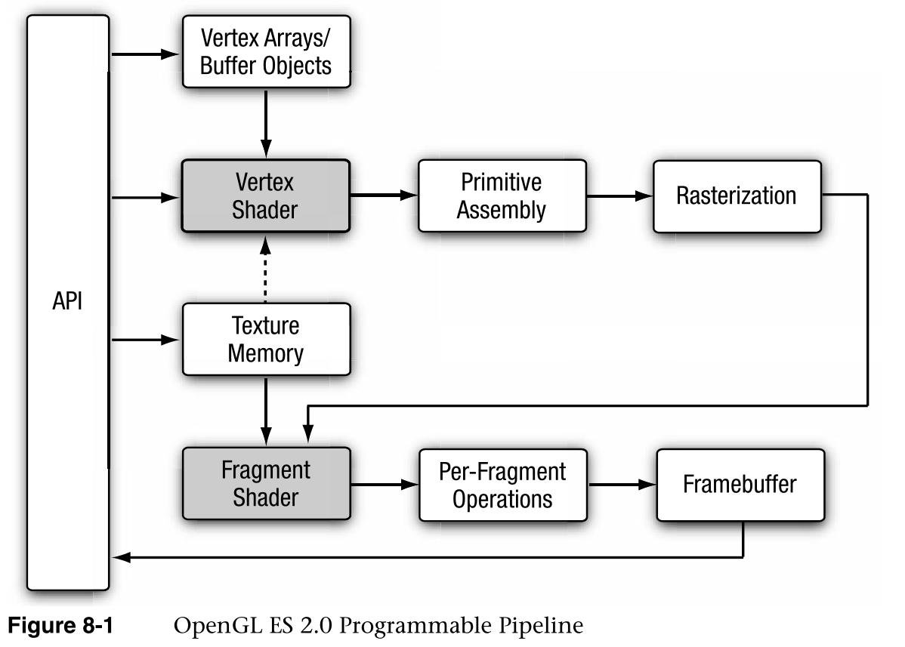
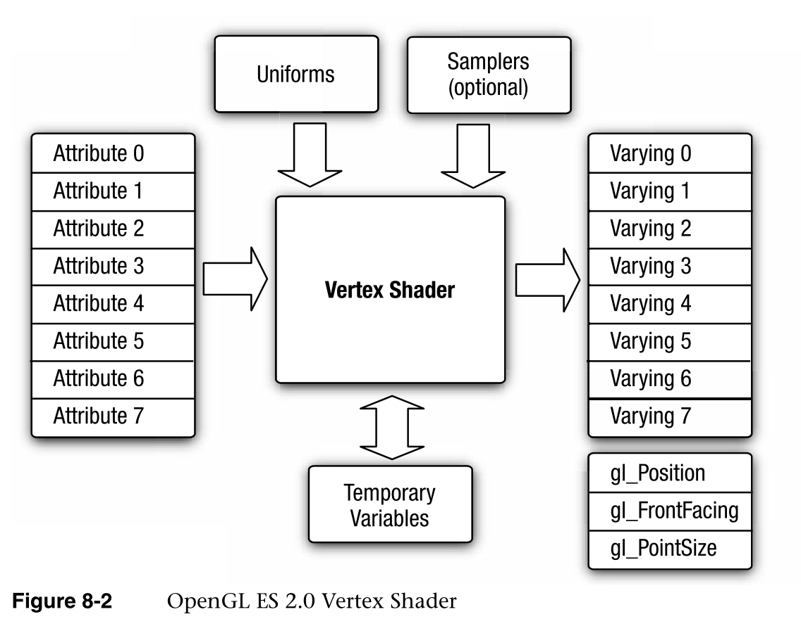

# 顶点着色器

Vertex Shaders

本章介绍OpenGL  ES 2.0可编程顶点流水线。图8-1说明了OpenGL ES 2.0可编程流水线。图8-1中的阴影框表示OpenGL ES  2.0中的可编程阶段。在本章中，我们讨论顶点着色器阶段。顶点着色器可用于执行传统的基于顶点的操作，例如通过**矩阵变换位置**、**计算光照方程**以生成**反常颜色**，以及**生成或变换纹理坐标**。

This chapter describes the OpenGL ES 2.0 programmable vertex pipeline. Figure  8-1 illustrates the OpenGL ES 2.0 programmable pipeline. The shaded boxes in  Figure 8-1 indicate the programmable stages in OpenGL ES 2.0. In this chapter we  discuss the vertex shader stage. Vertex shaders can be used to do traditional  vertex-based operations such as transforming the position by a matrix, computing  the lighting equation to generate a pervertex color, and generating or  transforming texture coordinates.




前几章，特别是第5章，“OpenGL  ES着色语言”和第6章，“顶点属性、顶点数组和缓冲对象”，讨论了如何指定顶点属性和统一输入，并对OpenGL ES  2.0着色语言进行了很好的描述。在第7章“图元组装和光栅化”中，我们讨论了光栅化阶段如何使用顶点着色器的输出(称为可变变量)来生成每个片段的值，然后将这些值输入到片段着色器。在本章中，我们从顶点着色器的高级概述开始，包括它的**输入和输出**。然后，我们讨论OpenGL  ES 2.0着色语言施加的一些限制，并描述在编写需要跨多个OpenGL ES  2.0实现移植的着色器时要记住的要点。然后我们通过讨论几个例子来描述如何编写顶点着色器。这些示例描述了一些常见的用例，例如用模型视图和投影矩阵转换顶点位置、生成逐顶点漫反射和镜面反射颜色的顶点照明示例、纹理坐标生成和顶点蒙皮。我们希望这些例子能帮助读者更好地理解如何编写顶点着色器，记住尽可能使顶点着色器便携的规则，**以及顶点着色器可以有多大的上限**。最后但同样重要的是，我们描述了一个实现OpenGL  ES 1.1固定功能顶点流水线的顶点着色器。这两个着色器还应该让读者很好地理解实现OpenGL ES 2.0的第一代手持设备将支持的顶点着色器的复杂性。

The previous chapters, specifically Chapter 5, “OpenGL ES Shading Language,”  and Chapter 6, “Vertex Attributes, Vertex Arrays, and Buffer Objects,” discussed  how to specify the vertex attribute and uniform inputs and also gave a good  description of the OpenGL ES 2.0 shading language. In Chapter 7, “Primitive  Assembly and Rasterization,” we discussed how the output of the vertex shader,  referred to as varying variables, is used by the rasterization stage to generate  per-fragment values, which are then input to the fragment shader. In this  chapter we begin with a high-level overview of a vertex shader including its  inputs and outputs. We then discuss some of the limitations imposed by the  OpenGL ES 2.0 shading language and describe points to keep in mind when writing  shaders that need to be portable across multiple OpenGL ES 2.0 implementations.  We then describe how to write vertex shaders by discussing a few examples. These  examples describe common use cases such as transforming a vertex position with a  model view and projection matrix, examples of vertex lighting that generate  per-vertex diffuse and specular colors, texture coordinate generation, and  vertex skinning. We hope that these examples help the reader get a good idea of  how to write vertex shaders, rules to keep in mind to make vertex shaders  portable as much as possible, and an upper limit on how big vertex shaders can  be. Last but not least, we describe a vertex shader that implements the OpenGL  ES 1.1 fixed function vertex pipeline. These two shaders should also give the  reader a good understanding of the complexity of vertex shaders that will be  supported by the first generation of handheld devices that implement OpenGL ES  2.0.

## 顶点着色器概述

Vertex Shader Overview

顶点着色器提供了一种对顶点进行操作的通用可编程方法。图8-2显示了顶点着色器的输入和输出。顶点着色器的输入包括以下内容:

The vertex shader provides a general-purpose programmable method for operating  on vertices. Figure 8-2 shows the inputs and outputs of a vertex shader. The  inputs to the vertex shader consist of the following:

- 属性—使用顶点数组提供的每个顶点的数据。

  Attributes—Per-vertex data supplied using vertex arrays.

- 统一-顶点着色器使用的恒定数据。

  Uniforms—Constant data used by the vertex shader.

- 着色器程序-顶点着色器程序源代码或可执行文件，描述将在顶点上执行的操作。

  Shader program—Vertex shader program source code or executable that describes  the operations that will be performed on the vertex.

顶点着色器的输出称为可变变量。在图元光栅化阶段，为每个生成的片段计算这些变量的插值，并将其作为输入传递给片段着色器。

The outputs of the vertex shader are called varying variables. In the  primitive rasterization stage, these variables are computed for each generated  fragment and are passed in as inputs to the fragment shader.




## 顶点着色器内置变量

Vertex Shader Built-In Variables

顶点着色器的内置变量可以分为由顶点着色器输出的**特殊变量**、**统一状态**(如深度范围)和**指定最大值**(如属性数量、变量数量和统一数量)的常数。

The built-in variables of a vertex shader can be categorized into special  variables that are output by the vertex shader, uniform state such as depth  range, and constants that specify maximum values such as the number of  attributes, number of varyings, and number of uniforms.

### 内置特殊变量

Built-In Special Variables

OpenGL  ES 2.0具有内置的特殊变量，这些变量要么由**顶点着色器输出**，然后成为片段着色器的输入，要么由**片段着色器输出**。顶点着色器可用的内置特殊变量如下:

**两种：一种是顶点着色器的输出，一个是片段着色器的输出**

OpenGL ES 2.0 has built-in special variables that are either output by the  vertex shader that then become input to the fragment shader, or are output by  the fragment shader. The built-in special variables available to the vertex  shader are as follows:

- GL _POSITION-位置用于输出片段坐标中的顶点位置。gl_Position值由裁剪和视口阶段用来执行图元的适当裁剪，并将顶点位置从裁剪坐标转换为屏幕坐标。

  **GL_POSITION:用于输出片段着色器的顶点位置。**

  - **由裁剪和视口阶段进行执行图元适当的进行裁剪**
  - **裁剪坐标转换为屏幕坐标**

  gl_Position—gl_Position is used to output the vertex position in clip  coordinates. The gl_Position values are used by the clipping and viewport stages  to perform appropriate clipping of primitives and convert the vertex position  from clip coordinates to screen coordinates.

- gl_PointSize—gl_PointSize用于以像素为单位写入点精灵的大小。渲染点精灵时使用gl_PointSize。然后，顶点着色器输出的gl_PointSize值被箝位到OpenGL  ES 2.0实现支持的混叠点大小范围内。gl_PointSize是使用mediump精度限定符声明的浮点变量。

  **精灵的大小：**

  gl_PointSize—gl_PointSize is used to write the size of the point sprite in  pixels. gl_PointSize is used when point sprites are rendered. The gl_PointSize  value output by a vertex shader is then clamped to the aliased point size range  supported by the OpenGL ES 2.0 implementation. gl_PointSize is a floating-point  variable declared using the mediump precision qualifier.

- 这个特殊的变量，虽然不是由顶点着色器直接编写的，但是是基于顶点着色器生成的位置值和渲染的图元类型生成的。gl_FrontFacing是一个布尔变量。

  gl_FrontFacing—This special variable, although not directly written by the  vertex shader, is generated based on the position values generated by the vertex  shader and primitive type being rendered. gl_FrontFacing is a boolean  variable.

## 内置统一状态

Built-In Uniform State

顶点着色器中唯一可用的内置统一状态是窗口坐标中的深度范围。这是由内置的统一名称gl  _ DepthRange给出的，它被声明为gl _ DepthRangeParameters类型的统一。

The only built-in uniform state available inside a vertex shader is the depth  range in window coordinates. This is given by the built-in uniform name  gl_DepthRange, which is declared as a uniform of type  gl_DepthRangeParameters.

```java
struct gl_DepthRangeParameters {
   highp float near; // near Z
   highp float far;  // far Z
   highp float diff; // far - near
}
uniform gl_DepthRangeParameters gl_DepthRange;
```

### 内置常数

Built-In Constants

顶点着色器中还有以下内置常量

The following built-in constants are also available inside the vertex  shader

```c
const medump int GL _ maxvertices = 8；
const medump int GL _ maxverticalxuriormvector = 128；
const mid UMP int GL _ maxvarying vectors = 8；
const medump int GL _ maxverticaltextureimageunits = 0；
const average UMP int GL _ maxcombinationed texture units = 8；
```

内置常数描述了以下最大项:

The built-in constants describe the following maximum terms:

- 这是可以指定的顶点属性的最大数量。所有ES  2.0实现支持的最小值是8

  gl_MaxVertexAttribs—This is the maximum number of vertex attributes that can  be specified. The minimum value supported by all ES 2.0 implementations is  eight.
  
- 这是顶点着色器中可以使用的vec4统一条目的最大数量。所有ES  2.0实现支持的最小值是128个vec4条目。开发人员实际可以使用的vec4统一条目的数量因实现和顶点着色器的不同而不同。例如，某些实现可能会根据统一限制对顶点着色器中使用的用户指定的文字值进行计数。在其他情况下，根据顶点着色器是否使用任何内置超越函数，可能需要包含特定于实现的统一(或常量)。目前还没有一种机制可以让应用程序找到在特定顶点着色器中可以使用的统一条目的数量。顶点着色器编译将会失败，并且在编译日志中可能会有提供关于所使用的统一条目数量的特定信息的信息。但是，编译日志返回的信息是特定于实现的。我们在本章中提供了一些指导，以帮助最大限度地利用顶点着色器中可用的顶点统一条目。

  gl_MaxVertexUniformVectors—This is the maximum number of vec4 uniform entries  that can be used inside a vertex shader. The minimum value supported by all ES  2.0 implementations is 128 vec4 entries. The number of vec4 uniform entries that  can actually be used by a developer can vary from implementation to  implementation and from one vertex shader to another. For example, some  implementations might count user-specified literal values used in a vertex  shader against the uniform limit. In other cases, implementation-specific  uniforms (or constants) might need to be included depending on whether the  vertex shader makes use of any built-in transcendental functions. There  currently is no mechanism that an application can use to find the number of  uniform entries that it can use in a particular vertex shader. The vertex shader  compilation will fail and there might be information in the compile log that  provides specific information with regards to number of uniform entries being  used. However, the information returned by the compile log is implementation  specific. We provide some guidelines in this chapter to help maximize the use of  vertex uniform entries available in a vertex shader.

- GL  _ MaxVaryingVectors—这是可变向量的最大数量；也就是说，顶点着色器可以输出的vec4条目的数量。所有ES  2.0实现支持的最小值是八个vec4条目。

  gl_MaxVaryingVectors—This is the maximum number of varying vectors; that is,  the number of vec4 entries that can be output by a vertex shader. The minimum  value supported by all ES 2.0 implementations is eight vec4 entries.

- 是顶点着色器中可用的纹理单元的最大数量。最小值为0，这意味着该实现不支持顶点纹理提取。

  gl_MaxVertexTextureImageUnits—This is the maximum number of texture units  available in a vertex shader. The minimum value is 0, which implies that the  implementation does not support a vertex texture fetch.

- 这是顶点+片段着色器中可用的纹理单元的最大数量的总和。最小值为八。

  gl_MaxCombinedTextureImageUnits—This is the sum of the maximum number of  texture units available in the vertex + fragment shaders. The minimum value is  eight.

为每个内置常量指定的值是所有OpenGL  ES 2.0实现必须支持的最小值。实现可能支持大于所述最小值的值。可以使用以下代码查询实际支持的值。

The values specified for each built-in constant are the minimum values that  must be supported by all OpenGL ES 2.0 implementations. It is possible that  implementations might support values greater than the minimum values described.  The actual supported values can be queried using the following code.

```java
GLint maxVertexAttribs, maxVertexUniforms, maxVaryings;
GLint maxVertexTextureUnits, maxCombinedTextureUnits;
glGetIntegerv(GL_MAX_VERTEX_ATTRIBS, &maxVertexAttribs);
glGetIntegerv(GL_MAX_VERTEX_UNIFORM_VECTORS, &maxVertexUniforms);
glGetIntegerv(GL_MAX_VARYING_VECTORS, &maxVaryings);
glGetIntegerv(GL_MAX_VERTEX_TEXTURE_IMAGE_UNITS, 
              &maxVertexTextureUnits);
glGetIntegerv(GL_MAX_COMBINED_TEXTURE_IMAGE_UNITS, 
              &maxCombinedTextureUnits);
```

## 精度限定符

Precision Qualifiers

我们简要回顾一下精度限定符。第5章涵盖了精度限定符。精度限定符可用于指定任何基于浮点或整数的变量的精度。用于指定精度的关键字有低、中、高。此处显示了一些带有精度限定符的声明示例。

We do a brief review of precision qualifiers. Precisions qualifiers are  covered in Chapter 5. Precision qualifiers can be used to specify the precision  of any float- or integer-based variable. The keywords for specifying the  precision are lowp, mediump, and highp. Some examples of declarations with  precision qualifiers are shown here.

```java
highp vec4        position;
varying lowp vec4 color;
mediump float     specularExp;
```

除了精度限定符，还有默认精度的概念。也就是说，如果声明的变量没有精度限定符，它将具有该类型的默认精度。默认精度限定符使用以下语法在顶点或片段着色器的顶部指定:

In addition to precision qualifiers, there is also the notion of default  precision. That is, if a variable is declared without having a precision  qualifier, it will have the default precision for that type. The default  precision qualifier is specified at the top of a vertex or fragment shader using  the following syntax:

```java
precision highp float;
precision mediump int;
```

为浮点指定的精度将用作基于浮点值的所有变量的默认精度。同样，为int指定的精度将用作所有基于整数的变量的默认精度。在顶点着色器中，如果**没有指定默认精度，则int和float的默认精度都很高。**

The precision specified for float will be used as the default precision for  all variables based on a floating-point value. Likewise, the precision specified  for int will be used as the default precision for all integer-based variables.  In the vertex shader, if no default precision is specified, the default  precision for both int and float is highp.

进度选择：

- 对于通常在顶点着色器中执行的操作，最可能需要的精度限定符是高精度限定符。
- 用矩阵变换位置，变换法线和纹理坐标，或者生成纹理坐标的操作需要高精度地完成。
- 颜色计算和光照方程很可能以中等精度完成。

这将取决于正在执行的颜色计算的种类以及正在执行的操作所需的范围和精度。我们相信highp很可能是顶点着色器中大多数操作使用的默认精度，因此在下面的示例中使用highp作为默认精度限定符。

For operations typically performed in a vertex shader, the precision qualifier  that will most likely be needed is the highp precision qualifier. Operations  that transform a position with a matrix, transform normals and texture  coordinates, or generate texture coordinates will need to be done with highp  precision. Color computations and lighting equations can most likely be done  with mediump precision. Again, this will depend on the kind of color  computations being performed and the range and precision required for operations  that are being performed. We believe that highp will most likely be the default  precision used for most operations in a vertex shader and therefore use highp as  the default precision qualifier in the examples that follow.

## ES  2.0顶点着色器限制

ES 2.0 Vertex Shader Limitations

在这一节中，我们描述了OpenGL  ES 2.0着色语言对顶点着色器的限制。这些限制应该会有所帮助开发人员编写了一个便携式顶点着色器，可以在大多数OpenGL  ES 2.0实现上编译和运行。

In this section we describe the limitations imposed by the OpenGL ES 2.0  shading language for vertex shaders. These limitations should help developers write a portable vertex shader that should compile and run on most  OpenGL ES 2.0 implementations.

### 顶点着色器的长度

Length of Vertex Shader

没有办法在所有OpenGL  ES  2.0实现中查询顶点着色器支持的最大指令数量。因此，无法确定给定顶点着色器的指令数是否小于或等于一个实现在顶点着色器中支持的指令数。**如果指令计数超过顶点着色器允许的最大指令数，顶点着色器源将无法编译。**

There is no way to query the maximum number of instructions supported in a  vertex shader across all OpenGL ES 2.0 implementations. It is therefore not  possible to say with certainty whether a given vertex shader’s instruction count  is less than or equal to the number of instructions supported in a vertex shader  by an implementation. If the instruction count exceeds the maximum number of  instructions allowed in a vertex shader, the vertex shader source will fail to  compile.

OpenGL  ES工作组认识到，无法查询顶点着色器中的最大指令数和可用制服的实际数量是严重的问题，会使开发人员的生活变得有些困难。该计划是为了能够提供一套顶点(和片段)着色器，这将有助于演示指令的复杂性和统一使用。此外，这套着色器将是OpenGL  ES 2.0一致性测试的一部分，这意味着所有符合OpenGL ES 2.0的实现都能够运行着色器。

The OpenGL ES working group recognizes that not being able to query the  maximum instruction count and the actual number of uniforms available in a  vertex shader are serious issues that can make developers’ lives somewhat  difficult. The plan is to be able to provide a suite of vertex (and fragment)  shaders that will help demonstrate the instruction complexity and uniform usage.  In addition, this suite of shaders will be part of the OpenGL ES 2.0 conformance  test, which means that all conformant OpenGL ES 2.0 implementations will be  capable of running the shaders.

### 临时变量

Temporary Variables

临时变量是指在函数内部声明的变量或存储中间值的变量。因为OpenGL  ES着色语言是高级语言，所以没有办法指定所有OpenGL ES 2.0实现必须支持的最小临时变量数。因此，顶点着色器可能会遇到这个问题，并且不会在所有ES  2.0实现上编译。

A temporary variable refers to a variable declared inside a function or a  variable that stores an intermediate value. Because OpenGL ES shading language  is a high-level language, there is no way to specify the minimum number of  temporary variables that must be supported by all OpenGL ES 2.0 implementations.  It is therefore possible that a vertex shader might run into this issue and not  compile on all ES 2.0 implementations.

### 流量控制

Flow Control

OpenGL  ES  2.0要求实现支持顶点着色器中的循环，而不要求它们必须展开。例如，您可以有一个For循环，循环索引从0到1023。这通常不会被着色器编译器展开，因为展开的着色器的代码大小对于大多数ES  2.0实现来说可能太大。以下限制适用于顶点着色器中使用的循环:

OpenGL ES 2.0 requires implementations to support for loops in a vertex shader  without requiring that they must be unrolled. For example, you could have a for  loop with a loop index that goes from 0 to 1023. This will typically not be  unrolled by the shader compiler, as the code size of the unrolled shader will  most likely be too big for most ES 2.0 implementations.The following restrictions apply to for loops used in a vertex shader:

- 在for循环中只能使用一个循环索引。

  Only one loop index can be used in a for loop.

- 循环索引必须初始化为常数整数表达式。

  The loop index must be initialized to a constant integral  expression.

- for循环中声明的条件表达式必须是下列之一:

  The condition expression declared in the for loop must be one of the  following:

  ```java
  loop_indx < constant_expression
  loop_indx <= constant_expression
  loop_indx > constant_expression
  loop_indx >= constant_expression
  loop_indx != constant_expression
  loop_indx == constant_expression
  ```

- 只能使用以下表达式之一在for循环语句中修改循环索引:

  The loop index can be modified in the for loop statement using one of the  following expressions only:

  ```java
  loop_index--
  loop_index++
  loop_index -= constant_expression
  loop_index += constant_expression
  ```

  

- 循环索引可以作为只读参数传递给for循环中的函数(即循环索引可以与使用in参数限定符声明的参数一起使用)。

  The loop index can be passed as a read-only argument to functions inside the  for loop (i.e., the loop index can be used with arguments declared using the in  parameter qualifier).

```java
Examples of valid for loop constructs are shown here.
const int numLights = 4;
int i, j;
for (i=0; i<numLights; i++)
{
   …
}
for (j=4; j>0; j--)
{
   …
   foo(j);  // argument to function foo that takes j
            // is declared with the in qualifier.
}
```


```java
Examples of invalid for loop constructs are shown here.
uniform int numLights;
int i;
for (i=0; i<numLights; i++)  // conditional expression is 
                             // not constant
{
   …
}
for (i=0; i<8; i++)
{
   i = foo();   // return value of foo() cannot be 
                // assigned to loop index i
}
for (j=4; j>0;)
{
   …
   j--;   // loop index j cannot be modified 
          // inside for loop
}
```

虽然OpenGL  ES 2.0着色语言规范指定了while和do-while循环，但这并不是必需的，因此可能不被所有OpenGL ES 2.0实现所支持。

while and do-while loops, though specified by the OpenGL ES 2.0 shading  language specification, are not a requirement and therefore might not be  supported by all OpenGL ES 2.0 implementations.

### 条件语句

Conditional Statements

完全支持以下条件语句，没有任何限制。

The following conditional statements are fully supported without any  restrictions.

```java
if(bool_expression)
{
   …
}
if(bool_expression)
{
   …
}
else
{
   …
}
```

bool_expression必须是标量布尔值。

bool_expression must be a scalar boolean value.

图形处理器通常**并行执行**具有多个顶点的顶点着色器或具有多个片段的片段着色器。并行执行的顶点或片段的数量将取决于GPU的性能目标。if和if-else条件语句中的bool_expression对于并行执行的顶点或片段可以有不同的值。由于GPU并行执行的顶点或片段数量减少，这可能会影响性能。我们建议，为了获得最佳性能，条件语句应该与bool_expression值一起使用，这些值对于并行执行的顶点或片段是相同的。如果使用统一的表达式，就会出现这种情况.

GPUs typically execute a vertex shader with multiple vertices or a fragment  shader with multiple fragments in parallel. The number of vertices or fragments  that are executed in parallel will depend on the GPU’s performance target. The  bool_expression in the if and if-else conditional statements can have different  values for the vertices or fragments being executed in parallel. This can impact  performance as the number of vertices or fragments executed in parallel by the  GPU is reduced. We recommend that for best performance, conditional statements  should be used with bool_expression values that are the same for vertices or  fragments being executed in parallel. This will be the case if a uniform  expression is used.

### 数组索引

Array Indexing

完全支持制服(不包括采样器)的数组索引。数组索引可以是常量、统一值或计算值。采样器只能使用常数积分表达式进行索引。常数积分表达式是文字值(如4)，常数整数变量(如const  int sampler _ indx = 3；)，或者常量表达式(例如3 + sampler_indx)。

Array indexing of uniforms (excluding samplers) is fully supported. The array  index can be a constant, uniform, or computed value. Samplers can only be  indexed using a constant integral expression. A constant integral expression is  a literal value (e.g., 4), a const integer variable (e.g., const int  sampler_indx = 3;), or a constant expression (e.g., 3 + sampler_indx).