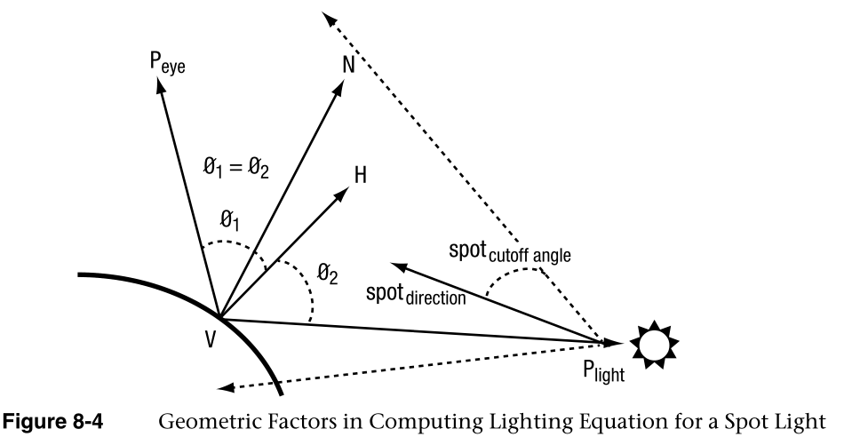

# 顶点着色器

Vertex Shaders

本章介绍OpenGL  ES 2.0可编程顶点流水线。图8-1说明了OpenGL ES 2.0可编程流水线。图8-1中的阴影框表示OpenGL ES  2.0中的可编程阶段。在本章中，我们讨论顶点着色器阶段。顶点着色器可用于执行传统的基于顶点的操作，例如通过**矩阵变换位置**、**计算光照方程**以生成**反常颜色**，以及**生成或变换纹理坐标**。

This chapter describes the OpenGL ES 2.0 programmable vertex pipeline. Figure  8-1 illustrates the OpenGL ES 2.0 programmable pipeline. The shaded boxes in  Figure 8-1 indicate the programmable stages in OpenGL ES 2.0. In this chapter we  discuss the vertex shader stage. Vertex shaders can be used to do traditional  vertex-based operations such as transforming the position by a matrix, computing  the lighting equation to generate a pervertex color, and generating or  transforming texture coordinates.


前几章，特别是第5章，“OpenGL  ES着色语言”和第6章，“顶点属性、顶点数组和缓冲对象”，讨论了如何指定顶点属性和统一输入，并对OpenGL ES  2.0着色语言进行了很好的描述。在第7章“图元组装和光栅化”中，我们讨论了光栅化阶段如何使用顶点着色器的输出(称为可变变量)来生成每个片段的值，然后将这些值输入到片段着色器。在本章中，我们从顶点着色器的高级概述开始，包括它的**输入和输出**。然后，我们讨论OpenGL  ES 2.0着色语言施加的一些限制，并描述在编写需要跨多个OpenGL ES  2.0实现移植的着色器时要记住的要点。然后我们通过讨论几个例子来描述如何编写顶点着色器。这些示例描述了一些常见的用例，**例如用模型视图和投影矩阵转换顶点位置、生成逐顶点漫反射和镜面反射颜色的顶点照明示例、纹理坐标生成和顶点蒙皮。**我们希望这些例子能帮助读者更好地理解如何编写顶点着色器，记住尽可能使顶点着色器便携的规则，**以及顶点着色器可以有多大的上限**。最后但同样重要的是，我们描述了一个实现OpenGL  ES 1.1固定功能顶点流水线的顶点着色器。这两个着色器还应该让读者很好地理解实现OpenGL ES 2.0的第一代手持设备将支持的顶点着色器的复杂性。

The previous chapters, specifically Chapter 5, “OpenGL ES Shading Language,”  and Chapter 6, “Vertex Attributes, Vertex Arrays, and Buffer Objects,” discussed  how to specify the vertex attribute and uniform inputs and also gave a good  description of the OpenGL ES 2.0 shading language. In Chapter 7, “Primitive  Assembly and Rasterization,” we discussed how the output of the vertex shader,  referred to as varying variables, is used by the rasterization stage to generate  per-fragment values, which are then input to the fragment shader. In this  chapter we begin with a high-level overview of a vertex shader including its  inputs and outputs. We then discuss some of the limitations imposed by the  OpenGL ES 2.0 shading language and describe points to keep in mind when writing  shaders that need to be portable across multiple OpenGL ES 2.0 implementations.  We then describe how to write vertex shaders by discussing a few examples. These  examples describe common use cases such as transforming a vertex position with a  model view and projection matrix, examples of vertex lighting that generate  per-vertex diffuse and specular colors, texture coordinate generation, and  vertex skinning. We hope that these examples help the reader get a good idea of  how to write vertex shaders, rules to keep in mind to make vertex shaders  portable as much as possible, and an upper limit on how big vertex shaders can  be. Last but not least, we describe a vertex shader that implements the OpenGL  ES 1.1 fixed function vertex pipeline. These two shaders should also give the  reader a good understanding of the complexity of vertex shaders that will be  supported by the first generation of handheld devices that implement OpenGL ES  2.0.

## 顶点着色器概述

Vertex Shader Overview

顶点着色器提供了一种对顶点进行操作的通用可编程方法。图8-2显示了顶点着色器的输入和输出。顶点着色器的输入包括以下内容:

The vertex shader provides a general-purpose programmable method for operating  on vertices. Figure 8-2 shows the inputs and outputs of a vertex shader. The  inputs to the vertex shader consist of the following:

- 属性—使用顶点数组提供的每个顶点的数据。

  Attributes—Per-vertex data supplied using vertex arrays.

- 统一-顶点着色器使用的恒定数据。

  Uniforms—Constant data used by the vertex shader.

- 着色器程序-顶点着色器程序源代码或可执行文件，描述将在顶点上执行的操作。

  Shader program—Vertex shader program source code or executable that describes  the operations that will be performed on the vertex.

顶点着色器的输出称为可变变量。在图元光栅化阶段，为每个生成的片段计算这些变量的插值，并将其作为输入传递给片段着色器。

The outputs of the vertex shader are called varying variables. In the  primitive rasterization stage, these variables are computed for each generated  fragment and are passed in as inputs to the fragment shader.


## 顶点着色器内置变量

Vertex Shader Built-In Variables

顶点着色器的内置变量可以分为由顶点着色器输出的**特殊变量**、**统一状态**(如深度范围)和**指定最大值**(如属性数量、变量数量和统一数量)的常数。

The built-in variables of a vertex shader can be categorized into special  variables that are output by the vertex shader, uniform state such as depth  range, and constants that specify maximum values such as the number of  attributes, number of varyings, and number of uniforms.

### 内置特殊变量

Built-In Special Variables

OpenGL  ES 2.0具有内置的特殊变量，这些变量要么由**顶点着色器输出**，然后成为片段着色器的输入，要么由**片段着色器输出**。顶点着色器可用的内置特殊变量如下:

**两种：一种是顶点着色器的输出，一个是片段着色器的输出**

OpenGL ES 2.0 has built-in special variables that are either output by the  vertex shader that then become input to the fragment shader, or are output by  the fragment shader. The built-in special variables available to the vertex  shader are as follows:

- GL _POSITION-位置用于输出片段坐标中的顶点位置。gl_Position值由裁剪和视口阶段用来执行图元的适当裁剪，并将顶点位置从裁剪坐标转换为屏幕坐标。

  **GL_POSITION:用于输出片段着色器的顶点位置。**

  - **由裁剪和视口阶段进行执行图元适当的进行裁剪**
  - **裁剪坐标转换为屏幕坐标**

  gl_Position—gl_Position is used to output the vertex position in clip  coordinates. The gl_Position values are used by the clipping and viewport stages  to perform appropriate clipping of primitives and convert the vertex position  from clip coordinates to screen coordinates.

- gl_PointSize—gl_PointSize用于以像素为单位写入点精灵的大小。渲染点精灵时使用gl_PointSize。然后，顶点着色器输出的gl_PointSize值被箝位到OpenGL  ES 2.0实现支持的混叠点大小范围内。gl_PointSize是使用mediump精度限定符声明的浮点变量。

  **精灵的大小：**

  gl_PointSize—gl_PointSize is used to write the size of the point sprite in  pixels. gl_PointSize is used when point sprites are rendered. The gl_PointSize  value output by a vertex shader is then clamped to the aliased point size range  supported by the OpenGL ES 2.0 implementation. gl_PointSize is a floating-point  variable declared using the mediump precision qualifier.

- 这个特殊的变量，虽然不是由顶点着色器直接编写的，但是是基于顶点着色器生成的位置值和渲染的图元类型生成的。gl_FrontFacing是一个布尔变量。

  gl_FrontFacing—This special variable, although not directly written by the  vertex shader, is generated based on the position values generated by the vertex  shader and primitive type being rendered. gl_FrontFacing is a boolean  variable.

## 内置统一状态

Built-In Uniform State

顶点着色器中唯一可用的内置统一状态是窗口坐标中的深度范围。这是由内置的统一名称gl  _ DepthRange给出的，它被声明为gl _ DepthRangeParameters类型的统一。

The only built-in uniform state available inside a vertex shader is the depth  range in window coordinates. This is given by the built-in uniform name  gl_DepthRange, which is declared as a uniform of type  gl_DepthRangeParameters.

```java
struct gl_DepthRangeParameters {
   highp float near; // near Z
   highp float far;  // far Z
   highp float diff; // far - near
}
uniform gl_DepthRangeParameters gl_DepthRange;
```

### 内置常数

Built-In Constants

顶点着色器中还有以下内置常量

The following built-in constants are also available inside the vertex  shader

```c
const medump int GL _ maxvertices = 8；
const medump int GL _ maxverticalxuriormvector = 128；
const mid UMP int GL _ maxvarying vectors = 8；
const medump int GL _ maxverticaltextureimageunits = 0；
const average UMP int GL _ maxcombinationed texture units = 8；
```

内置常数描述了以下最大项:

The built-in constants describe the following maximum terms:

- 这是可以指定的顶点属性的最大数量。所有ES  2.0实现支持的最小值是8

  gl_MaxVertexAttribs—This is the maximum number of vertex attributes that can  be specified. The minimum value supported by all ES 2.0 implementations is  eight.
  
- 这是顶点着色器中可以使用的vec4统一条目的最大数量。所有ES  2.0实现支持的最小值是128个vec4条目。开发人员实际可以使用的vec4统一条目的数量因实现和顶点着色器的不同而不同。例如，某些实现可能会根据统一限制对顶点着色器中使用的用户指定的文字值进行计数。在其他情况下，根据顶点着色器是否使用任何内置超越函数，可能需要包含特定于实现的统一(或常量)。目前还没有一种机制可以让应用程序找到在特定顶点着色器中可以使用的统一条目的数量。顶点着色器编译将会失败，并且在编译日志中可能会有提供关于所使用的统一条目数量的特定信息的信息。但是，编译日志返回的信息是特定于实现的。我们在本章中提供了一些指导，以帮助最大限度地利用顶点着色器中可用的顶点统一条目。

  gl_MaxVertexUniformVectors—This is the maximum number of vec4 uniform entries  that can be used inside a vertex shader. The minimum value supported by all ES  2.0 implementations is 128 vec4 entries. The number of vec4 uniform entries that  can actually be used by a developer can vary from implementation to  implementation and from one vertex shader to another. For example, some  implementations might count user-specified literal values used in a vertex  shader against the uniform limit. In other cases, implementation-specific  uniforms (or constants) might need to be included depending on whether the  vertex shader makes use of any built-in transcendental functions. There  currently is no mechanism that an application can use to find the number of  uniform entries that it can use in a particular vertex shader. The vertex shader  compilation will fail and there might be information in the compile log that  provides specific information with regards to number of uniform entries being  used. However, the information returned by the compile log is implementation  specific. We provide some guidelines in this chapter to help maximize the use of  vertex uniform entries available in a vertex shader.

- GL  _ MaxVaryingVectors—这是可变向量的最大数量；也就是说，顶点着色器可以输出的vec4条目的数量。所有ES  2.0实现支持的最小值是八个vec4条目。

  gl_MaxVaryingVectors—This is the maximum number of varying vectors; that is,  the number of vec4 entries that can be output by a vertex shader. The minimum  value supported by all ES 2.0 implementations is eight vec4 entries.

- 是顶点着色器中可用的纹理单元的最大数量。最小值为0，这意味着该实现不支持顶点纹理提取。

  gl_MaxVertexTextureImageUnits—This is the maximum number of texture units  available in a vertex shader. The minimum value is 0, which implies that the  implementation does not support a vertex texture fetch.

- 这是顶点+片段着色器中可用的纹理单元的最大数量的总和。最小值为八。

  gl_MaxCombinedTextureImageUnits—This is the sum of the maximum number of  texture units available in the vertex + fragment shaders. The minimum value is  eight.

为每个内置常量指定的值是所有OpenGL  ES 2.0实现必须支持的最小值。实现可能支持大于所述最小值的值。可以使用以下代码查询实际支持的值。

The values specified for each built-in constant are the minimum values that  must be supported by all OpenGL ES 2.0 implementations. It is possible that  implementations might support values greater than the minimum values described.  The actual supported values can be queried using the following code.

```java
GLint maxVertexAttribs, maxVertexUniforms, maxVaryings;
GLint maxVertexTextureUnits, maxCombinedTextureUnits;
glGetIntegerv(GL_MAX_VERTEX_ATTRIBS, &maxVertexAttribs);
glGetIntegerv(GL_MAX_VERTEX_UNIFORM_VECTORS, &maxVertexUniforms);
glGetIntegerv(GL_MAX_VARYING_VECTORS, &maxVaryings);
glGetIntegerv(GL_MAX_VERTEX_TEXTURE_IMAGE_UNITS, 
              &maxVertexTextureUnits);
glGetIntegerv(GL_MAX_COMBINED_TEXTURE_IMAGE_UNITS, 
              &maxCombinedTextureUnits);
```

## 精度限定符

Precision Qualifiers

我们简要回顾一下精度限定符。第5章涵盖了精度限定符。精度限定符可用于指定任何基于浮点或整数的变量的精度。用于指定精度的关键字有低、中、高。此处显示了一些带有精度限定符的声明示例。

We do a brief review of precision qualifiers. Precisions qualifiers are  covered in Chapter 5. Precision qualifiers can be used to specify the precision  of any float- or integer-based variable. The keywords for specifying the  precision are lowp, mediump, and highp. Some examples of declarations with  precision qualifiers are shown here.

```java
highp vec4        position;
varying lowp vec4 color;
mediump float     specularExp;
```

除了精度限定符，还有默认精度的概念。也就是说，如果声明的变量没有精度限定符，它将具有该类型的默认精度。默认精度限定符使用以下语法在顶点或片段着色器的顶部指定:

In addition to precision qualifiers, there is also the notion of default  precision. That is, if a variable is declared without having a precision  qualifier, it will have the default precision for that type. The default  precision qualifier is specified at the top of a vertex or fragment shader using  the following syntax:

```java
precision highp float;
precision mediump int;
```

为浮点指定的精度将用作基于浮点值的所有变量的默认精度。同样，为int指定的精度将用作所有基于整数的变量的默认精度。在顶点着色器中，如果**没有指定默认精度，则int和float的默认精度都很高。**

The precision specified for float will be used as the default precision for  all variables based on a floating-point value. Likewise, the precision specified  for int will be used as the default precision for all integer-based variables.  In the vertex shader, if no default precision is specified, the default  precision for both int and float is highp.

进度选择：

- 对于通常在顶点着色器中执行的操作，最可能需要的精度限定符是高精度限定符。
- 用矩阵变换位置，变换法线和纹理坐标，或者生成纹理坐标的操作需要高精度地完成。
- 颜色计算和光照方程很可能以中等精度完成。

这将取决于正在执行的颜色计算的种类以及正在执行的操作所需的范围和精度。我们相信highp很可能是顶点着色器中大多数操作使用的默认精度，因此在下面的示例中使用highp作为默认精度限定符。

For operations typically performed in a vertex shader, the precision qualifier  that will most likely be needed is the highp precision qualifier. Operations  that transform a position with a matrix, transform normals and texture  coordinates, or generate texture coordinates will need to be done with highp  precision. Color computations and lighting equations can most likely be done  with mediump precision. Again, this will depend on the kind of color  computations being performed and the range and precision required for operations  that are being performed. We believe that highp will most likely be the default  precision used for most operations in a vertex shader and therefore use highp as  the default precision qualifier in the examples that follow.

## ES  2.0顶点着色器限制

ES 2.0 Vertex Shader Limitations

在这一节中，我们描述了OpenGL  ES 2.0着色语言对顶点着色器的限制。这些限制应该会有所帮助开发人员编写了一个便携式顶点着色器，可以在大多数OpenGL  ES 2.0实现上编译和运行。

In this section we describe the limitations imposed by the OpenGL ES 2.0  shading language for vertex shaders. These limitations should help developers write a portable vertex shader that should compile and run on most  OpenGL ES 2.0 implementations.

### 顶点着色器的长度

Length of Vertex Shader

没有办法在所有OpenGL  ES  2.0实现中查询顶点着色器支持的最大指令数量。因此，无法确定给定顶点着色器的指令数是否小于或等于一个实现在顶点着色器中支持的指令数。**如果指令计数超过顶点着色器允许的最大指令数，顶点着色器源将无法编译。**

There is no way to query the maximum number of instructions supported in a  vertex shader across all OpenGL ES 2.0 implementations. It is therefore not  possible to say with certainty whether a given vertex shader’s instruction count  is less than or equal to the number of instructions supported in a vertex shader  by an implementation. If the instruction count exceeds the maximum number of  instructions allowed in a vertex shader, the vertex shader source will fail to  compile.

OpenGL  ES工作组认识到，无法查询顶点着色器中的最大指令数和可用制服的实际数量是严重的问题，会使开发人员的生活变得有些困难。该计划是为了能够提供一套顶点(和片段)着色器，这将有助于演示指令的复杂性和统一使用。此外，这套着色器将是OpenGL  ES 2.0一致性测试的一部分，这意味着所有符合OpenGL ES 2.0的实现都能够运行着色器。

The OpenGL ES working group recognizes that not being able to query the  maximum instruction count and the actual number of uniforms available in a  vertex shader are serious issues that can make developers’ lives somewhat  difficult. The plan is to be able to provide a suite of vertex (and fragment)  shaders that will help demonstrate the instruction complexity and uniform usage.  In addition, this suite of shaders will be part of the OpenGL ES 2.0 conformance  test, which means that all conformant OpenGL ES 2.0 implementations will be  capable of running the shaders.

### 临时变量

Temporary Variables

临时变量是指在函数内部声明的变量或存储中间值的变量。因为OpenGL  ES着色语言是高级语言，所以没有办法指定所有OpenGL ES 2.0实现必须支持的最小临时变量数。因此，顶点着色器可能会遇到这个问题，并且不会在所有ES  2.0实现上编译。

A temporary variable refers to a variable declared inside a function or a  variable that stores an intermediate value. Because OpenGL ES shading language  is a high-level language, there is no way to specify the minimum number of  temporary variables that must be supported by all OpenGL ES 2.0 implementations.  It is therefore possible that a vertex shader might run into this issue and not  compile on all ES 2.0 implementations.

### 流量控制

Flow Control

OpenGL  ES  2.0要求实现支持顶点着色器中的循环，而不要求它们必须展开。例如，您可以有一个For循环，循环索引从0到1023。这通常不会被着色器编译器展开，因为展开的着色器的代码大小对于大多数ES  2.0实现来说可能太大。以下限制适用于顶点着色器中使用的循环:

OpenGL ES 2.0 requires implementations to support for loops in a vertex shader  without requiring that they must be unrolled. For example, you could have a for  loop with a loop index that goes from 0 to 1023. This will typically not be  unrolled by the shader compiler, as the code size of the unrolled shader will  most likely be too big for most ES 2.0 implementations.The following restrictions apply to for loops used in a vertex shader:

- 在for循环中只能使用一个循环索引。

  Only one loop index can be used in a for loop.

- 循环索引必须初始化为常数整数表达式。

  The loop index must be initialized to a constant integral  expression.

- for循环中声明的条件表达式必须是下列之一:

  The condition expression declared in the for loop must be one of the  following:

  ```java
  loop_indx < constant_expression
  loop_indx <= constant_expression
  loop_indx > constant_expression
  loop_indx >= constant_expression
  loop_indx != constant_expression
  loop_indx == constant_expression
  ```

- 只能使用以下表达式之一在for循环语句中修改循环索引:

  The loop index can be modified in the for loop statement using one of the  following expressions only:

  ```java
  loop_index--
  loop_index++
  loop_index -= constant_expression
  loop_index += constant_expression
  ```

  

- 循环索引可以作为只读参数传递给for循环中的函数(即循环索引可以与使用in参数限定符声明的参数一起使用)。

  The loop index can be passed as a read-only argument to functions inside the  for loop (i.e., the loop index can be used with arguments declared using the in  parameter qualifier).

```java
Examples of valid for loop constructs are shown here.
const int numLights = 4;
int i, j;
for (i=0; i<numLights; i++)
{
   …
}
for (j=4; j>0; j--)
{
   …
   foo(j);  // argument to function foo that takes j
            // is declared with the in qualifier.
}
```


```java
Examples of invalid for loop constructs are shown here.
uniform int numLights;
int i;
for (i=0; i<numLights; i++)  // conditional expression is 
                             // not constant
{
   …
}
for (i=0; i<8; i++)
{
   i = foo();   // return value of foo() cannot be 
                // assigned to loop index i
}
for (j=4; j>0;)
{
   …
   j--;   // loop index j cannot be modified 
          // inside for loop
}
```

虽然OpenGL  ES 2.0着色语言规范指定了while和do-while循环，但这并不是必需的，因此可能不被所有OpenGL ES 2.0实现所支持。

while and do-while loops, though specified by the OpenGL ES 2.0 shading  language specification, are not a requirement and therefore might not be  supported by all OpenGL ES 2.0 implementations.

### 条件语句

Conditional Statements

完全支持以下条件语句，没有任何限制。

The following conditional statements are fully supported without any  restrictions.

```java
if(bool_expression)
{
   …
}
if(bool_expression)
{
   …
}
else
{
   …
}
```

bool_expression必须是标量布尔值。

bool_expression must be a scalar boolean value.

图形处理器通常**并行执行**具有多个顶点的顶点着色器或具有多个片段的片段着色器。并行执行的顶点或片段的数量将取决于GPU的性能目标。if和if-else条件语句中的bool_expression对于并行执行的顶点或片段可以有不同的值。由于GPU并行执行的顶点或片段数量减少，这可能会影响性能。我们建议，为了获得最佳性能，条件语句应该与bool_expression值一起使用，这些值对于并行执行的顶点或片段是相同的。如果使用统一的表达式，就会出现这种情况.

GPUs typically execute a vertex shader with multiple vertices or a fragment  shader with multiple fragments in parallel. The number of vertices or fragments  that are executed in parallel will depend on the GPU’s performance target. The  bool_expression in the if and if-else conditional statements can have different  values for the vertices or fragments being executed in parallel. This can impact  performance as the number of vertices or fragments executed in parallel by the  GPU is reduced. We recommend that for best performance, conditional statements  should be used with bool_expression values that are the same for vertices or  fragments being executed in parallel. This will be the case if a uniform  expression is used.

### 数组索引

Array Indexing

完全支持制服(不包括采样器)的数组索引。数组索引可以是常量、统一值或计算值。采样器只能使用常数积分表达式进行索引。常数积分表达式是文字值(如4)，常数整数变量(如const  int sampler _ indx = 3；)，或者常量表达式(例如3 + sampler_indx)。

Array indexing of uniforms (excluding samplers) is fully supported. The array  index can be a constant, uniform, or computed value. Samplers can only be  indexed using a constant integral expression. A constant integral expression is  a literal value (e.g., 4), a const integer variable (e.g., const int  sampler_indx = 3;), or a constant expression (e.g., 3 + sampler_indx).

属性矩阵和向量可以使用常数积分表达式进行索引。不强制使用非常数积分表达式对属性矩阵和向量进行索引。然而，这是一个非常有用的特性。下面的代码显示了一个执行顶点蒙皮的顶点着色器。a_matrixweights是一个存储矩阵权重的顶点属性，最多可存储四个矩阵。

Attribute matrices and vectors can be indexed using a constant integral  expression. Indexing attribute matrices and vectors with a non-constant integral  expression is not mandated. This, however, is a very useful feature. The  following code shows a vertex shader that performs vertex skinning.  a_matrixweights is a vertex attribute that stores the matrix weight, for up to  four matrices.

```java
attribute vec4 a_matrixweights; // matrix weights 
attribute vec4 a_matrixindices;  // matrix palette indices
int i;
for (i=0; i<=3; i++)
{
   float   m_wt = a_matrixweights[i];
   int     m_indx = int(a_matrixindices[i]) * 3;
   …
}
```

以粗体突出显示的代码a_matrixweights[i]和a_matrixindices[i]不需要支持，因此可能无法编译。

The code a_matrixweights[i] and a_matrixindices[i] highlighted in bold is not  required to be supported and can therefore fail to compile.

注意:索引常数矩阵和向量、变量和变量或变量和变量数组的规则与已经描述的属性的规则相同

Note: The rules for indexing constant matrices and vectors, varyings and  variables, or arrays of varyings and variables are the same as those for  attributes already described

### 计算顶点着色器中使用的制服数量

Counting Number of Uniforms Used in a Vertex Shader

gl  _ MaxVertexUniformVectors描述顶点着色器中可以使用的最大制服数量。任何兼容的OpenGL ES 2.0实现都必须支持的gl _  MaxVertexUniformVectors的最小值是128个vec4条目。统一存储用于存储以下变量:

gl_MaxVertexUniformVectors describes the maximum number of uniforms that can  be used in a vertex shader. The minimum value for gl_MaxVertexUniformVectors  that must be supported by any compliant OpenGL ES 2.0 implementation is 128 vec4  entries. The uniform storage is used to store the following variables:

- 用统一限定符声明的变量。

  Variables declared with the uniform qualifier.

- 常量变量。

  Const variables.

- •  Literal values.

- 特定于实现的常数

  Implementation-specific constants

顶点着色器中使用的统一变量的数量以及用常量限定符、文字值和特定于实现的常量声明的变量必须符合第5章中描述的打包规则。如果这些不适合，那么顶点着色器将无法编译。开发人员可以应用打包规则，并确定存储统一变量、常量变量和文字值所需的统一存储量。无法确定特定于实现的常量的数量，因为该值不仅会因实现而异，还会根据顶点着色器使用的内置着色语言函数而变化。通常，当使用内置超越函数时，需要特定于实现的常数。

The number of uniform variables used in a vertex shader along with the  variables declared with the const qualifier, literal values, and  implementation-specific constants must fit in gl_MaxVertexUniformVectors as per  the packing rules described in Chapter 5. If these do not fit, then the vertex  shader will fail to compile. It is possible for a developer to apply the packing  rules and determine the amount of uniform storage needed to store uniform  variables, const variables, and literal values. It is not possible to determine  the number of implementation-specific constants as this value will not only vary  from implementation to implementation but will also change depending on which  built-in shading language functions are being used by the vertex shader.  Typically, the implementation-specific constants are required when built-in  transcendental functions are used.

就文字值而言，OpenGL  ES  2.0着色语言规范声明不假设常数传播。这意味着同一文字值的多个实例将被多次计数。可以理解，在顶点着色器中使用文字值(如0.0或1.0)更容易，但我们建议尽可能避免这种情况。应该声明适当的常量变量，而不是使用文字值。这避免了多次使用相同的文字值计数，如果顶点统一存储要求超过实现支持的范围，这可能导致顶点着色器无法编译。

As far as literal values are concerned, the OpenGL ES 2.0 shading language  spec states that no constant propagation is assumed. This means that multiple  instances of the same literal value(s) will be counted multiple times.  Understandably it is easier to use literal values such as 0.0 or 1.0 in a vertex  shader, but our recommendation is that this be avoided as much as possible.  Instead of using literal values, appropriate const variables should be declared.  This avoids having the same literal value count multiple times, which might  cause the vertex shader to fail to compile if vertex uniform storage  requirements exceed what the implementation supports.

考虑下面的例子，它描述了顶点着色器代码的一个片段，该代码为每个顶点变换两个纹理坐标:

Consider the following example that describes a snippet of vertex shader code  that transforms two texture coordinates per vertex:

```java
#define NUM_TEXTURES   2
uniform mat4  tex_matrix[NUM_TEXTURES];        // texture matrices
uniform bool  enable_tex[NUM_TEXTURES];        // texture enables
uniform bool  enable_tex_matrix[NUM_TEXTURES]; // texture matrix 
                                               // enables
attribute vec4  a_texcoord0;  // available if enable_tex[0] is true
attribute vec4  a_texcoord1;  // available if enable_tex[1] is true
varying vec4    v_texcoord[NUM_TEXTURES];
v_texcoord[0] = vec4(0.0, 0.0, 0.0, 1.0);
// is texture 0 enabled
if (enable_tex[0])
{
   // is texture matrix 0 enabled
   if(enable_tex_matrix[0])
      v_texcoord[0] = tex_matrix[0] * a_texcoord0;
   else
      v_texcoord[0] = a_texcoord0;
}
v_texcoord[1] = vec4(0.0, 0.0, 0.0, 1.0);
// is texture 1 enabled
if (enable_tex[1])
{
   // is texture matrix 1 enabled
   if(enable_tex_matrix[1])
      v_texcoord[1] = tex_matrix[1] * a_texcoord1;
   else
      v_texcoord[1] = a_texcoord1;
}
```


刚才描述的代码可能导致对文字值0、1、0.0、1.0的每个引用都按照统一存储进行计数。为了保证这些文字值在统一存储中只计数一次，顶点着色器代码段应该编写如下

The code just described might result in each reference to the literal values  0, 1, 0.0, 1.0 counting against the uniform storage. To guarantee that these  literal values count only once against the uniform storage, the vertex shader  code snippet should be written as follows

```java
#define NUM_TEXTURES   2
const int  c_zero = 0;
const int  c_one  = 1;
uniform mat4  tex_matrix[NUM_TEXTURES];        // texture matrices
uniform bool  enable_tex[NUM_TEXTURES];        // texture enables
uniform bool  enable_tex_matrix[NUM_TEXTURES]; // texture matrix 
                                               // enables 	
attribute vec4  a_texcoord0;  // available if enable_tex[0] is true
attribute vec4  a_texcoord1;  // available if enable_tex[1] is true
varying vec4    v_texcoord[NUM_TEXTURES];
v_texcoord[c_zero] = vec4(float(c_zero), float(c_zero), 
                          float(c_zero), float(c_one));
// is texture 0 enabled
if(enable_tex[c_zero])
{
   // is texture matrix 0 enabled
   if(enable_tex_matrix[c_zero])
      v_texcoord[c_zero] = tex_matrix[c_zero] * a_texcoord0;
   else
      v_texcoord[c_zero] = a_texcoord0;
}
v_texcoord[c_one] = vec4(float(c_zero), float(c_zero), 
                         float(c_zero), float(c_one));
// is texture 1 enabled
if(enable_tex[c_one])
{
   // is texture matrix 1 enabled
   if(enable_tex_matrix[c_one])
      v_texcoord[c_one] = tex_matrix[c_one] * a_texcoord1;
   else
      v_texcoord[c_one] = a_texcoord1;
}
```

希望这一节有助于很好地理解OpenGL  ES 2.0着色语言的局限性，以及如何编写应该在大多数OpenGL ES 2.0实现上编译和运行的顶点着色器。

Hopefully this section has been helpful in providing a good understanding of  the limitations of the OpenGL ES 2.0 shading language and how to write vertex  shaders that should compile and run on most OpenGL ES 2.0  implementations.


## 顶点着色器示例

Vertex Shader Examples

我们现在展示几个示例，演示如何在顶点着色器中实现以下功能:

We now present a few examples that demonstrate how to implement the following  features in a vertex shader:

- 用矩阵变换顶点位置。

  Transforming vertex position with a matrix.

- 成逐顶点漫反射和镜面反射颜色的光照计算。

  Lighting computations to generate per-vertex diffuse and specular  color.

- 纹理坐标生成。

  Texture coordinate generation.

- 顶点蒙皮。

  Vertex skinning.

这些特性代表了OpenGL  ES 2.0应用程序希望在顶点着色器中执行的典型用例。

These features represent typical use cases that OpenGL ES 2.0 applications  will want to perform in a vertex shader.

### 一个简单的顶点着色器

A Simple Vertex Shader

示例8-1描述了一个使用OpenGL  ES着色语言编写的简单顶点着色器。顶点着色器将位置及其相关的颜色数据作为输入或属性，通过4 × 4矩阵转换位置，并输出转换后的位置和颜色。

Example 8-1 describes a simple vertex shader written using the OpenGL ES  shading language. The vertex shader takes a position and its associated color  data as inputs or attributes, transforms the position by a 4 × 4 matrix and  outputs the transformed position and color.

```java
Example 8-1 A Simple Vertex Shader 
// uniforms used by the vertex shader
uniform mat4    u_mvp_matrix; // matrix to convert P from 
                              // model space to clip space.
// attributes input to the vertex shader
attribute vec4  a_position;   // input position value
attribute vec4  a_color;      // input vertex color
// varying variables – input to the fragment shader
varying vec4    v_color;      // output vertex color
void
main()
{
   v_color = a_color;
   gl_Position = u_mvp_matrix * a_position;
}
```


然后，设置和光栅化阶段使用变换的顶点位置和图元类型将图元光栅化成片段。对于每个片段，插值的v_color将被计算并作为输入传递给片段着色器。

The transformed vertex positions and primitive type are then used by the setup  and rasterization stages to rasterize the primitive into fragments. For each  fragment, the interpolated v_color will be computed and passed as input to the  fragment shader.


### 顶点着色器中的照明

Lighting in a Vertex Shaderz

在这一节中，我们看一些例子，这些例子计算了方向光和点光源的照明方程。本节中描述的顶点着色器使用OpenGL  ES 1.1照明方程模型来计算方向光或点(或点)光的照明方程。在这里描述的照明例子中，观察者被假设在无穷远处。

In this section, we look at examples that compute the lighting equation for  directional lights and point, spot lights. The vertex shaders described in this  section use the OpenGL ES 1.1 lighting equation model to compute the lighting  equation for a directional or a spot (or point) light. In the lighting examples  described here, the viewer is assumed to be at infinity.

**定向光是一种光源**，它与被照亮的场景中的物体相距无限远。定向光的一个例子是太阳。由于光线在无限远的地方，光源发出的光线是平行的。光线方向向量是一个常数，不需要为每个顶点计算。图8-3描述了计算定向光的照明方程所需的术语。佩叶是观者的位置，困境是光的位置(困境。w  = 0)，N为法线，H为半平面向量。因为困境。w = 0，光线方向矢量将为困境。xyz。半平面向量H计算为|| VPlight + VPeye  ||。由于光源和观察者都在无穷远处，半平面矢量H = ||困境。xyz + (0，0，1) ||。

A directional light is a light source that is at an infinite distance from the  objects in the scene being lit. An example of a directional light is the sun. As  the light is at infinite distance, the light rays from the light source are  parallel. The light direction vector is a constant and does not need to be  computed per vertex. Figure 8-3 describes the terms that are needed in computing  the lighting equation for a directional light. Peye is the position of the  viewer, Plight is the position of the light (Plight .w = 0), N is the normal,  and H is the half-plane vector. Because Plight . w = 0, the light direction  vector will be Plight . xyz. The half-plane vector H is computed as || VPlight +  VPeye ||. As both the light source and viewer are at infinity, the half-plane  vector H = || Plight . xyz + (0, 0, 1) ||.


示例8-2描述了顶点着色器代码，该代码为方向光计算光照方程。方向光属性由包含以下元素的方向光结构描述:

Example 8-2 describes the vertex shader code that computes the lighting  equation for a directional light. The directional light properties are described  by a directional_light struct that contains the following elements:

- 方向-眼睛空间中的标准化光线方向。

  direction—The normalized light direction in eye space.

- 半平面-归一化的半平面向量。这可以为方向光预先计算，因为它不会改变。

  halfplane—The normalized half-plane vector H. This can be precomputed for a  directional light, as it does not change.

- 环境颜色—灯光的环境颜色。

  ambient_color—The ambient color of the light.

- 漫射颜色-光线的漫射颜色。

  diffuse_color—The diffuse color of the light.

- 镜面反射颜色-光线的镜面反射颜色。

  specular_color—The specular color of the light.

计算顶点漫反射和镜面反射颜色所需的材质属性由包含以下元素的材质属性结构描述:

The material properties needed to compute the vertex diffuse and specular  color are described by a material_properties struct that contains the following  elements:

- 环境颜色-材料的环境颜色。

  ambient_color—The ambient color of the material.

- 漫射颜色-材质的漫射颜色。

  diffuse_color—The diffuse color of the material.

- 镜面反射颜色-材质的镜面反射颜色。

  specular_color—The specular color of the material.

- 镜面指数-描述材质光泽的镜面指数，用于控制镜面高光的光泽。

  specular_exponent—The specular exponent that describes the shininess of the  material and is used to control the shininess of the specular  highlight.

```java
Example 8-2 Directional Light
struct directional_light {
   vec3  direction;     // normalized light direction in eye space
   vec3  halfplane;     // normalized half-plane vector
   vec4  ambient_color;
   vec4  diffuse_color;
   vec4  specular_color;
};
struct material_properties {
   vec4   ambient_color;
   vec4   diffuse_color;
   vec4   specular_color;
   float  specular_exponent;
};
const float                  c_zero = 0.0;
const float                  c_one = 1.0;
uniform material_properties  material;
uniform directional_light    light;
// normal has been transformed into eye space and is a normalized 
// value returns the computed color.
void
directional_light(vec3 normal)
{
   vec4   computed_color = vec4(c_zero, c_zero, c_zero, c_zero);
   float  ndotl;  // dot product of normal & light direction
   float  ndoth;  // dot product of normal & half-plane vector
   ndotl = max(c_zero, dot(normal, light.direction));
   ndoth = max(c_zero, dot(normal, light.halfplane));
   computed_color += (light.ambient_color * material.ambient_color);
   computed_color += (ndotl * light.diffuse_color 
                      * material.diffuse_color);
    if (ndoth > c_zero)
   {
      computed_color += (pow(ndoth, material.specular_exponent) * 
                         material.specular_color *
                         light.specular_color);
   }
   return computed_color;
}
```


示例8-2中描述的方向光顶点着色器代码将每个顶点的漫反射和镜面反射颜色合并为一种颜色(由computed_color给出)。另一个选择是计算每个顶点的漫反射和镜面反射颜色，并将它们作为单独的可变变量传递给片段着色器。

The directional light vertex shader code described in Example 8-2 combines the  per-vertex diffuse and specular color into a single color (given by  computed_color). Another option would be to compute the per-vertex diffuse and  specular colors and pass them as separate varying variables to the fragment  shader.

注意:在示例8-2中，我们将材质颜色(环境色、漫射色和镜面色)与亮色相乘。如果我们只计算一盏灯的照明方程，这很好。如果我们必须计算多个灯光的照明方程，我们应该计算每个灯光的环境、漫射和镜面反射值，然后通过将材质环境、漫射和镜面反射颜色乘以适当的计算项来计算最终的顶点颜色，然后将它们相加以生成每个顶点的颜色。

Note: In Example 8-2 we multiply the material colors (ambient, diffuse, and  specular) with the light colors. This is fine if we are computing the lighting  equation for only one light. If we have to compute the lighting equation for  multiple lights, we should compute the ambient, diffuse, and specular values for  each light and then compute the final vertex color by multiplying the material  ambient, diffuse, and specular colors to appropriate computed terms and then  summing them all to generate a per-vertex color.

点光源是一种从空间的某个位置向各个方向发出光的光源。点光源由位置向量(x，y，z，w)给出，其中w  ≠ 0。点光源在所有方向上均匀发光，但是其强度根据从光源到物体的距离而下降(即衰减)。该衰减使用以下等式计算:

A point light is a light source that emanates light in all directions from a  position in space. A point light is given by a position vector (x, y, z, w),  where w ≠ 0. The point light shines evenly in all directions but its intensity  falls off (i.e., gets attenuated) based on the distance from the light to the  object. This attenuation is computed using the following equation:


​	

K0、K1和K2是常数、线性和二次衰减因子。聚光灯是一种既有位置又有方向的光源，它模拟从一个位置(困境)沿一个方向(由点方向给出)发射的光锥。图8-4描述了计算聚光灯照明方程所需的术语。

K0, K1, and K2 are the constant, linear, and quadratic attenuation factors. A  spotlight is a light source with both a position and a direction that simulates  a cone of light emitted from a position (Plight) in a direction (given by  spotdirection). Figure 8-4 describes the terms that are needed in computing the  lighting equation for a spotlight.




根据与圆锥体中心的角度，发射光的强度通过光斑截止因子衰减。从圆锥中心的这个角度被计算为VPlight和spotdirection的点积。光斑截止因子在光斑方向给出的光斑方向上为1.0，并以指数形式下降到0.0光斑截止角弧度。

The intensity of the emitted light is attenuated by a spot cutoff factor based  on the angle from the center of the cone. This angle from the center of the cone  is computed as the dot product of VPlight and spotdirection. The spot cutoff  factor is 1.0 in the spot light direction given by spotdirection and falls off  exponentially to 0.0 spotcutoff angle radians away.

示例8-3描述了顶点着色器代码，该代码计算聚光灯(和点光源)的照明方程。聚光灯属性由包含以下元素的聚光灯结构描述:

Example 8-3 describes the vertex shader code that computes the lighting  equation for a spot (and point) light. The spot light properties are described  by a spot_light struct that contains the following elements:

- 方向-眼睛空间中的光线方向。

  direction—The light direction in eye space.

- 环境颜色—灯光的环境颜色。

  ambient_color—The ambient color of the light.

- 漫射颜色-光线的漫射颜色。

  diffuse_color—The diffuse color of the light.

- 镜面反射颜色—光线的镜面反射颜色

  specular_color—The specular color of the light

- 衰减系数—距离衰减系数K0、K1和K2。

  attenuation_factors—The distance attenuation factors K0, K1, and K2.

- 计算距离衰减-该布尔项决定是否必须计算距离衰减。

  compute_distance_attenuation—This boolean term determines if the distance  attenuation must be computed.

- 斑点方向-标准化的斑点方向向量。

  spot_direction—The normalized spot direction vector.

- 聚光灯指数—用于计算聚光灯截止因子的聚光灯指数。

  spot_exponent—The spotlight exponent used to compute the spot cutoff  factor.

- 聚光灯截止角度—聚光灯截止角度，单位为度。

  spot_cutoff_angle—The spotlight cutoff angle in degrees.


```java
Example 8-3 Spot Light
struct spot_light {
   vec4    position;            // light position in eye space
   vec4    ambient_color;
   vec4    diffuse_color;
   vec4    specular_color;
   vec3    spot_direction;      // normalized spot direction
   vec3    attenuation_factors; // attenuation factors K0, K1, K2
   bool    compute_distance_attenuation; 
   float   spot_exponent;       // spotlight exponent term
   float   spot_cutoff_angle;   // spot cutoff angle in degrees
};
struct material_properties {
   vec4    ambient_color;
   vec4    diffuse_color;
   vec4    specular_color;
   float   specular_exponent;
};
const float                  c_zero = 0.0;
const float                  c_one = 1.0;
uniform material_properties  material;
uniform spot_light           light;
// normal and position are normal and position values in eye space.
// normal is a normalized vector.
// returns the computed color.
vec4
spot_light(vec3 normal, vec4 position)
{
   vec4    computed_color = vec4(c_zero, c_zero, c_zero, c_zero);
   vec3    lightdir;
   vec3    halfplane;
   float   ndotl, ndoth;
   float   att_factor;
   att_factor = c_one;
   // we assume "w" values for light position and 
   // vertex position are the same
   lightdir = light.position.xyz - position.xyz;
   // compute distance attenuation
   if(light.compute_distance_attenuation)
   {
       vec3    att_dist;
      att_dist.x = c_one;
      att_dist.z = dot(lightdir, lightdir);
      att_dist.y = sqrt(att_dist.z);
      att_factor = c_one / dot(att_dist, light.attenuation_factors);
   }
   // normalize the light direction vector
   lightdir = normalize(lightdir);
   // compute spot cutoff factor
   if(light.spot_cutoff_angle < 180.0)
   {
      float  spot_factor = dot(-lightdir, light.spot_direction);
      if(spot_factor >= cos(radians(light.spot_cutoff_angle)))
         spot_factor = pow(spot_factor, light.spot_exponent);
      else
         spot_factor = c_zero;
      // compute combined distance & spot attenuation factor
      att_factor *= spot_factor;
   }
   if(att_factor > c_zero)
   {
      // process lighting equation --> compute the light color
      computed_color += (light.ambient_color * 
                         material.ambient_color);
      ndotl = max(c_zero, dot(normal, lightdir));
      computed_color += (ndotl * light.diffuse_color * 
                         material.diffuse_color);
      halfplane = normalize(lightdir + vec3(c_zero, c_zero, c_one));
      ndoth = dot(normal, halfplane);
      if (ndoth > c_zero)
      {
         computed_color += (pow(ndoth, material.specular_exponent)* 
                            material.specular_color * 
                            light.specular_color);
      }
      // multiply color with computed attenuation 
      computed_color *= att_factor;
   }
   return computed_color;
}
```

## 生成纹理坐标

Generating T exture Coordinates

我们看两个在顶点着色器中生成纹理坐标的例子。当通过生成反射矢量来渲染场景中有光泽(即反射性)的对象，然后使用该矢量来计算纹理坐标，该纹理坐标索引为纬度经度图(也称为球面图)或立方体图(表示捕捉反射环境的六个视图或面，假设在有光泽的对象中间有单个视点)。OpenGL  2.0规范将纹理坐标生成模式分别描述为GL _球面_贴图和GL  _反射_贴图。“球体贴图”模式生成一个纹理坐标，该坐标使用一个反射矢量来计算2D纹理坐标，以便查找2D纹理贴图。GL _ REFLOW _  MAP模式生成一个纹理坐标，它是一个反射向量，可以用作查找立方体贴图的3D纹理坐标。示例8-4和8-5描述了生成纹理坐标的顶点着色器代码，该代码将被适当的片段着色器用来计算发光对象上的反射图像。

We look at two examples that generate texture coordinates in a vertex shader.  The two examples are used when rendering shiny (i.e., reflective) objects in a  scene by generating a reflection vector and then using this to compute a texture  coordinate that indexes into a latitude longitude map (also called a sphere map)  or a cube map (represents six views or faces that capture reflected environment  assuming a single viewpoint in the middle of the shiny object). The OpenGL 2.0  specification describes the texture coordinate generation modes as GL_SPHERE_MAP  and GL_REFLECTION_MAP, respectively. The GL_SPHERE_MAP mode generates a texture  coordinate that uses a reflection vector to compute a 2D texture coordinate for  lookup into a 2D texture map. The GL_REFLECTION_MAP mode generates a texture  coordinate that is a reflection vector that can be used as a 3D texture  coordinate for lookup into a cube map. Examples 8-4 and 8-5 describe the vertex  shader code that generates texture coordinates that will be used by the  appropriate fragment shader to calculate the reflected image on the shiny  object.

```java
Example 8-4 Sphere Map Texture Coordinate Generation
// position is the normalized position coordinate in eye space
// normal is the normalized normal coordinate in eye space
// returns a vec2 texture coordinate
vec2
sphere_map(vec3 position, vec3 normal)
{
   reflection = reflect(position, normal);
   m = 2.0 * sqrt(reflection.x * reflection.x +
                  reflection.y * reflection.y +
                  (reflection.z + 1.0) * (reflection.z + 1.0));
   return vec2((reflection.x / m + 0.5), (reflection.y / m + 0.5));
}
```


```java
Example 8-5 Cube Map Texture Coordinate Generation
// position is the normalized position coordinate in eye space
// normal is the normalized normal coordinate in eye space
// returns the reflection vector as a vec3 texture coordinate
vec3
cube_map(vec3 position, vec3 normal)
{
   return reflect(position, normal);
}
```


然后，反射向量将在片段着色器中用作相应立方体贴图的纹理坐标。

The reflection vector will then be used inside a fragment shader as the  texture coordinate to the appropriate cube map.

## 顶点蒙皮

Vertex Skinning

顶点蒙皮是一种常用的技术，通过它可以平滑多边形之间的连接。这是通过对每个顶点应用具有适当权重的附加变换矩阵来实现的。用于蒙皮顶点的多个矩阵存储在矩阵调色板中。每个顶点的矩阵索引用于引用矩阵调色板中适当的矩阵，这些矩阵将用于蒙皮顶点。顶点蒙皮通常用于3D游戏中的角色模型，以确保它们看起来平滑和逼真(尽可能)，而不必使用额外的几何图形。用于对顶点进行蒙皮的矩阵数量通常为2到4个。

Vertex skinning is a commonly used technique whereby the joins between  polygons are smoothed. This is implemented by applying additional transform  matrices with appropriate weights to each vertex. The multiple matrices used to  skin vertices are stored in a matrix palette. Matrices indices per vertex are  used to refer to appropriate matrices in the matrix palette that will be used to  skin the vertex. Vertex skinning is commonly used for character models in 3D  games to ensure that they appear smooth and realistic (as much as possible)  without having to use additional geometry. The number of matrices used to skin a  vertex is typically two to four.

顶点蒙皮的数学公式如下:

The mathematics of vertex skinning is given by the following  equations:


其中

- N是将用于变换顶点的矩阵的数目
- P是顶点位置
- P’是变换的(蒙皮)位置
- N是顶点法线
- N’是变换的(蒙皮)法线
- Mi是与每个顶点的ith矩阵相关联的矩阵，并且被计算为Mi  = matrix _ palette[matrix_index[I]]，每个顶点指定N个matrix _  index值
- Mi-1T是矩阵
- Mi的逆转置
- wi是与矩阵相关联的权重


原文:  可修改后右键重新翻译

where n is the number of matrices that will be used to transform the vertex P  is the vertex position P′ is the transformed (skinned) position N is the vertex  normal N′ is the transformed (skinned) normal Mi is the matrix associated with  the ith matrix per vertex and is computed as Mi = matrix_palette [  matrix_index[i] ] with n matrix_index values specified per vertex Mi-1T is the  inverse transpose of matrix Mi wi is the weight associated with the  matrix

我们讨论了如何用32个矩阵的矩阵调色板和每个顶点最多四个矩阵来实现顶点蒙皮，以生成蒙皮的顶点。矩阵调色板大小为32个矩阵是很常见的。矩阵面板中的矩阵通常是4  × 3列主矩阵(即每个矩阵有4个vec3条目)。如果矩阵以列-主顺序存储，这将采用128个统一条目，每个统一条目的三个元素用于存储一行。所有OpenGL ES  2.0实现都支持的gl _  MaxVertexUniformVectors的最小值是128个vec4条目。这意味着我们只有这128个vec4统一条目的第四行可用。这一排彩车只能用于存放声明为彩车类型的制服(根据统一包装规则)。因此没有空间存放vec2、vec3或vec4制服。最好是将矩阵以行主顺序存储在面板中，每个矩阵使用三个vec4条目。如果我们这样做了，那么我们使用96个vec4的制服存储，剩下的32个vec4条目可以用来存储其他制服。请注意，我们没有足够的统一存储来存储计算蒙皮法线所需的逆转置矩阵。这通常不是问题，因为在大多数情况下，使用的矩阵是正交的，因此可以用来变换顶点位置和法线。

We discuss how to implement vertex skinning with a matrix palette of 32  matrices and up to four matrices per vertex to generate a skinned vertex. A  matrix palette size of 32 matrices is quite common. The matrices in the matrix  palette typically are 4 × 3 column major matrices (i.e., four vec3 entries per  matrix). If the matrices were to be stored in column-major order, this will take  128 uniform entries with three elements of each uniform entry used to store a  row. The minimum value of gl_MaxVertexUniformVectors that is supported by all  OpenGL ES 2.0 implementations is 128 vec4 entries. This means we will only have  the fourth row of these 128 vec4 uniform entries available. This row of floats  can only be used to store uniforms declared to be of type float (as per the  uniform packing rule). There is no room therefore to store a vec2, vec3, or vec4  uniform. It would be better to store the matrices in the palette in row-major  order using three vec4 entries per matrix. If we did this, then we use 96 vec4’s  of uniform storage and the remaining 32 vec4 entries can be used to store other  uniforms. Note that we do not have enough uniform storage to store inverse  transpose matrices needed to compute the skinned normal. This is typically not a  problem as in most cases the matrices used are orthonormal and therefore can be  used to transform the vertex position and the normal.

示例8-6描述了计算蒙皮法线和位置的顶点着色器代码。我们假设矩阵面板中有32个矩阵，并且这些矩阵是以行主顺序存储的。矩阵也被假定为正交的(即，相同的矩阵可以用于变换位置和法线)，并且最多四个矩阵用于变换每个顶点。

Example 8-6 describes the vertex shader code that computes the skinned normal  and position. We assume 32 matrices in the matrix palette, and that the matrices  are stored in row-major order. The matrices are also assumed to be orthonormal  (i.e., the same matrix can be used to transform position and normal) and up to  four matrices are used to transform each vertex.

```java
Example 8-6 Vertex Skinning Shader with No Check to See if Matrix Weight = 0
#define NUM_MATRICES  32  // 32 matrices in matrix palette
const int       c_zero  = 0;
const int       c_one   = 1;
const int       c_two   = 2;
const int       c_three = 3;
// store 32 4 x 3 matrices as an array of floats representing 
// each matrix in row-major order i.e. 3 vec4s 
uniform vec4    matrix_palette[NUM_MATRICES * 3];
// vertex position and normal attributes
attribute vec4  a_position
attribute vec3  a_normal;
// matrix weights - 4 entries / vertex
attribute vec4  a_matrixweights;
// matrix palette indices
attribute vec4  a_matrixindices;
void
skin_position(in vec4 position, float m_wt, int m_indx, 
                                out vec4 skinned_position)
{
   vec4    tmp;
   tmp.x = dot(position, matrix_palette[m_indx]);
   tmp.y = dot(position, matrix_palette[m_indx + c_one]);
   tmp.z = dot(position, matrix_palette[m_indx + c_two]);
   tmp.w = position.w;
        
   skinned_position += m_wt * tmp;
}
void
skin_normal(in vec3 normal, float m_wt, int m_indx, 
                                out vec3 skinned_normal)
{
   vec3    tmp;
   tmp.x = dot(normal, matrix_palette[m_indx].xyz);
   tmp.y = dot(normal, matrix_palette[m_indx + c_one].xyz);
   tmp.z = dot(normal, matrix_palette[m_indx + c_two].xyz);
   skinned_position += m_wt * tmp;
}
void
do_skinning(in vec4 position, in vec3 normal,
            out vec4 skinned_position, out vec4 skinned_normal)
{
   skinned_position = vec4(float(c_zero));
   skinned_normal = vec3(float(c_zero));
   // transform position and normal to eye space using matrix 
   // palette with four matrices used to transform a vertex
   m_wt = a_matrixweights[0];
   m_indx = int(a_matrixindices[0]) * c_three;
   skin_position(position, m_wt, m_indx, skinned_position);
   skin_normal(normal, m_wt, m_indx, skinned_normal);
   m_wt = a_matrixweights[1];
   m_indx = int(a_matrixindices[1]) * c_three;
   skin_position(position, m_wt, m_indx, skinned_position);
    skin_normal(normal, m_wt, m_indx, skinned_normal);
   m_wt = a_matrixweights[2];
   m_indx = int(a_matrixindices[2]) * c_three;
   skin_position(position, m_wt, m_indx, skinned_position);
   skin_normal(normal, m_wt, m_indx, skinned_normal);
   m_wt = a_matrixweights[3];
   m_indx = int(a_matrixindices[3]) * c_three;
   skin_position(position, m_wt, m_indx, skinned_position);
   skin_normal(normal, m_wt, m_indx, skinned_normal);
}
```


在示例8-6中，顶点蒙皮着色器通过用四个矩阵和适当的矩阵权重变换顶点来生成蒙皮顶点。一些矩阵权重可能为零，这是可能的，也是很常见的。在示例8-6中，使用所有四个矩阵变换顶点，而不考虑它们的权重。在调用skin_position和skin_normal之前，最好使用条件表达式来检查矩阵权重是否为零。示例8-7描述了在应用矩阵变换之前检查矩阵权重是否为零的顶点蒙皮着色器。

In Example 8-6, the vertex skinning shader generates a skinned vertex by  transforming a vertex with four matrices and appropriate matrix weights. It is  possible and quite common that some of these matrix weights may be zero. In  Example 8-6, the vertex is transformed using all four matrices, irrespective of  their weights. It might be better to use a conditional expression to check if  matrix weight is zero before calling skin_position and skin_normal. Example 8-7  describes the vertex skinning shader that checks if the matrix weight is zero  before applying the matrix transformation.

```java
Example 8-7 Vertex Skinning Shader with Checks to See if Matrix Weight = 0
void
do_skinning(in vec4 position, in vec3 normal,
            out vec4 skinned_position, out vec4 skinned_normal)
{
   skinned_position = vec4(float(c_zero));
   skinned_normal = vec3(float(c_zero));
   // transform position and normal to eye space using matrix 
   // palette with four matrices used to transform a vertex
   m_wt = a_matrixweights[0];
   if(m_wt > 0.0)
   {
       m_indx = int(a_matrixindices[0]) * c_three;
       skin_position(position, m_wt, m_indx, skinned_position);
       skin_normal(normal, m_wt, m_indx, skinned_normal);
   }
   m_wt = a_matrixweights[1];
   if(m_wt > 0.0)
   {   m_indx = int(a_matrixindices[1]) * c_three;
       skin_position(position, m_wt, m_indx, skinned_position);
       skin_normal(normal, m_wt, m_indx, skinned_normal);
   }
   m_wt = a_matrixweights[2];
   if(m_wt > 0.0)
   {
       m_indx = int(a_matrixindices[2]) * c_three;
       skin_position(position, m_wt, m_indx, skinned_position);
       skin_normal(normal, m_wt, m_indx, skinned_normal);
   }
   m_wt = a_matrixweights[3];
   if(m_wt > 0.0)
   {
       m_indx = int(a_matrixindices[3]) * c_three;
       skin_position(position, m_wt, m_indx, skinned_position);
       skin_normal(normal, m_wt, m_indx, skinned_normal);
   }
}
```


乍一看，我们可能会得出结论，示例8-7中的顶点蒙皮着色器比示例8-6中的顶点蒙皮着色器具有更好的性能。这不一定是真的，答案可能因图形处理器而异。这是因为在条件表达式if  (m_wt >  0.0)中，m_wt是一个动态值，对于由GPU并行执行的顶点可以不同。我们现在遇到发散流控制，其中并行执行的顶点可能具有不同的m_wt值，这可能导致执行序列化。如果图形处理器没有有效地实现发散流控制，那么示例8-7中的顶点着色器可能不如示例8-6中的版本高效。因此，作为应用程序初始化阶段的一部分，应用程序应该通过在GPU上执行测试着色器来测试发散流控制的性能，以确定使用哪些着色器。

At first glance, we might conclude that the vertex skinning shader in Example  8-7 has better performance than the vertex skinning shader in Example 8-6. This  is not necessarily true and the answer can vary across GPUs. This is because in  the conditional expression if (m_wt > 0.0), m_wt is a dynamic value and can  be different for vertices being executed in parallel by the GPU. We now run into  divergent flow control where vertices being executed in parallel may have  different values for m_wt and this can cause execution to serialize. If a GPU  does not implement divergent flow control efficiently, the vertex shader in  Example 8-7 might not be as efficient as the version in Example 8-6.  Applications should, therefore, test performance of divergent flow control by  executing a test shader on the GPU as part of the application initialization  phase to determine which shaders to use.

我们希望到目前为止讨论的例子已经很好地理解了顶点着色器，如何编写它们，以及如何将它们用于各种各样的效果。

We hope that the examples discussed so far have provided a good understanding  of vertex shaders, how to write them, and how to use them for a wide-ranging  array of effects.

## OpenGL  ES 1.1顶点流水线作为ES 2.0顶点着色器

OpenGL ES 1.1 Vertex Pipeline as an ES 2.0 Vertex Shader

我们现在讨论一个顶点着色器，它实现了OpenGL  ES 1.1固定函数顶点流水线，而没有顶点蒙皮。这也是一个有趣的练习，旨在弄清楚一个顶点着色器可以有多大才能在所有OpenGL ES 2.0实现中运行。

We now discuss a vertex shader that implements the OpenGL ES 1.1 fixed  function vertex pipeline without vertex skinning. This is also meant to be an  interesting exercise in figuring out how big a vertex shader can be for it to  run across all OpenGL ES 2.0 implementations.

这个顶点着色器实现了OpenGL  ES 1.1顶点管道的以下固定功能:

This vertex shader implements the following fixed functions of the OpenGL ES  1.1 vertex pipeline:

- 如果需要，将法线和位置变换到眼睛空间(通常是照明所需)。还执行正常的重新缩放或归一化。

  Transform the normal and position to eye space, if required (typically  required for lighting). Rescale or normalization of normal is also  performed.

- 计算OpenGL  ES 1.1顶点照明方程，最多八个方向、点或聚光灯，每个顶点有双面照明和颜色材质

  Computes the OpenGL ES 1.1 vertex lighting equation for up to eight  directional, point, or spot lights with two-sided lighting and color material  per vertex

- 每个顶点最多变换两个纹理坐标。

  Transform texture coordinates for up to two texture coordinates per  vertex.

- 计算雾因子传递给片段着色器。片段着色器使用雾化因子在雾化颜色和顶点颜色之间进行插值。

  Compute fog factor passed to fragment shader. The fragment shader uses the fog  factor to interpolate between fog color and vertex color.

- 计算每个顶点的用户裁剪平面因子。仅支持一个用户剪辑平面。

  Computes per-vertex user clip plane factor. Only one user clip plane is  supported.

- 将位置转换为剪辑空间。

  Transform position to clip space.

示例8-8是实现OpenGL  ES 1.1固定函数顶点管道的顶点着色器，如前所述。

Example 8-8 is the vertex shader that implements the OpenGL ES 1.1 fixed  function vertex pipeline as already described.

```java
Example 8-8 OpenGL ES 1.1 Fixed Function Vertex Pipeline
//******************************************************************
//
// OpenGL ES 2.0 vertex shader that implements the following 
// OpenGL ES 1.1 fixed function pipeline
//
// - compute lighting equation for up to eight directional/point/
// - spot lights 
// - transform position to clip coordinates
// - texture coordinate transforms for up to two texture coordinates
// - compute fog factor
// - compute user clip plane dot product (stored as v_ucp_factor)
//
//******************************************************************
    #define NUM_TEXTURES                2
#define GLI_FOG_MODE_LINEAR         0
#define GLI_FOG_MODE_EXP            1
#define GLI_FOG_MODE_EXP2           2
struct light {
   vec4    position;  // light position for a point/spot light or
                      // normalized dir. for a directional light
   vec4    ambient_color;
   vec4    diffuse_color;
   vec4    specular_color;
   vec3    spot_direction;
   vec3    attenuation_factors;
   float   spot_exponent;
   float   spot_cutoff_angle;
   bool    compute_distance_attenuation;
};
struct material {
   vec4    ambient_color;
   vec4    diffuse_color;
   vec4    specular_color;
   vec4    emissive_color;
   float   specular_exponent;
};
const float       c_zero = 0.0;
const float       c_one = 1.0;
const int         indx_zero = 0;
const int         indx_one = 1;
uniform mat4      mvp_matrix;   // combined model-view + 
                                // projection matrix
uniform mat4      modelview_matrix;     // model view matrix
uniform mat3      inv_modelview_matrix; // inverse model-view 
                                        // matrix used 
// to transform normal
uniform mat4      tex_matrix[NUM_TEXTURES]; // texture matrices
uniform bool      enable_tex[NUM_TEXTURES]; // texture enables
uniform bool      enable_tex_matrix[NUM_TEXTURES]; // texture matrix
                                                   // enables
uniform material  material_state;
uniform vec4      ambient_scene_color;
uniform light     light_state[8];
uniform bool      light_enable_state[8];  // booleans to indicate
                                          // which of eight
                                          // lights are enabled
uniform int       num_lights;// number of lights enabled = sum of 
                             // light_enable_state bools set to TRUE
uniform bool      enable_lighting;        // is lighting enabled
uniform bool      light_model_two_sided;  // is two-sided lighting 
                                          // enabled
uniform bool      enable_color_material;  // is color material 
                                          // enabled
uniform bool      enable_fog;             // is fog enabled
uniform float     fog_density;
uniform float     fog_start, fog_end;
uniform int       fog_mode;               // fog mode - linear, exp,
                                          // or exp2
uniform bool      xform_eye_p;   // xform_eye_p is set if we need 
                                 // Peye for user clip plane, 
                                 // lighting, or fog
uniform bool      rescale_normal;     // is rescale normal enabled
uniform bool      normalize_normal;   // is normalize normal enabled
uniform float     rescale_normal_factor; // rescale normal factor if
                                      // glEnable(GL_RESCALE_NORMAL)
uniform vec4      ucp_eqn;       // user clip plane equation –
                                 // - one user clip plane specified
uniform bool      enable_ucp;    // is user clip plane enabled
//******************************************************
// vertex attributes - not all of them may be passed in
//******************************************************
attribute vec4     a_position; // this attribute is always specified
attribute vec4     a_texcoord0;// available if enable_tex[0] is true
attribute vec4     a_texcoord1;// available if enable_tex[1] is true
attribute vec4     a_color;    // available if !enable_lighting or
                       // (enable_lighting && enable_color_material)
attribute vec3     a_normal;   // available if xform_normal is set 
                               // (required for lighting)
//************************************************
// varying variables output by the vertex shader
//************************************************
varying vec4        v_texcoord[NUM_TEXTURES];
varying vec4        v_front_color;
varying vec4        v_back_color;
varying float       v_fog_factor;
varying float       v_ucp_factor;
//************************************************
// temporary variables used by the vertex shader
//************************************************
vec4                p_eye;
vec3                n;
vec4                mat_ambient_color;
vec4                mat_diffuse_color;
vec4
lighting_equation(int i)
{
   vec4    computed_color = vec4(c_zero, c_zero, c_zero, c_zero);
   vec3    h_vec;
   float   ndotl, ndoth;
   float   att_factor;
   att_factor = c_one;
   if(light_state[i].position.w != c_zero)
   {
      float   spot_factor;
      vec3    att_dist;
      vec3    VPpli;
      // this is a point or spot light
      // we assume "w" values for PPli and V are the same
      VPpli = light_state[i].position.xyz - p_eye.xyz;    
      if(light_state[i].compute_distance_attenuation)
      {
          // compute distance attenuation
          att_dist.x = c_one;
          att_dist.z = dot(VPpli, VPpli);
          att_dist.y = sqrt(att_dist.z);
          att_factor = c_one / dot(att_dist, 
             light_state[i].attenuation_factors);
      }
      VPpli = normalize(VPpli);
      if(light_state[i].spot_cutoff_angle < 180.0)
      {
         // compute spot factor
         spot_factor = dot(-VPpli, light_state[i].spot_direction);
         if(spot_factor >= cos(radians(
                               light_state[i].spot_cutoff_angle)))
            spot_factor = pow(spot_factor, 
                              light_state[i].spot_exponent);
         else
            spot_factor = c_zero;
         att_factor *= spot_factor;
           }
   }
   else
   {
      // directional light
      VPpli = light_state[i].position.xyz;
   }
   if(att_factor > c_zero)
   {
      // process lighting equation --> compute the light color
      computed_color += (light_state[i].ambient_color *
                         mat_ambient_color);
      ndotl = max(c_zero, dot(n, VPpli));
      computed_color += (ndotl * light_state[i].diffuse_color *
                         mat_diffuse_color);
      h_vec = normalize(VPpli + vec3(c_zero, c_zero, c_one));
      ndoth = dot(n, h_vec);
      if (ndoth > c_zero)
      {
         computed_color += (pow(ndoth, 
                            material_state.specular_exponent) * 
                            material_state.specular_color * 
                            light_state[i].specular_color);
       }
       computed_color *= att_factor; // multiply color with 
                                     // computed attenuation factor
                                     // * computed spot factor
   }
   return computed_color;
}
float
compute_fog()
{
   float   f;
   // use eye Z as approximation
   if(fog_mode == GLI_FOG_MODE_LINEAR)
   {
      f = (fog_end - p_eye.z) / (fog_end - fog_start);
   }
   else if(fog_mode == GLI_FOG_MODE_EXP)
   {
      f = exp(-(p_eye.z * fog_density));
   }
   else
   {
      f = (p_eye.z * fog_density);
           f = exp(-(f * f));
   }
   f = clamp(f, c_zero, c_one);
   return f;
}
vec4
do_lighting()
{
   vec4    vtx_color;
   int     i, j;
   vtx_color = material_state.emissive_color + 
               (mat_ambient_color * ambient_scene_color);
   j = (int)c_zero;
   for (i=(int)c_zero; i<8; i++)
   {
      if(j >= num_lights)
         break;
      if (light_enable_state[i])
      {
         j++;
         vtx_color += lighting_equation(i);
      }
   }
   vtx_color.a = mat_diffuse_color.a;
   return vtx_color;
}
void
main(void)
{
   int     i, j;
   // do we need to transform P
   if(xform_eye_p)
      p_eye = modelview_matrix * a_position;
   if(enable_lighting)
   {
      n = inv_modelview_matrix * a_normal;
      if(rescale_normal)
         n = rescale_normal_factor * n;
      if (normalize_normal)
               n = normalize(n);
      mat_ambient_color = enable_color_material ? a_color
                                    : material_state.ambient_color;
      mat_diffuse_color = enable_color_material ? a_color
                                    : material_state.diffuse_color;
      v_front_color = do_lighting();
      v_back_color = v_front_color;
      // do 2-sided lighting
      if(light_model_two_sided)
      {
         n = -n;
         v_back_color = do_lighting();
      }
   }
   else
   {
      // set the default output color to be the per-vertex / 
      // per-primitive color
      v_front_color = a_color;
      v_back_color = a_color;
   }
   // do texture xforms
   v_texcoord[indx_zero] = vec4(c_zero, c_zero, c_zero, c_one);
   if(enable_tex[indx_zero])
   {
      if(enable_tex_matrix[indx_zero])
         v_texcoord[indx_zero] = tex_matrix[indx_zero] * 
                                 a_texcoord0;
      else
         v_texcoord[indx_zero] = a_texcoord0;
   }
   v_texcoord[indx_one] = vec4(c_zero, c_zero, c_zero, c_one);
   if(enable_tex[indx_one])
   {
      if(enable_tex_matrix[indx_one])
         v_texcoord[indx_one] = tex_matrix[indx_one] * a_texcoord1;
      else
         v_texcoord[indx_one] = a_texcoord1;
   }
    v_ucp_factor = enable_ucp ? dot(p_eye, ucp_eqn) : c_zero;
    v_fog_factor = enable_fog ? compute_fog() : c_one;
    gl_Position = mvp_matrix * a_position;
}
```

