# 纹理

Texturing

现在我们已经详细介绍了顶点着色器，您应该已经熟悉了转换顶点和准备渲染图元的所有细节。管道中的下一步是片段着色器，OpenGL  ES  2.0的大部分视觉魔法就发生在这里。可编程片段着色器是产生包括纹理、每像素照明和阴影在内的效果的基础。片段着色器的一个基本方面是将纹理应用到表面。本章涵盖了创建、加载和应用纹理的所有细节:

Now that we have covered vertex shaders in detail, you should be familiar with  all of the gritty details in transforming vertices and preparing primitives for  rendering. The next step in the pipeline is the fragment shader, where much of  the visual magic of OpenGL ES 2.0 occurs. Programmable fragment shaders are  fundamental in producing effects that include texturing, per-pixel lighting, and  shadows. A fundamental aspect of fragment shaders is the application of textures  to surfaces. This chapter covers all of the details of creating, loading, and  applying textures:

## 纹理基础

Texting base

渲染3D图形时最基本的操作之一是将纹理应用到表面。纹理允许表示仅从网格几何图形中无法获得的附加细节。OpenGL  ES 2.0中的纹理有两种形式:2D纹理和立方体贴图纹理。纹理通常通过使用纹理坐标应用于表面，纹理坐标可以被认为是纹理阵列数据的索引。下面几节介绍OpenGL ES中不同的纹理类型，以及如何加载和访问它们。

One of the most fundamental operations used in rendering 3D graphics is the  application of textures to a surface. Textures allow for the representation of  additional detail not available just from the geometry of a mesh. Textures in  OpenGL ES 2.0 come in two forms:2D textures and cube map textures. Textures are typically applied to a surface by using texture coordinates that 
can be thought of as indices into texture array data. The following sections introduce the different texture types in OpenGL ES and how they are loaded and accessed.

## 2D纹理

2D纹理是OpenGL  ES中最基本和最常见的纹理形式。正如你可能猜到的那样，2D纹理是一组二维图像数据。纹理的单个数据元素被称为纹理元素。纹理元素是描述纹理像素的一种简化方式。OpenGL  ES中的纹理图像数据可以用很多不同的基本格式表示。纹理数据的基本格式如表9-1所示。

A 2D texture is the most basic and common form of texture in OpenGL ES. A 2D  texture is—as you might guess—a two-dimensional array of image data. The  individual data elements of a texture are known as texels. A texel is a  shortened way of describing a texture pixel. Texture image data in OpenGL ES can  be represented in many different basic formats. The basic formats available for  texture data are shown in Table 9-1.

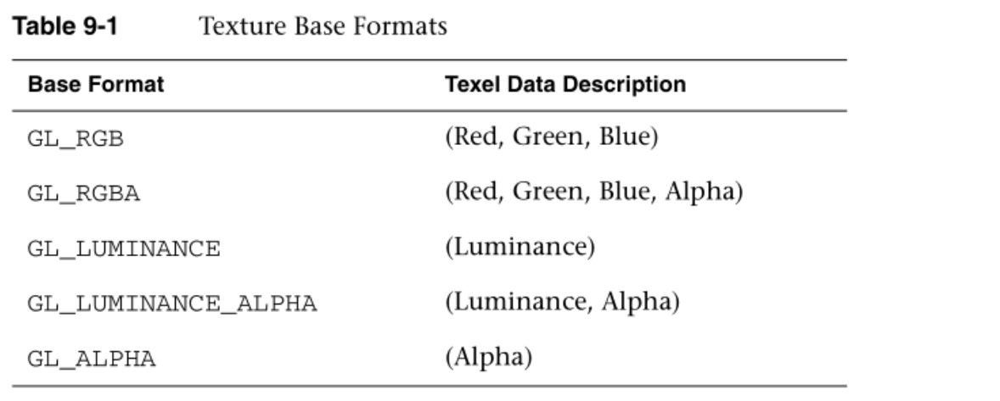


图像中的每个纹理元素都是根据其基本格式和数据类型指定的。稍后，我们将更详细地描述可以表示纹理元素的各种数据类型。目前，需要理解的重要一点是，2D纹理是图像数据的二维数组。当使用2D纹理渲染时，纹理坐标被用作纹理图像的索引。通常，网格将在3D内容创作程序中创作，每个顶点具有纹理坐标。2D纹理的纹理坐标由一对2D坐标(s，t)给出，有时也称为(u，v)坐标。这些坐标代表用于查找纹理图的归一化坐标，如图9-1所示。

Each texel in the image is specified according to its basic format and also  its data type. Later, we describe in more detail the various data types that can  represent a texel. For now, the important point to understand is that a 2D  texture is a two-dimensional array of image data. When rendering with a 2D  texture, a texture coordinate is used as an index into the texture image.  Generally, a mesh will be authored in a 3D content authoring program with each  vertex having a texture coordinate. Texture coordinates for 2D textures are  given by a 2D pair of coordinates (s, t), sometimes also called (u, v)  coordinates. These coordinates represent normalized coordinates used to look up  into a texture map as shown in Figure 9-1.

纹理图像的左下角由st坐标(0.0，0.0)指定。纹理图像的右上角由st坐标(1.0，1.0)指定。允许范围[0.0，1.0]之外的坐标，该范围之外的纹理提取行为由纹理环绕模式定义(在纹理过滤和环绕一节中描述)。

The lower left corner of the texture image is specified by the st-coordinates  (0.0, 0.0). The upper right corner of the texture image is specified by the  st-coordinates (1.0, 1.0). Coordinates outside of the range [0.0, 1.0] are  allowed, and the behavior of texture fetches outside of that range is defined by  the texture wrapping mode (described in the section on texture filtering and  wrapping).

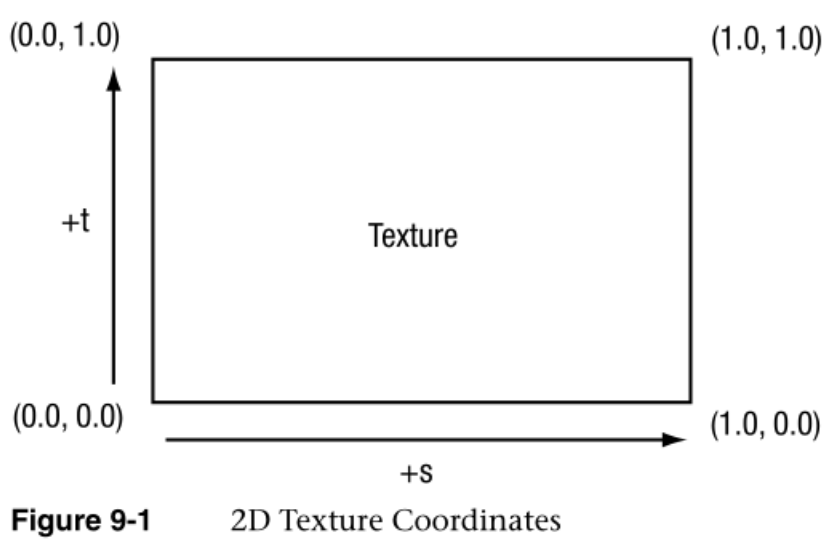


## 立方体贴图

Cubemap Textures

除了2D纹理，OpenGL  ES  2.0还支持立方体贴图纹理。最基本的，立方体贴图是由六个独立的2D纹理面组成的纹理。立方体贴图的每个面代表立方体的六个面之一。立方体贴图在3D渲染中有多种高级用途，但最基本的用途是用于称为环境贴图的效果。为此，通过使用立方体贴图表示环境来渲染环境在对象上的反射。为环境贴图生成立方体贴图的典型方式是将相机放置在场景的中心，从六个轴方向(+X、–X、+Y、–Y、+Z、–Z)中的每一个捕捉场景的图像，并存储在每个立方体面中。

In addition to 2D textures, OpenGL ES 2.0 also supports cubemap textures. At  its most basic, a cubemap is a texture made up of six individual 2D texture  faces. Each face of the cubemap represents one of the six sides of a cube.  Cubemaps have a variety of advanced uses in 3D rendering, but the most basic use  is for an effect known as environment mapping. For this effect, the reflection  of the environment onto the object is rendered by using a cubemap to represent  the environment. The typical way that a cubemap is generated for environment  mapping is that a camera is placed in the center of the scene and an image of  the scene is captured from each of the six axis directions (+X, –X, +Y, –Y, +Z,  –Z) and stored in each cube face.

从立方体贴图中提取纹理元素的方法是使用3D矢量(s，t，r)作为纹理坐标来查找立方体贴图。3D矢量用于首先选择要从立方体贴图的面提取，然后将坐标投影到2D  (s，t)坐标以从立方体贴图面提取。计算2D  (s，t)坐标的实际数学不在我们的讨论范围之内，但可以说3D矢量是用来查找立方体贴图的。你可以通过描绘一个来自立方体内部原点的3D向量来可视化这种工作方式。矢量与立方体相交的点是从立方体贴图中提取的纹理元素。这如图9-2所示，其中一个三维矢量与立方体面相交。

The way that texels are fetched out of a cubemap is by using a 3D vector  (s,t,r) as the texture coordinate to look up into a cubemap. The 3D vector is  used to first select a face of the cubemap to fetch from, and then the  coordinate is projected into a 2D (s,t) coordinate to fetch from the cubemap  face. The actual math for computing the 2D (s,t) coordinate is outside our scope  here, but suffice to say that a 3D vector is used to look up into a cubemap. You  can visualize the way this works by picturing a 3D vector coming from the origin  inside of a cube. The point at which that vector intersects the cube is the  texel that would be fetched from the cubemap. This is shown in Figure 9-2, where  a 3D vector intersects the cube face.

立方体贴图的每个面的指定方式与指定2D纹理的方式相同。每个面必须是正方形的(例如，宽度和高度必须相等)，并且每个面必须具有相同的宽度和高度。用于纹理坐标的3D矢量通常不是(0.0，1.0)  (0.0，0.0) (1.0，1.0) (1.0，0.0)纹理+s +t  184第9章:纹理直接存储在网格的每个顶点上，就像2D纹理一样。相反，获取立方体贴图的最常见方式是使用法向量作为计算立方体贴图纹理坐标的基础。典型地，法向矢量与来自眼睛的矢量一起被用来计算反射矢量，然后该反射矢量被用来查找立方体图。这种计算在第13章“用OpenGL  ES 2.0进行高级编程”的环境映射示例中有所描述

The faces of a cubemap are each specified in the same manner as one would  specify a 2D texture. Each of the faces must be square (e.g., the width and  height must be equal) and each of the faces must have the same width and height.  The 3D vector that is used for the texture coordinate is not normally (0.0, 1.0)  (0.0, 0.0) (1.0, 1.0) (1.0, 0.0) Texture +s +t 184 Chapter 9: Texturing stored  directly per-vertex on the mesh as it is for 2D texturing. Rather, the most  common way cubemaps are fetched from is to use the normal vector as a basis for  computing the cubemap texture coordinate. Typically the normal vector is used  along with a vector from the eye to compute a reflection vector that is then  used to look up into a cubemap. This computation is described in the environment  mapping example in Chapter 13, “Advanced Programming with OpenGL ES  2.0.”

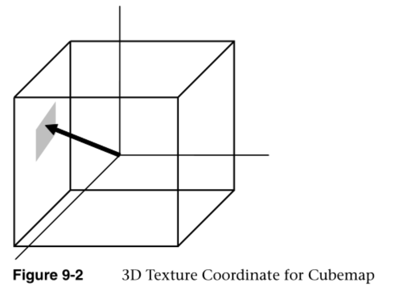


## 纹理对象和加载纹理

Texture Objects and Loading Textures

纹理应用的第一步是创建一个纹理对象。纹理对象是一个容器对象，它保存渲染所需的纹理数据，如图像数据、过滤模式和包装模式。在OpenGL  ES中，纹理对象由一个无符号整数表示，该整数是纹理对象的句柄。用于生成纹理对象的函数是glGenTextures。

The first step in the application of textures is to create a texture object. A  texture object is a container object that holds the texture data that is needed  for rendering such as image data, filtering modes, and wrap modes. In OpenGL ES,  a texture object is represented by an unsigned integer that is a handle to the  texture object. The function that is used for generating texture objects is  glGenTextures.

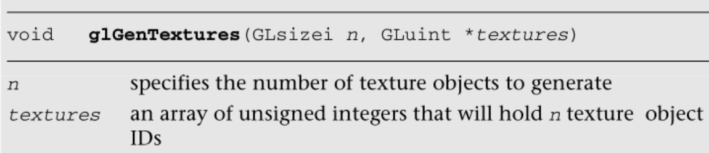


当应用程序不再需要纹理对象时，也需要删除它们。这通常是在应用程序关闭时完成的，例如，在游戏中改变级别时。这可以使用glDeleteTextures来完成。

Texture objects also need to be deleted when an application no longer needs  them. This is typically either done at application shutdown or, for example,  when changing levels in a game. This can be done using  glDeleteTextures.

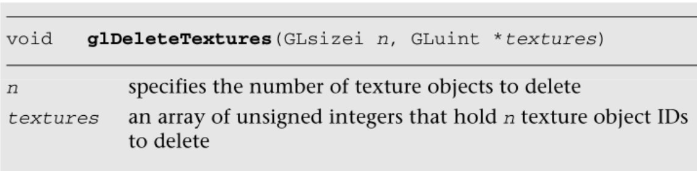

一旦纹理对象标识已经用glGenTextures生成，应用程**序必须绑定纹理对**象才能对其进行操作。一旦纹理对象被绑定，后续操作(如glTexImage2D和glTexParameter)会影响绑定的纹理对象。用于绑定纹理对象的函数是glBindTexture。

Once texture object IDs have been generated with glGenTextures, the  application must bind the texture object to operate on it. Once texture objects  are bound, subsequent operations such as glTexImage2D and glTexParameter affect  the bound texture object. The function used to bind texture objects is  glBindTexture.

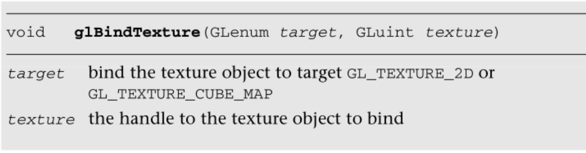


一旦纹理绑定到特定的纹理目标，该纹理对象将保持绑定到该目标，直到被删除。生成纹理对象并将其绑定后，使用纹理的下一步是实际加载图像数据。用于加载纹理的主要功能是glTexImage2D。

Once a texture is bound to a particular texture target, that texture object  will remain bound to that target until it is deleted. After generating a texture  object and binding it, the next step to using a texture is to actually load the  image data. The primary function that is used for loading textures is  glTexImage2D.

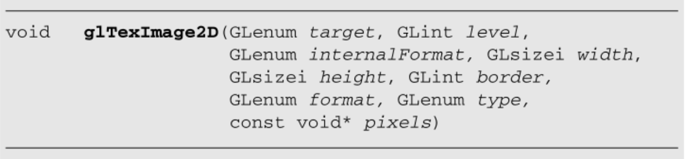

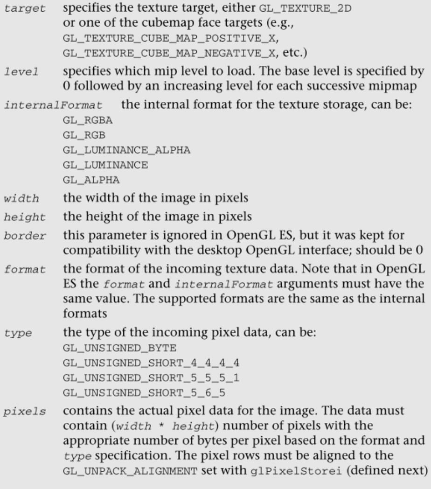


来自Simple_Texture2D示例的示例9-1中的代码演示了生成一个纹理对象，绑定它，然后用由无符号字节组成的RGB图像数据加载一个2  × 2 2D纹理。

The code in Example 9-1 from the Simple_Texture2D example demonstrates  generating a texture object, binding it, and then loading a 2 × 2 2D texture  with RGB image data made from unsigned bytes.

```c
Example 9-1 Generating a Texture Object, Binding It, and Loading Image Data
// Texture object handle
GLuint textureId;
   
// 2 x 2 Image, 3 bytes per pixel(R, G, B)
GLubyte pixels[4 * 3] =
{
   255,   0,   0, // Red
     0, 255,   0, // Green
     0,   0, 255, // Blue
   255, 255,   0  // Yellow
};
// Use tightly packed data
glPixelStorei(GL_UNPACK_ALIGNMENT, 1);
   
// Generate a texture object
glGenTextures(1, &textureId);
// Bind the texture object
glBindTexture(GL_TEXTURE_2D, textureId);
// Load the texture
glTexImage2D(GL_TEXTURE_2D, 0, GL_RGB, 2, 2, 0, GL_RGB, 
             GL_UNSIGNED_BYTE, pixels);
   
// Set the filtering mode
glTexParameteri(GL_TEXTURE_2D, GL_TEXTURE_MIN_FILTER, GL_NEAREST);
glTexParameteri(GL_TEXTURE_2D, GL_TEXTURE_MAG_FILTER, GL_NEAREST);
```

在代码的第一部分，像素阵列用简单的2  ×  2纹理数据初始化。数据由范围为[0，255]的无符号字节RGB三元组组成。当从着色器中的8位无符号字节纹理组件提取数据时，值从范围[0，255]映射到浮点范围[0.0，1.0]。通常，应用程序不会以这种简单的方式创建纹理数据，而是从图像文件中加载数据。提供此示例是为了演示应用编程接口的使用。

n the first part of the code, the pixels array is initialized with simple 2 ×  2 texture data. The data is composed of unsigned byte RGB triplets that are in  the range [0, 255]. When data is fetched from an 8-bit unsigned byte texture  component in the shader, the values are mapped from the range [0, 255] to the  floating-point range [0.0, 1.0]. Typically, an application would not create  texture data in this simple manner but rather load the data from an image file.  This example is provided to demonstrate the use of the API.

请注意，在调用glTexImage2D之前，应用程序会调用glPixelStorei来设置解包对齐。当纹理数据通过glTexImage2D上传时，像素行被假定为与GL  _ UNPACK _  ALIGNMENT的值集对齐。默认情况下，该值为4，这意味着像素行假定从4字节的边界开始。该应用程序将解包对齐设置为1，这意味着每行像素从一个字节边界开始(换句话说，数据是紧密打包的)。接下来给出了glPixelStorei的完整定义。

Note that prior to calling glTexImage2D the application makes a call to  glPixelStorei to set the unpack alignment. When texture data is uploaded via  glTexImage2D, the rows of pixels are assumed to be aligned to the value set for  GL_UNPACK_ALIGNMENT. By default, the value is 4, meaning that rows of pixels are  assumed to begin on 4-byte boundaries. This application sets the unpack  alignment to 1, meaning that each row of pixels begins on a byte boundary (in other words, the data is tightly packed). The full  definition for glPixelStorei is given next.

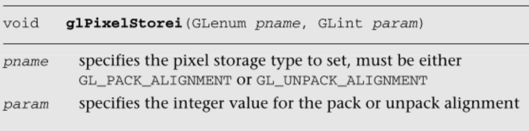

glPixelStorei的GL  _ PACK _  ALIGNMENT参数对纹理图像上传没有任何影响。打包对齐由glReadPixels使用，这在第11章“片段操作”中有所描述。glPixelStorei设置的打包和解包对齐是全局状态，不与纹理对象存储或关联

The GL_PACK_ALIGNMENT argument to glPixelStorei does not have any impact on  texture image uploading. The pack alignment is used by glReadPixels, which is  described in Chapter 11, “Fragment Operations.” The pack and unpack alignments  set by glPixelStorei are global state and are not stored or associated with a  texture object.

回到示例程序，在定义图像数据之后，使用glGenTextures生成一个纹理对象，然后使用glBindTexture将该对象绑定到GL  _ TYTHON _  2D目标。最后，使用glTexImage2D将图像数据加载到纹理对象中。格式被设置为GL_RGB，这表示图像数据由(R，G，B)三元组组成。该类型设置为GL_UNSIGNED_BYTE，表示数据的每个通道都存储在一个8位无符号字节中。加载纹理数据还有许多其他选项，包括表9-1中描述的不同格式。此外，可以使用GL_UNSIGNED_SHORT_4_4_4_4、GL_UNSIGNED_SHORT_5_5_5_1或GL_UNSIGNED_SHORT_5_6_5将纹理元素中的所有组件打包成16位。

Back to the example program, after defining the image data, a texture object  is generated using glGenTextures and then that object is bound to the  GL_TEXTURE_2D target using glBindTexture. Finally, the image data is loaded into  the texture object using glTexImage2D. The format is set as GL_RGB, which  signifies that the image data is composed of (R,G,B) triplets. The type is set  as GL_UNSIGNED_BYTE, which signifies that each channel of the data is stored in  an 8-bit unsigned byte. There are a number of other options for loading texture  data, including different formats as described in Table 9-1. In addition, all of  the components in a texel can be packed into 16 bits using  GL_UNSIGNED_SHORT_4_4_4_4, GL_UNSIGNED_SHORT_5_5_5_1, or  GL_UNSIGNED_SHORT_5_6_5.

代码的最后一部分使用glTexParameteri将缩小和放大过滤模式设置为GL  _ LEASTER。这个代码是必需的，因为我们没有为纹理加载完整的mipmap链，所以我们必须选择一个非MIP  map缩小过滤器。另一个选择是使用GL_LINEAR的缩小和放大模式，它提供双线性非映射过滤。纹理过滤和纹理映射的细节将在下一节解释。

The last part of the code uses glTexParameteri to set the minification and  magnification filtering modes to GL_NEAREST. This code is required because we  have not loaded a complete mipmap chain for the texture so we must select a  nonmipmapped minification filter. The other option would have been to use  minification and magnification modes of GL_LINEAR, which provides bilinear  nonmipmapped filtering. The details of texture filtering and mipmapping are  explained in the next section.

## 纹理过滤和纹理映射

Texture Filtering and Mipmapping

迄今为止，我们对2D纹理的解释仅限于描述一幅2D图像。虽然这让我们能够解释纹理的概念，但实际上在OpenGL  ES中纹理是如何指定和使用的还有一点点。原因与视觉假象和性能有关,使用单一纹理贴图时出现的问题。

so far, we have limited our explanation of 2D textures to describing a single  2D image. Although this allowed us to explain the concept of texturing, there is  actually a bit more to how textures are specified and used in OpenGL ES. The  reason has to do with the visual artifacts and performance issues that occur due to using a single texture map.

正如我们到目前为止所描述的纹理，纹理坐标被用来生成一个2D索引来从纹理图中提取。当缩小和放大过滤器被设置为GL  _ NEXTER时，这正是将要发生的:将在提供的纹理坐标位置提取一个纹理元素。这被称为点采样或最近采样。

As we have described texturing so far, the texture coordinate is used to  generate a 2D index to fetch from the texture map. When the minification and  magnification filters are set to GL_NEAREST, this is exactly what will happen: a  single texel will be fetched at the texture coordinate location provided. This  is known as point or nearest sampling.

然而，最近的采样可能会产生显著的视觉伪影。伪像的原因是，随着三角形在屏幕空间中变小，纹理坐标在从一个像素插值到另一个像素时会有很大的跳跃。结果，从大的纹理图中获取少量样本，导致混叠伪影。OpenGL  ES中用于解决这种类型工件的解决方案被称为mipmapping。mipmapping背后的想法是建立一个称为mipmap链的图像链。mipmap链从最初指定的图像开始，然后继续，每个后续图像在每个维度上的大小是它之前的图像的一半。这个链一直延续到我们在链的底部找到一个1  × 1的纹理。mip级别可以通过编程方式生成，通常通过将mip级别中的每个像素计算为其上方mip级别中相同位置的四个像素的平均值(框过滤)。

However, nearest sampling might produce significant visual artifacts. The  reason for the artifacts is that as a triangle becomes smaller in screen space,  the texture coordinates take large jumps when being interpolated from pixel to  pixel. As a result, a small number of samples are taken from a large texture  map, resulting in aliasing artifacts. The solution that is used to resolve this  type of artifact in OpenGL ES is known as mipmapping. The idea behind mipmapping  is to build a chain of images known as a mipmap chain. The mipmap chain begins  with the originally specified image and then continues with each subsequent  image being half as large in each dimension as the one before it. This chain  continues until we reach a single 1 × 1 texture at the bottom of the chain. The  mip levels can be generated programmatically, typically by computing each pixel  in a mip level as an average of the four pixels at the same location in the mip  level above it (box filtering).

在第9章/MipMap2D示例程序中，我们提供了一个示例，演示如何使用箱式过滤技术为纹理生成MipMap链。生成mipmap链的代码由GenMipMap2D函数给出。该函数将RGB8图像作为输入，并通过对前面的图像执行箱式过滤器来生成下一个mipmap级别。有关如何进行框过滤的详细信息，请参见示例中的源代码。然后使用glTexImage2D加载mipmap链，如示例9-2所示。

In the Chapter_9/MipMap2D sample program, we provide an example demonstrating  how to generate a mipmap chain for a texture using a box filtering technique.  The code to generate the mipmap chain is given by the GenMipMap2D function. This  function takes an RGB8 image as input and generates the next mipmap level by  performing a box filter on the preceding image. Please see the source code in  the example for details on how the box filtering is done. The mipmap chain is  then loaded using glTexImage2D as shown in Example 9-2.

```c
Example 9-2 Loading a 2D Mipmap Chain
// Load mipmap level 0
glTexImage2D(GL_TEXTURE_2D, 0, GL_RGB, width, height, 
             0, GL_RGB, GL_UNSIGNED_BYTE, pixels);
   
level = 1;
prevImage = &pixels[0];
   
while(width > 1 && height > 1)
{
   int newWidth,
       newHeight;
    // Generate the next mipmap level
   GenMipMap2D(prevImage, &newImage, width, height, 
               &newWidth, &newHeight);
   // Load the mipmap level
   glTexImage2D(GL_TEXTURE_2D, level, GL_RGB, 
                newWidth, newHeight, 0, GL_RGB,
                GL_UNSIGNED_BYTE, newImage);
   // Free the previous image
   free(prevImage);
   // Set the previous image for the next iteration
   prevImage = newImage;
   level++;
   // Half the width and height
   width = newWidth;
   height = newHeight;
}
free(newImage);
```

加载了mipmap链后，我们可以设置过滤模式来使用MIP  map。结果是，我们在屏幕像素和纹理像素之间实现了更好的比率，从而减少了混叠伪影。混叠也减少了，因为mipmap链中的每个图像都被连续过滤，因此随着我们在链中的下移，高频元素被进一步衰减。

With a mipmap chain loaded, we can then set up the filtering mode to use  mipmaps. The result is that we achieve a better ratio between screen pixels and  texture pixels and thereby reduce aliasing artifacts. Aliasing is also reduced  because each image in the mipmap chain is successively filtered so that  high-frequency elements are attenuated further and further as we move down the  chain.

纹理化时有两种不同类型的过滤:缩小和放大。缩小是当屏幕上投影多边形的尺寸小于纹理的尺寸时发生的情况。放大是当屏幕上投影多边形的尺寸大于纹理的尺寸时发生的情况。使用哪种过滤类型的决定都是由硬件自动完成的，但是应用编程接口提供了对每种情况下使用哪种过滤类型的控制。对于放大来说，mipmapping是不相关的，因为我们将总是从可用的最大水平进行采样。对于缩小，可以使用多种不同的采样模式。选择使用哪种模式是基于你需要达到的视觉质量，以及为了纹理过滤你愿意放弃多少性能。

There are two different types of filtering that occur when texturing:  minification and magnification. Minification is what happens when the size of  the projected polygon on the screen is smaller than the size of the texture.  Magnification is what happens when the size of the projected polygon on screen  is larger than the size of the texture. The determination of which filter type  to use is all done automatically by the hardware, but the API provides control  over what type of filtering to use in each case. For magnification, mipmapping  is not relevant, because we will always be sampling from the largest level  available. For minification, there are a variety of different sampling modes  that can be used. The choice of which mode to use is based on the visual quality  you need to achieve and how much performance you are willing to give up for  texture filtering.

指定过滤模式的方式是使用GlTextParameter[I  | f][v

The way that the filtering modes are specified is with glTexParameter[i  |f][v

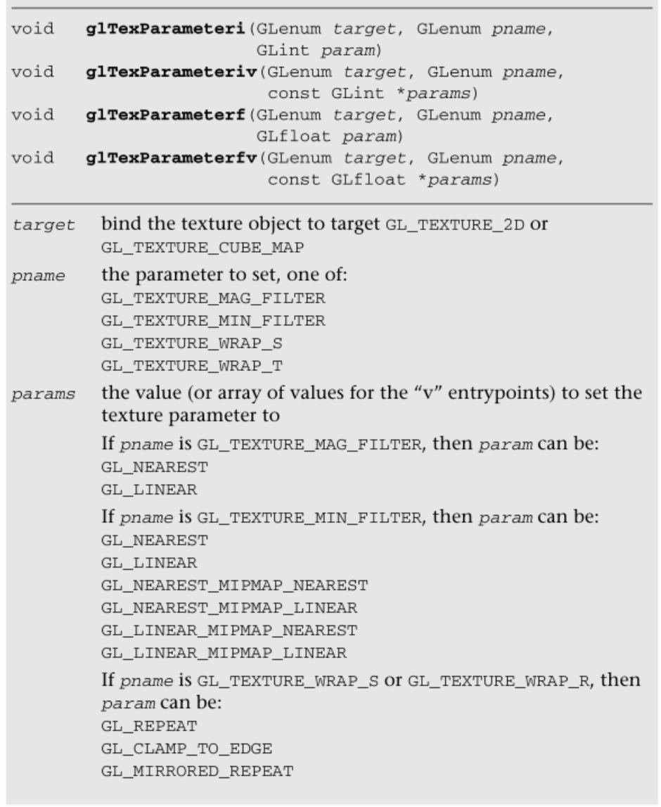

放大过滤器可以是最近的或线性的。在GL  _  NEXTERAL放大过滤中，将从最接近纹理坐标的纹理中获取一个单点样本。在GL_LINEAR放大滤波中，将从纹理坐标附近的纹理中获取双线性(平均四个样本)。

The magnification filter can be either GL_NEAREST or GL_LINEAR. In GL_NEAREST  magnification filtering, a single point sample will be taken from the texture  nearest to the texture coordinate. In GL_LINEAR magnification filtering, a  bilinear (average of four samples) will be taken from the texture about the  texture coordinate.

缩小过滤器可以设置为以下任何值:

The minification filter can be set to any of the following values:

- GL  _ NERSATE-将从最接近纹理坐标的纹理中获取一个单点样本。

  GL_NEAREST—A single point sample will be taken from the texture nearest to the  texture coordinate.

- GL  _ LINEAR将从最接近纹理坐标的纹理中获取双线性样本。

  GL_LINEAR—A bilinear sample will be taken from the texture nearest to the  texture coordinate.

- 最接近——将从所选的最接近的分子印迹水平上取一个单点样品

  GL_NEAREST_MIPMAP_NEAREST—A single point sample will be taken from the closest  mip level chosen

- 将从两个最接近的mip级别中提取一个样本，并在这些样本之间进行插值。

  GL_NEAREST_MIPMAP_LINEAR—Will take a sample from the two closest mip levels  and interpolate between those samples.

- GL  _ LINEAL _ mipPAP _ NEXTERAL—将从所选的最近的MIP级别进行双线性提取。

  GL_LINEAR_MIPMAP_NEAREST—Will take a bilinear fetch from the closest mip level  chosen.

- 将从两个最接近的mip级别中的每一个获取双线性提取，然后在它们之间进行插值。最后一种模式通常被称为三线性滤波，它产生所有模式中最好的质量。

  GL_LINEAR_MIPMAP_LINEAR—Will take a bilinear fetch from each of the two  closest mip levels and then interpolate between them. This last mode is  typically referred to as trilinear filtering and produces the best quality of  all modes.

注意:GL  _ NERSATE和GL _ LINEAR是唯一不需要为纹理指定完整的纹理映射链的纹理缩小模式。所有其他模式都要求纹理存在完整的mipmap链。

Note: GL_NEAREST and GL_LINEAR are the only texture minification modes that do  not require a complete mipmap chain to be specified for the texture. All of the  other modes require that a complete mipmap chain exists for the  texture.

图9-3中的MipMap2D示例显示了用GL  _ NEXTER和GL _ LINEAR _ MIPMAP _ LINEAR滤波绘制的多边形之间的差异。

The MipMap2D example in Figure 9-3 shows the difference between a polygon  drawn with GL_NEAREST versus GL_LINEAR_MIPMAP_LINEAR filtering.

值得一提的是您选择的纹理过滤模式的一些性能影响。如果缩小发生，性能是一个问题，使用mipmap过滤模式通常是大多数硬件的最佳选择。这是因为在没有纹理映射的情况下，纹理缓存的利用率往往非常低，因为提取发生在整个映射的稀疏位置。但是你使用的过滤模式越高，硬件上通常会有一定的性能成本。例如，在大多数硬件上，双线性滤波的成本低于三线性滤波。您应该选择一种模式，在不过度影响性能的情况下，为您提供所需的质量。在一些硬件上，你可以免费获得高质量的过滤，特别是如果纹理过滤的成本不是你的瓶颈的话。这是需要针对您计划运行应用程序的应用程序和硬件进行调整的事情。

It is worth mentioning some performance implications for the texture filtering  mode that you choose. If minification occurs and performance is a concern, using  a mipmap filtering mode is usually the best choice on most hardware. The reason  is because you tend to get very poor texture cache utilization without mipmaps  because fetches happen at sparse locations throughout a map. However, the higher  the filtering mode you use, there usually is some performance cost in the  hardware. For example, on most hardware it is the case that doing bilinear  filtering is less costly than doing trilinear filtering. You should choose a  mode that gives you the quality desired without unduly negatively impacting  performance. On some hardware, you might get high-quality filtering virtually  for free particularly if the cost of the texture filtering is not your  bottleneck. This is something that needs to be tuned for the application and  hardware on which you plan to run your application.

## 自动生成纹理贴图

Automatic Mipmap Generation

在上一节的MipMap2D示例中，应用程序为MipMap链的零级创建了一个图像。然后，它通过对每幅图像执行一个箱式过滤器，并连续将宽度和高度减半，来生成mipmap链的其余部分。这是生成Mipmap的一种方式，但是OpenGL  ES 2.0也提供了一种使用glGenerateMipmap自动生成MIP map的机制。

In the MipMap2D example in the previous section, the application created an  image for level zero of the mipmap chain. It then generated the rest of the  mipmap chain by performing a box filter on each image and successively halving  the width and height. This is one way to generate mipmaps, but OpenGL ES 2.0  also provides a mechanism for automatically generating mipmaps using  glGenerateMipmap.

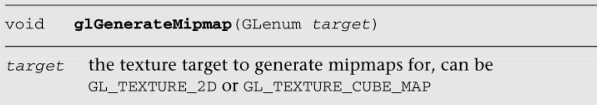

当在绑定的纹理对象上调用glGenerateMipmap时，这个函数将从零级图像的内容生成整个Mipmap链。对于2D纹理，这意味着纹理级别0的内容将被连续过滤并用于每个后续级别。对于立方体贴图，每个立方体面将从每个立方体面的零级生成。请注意，要将此函数用于立方体贴图，您必须为每个立方体面指定零级，并且每个面必须具有匹配的内部格式、宽度和高度。另外需要注意的是OpenGL  ES 2.0并没有强制要求一个特定的过滤算法来生成mipmaps(尽管它建议使用方块过滤)。

When calling glGenerateMipmap on a bound texture object, this function will  generate the entire mipmap chain from the contents of the image in level zero.  For a 2D texture, this means that the contents of texture level zero will be  successively filtered and used for each of the subsequent levels. For a cubemap,  each of the cube faces will be generated from the level zero in each cube face.  Note that to use this function with cubemaps you must have specified level zero  for each cube face and each face must have a matching internal format, width,  and height. An additional note is that OpenGL ES 2.0 does not mandate a  particular filtering algorithm that will be used for generating mipmaps  (although it recommends box filtering).

如果您需要一个特定的过滤方法，那么您仍然需要自己生成mipmaps。

if you require a particular filtering method, then you will still need to  generate the mipmaps on your own.

当您开始使用framebuffer对象渲染纹理时，自动生成mipmap变得尤为重要。当渲染到纹理时，我们不希望必须将纹理的内容读回CPU来生成纹理贴图。取而代之的是，可以使用glGenerateMipmap，然后图形硬件可以潜在地生成Mipmap，而不必将数据读回CPU。当我们在第12章“帧缓冲区对象”中更详细地讨论帧缓冲区对象时，这一点应该会变得很清楚。

Automatic mipmap generation becomes particularly important when you start to  use framebuffer objects for rendering to a texture. When rendering to a texture,  we don’t want to have to read back the contents of the texture to the CPU to  generate mipmaps. Instead, glGenerateMipmap can be used and the graphics  hardware can then potentially generate the mipmaps without ever having to read  the data back to the CPU. When we cover framebuffer objects in more detail in  Chapter 12, “Framebuffer Objects,” this point should become clear.

## 纹理坐标环绕

Texture Coordinate Wrapping

纹理环绕模式用于设置当纹理坐标超出范围[0.0，1.0]时的行为。纹理环绕模式使用GlTextParameter[I  | f[v设置。纹理环绕模式可以为s坐标和t坐标独立设置。GL _ TEXTURE _ WRAP _ S模式定义了当S坐标超出范围[0.0，1.0]时的行为，GL _ TEXTURE _ WRAP _ T设置了T坐标的行为。在OpenGL  ES中，有三种包装模式可供选择，如表9-2所示。

Texture wrap modes are used to set what the behavior is when a texture  coordinate is outside of the range [0.0, 1.0]. The texture wrap modes are set  using glTexParameter[i|f][v]. The texture wrap mode can be set independently for  both the s-coordinate and t-coordinate. The GL_TEXTURE_WRAP_S mode defines what  the behavior is when the s-coordinate is outside of the range [0.0, 1.0] and  GL_TEXTURE_WRAP_T sets the behavior for the t-coordinate. In OpenGL ES, there  are three wrap modes to choose from, as described in Table 9-2.

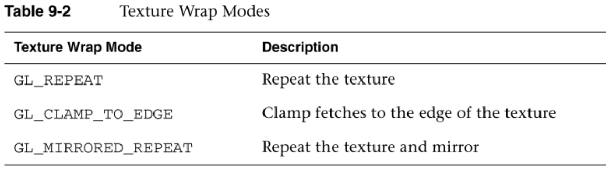

请注意，纹理环绕模式也对过滤行为有影响。例如，当纹理坐标位于纹理边缘时，双线性过滤器内核可能会跨越纹理边缘。在这种情况下，环绕模式将决定为纹理边缘之外的内核部分提取哪些纹理元素。只要您不想要任何形式的重复，就应该使用GL  _ CLAMP _ TO _ EDGE。

Note that the texture wrap modes also have an impact for the behavior of  filtering. For example, when a texture coordinate is at the edge of a texture,  the bilinear filter kernel might span beyond the edge of the texture. In this  case, the wrap mode will determine which texels are fetched for the portion of  the kernel that is outside the texture edge. GL_CLAMP_TO_EDGE should be used  whenever you do not want any form of repeating.