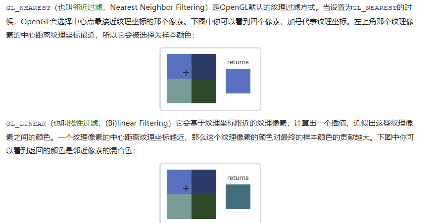

补充：

我们使用完顶点着色器之后就可以删除了

```java
在把着色器对象**链接**到程序对象以后，记得删除着色器对象，我们不再需要它们了：
glDeleteShader(vertexShader);
glDeleteShader(fragmentShader);
```

glVertexAttribPointer函数的参数非常多，所以我会逐一介绍它们：

- 第一个参数指定我们要配置的顶点属性。还记得我们在顶点着色器中使用`layout(location = 0)`定义了position顶点属性的位置值(Location)吗？它可以把顶点属性的位置值设置为`0`。因为我们希望把数据传递到这一个顶点属性中，所以这里我们传入`0`。
- 第二个参数指定顶点属性的大小。顶点属性是一个`vec3`，它由3个值组成，所以大小是3。
- 第三个参数指定数据的类型，这里是GL_FLOAT(GLSL中`vec*`都是由浮点数值组成的)。
- **下个参数定义我们是否希望数据被标准化(Normalize)。如果我们设置为GL_TRUE，所有数据都会被映射到0（对于有符号型signed数据是-1）到1之间。我们把它设置为GL_FALSE。**
- 第五个参数叫做步长(Stride)，它告诉我们在连续的顶点属性组之间的间隔。由于下个组位置数据在3个`float`之后，我们把步长设置为`3 * sizeof(float)`。要注意的是由于我们知道这个数组是紧密排列的（在两个顶点属性之间没有空隙）我们也可以设置为0来让OpenGL决定具体步长是多少（只有当数值是紧密排列时才可用）。一旦我们有更多的顶点属性，我们就必须更小心地定义每个顶点属性之间的间隔，我们在后面会看到更多的例子（译注: 这个参数的意思简单说就是从这个属性第二次出现的地方到整个数组0位置之间有多少字节）。
- 最后一个参数的类型是`void*`，所以需要我们进行这个奇怪的强制类型转换。它表示位置数据在缓冲中起始位置的偏移量(Offset)。由于位置数据在数组的开头，所以这里是0。我们会在后面详细解释这个参数。


```java
glBindBuffer(GL_ARRAY_BUFFER, VBO);
glBufferData(GL_ARRAY_BUFFER, sizeof(vertices), vertices, GL_STATIC_DRAW);
// 1. 设置顶点属性指针
glVertexAttribPointer(0, 3, GL_FLOAT, GL_FALSE, 3 * sizeof(float), (void*)0);
glEnableVertexAttribArray(0);
```


误区2：

```java
// 2. 当我们渲染一个物体时要使用着色器程序
glUseProgram(shaderProgram);
// 3. 绘制物体
someOpenGLFunctionThatDrawsOurTriangle();
```

## uniform

是一个从cpu应用向GPU中的着色器发送数据的方式，它是全局的，所以在着色器中的名字需要不一样的

**如果你声明了一个uniform却在GLSL代码中没用过，编译器会静默移除这个变量，导致最后编译出的版本中并不会包含它，这可能导致几个非常麻烦的错误，记住这点！**

查询uniform地址不要求你之前使用过着色器程序

更新一个uniform之前你**必须**先使用程序

uniform对于设置一个在渲染迭代中会改变的属性是一个非常有用的工具，


## 纹理环绕模式

如果我们选择GL_CLAMP_TO_BORDER选项，我们还需要指定一个边缘的颜色。这需要使用glTexParameter函数的`fv`后缀形式，用GL_TEXTURE_BORDER_COLOR作为它的选项，并且传递一个float数组作为边缘的颜色值：

## 纹理过滤

当你有一个很大的物体但是纹理的分辨率很低的时候这就变得很重要了


Texture Pixel也叫Texel，你可以想象你打开一张`.jpg`格式图片，不断放大你会发现它是由无数像素点组成的，这个点就是纹理像素；注意不要和纹理坐标搞混，纹理坐标是你给模型顶点设置的那个数组，OpenGL以这个顶点的纹理坐标数据去查找纹理图像上的像素，然后进行采样提取纹理像素的颜色。




比如`.PNG`，然后自己写一个图像加载器，把图像转化为字节序列。写自己的图像加载器虽然不难，但仍然挺麻烦的，而且如果要支持更多文件格式呢？你就不得不为每种你希望支持的格式写加载器了。


```
//    //获取解码器上下文
//    AVCodecContext *pCodecCtx=formatContext->streams[audeo_stream_index]->codec;
//    //获取解码器
//    AVCodec *pCodex = avcodec_find_decoder(pCodecCtx->codec_id);
//    //打开解码器
//    if (avcodec_open2(pCodecCtx, pCodex, NULL)<0) {
//    }
//    //申请avpakcet，装解码前的数据
//    AVPacket *packet = (AVPacket *)av_malloc(sizeof(AVPacket));
//    //申请avframe，装解码后的数据
//    AVFrame *frame = av_frame_alloc();
//    //得到SwrContext ，进行重采样，具体参考http://blog.csdn.net/jammg/article/details/52688506
//    swrContext = swr_alloc();
//    //缓存区
//    uint8_t *out_buffer = (uint8_t *) av_malloc(44100 * 2);
////输出的声道布局（立体声）
//    uint64_t  out_ch_layout=AV_CH_LAYOUT_STEREO;
////输出采样位数  16位
//    enum AVSampleFormat out_formart=AV_SAMPLE_FMT_S16;
////输出的采样率必须与输入相同
//    int out_sample_rate = pCodecCtx->sample_rate;
//
////swr_alloc_set_opts将PCM源文件的采样格式转换为自己希望的采样格式
//    swr_alloc_set_opts(swrContext, out_ch_layout, out_formart, out_sample_rate,
//                       pCodecCtx->channel_layout, pCodecCtx->sample_fmt, pCodecCtx->sample_rate, 0,
//                       NULL);
//
//    swr_init(swrContext);
////    获取通道数  2
//    int out_channer_nb = av_get_channel_layout_nb_channels(AV_CH_LAYOUT_STEREO);
////    反射得到Class类型
//    jclass david_player = env->GetObjectClass(instance);
////    反射得到createAudio方法
//    jmethodID createAudio = env->GetMethodID(david_player, "createTrack", "(II)V");
////    反射调用createAudio
//    env->CallVoidMethod(instance, createAudio, 44100, out_channer_nb);
//    jmethodID audio_write = env->GetMethodID(david_player, "playTrack", "([BI)V");
//    int got_frame;
//    while (av_read_frame(formatContext, packet) >= 0) {
//        if (packet->stream_index == audeo_stream_index) {
////            解码  mp3   编码格式frame----pcm   frame
//            avcodec_decode_audio4(pCodecCtx, frame, &got_frame, packet);
//            if (got_frame) {
//                LOGCATE("音乐解码");
//                swr_convert(swrContext, &out_buffer, 44100 * 2, (const uint8_t **) frame->data, frame->nb_samples);
////                缓冲区的大小
//                int size = av_samples_get_buffer_size(NULL, out_channer_nb, frame->nb_samples,
//                                                      AV_SAMPLE_FMT_S16, 1);
//                jbyteArray audio_sample_array = env->NewByteArray(size);
//                env->SetByteArrayRegion(audio_sample_array, 0, size, (const jbyte *) out_buffer);
//                env->CallVoidMethod(instance, audio_write, audio_sample_array, size);
//                env->DeleteLocalRef(audio_sample_array);
//            }
//        }
//    }
//    av_frame_free(&frame);
//    swr_free(&swrContext);
//    avcodec_close(pCodecCtx);
//    avformat_close_input(&formatContext);
```

```
//
//#include <SDL.h>
//#define SDL_AUDIO_BUFFER_SIZE 1024
//typedef struct PacketQueue {
//    AVPacketList * first_pkt, *last_pkt;
//    int nb_packets;
//    int size;
//    SDL_mutex *mutex;       //mutex主要是用来实现资源的互拆的，跟java里在synchronize关键作用有相似之处
//    //，虽然本和序中没有用多线程，但sdl在播放另启了一个线程。
//    SDL_cond * cond;
//} PacketQueue;
//PacketQueue audioq;
//
//void packet_queue_init(PacketQueue *q) {
//    memset(q, 0, sizeof(PacketQueue));
//    q->mutex = SDL_CreateMutex();
//    q->cond = SDL_CreateCond();
//}
//
//int packet_queue_put(PacketQueue *q, AVPacket *pkt) {
//
//    AVPacketList *pkt1;
//    if (av_dup_packet(pkt) < 0)
//        return -1;
//    pkt1 = av_malloc(sizeof(AVPacketList));
//    if (!pkt1)
//        return -1;
//    pkt1->pkt = *pkt;
//    pkt1->next = NULL;
//
//    SDL_LockMutex(q->mutex);
//
//    if (!q->last_pkt)
//        q->first_pkt = pkt1;
//    else
//        q->last_pkt->next = pkt1;
//    q->last_pkt = pkt1;
//    q->nb_packets++;
//    q->size += pkt1->pkt.size;
//    SDL_CondSignal(q->cond);
//
//    SDL_UnlockMutex(q->mutex);
//    return 0;
//}
//
//int quit = 0;
//static int packet_queue_get(PacketQueue *q, AVPacket *pkt, int block) {
//    AVPacketList *pkt1;
//    int ret;
//
//    SDL_LockMutex(q->mutex);
//
//    for (;;) {
//
//        if (quit) {
//            ret = -1;
//            break;
//        }
//
//        pkt1 = q->first_pkt;
//        if (pkt1) {
//            q->first_pkt = pkt1->next;
//            if (!q->first_pkt)
//                q->last_pkt = NULL;
//            q->nb_packets--;
//            q->size -= pkt1->pkt.size;
//            *pkt = pkt1->pkt;
//            av_free(pkt1);         //这招我很赞赏，他在取去一个packet后，将上一个paket置空，而在下面的程序就不用再调用av_free操作了
//            ret = 1;
//            break;
//        } else if (!block) {
//            ret = 0;
//            break;
//        } else {
//            SDL_CondWait(q->cond, q->mutex);
//        }
//    }
//    SDL_UnlockMutex(q->mutex);
//    return ret;
//}
//
////int audio_decode_frame(AVCodecContext *aCodecCtx, uint8_t *audio_buf, int buf_size) {
//int audio_decode_frame(AVCodecContext *aCodecCtx, AVFrame *frame,
//                       uint8_t *audio_buf) {
//    static AVPacket pkt_temp;
//    int len1, data_size, got_frame;
//    int new_packet;
//    for (;;) {
//        while (pkt_temp.size > 0 || (!pkt_temp.data && new_packet)) {
//            if (!frame) {
//                if (!(frame = avcodec_alloc_frame()))
//                    return AVERROR(ENOMEM);
//            } else {
//                avcodec_get_frame_defaults(frame);
//            }
//            new_packet = 0;
//
//            len1 = avcodec_decode_audio4(aCodecCtx, frame, &got_frame,
//                                         &pkt_temp);
//            if (len1 < 0) {
//                /* if error, skip frame */
//                pkt_temp.size = 0;
//                break;
//            }
//            pkt_temp.data += len1;
//            pkt_temp.size -= len1;
//
//            if (got_frame <= 0) /* No data yet, get more frames */
//                continue;
//            data_size = av_samples_get_buffer_size(NULL, aCodecCtx->channels,
//                                                   frame->nb_samples, aCodecCtx->sample_fmt, 1);
//            memcpy(audio_buf, frame->data[0], frame->linesize[0]);
//            /* We have data, return it and come back for more later */
//            return data_size;
//        }
//        if (quit)
//            return -1;
//
//        if ((new_packet = packet_queue_get(&audioq, &pkt_temp, 1)) < 0)
//            return -1;
//
//    }
//}
//
//void audio_callback(void *userdata, Uint8 *stream, int len) {
//    AVCodecContext *aCodecCtx = (AVCodecContext *) userdata;
//    //以后变量全定义成static ,确保下次循环，变量不会被初始化
//    static uint8_t audio_buf[(AVCODEC_MAX_AUDIO_FRAME_SIZE * 3) / 2];
//    static unsigned int audio_buf_remain_size=0;    //记录下audio_buffer剩余数据量
//    static unsigned int audio_buf_total_size=0;        //记录下audio_buffer总数据量
//    static unsigned int audio_buf_index = 0;
//
//    int read_size; //第次送入＊stream中数据的真正长度，理论值是len,但在最后一次操作实际值可能会小于len;
//
//    AVFrame *frame = NULL;
//    int flag=0;
//    while(len){
//        if(audio_buf_index>=audio_buf_total_size){
//            audio_buf_remain_size = audio_decode_frame(aCodecCtx, frame, audio_buf);
//            audio_buf_total_size=audio_buf_remain_size;
//            audio_buf_index=0;
//            if(audio_buf_total_size<0){
//                audio_buf_remain_size=audio_buf_total_size = 1024;
//                memset(audio_buf, 0, audio_buf_total_size);
//                continue;
//            }
//        }
//        read_size=(audio_buf_remain_size > len)? len : audio_buf_remain_size;
//        memcpy(stream, (uint8_t *) audio_buf + audio_buf_index, read_size);
//        audio_buf_index += read_size;
//        audio_buf_remain_size -= read_size;
//        stream += read_size;
//        len -= read_size;
//    }
//}
```