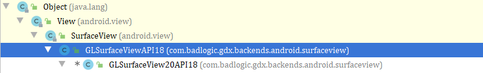
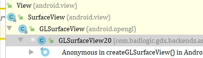

# 创建view 

显示view的策略，全屏显示，

## 创建过程

1.第一步

创建之前先检查GL

```java
	protected boolean checkGL20 () {
	    //得到egl
		EGL10 egl = (EGL10)EGLContext.getEGL();
		//得到默认的显示平面
		EGLDisplay display = egl.eglGetDisplay(EGL10.EGL_DEFAULT_DISPLAY);
		int[] version = new int[2];
		//初始化，他佳能返回实现的主次版本号
       //完成之后我们就知道那些表面是可以使用的
		egl.eglInitialize(display, version);
		int EGL_OPENGL_ES2_BIT = 4;
        /**
         * 这里并没有做
         * 1.查询底层窗口系统支持的所有的EGL的表面配置
         * eglGetConfigs
         * 2，查询配置属性
         * eglGetConfigAttrib
         */
        /**
         * 指定EGL属性
         */
		int[] configAttribs = {
		        EGL10.EGL_RED_SIZE,
                4,
                EGL10.EGL_GREEN_SIZE,
                4,
                EGL10.EGL_BLUE_SIZE,
                4,
                EGL10.EGL_RENDERABLE_TYPE,
                EGL_OPENGL_ES2_BIT,
                EGL10.EGL_NONE};
		EGLConfig[] configs = new EGLConfig[10];
		int[] num_config = new int[1];
		//让egl选择匹配的EGLConfigs，自己需要提供属性列表
        //如果eglChooseConfig成功返回，将返回一组符合您条件的EGLConfigs ，有可能返回一个可能返回多个
		egl.eglChooseConfig(display, configAttribs, configs, 10, num_config);
		egl.eglTerminate(display);
		return num_config[0] > 0;
	}
```

2.根据sdk版本进行创建相应的View

```java
int sdkVersion = android.os.Build.VERSION.SDK_INT; //得到sdk版本
```

小于10或者配置使用useGLSurfaceView20API18的就会创建GLSurfaceView20API18，其它的创建GLSurfaceView20。

2.1.GLSurfaceView20API18的创建方式

继承关系：



继承与SurfaceView

- 创建对象

  ```java
  public GLSurfaceView20API18 (Context context, ResolutionStrategy resolutionStrategy) {
     super(context);
     this.resolutionStrategy = resolutionStrategy;
     init(false, 16, 0);
  }
  
  super：
  private void init() {
      //创建回调 在生命周期中收到通知
      SurfaceHolder holder = getHolder();
      holder.addCallback(this);
      int sdkVersion = android.os.Build.VERSION.SDK_INT;
      // setFormat is done by SurfaceView in SDK 2.3 and newer.
      if (sdkVersion <= 8) {	// SDK 2.2 or older
          holder.setFormat(PixelFormat.RGB_565);
      }
      // setType is not needed for SDK 2.0 or newer. Uncomment this
      // statement if back-porting this code to older SDKs.
      // holder.setType(SurfaceHolder.SURFACE_TYPE_GPU);
  }
  ```

- 初始化

  ```
  private void init (boolean translucent, int depth, int stencil) {
     //我们创建是不透明的    忽略
     if (translucent) {
        this.getHolder().setFormat(PixelFormat.TRANSLUCENT);
     }
     //创建egl  稍等看一下egl
     setEGLContextFactory(new ContextFactory());
     /*
      * We need to choose an EGLConfig that matches the format of our surface exactly. This is going to be done in our custom
      * config chooser. See ConfigChooser class definition below.
      */
     setEGLConfigChooser(translucent ? new ConfigChooser(8, 8, 8, 8, depth, stencil) : new ConfigChooser(5, 6, 5, 0, depth,
        stencil));
  
     /* Set the renderer responsible for frame rendering */
  }
  ```

- EGLContextFactory

  ```java
  static class ContextFactory implements EGLContextFactory {
     private static int EGL_CONTEXT_CLIENT_VERSION = 0x3098;
  
     public EGLContext createContext (EGL10 egl, EGLDisplay display, EGLConfig eglConfig) {
        Log.w(TAG, "creating OpenGL ES 2.0 context");
        checkEglError("Before eglCreateContext", egl);
        int[] attrib_list = {EGL_CONTEXT_CLIENT_VERSION, 2, EGL10.EGL_NONE};
         //创建一个上下文
        EGLContext context = egl.eglCreateContext(display, eglConfig, EGL10.EGL_NO_CONTEXT, attrib_list);
        checkEglError("After eglCreateContext", egl);
        return context;
     }
  // 销毁
     public void destroyContext (EGL10 egl, EGLDisplay display, EGLContext context) {
        egl.eglDestroyContext(display, context);
     }
  }
  ```

2.2.看一下GLSurfaceView20的创建方式

继承关系



它是继承于GLSurface（和上一个不同之处）

其他初始化都是一样的。

2.3.暂停

```
protected void preserveEGLContextOnPause () {
   int sdkVersion = android.os.Build.VERSION.SDK_INT;
   if ((sdkVersion >= 11 && view instanceof GLSurfaceView20) || view instanceof GLSurfaceView20API18) {
      try {
         view.getClass().getMethod("setPreserveEGLContextOnPause", boolean.class).invoke(view, true);
      } catch (Exception e) {
         Gdx.app.log(LOG_TAG, "Method GLSurfaceView.setPreserveEGLContextOnPause not found");
      }
   }
}
```

2.4.设置聚焦

```java
view.setFocusable(true);
view.setFocusableInTouchMode(true);
```

3.图像绘制  以及如何进行调用

```java
void onSurfaceCreated(GL10 gl, EGLConfig config);     //创建
void onSurfaceChanged(GL10 gl, int width, int height);   // 改变
void onDrawFrame(GL10 gl);   //绘制
```

三个方法

3.1.onSurfaceCreated

```java
@Override
public void onSurfaceCreated (GL10 gl, EGLConfig config) {
   //得到egl上下文
   eglContext = ((EGL10)EGLContext.getEGL()).eglGetCurrentContext();
   //根据版本设置 gl20  gl30，gl3.0兼容2.0
   setupGL(gl);
   //根据显示器的参数设置  format
   // 描述每个像素的位，深度缓冲区精度，模板精度和MSAA样本数量的类
   logConfig(config);
    //屏幕上每英尺的物理像素
    updatePpi();
  
   Mesh.invalidateAllMeshes(app);
   Texture.invalidateAllTextures(app);
   Cubemap.invalidateAllCubemaps(app);
   TextureArray.invalidateAllTextureArrays(app);
   ShaderProgram.invalidateAllShaderPrograms(app);
   FrameBuffer.invalidateAllFrameBuffers(app);

   logManagedCachesStatus();

   Display display = app.getWindowManager().getDefaultDisplay();
   this.width = display.getWidth();
   this.height = display.getHeight();
   this.mean = new WindowedMean(5);
   this.lastFrameTime = System.nanoTime();

   gl.glViewport(0, 0, this.width, this.height);
}
```

## 一个完成的显示案例

```java
public class EGLRenderer extends HandlerThread {
    private EGLConfig eglConfig = null;
    private EGLDisplay eglDisplay = EGL14.EGL_NO_DISPLAY;
    private EGLContext eglContext = EGL14.EGL_NO_CONTEXT;
    private int program;
    private int vPosition;
    private int uColor;
    public EGLRenderer() {
        super("EGLRenderer");
        onCreate();
    }

    /**
     * 创建OpenGL环境
     */
    private void onCreate() {
        eglDisplay = EGL14.eglGetDisplay(EGL14.EGL_DEFAULT_DISPLAY);
        int[] version = new int[2];
        if (!EGL14.eglInitialize(eglDisplay, version, 0, version, 1)) {
            throw new RuntimeException("EGL error " + EGL14.eglGetError());
        }
//        EGLConfig eglConfig[]=new EGLConfig[10];
//        EGL14.eglGetConfigs(eglDisplay,eglConfig)
        int[] configAttribs = {
                EGL14.EGL_BUFFER_SIZE, 32,
                EGL14.EGL_ALPHA_SIZE, 8,
                EGL14.EGL_BLUE_SIZE, 8,
                EGL14.EGL_GREEN_SIZE, 8,
                EGL14.EGL_RED_SIZE, 8,
                EGL14.EGL_RENDERABLE_TYPE, //renderable
                EGL14.EGL_OPENGL_ES2_BIT,
                EGL14.EGL_SURFACE_TYPE,
                EGL14.EGL_WINDOW_BIT,
                EGL14.EGL_NONE
        };
        int[] numConfigs = new int[1];
        EGLConfig[] configs = new EGLConfig[1];
        if (!EGL14.eglChooseConfig(eglDisplay,
                configAttribs,
                0,
                configs,
                0,
                configs.length,
                numConfigs,
                0)) {
            throw new RuntimeException("EGL error " + EGL14.eglGetError());
        }
        //这里可以加一个判断   也可以不加，配置失败上一步就已经抛出了异常
        eglConfig = configs[0];
        int[] contextAttribs = {
                EGL14.EGL_CONTEXT_CLIENT_VERSION, 2,
                EGL14.EGL_NONE
        };
        //创建一个上下文
        eglContext = EGL14.eglCreateContext(eglDisplay, eglConfig, EGL14.EGL_NO_CONTEXT, contextAttribs, 0);
        if (eglContext == EGL14.EGL_NO_CONTEXT) {
            throw new RuntimeException("EGL error " + EGL14.eglGetError());
        }
    }

    /**
     * 销毁OpenGL环境
     */
    private void onDestroy() {
        EGL14.eglDestroyContext(eglDisplay, eglContext);
        eglContext = EGL14.EGL_NO_CONTEXT;
        eglDisplay = EGL14.EGL_NO_DISPLAY;
    }

    @Override
    public synchronized void start() {
        super.start();
        new Handler(getLooper()).post(new Runnable() {
            @Override
            public void run() {


//                while (true){
                //执行onFrame方法
          
                onDrawFrame();

            }
        });
    }

    public void onRelease() {
        new Handler(getLooper()).post(new Runnable() {
            @Override
            public void run() {
                onDestroy();
                quit();
            }
        });
    }


    /**
     * 加载制定shader的方法
     *
     * @param shaderType shader的类型  GLES20.GL_VERTEX_SHADER   GLES20.GL_FRAGMENT_SHADER
     * @param sourceCode shader的脚本
     * @return shader索引
     */
    private int loadShader(int shaderType, String sourceCode) {
        int shader = GLES20.glCreateShader(shaderType);
        if (shader != 0) {
            GLES20.glShaderSource(shader, sourceCode);
            GLES20.glCompileShader(shader);
            int[] compiled = new int[1];
            GLES20.glGetShaderiv(shader, GLES20.GL_COMPILE_STATUS, compiled, 0);
            if (compiled[0] == 0) {
                Log.e("ES20_ERROR", "Could not compile shader " + shaderType + ":");
                Log.e("ES20_ERROR", GLES20.glGetShaderInfoLog(shader));
                GLES20.glDeleteShader(shader);
                shader = 0;
            }
        }
        return shader;
    }

    /**
     * 创建shader程序的方法
     */
    private int createProgram(String vertexSource, String fragmentSource) {
        int vertexShader = loadShader(GLES20.GL_VERTEX_SHADER, vertexSource);
        if (vertexShader == 0) {
            return 0;
        }
        int pixelShader = loadShader(GLES20.GL_FRAGMENT_SHADER, fragmentSource);
        if (pixelShader == 0) {
            return 0;
        }
        int program = GLES20.glCreateProgram();
        if (program != 0) {
            GLES20.glAttachShader(program, vertexShader);
            GLES20.glAttachShader(program, pixelShader);
            GLES20.glLinkProgram(program);
            int[] linkStatus = new int[1];
            GLES20.glGetProgramiv(program, GLES20.GL_LINK_STATUS, linkStatus, 0);
            if (linkStatus[0] != GLES20.GL_TRUE) {
                Log.e("ES20_ERROR", "Could not link program: ");
                Log.e("ES20_ERROR", GLES20.glGetProgramInfoLog(program));
                GLES20.glDeleteProgram(program);
                program = 0;
            }
        }
        return program;
    }

    /**
     * 获取图形的顶点
     * 特别提示：由于不同平台字节顺序不同数据单元不是字节的一定要经过ByteBuffer
     * 转换，关键是要通过ByteOrder设置nativeOrder()，否则有可能会出问题
     *
     * @return 顶点Buffer
     */
    private FloatBuffer getVertices() {
        float vertices[] = {
                0.0f, 0.5f,
                -0.5f, -0.5f,
                0.5f, -0.5f,
        };

        // 创建顶点坐标数据缓冲
        // vertices.length*4是因为一个float占四个字节
        ByteBuffer vbb = ByteBuffer.allocateDirect(vertices.length * 4);
        vbb.order(ByteOrder.nativeOrder());             // 设置字节顺序
        FloatBuffer vertexBuf = vbb.asFloatBuffer();    // 转换为Float型缓冲
        vertexBuf.put(vertices);                        // 向缓冲区中放入顶点坐标数据
        vertexBuf.position(0);                          // 设置缓冲区起始位置
        return vertexBuf;
    }
    EGLSurface eglSurface;
    public void surfaceCreated(Surface surface){
        final int[] surfaceAttribs = {EGL14.EGL_NONE};
        eglSurface = EGL14.eglCreateWindowSurface(eglDisplay, eglConfig, surface, surfaceAttribs, 0);
        program = createProgram(verticesShader, fragmentShader);
        vPosition = GLES20.glGetAttribLocation(program, "vPosition");
        uColor = GLES20.glGetUniformLocation(program, "uColor");
        vertices = getVertices();
    }
    FloatBuffer vertices;


    public void onDrawFrame() {
        //使用当前进行绘制
        EGL14.eglMakeCurrent(eglDisplay, eglSurface, eglSurface, eglContext);
        GLES20.glClearColor(0.0f, 0, 0, 1.0f);
        GLES20.glClear(GLES20.GL_DEPTH_BUFFER_BIT | GLES20.GL_COLOR_BUFFER_BIT);
        GLES20.glUseProgram(program);
        GLES20.glVertexAttribPointer(vPosition, 2, GLES20.GL_FLOAT, false, 0, vertices);
        GLES20.glEnableVertexAttribArray(vPosition);
        GLES20.glUniform4f(uColor, 0.0f, 1.0f, 0.0f, 1.0f);
        GLES20.glDrawArrays(GLES20.GL_TRIANGLE_STRIP, 0, 3);
        //opengl 设置结束之后，需要交换缓存区域 
        EGL14.eglSwapBuffers(eglDisplay, eglSurface);
        EGL14.eglDestroySurface(eglDisplay, eglSurface);
    }

    private static final String verticesShader
            = "attribute vec2 vPosition;            \n" // 顶点位置属性vPosition
            + "void main(){                         \n"
            + "   gl_Position = vec4(vPosition,0,1);\n" // 确定顶点位置
            + "}";

    private static final String fragmentShader
            = "precision mediump float;         \n"     // 声明float类型的精度为中等(精度越高越耗资源)
            + "uniform vec4 uColor;             \n"     // uniform的属性uColor
            + "void main(){                     \n"
            + "   gl_FragColor = uColor;        \n"     // 给此片元的填充色
            + "}";
}
```


