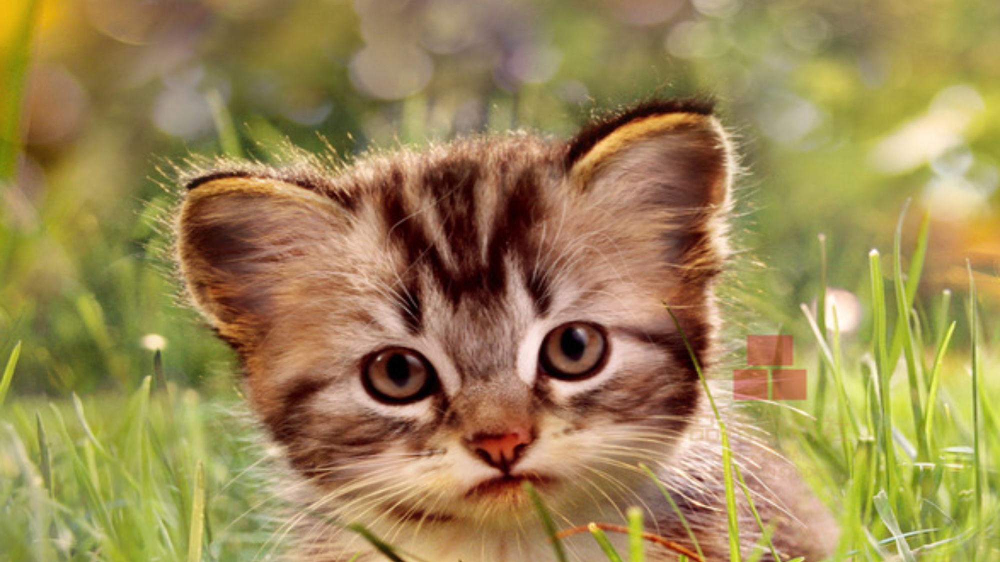

# 显示纹理

```
private String vertexShaderCode =
        "attribute vec4 vPosition;\n" +      //位置
                "attribute vec2 vCoordinate;\n" +    // 纹理
                "varying vec2 aCoordinate;\n" +      //  传递纹理   片段着色器
                "void main(){\n" +
                "    gl_Position=vPosition;\n" +
                "    aCoordinate=vCoordinate;\n" +
                "}";
private String fragmentShaderCode =
        "precision mediump float;\n" +
                "uniform sampler2D vTexture;\n" +
                "varying vec2 aCoordinate;\n" +
                "void main(){\n" +
                "    vec4 nColor=texture2D(vTexture,aCoordinate);\n" +
                "    gl_FragColor=nColor;" +
                "}";
```

```
public class ImageTexture extends BaseGameScreen {
    private int mProgram;
    private int glHPosition;
    private int glHTexture;
    private int glHCoordinate;
    private Bitmap mBitmap;
    private FloatBuffer bPos;
    private FloatBuffer bCoord;

    private final float[] sPos = {
            -1.0f, 1.0f,
            -1.0f, -1.0f,
            1.0f, 1.0f,
            1.0f, -1.0f
    };
    static float yy = 1f;
    static float sCoord[] = {
                        0.0f, 0.0f,
            0.0f, 1.0f,
            1.0f, 0.0f,
            1.0f, 1.0f,
    };
//    private final float[] sCoord = {
//            0.0f, 0.0f,
//            0.0f, 1.0f,
//            1.0f, 0.0f,
//            1.0f, 1.0f,
//    };
    private String vertexShaderCode =
            "attribute vec4 vPosition;\n" +      //位置
                    "attribute vec2 vCoordinate;\n" +    // 纹理
                    "varying vec2 aCoordinate;\n" +      //  传递纹理   片段着色器
                    "void main(){\n" +
                    "    gl_Position=vPosition;\n" +
                    "    aCoordinate=vCoordinate;\n" +
                    "}";
    private String fragmentShaderCode =
            "precision mediump float;\n" +
                    "uniform sampler2D vTexture;\n" +
                    "varying vec2 aCoordinate;\n" +
                    "void main(){\n" +
                    "    vec4 nColor=texture2D(vTexture,aCoordinate);\n" +
                    "    gl_FragColor=nColor;" +
                    "}";


    private Context context;

    public ImageTexture(Context context) {
        this.context = context;
        ByteBuffer bb = ByteBuffer.allocateDirect(sPos.length * 4);
        bb.order(ByteOrder.nativeOrder());
        bPos = bb.asFloatBuffer();
        bPos.put(sPos);
        bPos.position(0);
        ByteBuffer cc = ByteBuffer.allocateDirect(sCoord.length * 4);
        cc.order(ByteOrder.nativeOrder());
        bCoord = cc.asFloatBuffer();
        bCoord.put(sCoord);
        bCoord.position(0);
    }

//    private int vChangeColor;

    public void preProgram() {

    }

    int ii;
    @Override
    public void render() {
        GLES20.glClear(GLES20.GL_COLOR_BUFFER_BIT|GLES20.GL_DEPTH_BUFFER_BIT);
        GLES20.glUseProgram(mProgram);
        GLES20.glEnableVertexAttribArray(glHPosition);
        GLES20.glEnableVertexAttribArray(glHCoordinate);
        GLES20.glBindTexture(GLES20.GL_TEXTURE_2D,ii);
        GLES20.glUniform1i(glHTexture, 0);
        GLES20.glVertexAttribPointer(glHPosition, 2, GLES20.GL_FLOAT, false, 0, bPos);
        GLES20.glVertexAttribPointer(glHCoordinate, 2, GLES20.GL_FLOAT, false, 0, bCoord);
        GLES20.glDrawArrays(GLES20.GL_TRIANGLE_STRIP, 0, 4);
        GLES20.glBindTexture(GLES20.GL_TEXTURE_2D,0);


        ByteBuffer rgbaBuf = ByteBuffer.allocateDirect(200 * 200 * 4);
        rgbaBuf.position(0);
        GLES20.glReadPixels(0, 0, 100, 100, GLES20.GL_RGBA, GLES20.GL_UNSIGNED_BYTE, rgbaBuf);
        System.out.println("=====================================");
    }

    @Override
    public void create() {
        int vertexShader = loadShader(GLES20.GL_VERTEX_SHADER, vertexShaderCode);
        int fragmentShader = loadShader(GLES20.GL_FRAGMENT_SHADER, fragmentShaderCode);
        mProgram = GLES20.glCreateProgram();
        GLES20.glAttachShader(mProgram, vertexShader);
        GLES20.glAttachShader(mProgram, fragmentShader);
        GLES20.glLinkProgram(mProgram);
        glHPosition = GLES20.glGetAttribLocation(mProgram, "vPosition");
        glHCoordinate = GLES20.glGetAttribLocation(mProgram, "vCoordinate");
        glHTexture = GLES20.glGetUniformLocation(mProgram, "vTexture");

        createTexture();
        createTexture1();
    }

    @Override
    public void surfaceChange(int width, int height) {
        GLES20.glViewport(0,0,width,height);
    }

    @Override
    public void dispose() {

    }

    private int createTexture() {
        try {
//            mBitmap = BitmapFactory.decodeStream(context.getAssets().open("texture/fengj.png"));
            mBitmap = BitmapFactory.decodeStream(context.getAssets().open("texture/fengj.png"));
        } catch (IOException e) {
            e.printStackTrace();
        }
        int[] texture = new int[1];
        if (mBitmap != null && !mBitmap.isRecycled()) {
            //生成纹理
            GLES20.glGenTextures(1, texture, 0);
            //绑定
            GLES20.glBindTexture(GLES20.GL_TEXTURE_2D, texture[0]);
            //设置缩小过滤为使用纹理中坐标最接近的一个像素的颜色作为需要绘制的像素颜色
            GLES20.glTexParameterf(GLES20.GL_TEXTURE_2D, GLES20.GL_TEXTURE_MIN_FILTER, GLES20.GL_NEAREST);
            //设置放大过滤为使用纹理中坐标最接近的若干个颜色，通过加权平均算法得到需要绘制的像素颜色
            GLES20.glTexParameterf(GLES20.GL_TEXTURE_2D, GLES20.GL_TEXTURE_MAG_FILTER, GLES20.GL_LINEAR);
//            //设置环绕方向S，截取纹理坐标到[1/2n,1-1/2n]。将导致永远不会与border融合
            GLES20.glTexParameterf(GLES20.GL_TEXTURE_2D, GLES20.GL_TEXTURE_WRAP_S, GLES20.GL_CLAMP_TO_EDGE);
//            //设置环绕方向T，截取纹理坐标到[1/2n,1-1/2n]。将导致永远不会与border融合
            GLES20.glTexParameterf(GLES20.GL_TEXTURE_2D, GLES20.GL_TEXTURE_WRAP_T, GLES20.GL_CLAMP_TO_EDGE);
//            根据以上指定的参数，生成一个2D纹理
            GLUtils.texImage2D(GLES20.GL_TEXTURE_2D, 0, mBitmap, 0);
            ii = texture[0];
            return texture[0];
        }
        return 0;
    }


    private int createTexture1() {
        try {
//            mBitmap = BitmapFactory.decodeStream(context.getAssets().open("texture/fengj.png"));
            mBitmap = BitmapFactory.decodeStream(context.getAssets().open("texture/11.png"));
        } catch (IOException e) {
            e.printStackTrace();
        }
        int[] texture = new int[1];
        if (mBitmap != null && !mBitmap.isRecycled()) {
            //生成纹理
            GLES20.glGenTextures(1, texture, 0);
            //绑定
            GLES20.glBindTexture(GLES20.GL_TEXTURE_2D, texture[0]);
            //设置缩小过滤为使用纹理中坐标最接近的一个像素的颜色作为需要绘制的像素颜色
            GLES20.glTexParameterf(GLES20.GL_TEXTURE_2D, GLES20.GL_TEXTURE_MIN_FILTER, GLES20.GL_NEAREST);
            //设置放大过滤为使用纹理中坐标最接近的若干个颜色，通过加权平均算法得到需要绘制的像素颜色
            GLES20.glTexParameterf(GLES20.GL_TEXTURE_2D, GLES20.GL_TEXTURE_MAG_FILTER, GLES20.GL_LINEAR);
//            //设置环绕方向S，截取纹理坐标到[1/2n,1-1/2n]。将导致永远不会与border融合
            GLES20.glTexParameterf(GLES20.GL_TEXTURE_2D, GLES20.GL_TEXTURE_WRAP_S, GLES20.GL_CLAMP_TO_EDGE);
//            //设置环绕方向T，截取纹理坐标到[1/2n,1-1/2n]。将导致永远不会与border融合
            GLES20.glTexParameterf(GLES20.GL_TEXTURE_2D, GLES20.GL_TEXTURE_WRAP_T, GLES20.GL_CLAMP_TO_EDGE);
//            根据以上指定的参数，生成一个2D纹理
            GLUtils.texImage2D(GLES20.GL_TEXTURE_2D, 0, mBitmap, 0);
            iii = texture[0];
            return texture[0];
        }
        return 0;
    }

    int iii = 0;
}
```

