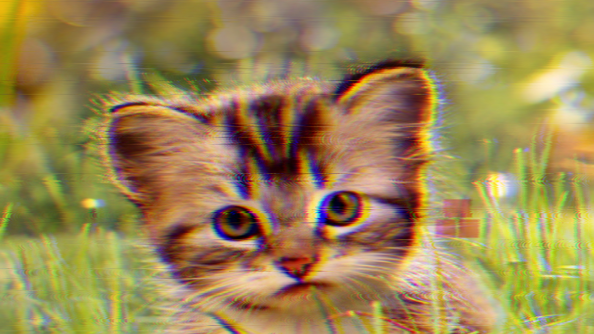

# 毛刺



```
package com.example.myapplication.learn.texture;

import android.content.Context;
import android.graphics.Bitmap;
import android.graphics.BitmapFactory;
import android.opengl.GLES20;
import android.opengl.GLUtils;

import com.example.myapplication.learn.shape.base.BaseGameScreen;

import java.io.IOException;
import java.nio.ByteBuffer;
import java.nio.ByteOrder;
import java.nio.FloatBuffer;

/**
 * 绘制灰色
 */
public class ImageTextureMaocilujing extends BaseGameScreen {
    private int mProgram;
    private int glHPosition;
    private int glHTexture;
    private int glHCoordinate;
    private int time;
    private Bitmap mBitmap;
    private FloatBuffer bPos;
    private FloatBuffer bCoord;

    private final float[] sPos = {
            -1.0f, 1.0f,
            -1.0f, -1.0f,
            1.0f, 1.0f,
            1.0f, -1.0f
    };

    private final float[] sCoord = {
            0.0f, 0.0f,
            0.0f, 1.0f,
            1.0f, 0.0f,
            1.0f, 1.0f,
    };
    private String vertexShaderCode =
            "attribute vec4 vPosition;\n" +      //位置
                    "attribute vec2 vCoordinate;\n" +    // 纹理
                    "varying vec2 aCoordinate;\n" +
                    "const float PI = 3.1415926;" +      //  传递纹理   片段着色器
                    "void main(){\n" +
                    "gl_Position = vPosition;" +
                    "aCoordinate=vCoordinate;" +
                    "}";
    private String fragmentShaderCode =
            "precision mediump float;\n" +
                    "uniform sampler2D vTexture;\n" +
                    "varying vec2 aCoordinate;\n" +
                    "uniform float time;" +
                    "const float PI = 3.1415926;" +
                    "float rand(float n) {\n" +
                    "    //fract(x),返回x的小数部分数据\n" +
                    "    return fract(sin(n) * 43758.5453123);\n" +
                    "}" +
                    "void main(){\n" +
                    "    // 最大抖动\n" +
                    "    float maxJitter = 0.06;\n" +
                    "    // 一次毛刺滤镜的时长\n" +
                    "    float duration = 0.3;\n" +
                    "    // 红色颜色偏移量\n" +
                    "    float colorROffset = 0.01;\n" +
                    "    // 绿色颜色偏移量\n" +
                    "    float colorBOffset = -0.025;\n" +
                    "\n" +
                    "    // 时间周期[0.0,0.6];\n" +
                    "    float time1 = mod(time, duration * 2.0);\n" +
                    "    // 振幅:[0,1];\n" +
                    "    float amplitude = max(sin(time1 * (PI / duration)), 0.0);\n" +
                    "\n" +
                    "    // 像素随机偏移[-1,1]\n" +
                    "    float jitter = rand(aCoordinate.y) * 2.0 - 1.0; // -1~1\n" +
                    "\n" +
                    "    // 是否要做偏移.\n" +
                    "    bool needOffset = abs(jitter) < maxJitter * amplitude;\n" +
                    "\n" +
                    "    // 获取纹理X值.根据needOffset，来计算它X撕裂.\n" +
                    "    // needOffset = YES，撕裂较大;\n" +
                    "    // needOffset = NO，撕裂较小.\n" +
                    "    float textureX = aCoordinate.x + (needOffset ? jitter : (jitter * amplitude * 0.006));\n" +
                    "\n" +
                    "    // 撕裂后的纹理坐标x,y\n" +
                    "    vec2 textureCoords = vec2(textureX, aCoordinate.y);\n" +
                    "\n" +
                    "    // 颜色偏移3组颜色\n" +
                    "    // 根据撕裂后获取的纹理颜色值\n" +
                    "    vec4 mask = texture2D(vTexture, textureCoords);\n" +
                    "    // 撕裂后的纹理颜色偏移\n" +
                    "    vec4 maskR = texture2D(vTexture, textureCoords + vec2(colorROffset * amplitude, 0.0));\n" +
                    "    // 撕裂后的纹理颜色偏移\n" +
                    "    vec4 maskB = texture2D(vTexture, textureCoords + vec2(colorBOffset * amplitude, 0.0));\n" +
                    "\n" +
                    "    // 红色/蓝色部分发生撕裂.\n" +
                    "    gl_FragColor = vec4(maskR.r, mask.g, maskB.b, mask.a);\n" +
                    "}";

    private Context context;

    public ImageTextureMaocilujing(Context context) {
        this.context = context;
        ByteBuffer bb = ByteBuffer.allocateDirect(sPos.length * 4);
        bb.order(ByteOrder.nativeOrder());
        bPos = bb.asFloatBuffer();
        bPos.put(sPos);
        bPos.position(0);
        ByteBuffer cc = ByteBuffer.allocateDirect(sCoord.length * 4);
        cc.order(ByteOrder.nativeOrder());
        bCoord = cc.asFloatBuffer();
        bCoord.put(sCoord);
        bCoord.position(0);
    }

//    private int vChangeColor;

    public void preProgram() {

    }


    float dela = 0;
    int ii;
    @Override
    public void render() {
        dela+=0.05F;
        GLES20.glClear(GLES20.GL_COLOR_BUFFER_BIT|GLES20.GL_DEPTH_BUFFER_BIT);
        GLES20.glUseProgram(mProgram);
        GLES20.glEnableVertexAttribArray(glHPosition);
        GLES20.glUniform1f(time,dela);

        GLES20.glEnableVertexAttribArray(glHCoordinate);
        GLES20.glBindTexture(GLES20.GL_TEXTURE_2D,ii);
        GLES20.glUniform1i(glHTexture, 0);
        GLES20.glVertexAttribPointer(glHPosition, 2, GLES20.GL_FLOAT, false, 0, bPos);
        GLES20.glVertexAttribPointer(glHCoordinate, 2, GLES20.GL_FLOAT, false, 0, bCoord);
        GLES20.glDrawArrays(GLES20.GL_TRIANGLE_STRIP, 0, 4);
        GLES20.glBindTexture(GLES20.GL_TEXTURE_2D,0);
    }

    @Override
    public void create() {
        int vertexShader = loadShader(GLES20.GL_VERTEX_SHADER, vertexShaderCode);
        int fragmentShader = loadShader(GLES20.GL_FRAGMENT_SHADER, fragmentShaderCode);
        mProgram = GLES20.glCreateProgram();
        GLES20.glAttachShader(mProgram, vertexShader);
        GLES20.glAttachShader(mProgram, fragmentShader);
        GLES20.glLinkProgram(mProgram);
        glHPosition = GLES20.glGetAttribLocation(mProgram, "vPosition");
        glHCoordinate = GLES20.glGetAttribLocation(mProgram, "vCoordinate");
        glHTexture = GLES20.glGetUniformLocation(mProgram, "vTexture");
        time = GLES20.glGetUniformLocation(mProgram, "time");
        createTexture();
    }

    @Override
    public void surfaceChange(int width, int height) {
        GLES20.glViewport(0,0,width,height);
    }

    @Override
    public void dispose() {

    }

    private int createTexture() {
        try {
//            mBitmap = BitmapFactory.decodeStream(context.getAssets().open("texture/fengj.png"));
            mBitmap = BitmapFactory.decodeStream(context.getAssets().open("texture/fengj.png"));
        } catch (IOException e) {
            e.printStackTrace();
        }
        int[] texture = new int[1];
        if (mBitmap != null && !mBitmap.isRecycled()) {
            //生成纹理
            GLES20.glGenTextures(1, texture, 0);
            //绑定
            GLES20.glBindTexture(GLES20.GL_TEXTURE_2D, texture[0]);
            //设置缩小过滤为使用纹理中坐标最接近的一个像素的颜色作为需要绘制的像素颜色
            GLES20.glTexParameterf(GLES20.GL_TEXTURE_2D, GLES20.GL_TEXTURE_MIN_FILTER, GLES20.GL_NEAREST);
            //设置放大过滤为使用纹理中坐标最接近的若干个颜色，通过加权平均算法得到需要绘制的像素颜色
            GLES20.glTexParameterf(GLES20.GL_TEXTURE_2D, GLES20.GL_TEXTURE_MAG_FILTER, GLES20.GL_LINEAR);
//            //设置环绕方向S，截取纹理坐标到[1/2n,1-1/2n]。将导致永远不会与border融合
            GLES20.glTexParameterf(GLES20.GL_TEXTURE_2D, GLES20.GL_TEXTURE_WRAP_S, GLES20.GL_CLAMP_TO_EDGE);
//            //设置环绕方向T，截取纹理坐标到[1/2n,1-1/2n]。将导致永远不会与border融合
            GLES20.glTexParameterf(GLES20.GL_TEXTURE_2D, GLES20.GL_TEXTURE_WRAP_T, GLES20.GL_CLAMP_TO_EDGE);
//            根据以上指定的参数，生成一个2D纹理
            GLUtils.texImage2D(GLES20.GL_TEXTURE_2D, 0, mBitmap, 0);
            ii = texture[0];
            return texture[0];
        }
        return 0;
    }
}
```