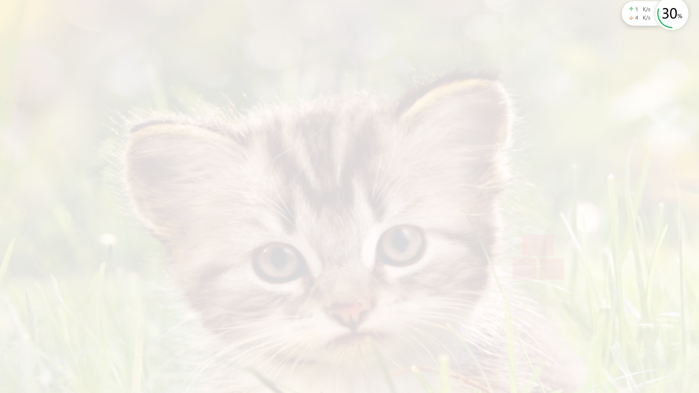

# 闪白



```
package com.example.myapplication.learn.base;

import android.opengl.GLES20;
import android.opengl.GLSurfaceView;

import com.example.myapplication.MainActivity;
import com.example.myapplication.base.core.Game;
import com.example.myapplication.learn.shape.base.BaseGameScreen;
import com.example.myapplication.learn.texture.ImageTexture;
import com.example.myapplication.learn.texture.ImageTextureBrightness;
import com.example.myapplication.learn.texture.ImageTextureClod;
import com.example.myapplication.learn.texture.ImageTextureDIPIAN;
import com.example.myapplication.learn.texture.ImageTextureFangda;
import com.example.myapplication.learn.texture.ImageTextureGaosi;
import com.example.myapplication.learn.texture.ImageTextureHUi;
import com.example.myapplication.learn.texture.ImageTextureMaocilujing;
import com.example.myapplication.learn.texture.ImageTextureMat;
import com.example.myapplication.learn.texture.ImageTextureMatHSV;
import com.example.myapplication.learn.texture.ImageTextureMatrix;
import com.example.myapplication.learn.texture.ImageTextureMsk;
import com.example.myapplication.learn.texture.ImageTextureNine;
import com.example.myapplication.learn.texture.ImageTexturePointActive;
import com.example.myapplication.learn.texture.ImageTextureSettingColor;
import com.example.myapplication.learn.texture.ImageTextureSettingGrav;
import com.example.myapplication.learn.texture.ImageTextureSettingRange;
import com.example.myapplication.learn.texture.ImageTextureSettingRangeCir;
import com.example.myapplication.learn.texture.ImageTextureShaiBai;
import com.example.myapplication.learn.texture.ImageTexturedoudong;
import com.example.myapplication.learn.texture.ImageTexturelinghuichuqiao;


public class MyGame extends Game {
    private BaseGameScreen baseGameScreen;

    public MyGame(MainActivity mainActivity, GLSurfaceView view){
        //使用自定义宽高布局
        baseGameScreen = new ImageTextureShaiBai(mainActivity);
    }

    @Override
    public void create() {
        baseGameScreen.create();
    }


    @Override
    public void render() {
        GLES20.glClearColor(0.5F,0.5F,0.5F,1);
        GLES20.glClear(GLES20.GL_DEPTH_BUFFER_BIT | GLES20.GL_COLOR_BUFFER_BIT |GLES20.GL_STENCIL_BUFFER_BIT);
        baseGameScreen.render();
    }


    @Override
    public void dispose() {

    }

    @Override
    public void surfaceChanage(int width, int height) {
        baseGameScreen.surfaceChange(width,height);
    }

    @Override
    public void resume() {
        super.resume();
//        shape.resume();
    }

    @Override
    public void pause() {
        super.pause();
//        shape.pause();
    }
}
```