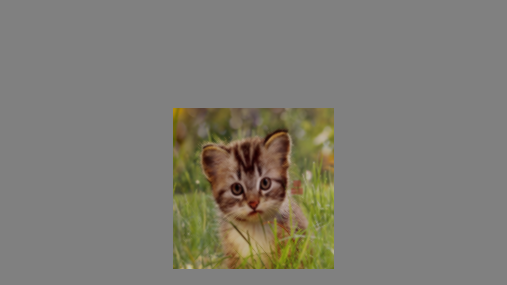

# 高斯模糊

```
private String vertexShaderCode =
        "attribute vec4 vPosition;\n" +      //位置
                "attribute vec2 vCoordinate;\n" +    // 纹理
                "varying vec2 aCoordinate;\n" +
                "uniform mat4 vMatrix;" +      //  传递纹理   片段着色器
                "void main(){\n" +
                "    gl_Position=vPosition * vMatrix;\n" +
                "    aCoordinate=vCoordinate;\n" +
                "}";
/**
 * 灰色
 */
private String fragmentShaderCode =
        "precision mediump float;\n" +
        "uniform sampler2D vTexture;\n" +
        "varying vec2 aCoordinate;\n" +
        "void main(){\n" +

                "vec4 color = vec4(0.0);" +
                "int coreSize = 3;" +
                "int halfsize = coreSize / 2;" +
                "float texelOffset = 0.006;" +
                "float kernel[9];" +
                "kernel[6] = 1.0;" +
                "kernel[7] = 1.0;" +
                "kernel[8] = 1.0;" +
                "kernel[3] = 1.0;" +
                "kernel[4] = 4.0;" +
                "kernel[5] = 1.0;" +
                "kernel[0] = 1.0;" +
                "kernel[1] = 1.0;" +
                "kernel[2] = 1.0;" +
                "int index = 0;" +
                "for(int y = 0;y<coreSize;y++){" +
                "   for(int x = 0;x<coreSize;x++){" +
                "       vec4 currentColor = texture2D(vTexture,aCoordinate + " +
                "vec2(float((-1+x))*texelOffset,float((-1+y))*texelOffset));" +
                "       color += currentColor*kernel[index];" +
                "       index++;" +
                "   }" +
                "}" +
                "color /= 16.0;" +
        "    gl_FragColor=color;" +
        "}";
```



```
package com.example.myapplication.learn.texture;

import android.content.Context;
import android.graphics.Bitmap;
import android.graphics.BitmapFactory;
import android.opengl.GLES20;
import android.opengl.GLUtils;
import android.opengl.Matrix;

import com.example.myapplication.learn.shape.base.BaseGameScreen;

import java.io.IOException;
import java.nio.ByteBuffer;
import java.nio.ByteOrder;
import java.nio.FloatBuffer;

/**
 * 高斯  模糊
 */
public class ImageTextureGaosi extends BaseGameScreen {
    private int mProgram;
    private int glHPosition;
    private int glHTexture;
    private int glHCoordinate;
    private int vMatrix;
    private Bitmap mBitmap;
    private FloatBuffer bPos;
    private FloatBuffer bCoord;
    //相机位置
    private float[] mViewMatrix=new float[16];
    //透视
    private float[] mProjectMatrix=new float[16];
    //变换矩阵
    private float[] mMVPMatrix=new float[16];

    private final float[] sPos={
            -1.0f,1.0f,
            -1.0f,-1.0f,
            1.0f,1.0f,
            1.0f,-1.0f
    };

    private final float[] sCoord={
            0.0f,0.0f,
            0.0f,1.0f,
            1.0f,0.0f,
            1.0f,1.0f,
    };
    private String vertexShaderCode =
            "attribute vec4 vPosition;\n" +      //位置
                    "attribute vec2 vCoordinate;\n" +    // 纹理
                    "varying vec2 aCoordinate;\n" +
                    "uniform mat4 vMatrix;" +      //  传递纹理   片段着色器
                    "void main(){\n" +
                    "    gl_Position=vPosition * vMatrix;\n" +
                    "    aCoordinate=vCoordinate;\n" +
                    "}";
    /**
     * 灰色
     */
    private String fragmentShaderCode =
            "precision mediump float;\n" +
            "uniform sampler2D vTexture;\n" +
            "varying vec2 aCoordinate;\n" +
            "void main(){\n" +

                    "vec4 color = vec4(0.0);" +
                    "int coreSize = 3;" +
                    "int halfsize = coreSize / 2;" +
                    "float texelOffset = 0.006;" +
                    "float kernel[9];" +
                    "kernel[6] = 1.0;" +
                    "kernel[7] = 1.0;" +
                    "kernel[8] = 1.0;" +
                    "kernel[3] = 1.0;" +
                    "kernel[4] = 4.0;" +
                    "kernel[5] = 1.0;" +
                    "kernel[0] = 1.0;" +
                    "kernel[1] = 1.0;" +
                    "kernel[2] = 1.0;" +
                    "int index = 0;" +
                    "for(int y = 0;y<coreSize;y++){" +
                    "   for(int x = 0;x<coreSize;x++){" +
                    "       vec4 currentColor = texture2D(vTexture,aCoordinate + " +
                    "vec2(float((-1+x))*texelOffset,float((-1+y))*texelOffset));" +
                    "       color += currentColor*kernel[index];" +
                    "       index++;" +
                    "   }" +
                    "}" +
                    "color /= 16.0;" +
            "    gl_FragColor=color;" +
            "}";

//    private String fragmentShaderCode =
//            "precision mediump float;\n" +
//            "uniform sampler2D vTexture;\n" +
//            "varying vec2 aCoordinate;\n" +
//            "void main(){\n" +
//                    "vec4 color = vec4(0.0);" +
//                    "int coreSize = 3;" +
//                    "int halfsize = coreSize / 2;" +
//                    "float texelOffset = 0.01F;" +
//                    "float kernel[9];" +
//                    "kernel[6] = 1.0F;" +
//                    "kernel[7] = 2.0F;" +
//                    "kernel[8] = 1.0F;" +
//                    "kernel[3] = 2.0F;" +
//                    "kernel[4] = 4.0F;" +
//                    "kernel[5] = 2.0F;" +
//                    "kernel[0] = 1.0F;" +
//                    "kernel[1] = 2.0F;" +
//                    "kernel[2] = 1.0F;" +
//                    "int index = 0;" +
//                    "for(int y = 0;y<coreSize;y++){" +
//                    "   for(int x = 0;x<coreSize;x++){" +
//                    "       vec4 currentColor = texture2D(vTexture,aCoordinate + vec2(float((-1+x))*texelOffset,float((-1+y))*texelOffset));" +
//                    "       color += currentColor*kernel[index];" +
//                    "       index++;" +
//                    "   }" +
//                    "}" +
//                    "color /= 16.0F;" +
//            "    gl_FragColor=color;" +
//            "}";
    private Context context;
    public ImageTextureGaosi(Context context){
        this.context = context;
        ByteBuffer bb=ByteBuffer.allocateDirect(sPos.length*4);
        bb.order(ByteOrder.nativeOrder());
        bPos=bb.asFloatBuffer();
        bPos.put(sPos);
        bPos.position(0);
        ByteBuffer cc=ByteBuffer.allocateDirect(sCoord.length*4);
        cc.order(ByteOrder.nativeOrder());
        bCoord=cc.asFloatBuffer();
        bCoord.put(sCoord);
        bCoord.position(0);
    }

//    private int vChangeColor;

    public void preProgram(){
        int vertexShader = loadShader(GLES20.GL_VERTEX_SHADER,vertexShaderCode);
        int fragmentShader = loadShader(GLES20.GL_FRAGMENT_SHADER,fragmentShaderCode);
        mProgram = GLES20.glCreateProgram();
        GLES20.glAttachShader(mProgram,vertexShader);
        GLES20.glAttachShader(mProgram,fragmentShader);
        GLES20.glLinkProgram(mProgram);
    }

    private int createTexture(){
        int[] texture=new int[1];
        if(mBitmap!=null&&!mBitmap.isRecycled()){
            //生成纹理
            GLES20.glGenTextures(1,texture,0);
            //生成纹理
            GLES20.glBindTexture(GLES20.GL_TEXTURE_2D,texture[0]);
            //设置缩小过滤为使用纹理中坐标最接近的一个像素的颜色作为需要绘制的像素颜色
            GLES20.glTexParameterf(GLES20.GL_TEXTURE_2D, GLES20.GL_TEXTURE_MIN_FILTER,GLES20.GL_NEAREST);
            //设置放大过滤为使用纹理中坐标最接近的若干个颜色，通过加权平均算法得到需要绘制的像素颜色
            GLES20.glTexParameterf(GLES20.GL_TEXTURE_2D,GLES20.GL_TEXTURE_MAG_FILTER,GLES20.GL_LINEAR);
            //设置环绕方向S，截取纹理坐标到[1/2n,1-1/2n]。将导致永远不会与border融合
            GLES20.glTexParameterf(GLES20.GL_TEXTURE_2D, GLES20.GL_TEXTURE_WRAP_S,GLES20.GL_CLAMP_TO_EDGE);
            //设置环绕方向T，截取纹理坐标到[1/2n,1-1/2n]。将导致永远不会与border融合
            GLES20.glTexParameterf(GLES20.GL_TEXTURE_2D, GLES20.GL_TEXTURE_WRAP_T,GLES20.GL_CLAMP_TO_EDGE);
            //根据以上指定的参数，生成一个2D纹理
            GLUtils.texImage2D(GLES20.GL_TEXTURE_2D, 0, mBitmap, 0);
            return texture[0];
        }
        return 0;
    }

    @Override
    public void render() {
        GLES20.glClear(GLES20.GL_COLOR_BUFFER_BIT|GLES20.GL_DEPTH_BUFFER_BIT);
        GLES20.glUseProgram(mProgram);

//        GLES20.glUniform4fv(vChangeColor,1,new float[]{1,1,1,1},0);

        GLES20.glEnableVertexAttribArray(glHPosition);
        GLES20.glEnableVertexAttribArray(glHCoordinate);
        GLES20.glUniform1i(glHTexture, 0);
        createTexture();
        GLES20.glVertexAttribPointer(glHPosition,2,GLES20.GL_FLOAT,false,0,bPos);
        GLES20.glVertexAttribPointer(glHCoordinate,2,GLES20.GL_FLOAT,false,0,bCoord);
        GLES20.glUniformMatrix4fv(vMatrix,1,false,mMVPMatrix,0);
        GLES20.glDrawArrays(GLES20.GL_TRIANGLE_STRIP,0,4);
    }

    @Override
    public void create() {
        GLES20.glClearColor(1.0f,1.0f,1.0f,1.0f);
        GLES20.glEnable(GLES20.GL_TEXTURE_2D);
        preProgram();
        glHPosition=GLES20.glGetAttribLocation(mProgram,"vPosition");
        glHCoordinate=GLES20.glGetAttribLocation(mProgram,"vCoordinate");
        glHTexture=GLES20.glGetUniformLocation(mProgram,"vTexture");
        vMatrix = GLES20.glGetUniformLocation(mProgram,"vMatrix");
        try {
            mBitmap= BitmapFactory.decodeStream(context.getAssets().open("texture/fengj.png"));
        } catch (IOException e) {
            e.printStackTrace();
        }
    }

    @Override
    public void surfaceChange(int width, int height) {
        float ratio=(float)width/height;
//        设置相机类型
        Matrix.frustumM(mProjectMatrix,0,-ratio,ratio,-1,1,3,7);
//        设置相机位置
        Matrix.setLookAtM(mViewMatrix, 0,
                0, 0, 7.0f,
                0f, 0f, 0f,
                0f, 1.0f, 0.0f);
        Matrix.multiplyMM(mMVPMatrix,0,mProjectMatrix,0,mViewMatrix,0);
    }

    @Override
    public void dispose() {

    }
}
```